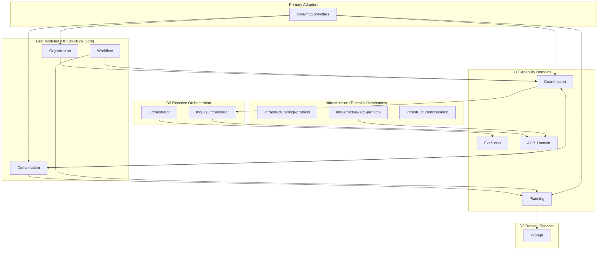
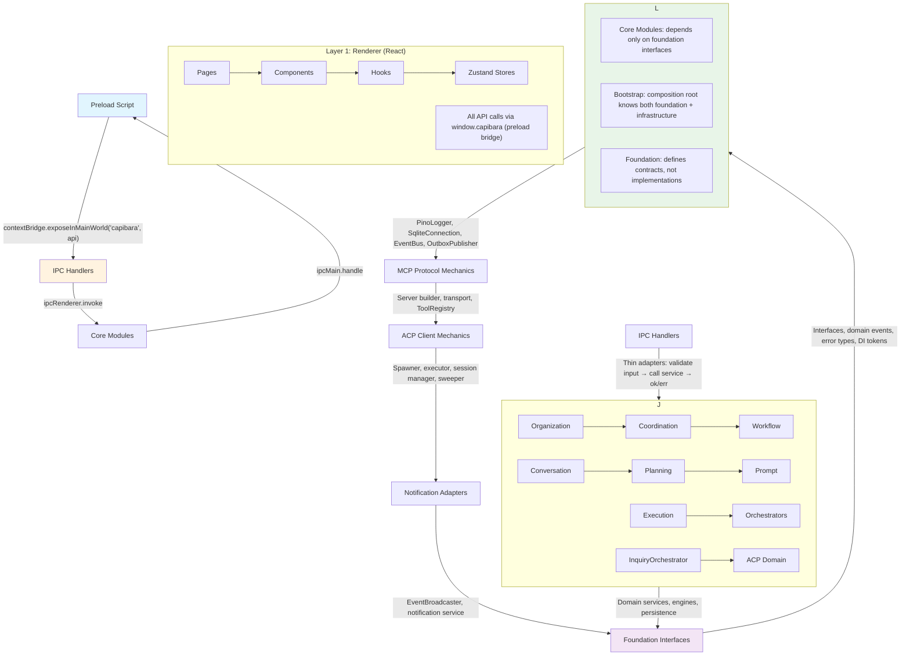

# Project: Capibara

## Overview

Capibara is an AI-Powered Organization Orchestration Platform delivered as an Electron desktop application. It enables users to define AI agent teams (roles with personas, skills, and permissions), decompose work into hierarchical task trees, and orchestrate multi-agent execution with human-in-the-loop collaboration. The system supports conversational planning, AI-to-AI inquiry chains with depth guards, plan tree review/approval workflows, and a Model Context Protocol (MCP) server that exposes tools to AI agents for task transitions, inquiries, and context queries.

The codebase is a pnpm monorepo with a single `apps/electron` sub-project. The Electron app uses a three-layer architecture (main process / preload / renderer) built with electron-vite, React, Zustand, Tailwind CSS, better-sqlite3, and tsyringe dependency injection.

## Core Terms

| Term | Meaning |
|------|---------|
| ACP | Agent Client Protocol -- the protocol layer for managing AI agent subprocesses, sessions, and communication |
| Org / Organization | A workspace containing an AI team (roles), tasks, and configuration. The primary multi-tenancy boundary |
| Role | An AI agent definition within an org: persona, skills, permissions, parent-child hierarchy, tool policy |
| Skill | A reusable capability (command + description) assignable to roles. Sources: builtin, template, custom |
| Task | A work item in a hierarchical tree. Has type, status, assignee role, and optional planning mode |
| Process Schema | Defines work item types, statuses, transitions, and behavior rules for an org's task lifecycle |
| Work Item Type | A named task type (e.g. epic, feature, bug) with constraints: isLeaf, allowedChildren, canDecompose |
| Status Category | Classification of task statuses: initial, active, approval, terminal |
| Planning Mode | Task decomposition strategy: `eager` (auto-apply) or `preview` (requires human approval) |
| Plan Tree | A proposed task decomposition tree submitted by an AI agent, pending human review |
| Run | A single AI agent execution instance targeting a task, conversation, or inquiry response |
| Wake | The act of scheduling an AI agent to execute. Triggered by events (task assigned, conversation reply, etc.) |
| Wake Gate | Guard that blocks scheduling when: scheduler paused, role paused, org has active run, or circuit breaker tripped |
| Conversation | A multi-party exchange: inquiry (AI asks human/peer), planning (human describes project), adhoc, or plan_review |
| Inquiry | An AI-to-AI or AI-to-human question routed through the coordination layer |
| Chain Depth | Nesting level of AI-to-AI inquiry suspensions. Max default 5; enforced by ChainDepthGuard |
| Session Suspension | When an AI agent pauses execution while awaiting a response to its inquiry |
| InquiryAggregator | Collects replies from multiple respondents and formats them for the suspended agent |
| MCP | Model Context Protocol -- server exposing tools (task transitions, inquiries, context queries) to AI agents |
| Orchestrator | Top-level event-driven coordinator: TaskOrchestrator, ConversationOrchestrator, RunOrchestrator |
| Prompt Scenario | One of 9 execution contexts (e.g. execute_leaf, preview_decomposition, conversation_reply) determining the system prompt |
| DesktopResult | Discriminated union result type `{ ok: true, data } | { ok: false, error }` used across all IPC boundaries |
| Outbox Pattern | Transactional outbox for domain events: events are written to SQLite in the same transaction as business data, then asynchronously published to the event bus |
| Behavior Engine | Rule engine that evaluates conditions and executes actions (e.g. auto-transition) on task status changes |
| Template | Pre-defined org structure (roles, skills, process schema) loaded from JSON files for quick workspace setup |
| Decomposition | The process of breaking a parent task into child tasks, either by AI (plan tree) or manually |
| Circuit Breaker | Wake gate limit on consecutive agent wake-ups per role (`maxConsecutiveWakes`) |
| Hexagonal skeleton | Primary (inbound/driving) + Domain Core + Secondary (outbound/driven) adapters. Conceptual roles by control-flow direction. |
| Transactional Outbox | Write event to outbox table in the same tx as business data, publish asynchronously. Outbox delivery semantics; the dual obligation is that every subscriber is idempotent. |
| Port / Adapter | Domain-defined interface / concrete class implementing it. |
| Front door / Back door | TaskOrchestrator (pre-Run admission) / RunOrchestrator (post-Run continuation). |
| IExecutor | The existing AI abstraction boundary; Execution touches AI only via this port. Planning has zero AI references. |

## Module Structure

### Core (Main Process) -- `apps/electron/src/core/`

| Module | Path | Responsibility |
|--------|------|---------------|
| **Organization** | `modules/organization/` | Org/role/skill CRUD, role hierarchy traversal, template-based org creation |
| **Workflow** | `modules/workflow/` | Task lifecycle, process schemas, state machine, behavior engine, task scheduling |
| **Conversation** | `modules/conversation/` | Multi-party conversation lifecycle, state transitions, message persistence, routing signals |
| **Coordination** | `modules/coordination/` | Inquiry routing to respondents, timeout escalation up role hierarchy |
| **Execution** | `modules/execution/` | Run lifecycle (start/complete/fail/cancel/suspend), cost tracking, execution logging |
| **ACP** | `modules/acp/` | ACP domain policies and collaboration (client mechanics in infrastructure/acp-protocol) |
| **Orchestrator** | `modules/orchestrator/` | Top-level event-driven coordination: task scheduling, wake gating, retry logic, run dispatch |
| **Planning** | `modules/planning/` | Plan tree submission, approval, discard, refinement, and expiration |
| **Prompt** | `modules/prompt/` | System prompt construction: scenario resolution, context assembly, strategy-specific rendering |
| **MCP** | `mcp/providers/` | Primary-side MCP tool providers (task, conversation, context, plan-tree) |
| **Notification** | `modules/notification/` | Desktop notifications and event broadcasting from main process to renderer |

### Foundation & Infrastructure -- `apps/electron/src/core/`

| Area | Path | Responsibility |
|------|------|---------------|
| **Foundation** | `foundation/` | Interfaces (ILogger, IEventBus, IEventPublisher, ISqliteConnection, IOutboxRepository, INotificationService, IToolRegistry), domain events, error types, DI tokens |
| **Infrastructure** | `infrastructure/` | Concrete implementations: PinoLogger, EmitteryEventBus, OutboxEventPublisher (transactional outbox), SqliteConnection, auto-updater, notification adapters, MCP protocol mechanics (server builder + transport), ACP client mechanics (spawner, executor, session manager, sweeper) |
| **Bootstrap** | `bootstrap/` | Composition root: manual DI wiring, module registration in dependency order, startup reconciliation |
| **Config** | `config/` | Layered config loading (defaults -> global -> project -> env), Zod validation |
| **IPC Handlers** | `ipc-handlers/` | Thin adapters: ipcMain.handle() registration for 60+ channels in capibara:domain:action format |
| **Preload** | `preload/` | contextBridge.exposeInMainWorld -- pure passthrough with zero business logic |
| **Shared** | `shared/` | DesktopResult type, CapibaraApi interface (renderer contract), SectionId type |

### Renderer -- `apps/electron/src/renderer/`

| Area | Path | Responsibility |
|------|------|---------------|
| **Components** | `components/` | Page and UI components organized by domain (dashboard, inbox, planning, tasks, team, skills, settings, onboarding, organization, layout) |
| **Store** | `store/` | Zustand stores: app, task, run, conversation, organization, plan-tree, toast |
| **Hooks** | `hooks/` | Custom React hooks for locale, events, run logs, tool calls, onboarding, workflow schema, section shortcuts |
| **Lib** | `lib/` | Utility functions: cn() (Tailwind class merge), subscribeToEvents() (IPC event dispatcher) |
| **UI** | `components/ui/` | shadcn/ui primitives: button, card, dialog, input, tabs, etc. |

### Shared -- `apps/electron/src/shared/`

| Area | Path | Responsibility |
|------|------|---------------|
| **Constants** | `constants.ts` | APP_NAME, MAX_REVISE_ATTEMPTS (3), MAX_RETRY_ON_FAILURE (3), MAX_CONSECUTIVE_WAKES (5) |
| **Locale** | `locale/` | Typed i18n: LocaleMessages interface (~570 keys), en-US and zh-CN translations, OS detection, fallback chain |

### Module Dependency Graph

**Key dependency rules:**
- Leaf modules (Organization, Conversation, Workflow) have no dependencies
- D1 modules depend only on leaves and other D1 modules
- D3 modules (Orchestrator, InquiryOrchestrator) orchestrate across D1 domains
- Infrastructure implements foundation interfaces but core modules never import from infrastructure directly
- MCP Providers are primary adapters that depend on domain services; protocol mechanics are in infrastructure

## Layer Structure

**Key architectural rules:**
- **Modules depend only on foundation interfaces, never on infrastructure** — bootstrap/composition-root is the only place that knows about both
- IEventPublisher (publish) vs IEventBus (subscribe): services publish, infrastructure subscribes
- Transactional outbox guarantees at-least-once event delivery across process restarts
- All IPC responses use DesktopResult discriminated union (no exceptions cross the boundary)
- dependency-cruiser rules enforced at `error` severity in CI (blocking merge)
- Four forbidden rules: `no-core-to-adapters`, `d0-must-stay-leaf`, `no-upward-d1-to-d3`, `same-module-allowed-cross-module-forbidden`

**Domain layer concepts:**
- **D0-D3 layers**: Domain Core role labels—D0 structural core (Organization), D1 capability domains (Conversation/Workflow/acp-domain/Execution/Planning), D2 derived services (Prompt), D3 reactive orchestration (Coordination + 3 Orchestrators)
- **Layer = role label**: Layers explain "why a module is here", NOT strict dependency rank. Same-layer dependencies allowed. The dependency truth is the §7 DAG, enforced by dependency-cruiser
- **Folder convention**: Top-level folders group by technical-vs-business, NOT inbound-vs-outbound. `infrastructure/` = all technical/framework mechanics (both mcp-protocol and acp-protocol live here)
- **Dependency guard**: dependency-cruiser CI rules promoting the dependency DAG from a diagram to an enforced, machine-checked rule set

## Key Business Rules

### Task Lifecycle
- Tasks follow a state machine governed by the org's ProcessSchema
- Only leaf tasks can enter approval states; non-leaf tasks are auto-approved
- AI roles (requiresHumanApproval=false) skip approval -- auto-advance to next status
- System-driven transitions (triggeredBy='system') are never re-waked by orchestrators
- Task depth is computed from parent + 1; max traversal depth is 10

### Scheduling & Wake Gating
- One active run per org at a time
- Scheduling is paused for the entire org when any task is in approval category
- Wake gate blocks if: scheduler paused, role paused, org has active run, or role exceeds maxConsecutiveWakes (circuit breaker)
- Pending wakes are consumed one per drain cycle (run end -> drain -> next wake)
- 200ms debounce on rapid wake events per taskId+roleId pair

### AI-to-AI Collaboration
- Max chain depth default is 5 (configurable); exceeding throws an error
- Circular inquiry detection prevents both direct and indirect recursive chains
- Suspension aggregationMode `all` requires every awaiting inquiry resolved; `any` requires at least one
- ACP session resume strategy: supportsResume > supportsLoad > rebuild

### Plan Tree
- Max 500 nodes, max depth 10, no self-nesting
- Every node must have an assigneeRoleId
- Root type must match task type (or be allowedAtRoot for conversation-anchored)
- Child types must be in parent's allowedChildren; leaf nodes cannot have children
- Optimistic locking: approval accepts expectedVersion, rejects on mismatch
- Pending feedback is one-shot: consumed once to avoid re-injection
- Plan trees expire after 24 hours; stale trees are cleaned up

### File Access & Permissions
- Three-layer file access: cwd boundary, role allowlist (glob), global denylist (.env, secrets, .git)
- Tool permission policy modes: permissive, restrictive (currently falls back to permissive), ask_user (falls back to permissive)
- Dangerous commands denylist enforced (rm -rf, drop table, etc.)

### Execution & Retry
- Failed runs get exponential backoff retry up to maxRetryOnFailure (default 3)
- Orphaned runs (from crashes) are marked as interrupted on startup
- Runs suspended (not failed/cancelled) do not roll back task status

### Conversation Routing
- Inquiry routing walks up the role ancestor tree, falling through paused/missing parents
- Human fallback is the last resort for both routing and escalation
- conversation:response-needed is only pushed to renderer when roleId is null (human is respondent)

### Organization
- Skill commands must be globally unique
- Only custom-source skills can be deleted
- autoStartOnCreate drives automatic scheduling when the first root task is created
- Template loading creates a system Planning Assistant role by default

### Configuration
- Layered loading: defaults -> global config (~/capibara/config.json) -> project config -> environment variables
- All config validated via Zod schema at load time

### Naming and Layer Classification
- D3 active orchestration units use the `Orchestrator` suffix; never `Service`
- `InquiryEscalationService` is passive (polled via `scanAndEscalate()`) — keeps `Service`
- `InquiryOrchestrator` is active (subscribes `conversation:route-resolved` events) — renamed from InquiryRouter

### Event-Driven Patterns
- `conversation:route-resolved` event: Coordination publishes route decision; Conversation subscribes and applies idempotent write-back (no direct service-to-service calls)
- Idempotency strategy for event re-delivery: if conversation is already in `waiting` with same `respondentRoleId` and `respondentType`, subscriber no-ops

### ACP Behavior Fixes
- Resume fallback: if `resumeSession` or load fails, system falls back to `rebuild(record)` to avoid hard-failing recovery
- Aggregation timeout with `timed_out` states: for `aggregationMode='all'`, pending/in-progress awaitings are marked `timed_out` after `inquiryTimeoutMs` from suspension timestamp; both `resolved` and `timed_out` are terminal states preventing indefinite suspension
- Restrictive permission mode: denies by default unless explicit allowlisting is implemented; `ask_user` mode denies until interactive approval flow is available

## API Overview

### IPC Channels (Renderer -> Main)

| Domain | Channels | Key Operations |
|--------|----------|---------------|
| Organization (16) | `capibara:org:*` | CRUD for orgs, roles, skills, templates |
| Workflow (13) | `capibara:task:*`, `capibara:process:*` | Task CRUD/transition/cancel/approve/reject, process schema/templates |
| Conversation (10) | `capibara:conversation:*` | List/get/messages/add/resolve/cancel/inquiry/adhoc/planning |
| Execution (11) | `capibara:run:*`, `capibara:cost:*`, `capibara:log:*` | Run list/get/cancel, cost summary, logs, interrupted count, resume |
| Plan Tree (8) | `capibara:plan-tree:*` | Get/approve/discard/refine by taskId or conversationId |
| System (10) | `capibara:scheduler:*`, `capibara:setting:*`, `capibara:system:*` | Scheduler pause/resume, settings, health check, dialogs, snapshot, locale |
| ACP (5) | `capibara:acp:*` | Audit tool-calls/file-access by runId/orgId, active suspensions |

### Main -> Renderer Events

| Event Type | Trigger |
|------------|---------|
| `snapshot:updated` | Periodic workspace state refresh |
| `org:changed` | Organization data changed |
| `task:changed`, `task:entered-approval` | Task state transitions |
| `run:changed`, `run:log`, `run:assistant-text`, `run:tool-call`, `run:completed`, `run:suspended`, `run:resumed` | Run lifecycle and streaming output |
| `conversation:changed`, `conversation:response-needed` | Conversation updates |
| `plan-tree:ready`, `plan-tree:approved`, `plan-tree:discarded` | Plan tree lifecycle |
| `notification` | Desktop notification trigger |

### MCP Tools (Exposed to AI Agents)

| Tool | Description |
|------|-------------|
| `capibara_task_transition` | Transition a task's status; returns available transitions on failure |
| `capibara_task_create_child` | Create a child task under a parent |
| `capibara_ask_question` | Create a single-target inquiry with chain depth and circular detection |
| `capibara_broadcast_question` | Create a multi-target broadcast inquiry with wait mode all/any |
| `capibara_context` | Query tasks, roles, task details, role details by orgId |
| `capibara_plan_submit_tree` | Submit a complete task decomposition tree (task-anchored or conversation-anchored) |

### Domain Events (Internal)

~30 typed domain events organized across four domains: Organization, Task, Conversation, Run, and PlanTree. All events carry typed payloads validated by Zod schemas at deserialization time. Events flow through the transactional outbox pattern for durable delivery.
