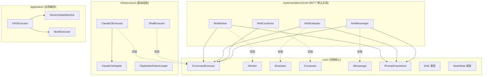

# 架构设计：Worker 与 Pipeline 抽象改进（v2）

> Change ID: `20260320-worker-pipeline-abstraction`
> 日期: 2026-03-20
> 阶段: design (v2 - 基于反馈重新设计)

---

## 设计修订说明

基于以下反馈重新设计：
1. **所有角色**的执行过程都应可插拔，而非仅限 Worker
2. 需要为 `ICommandExecutor` 显式支持 `systemPromptFile` 参数
3. MVP 默认实现（"My Virtual Tech Team"）应作为**薄层独立文件夹**，便于未来扩展

---

## 架构概览

本设计围绕四个核心改造展开：

1. **ICommandExecutor - 通用命令执行接口** - 所有角色共享的底层执行抽象，替代当前对 `CliProcessPool` 的直接依赖
2. **implementations/mvtt/ - 默认实现包** - "My Virtual Tech Team" 的所有角色实现收敛到独立文件夹，作为薄层包装
3. **DAG Pipeline 编排引擎** - 用有向无环图替代固定线性阶段数组
4. **通用状态机** - 动态生成节点状态，替代硬编码的阶段枚举

### 核心思想：三层解耦

```
┌─────────────────────────────────────────────────────┐
│  角色接口层 (core/interfaces/)                       │
│  IWorker, IEvaluator, IConductor, IMessenger        │
│  定义"做什么" - 纯领域契约，不关心执行方式           │
└───────────────────────┬─────────────────────────────┘
                        │ 实现
┌───────────────────────▼─────────────────────────────┐
│  实现层 (implementations/mvtt/)                      │
│  MvttWorker, MvttEvaluator, MvttConductor, ...      │
│  定义"做什么的具体逻辑" - prompt 组装 + 结果解析     │
│  薄层：仅组装 prompt，委托 ICommandExecutor 执行     │
└───────────────────────┬─────────────────────────────┘
                        │ 委托
┌───────────────────────▼─────────────────────────────┐
│  执行层 (infrastructure/)                            │
│  ClaudeCliExecutor, ShellExecutor, (未来 ApiExecutor)│
│  定义"怎么执行" - 具体的命令执行后端                 │
│  实现 ICommandExecutor 接口                          │
└─────────────────────────────────────────────────────┘
```

### 架构图



### 与上一版设计的关键差异

| 维度 | v1 设计 | v2 设计 |
|------|---------|---------|
| 策略抽象范围 | 仅 Worker (`IExecutionStrategy`) | **所有角色**共享 (`ICommandExecutor`) |
| 角色实现位置 | 散落在 `roles/` 各子目录 | 收敛到 `implementations/mvtt/` 独立文件夹 |
| Prompt 工程耦合 | 实现层直接引用 `CliProcessPool` | 实现层仅依赖 `ICommandExecutor` + `IPromptFramework` |
| System Prompt 传递 | 通过 adapter 内部 temp file 隐式处理 | `ICommandExecutor` 接口显式支持 `systemPromptFile` |
| 扩展新实现 | 需在多个 `roles/` 子目录新增文件 | 新建 `implementations/{name}/` 文件夹即可 |

---

## 模块结构

| 模块 | 目的 | 依赖 | 层级 |
|------|------|------|------|
| `core/interfaces/command-executor.interface.ts` | 通用命令执行抽象接口 | 无 | domain |
| `core/types/command-executor.types.ts` | 命令请求/响应/配置类型 | 无 | domain |
| `core/types/dag.types.ts` | DAG Pipeline 定义类型 | `phase.types` | domain |
| `core/types/node-state.types.ts` | 通用节点状态类型 | 无 | domain |
| `implementations/mvtt/mvtt-worker.ts` | MVTT Worker 实现（薄层） | `core/` | implementation |
| `implementations/mvtt/mvtt-evaluator.ts` | MVTT Evaluator 实现（薄层） | `core/` | implementation |
| `implementations/mvtt/mvtt-conductor.ts` | MVTT Conductor 实现（薄层） | `core/` | implementation |
| `implementations/mvtt/mvtt-messenger.ts` | MVTT Messenger 实现（薄层） | `core/` | implementation |
| `implementations/mvtt/index.ts` | Barrel export + 注册工厂 | 全部 mvtt 模块 | implementation |
| `infrastructure/executors/claude-cli.executor.ts` | Claude CLI 命令执行器 | `core/`, `cli-adapter/` | infrastructure |
| `infrastructure/executors/shell.executor.ts` | Shell 命令执行器 | `core/` | infrastructure |
| `infrastructure/pipeline/pipeline-definition.loader.ts` | Pipeline 定义加载 | `core/` | infrastructure |
| `infrastructure/pipeline/default-pipeline.factory.ts` | 生成默认线性 DAG 定义（当未配置自定义文件时） | `core/` | infrastructure |
| `application/pipeline/dag-executor.ts` | DAG 编排引擎 | `core/` | application |
| `application/pipeline/node-executor.ts` | 单节点执行器 | `core/` | application |
| `application/state-machine/generic-state-machine.ts` | 通用动态状态机 | `core/` | application |

---

## 接口定义

### 1. ICommandExecutor - 通用命令执行接口

**这是本次设计的核心抽象。所有角色实现都通过此接口执行底层命令，而非直接依赖 `CliProcessPool` 或 `ClaudeCliAdapter`。**

```typescript
// core/interfaces/command-executor.interface.ts

import type {
  CommandRequest,
  CommandResponse,
} from '../types/command-executor.types.js';

/**
 * 通用命令执行接口
 *
 * 所有角色实现的底层执行后端。封装了"怎么执行命令"的细节，
 * 使角色实现（implementations/）仅关注"组装什么命令"。
 *
 * 生命周期：启动时通过 DI 注册，配置变更需重启。
 */
export interface ICommandExecutor {
  /** 执行器类型标识符 */
  readonly type: string;

  /** 执行命令，返回统一格式的结果 */
  execute(request: CommandRequest): Promise<CommandResponse>;

  /** 验证执行器配置是否合法（启动时调用） */
  validate(): Promise<boolean>;
}
```

### 2. CommandRequest / CommandResponse 类型

```typescript
// core/types/command-executor.types.ts

/**
 * 通用命令请求
 *
 * 设计原则：
 * - 通用字段直接定义（input, timeout, cwd）
 * - 与 LLM 相关的字段作为可选项（systemPrompt, systemPromptFile）
 * - 执行器特有参数放在 options 中
 */
export interface CommandRequest {
  /** 输入内容（用户 prompt / 命令参数 / stdin 输入） */
  input: string;

  /** 系统级提示（LLM 类执行器使用） */
  systemPrompt?: string;

  /**
   * 系统提示文件路径（LLM 类执行器使用）
   * 当 systemPrompt 内容过长时，执行器应优先使用文件传递，
   * 避免命令行参数长度限制（Windows ~8K, Linux ~2M）。
   *
   * 使用优先级：
   * 1. 若 systemPromptFile 已提供 -> 直接使用文件路径
   * 2. 若仅 systemPrompt 且长度 > threshold -> 执行器自动写入临时文件
   * 3. 若仅 systemPrompt 且长度较短 -> 可直接作为参数传递
   */
  systemPromptFile?: string;

  /** 工作目录 */
  cwd?: string;

  /** 超时时间（毫秒） */
  timeout?: number;

  /**
   * 执行器特有参数
   *
   * ClaudeCliExecutor 示例：
   *   { sessionId, resume, maxTurns, allowedTools, disallowedTools, outputFormat }
   *
   * ShellExecutor 示例：
   *   { command, env, shell }
   *
   * 未来 HttpApiExecutor 示例：
   *   { url, method, headers, body }
   */
  options: Record<string, unknown>;
}

/**
 * 通用命令响应
 */
export interface CommandResponse {
  /** 执行是否成功 */
  success: boolean;

  /** 原始输出内容（由 Messenger 负责格式归一化） */
  output: string;

  /** 执行耗时（毫秒） */
  duration: number;

  /**
   * 执行器特有的结果元数据
   *
   * ClaudeCliExecutor 示例：
   *   { sessionId, exitCode, costUsd, tokensUsed, numTurns }
   *
   * ShellExecutor 示例：
   *   { exitCode, stderr }
   */
  metadata: Record<string, unknown>;
}

/**
 * 执行器配置（从 YAML/JSON 反序列化）
 */
export interface CommandExecutorConfig {
  /** 执行器类型 */
  type: string;
  /** 执行器特有配置 */
  options: Record<string, unknown>;
}
```

### 3. 重构后的 WorkerCommand / WorkerResult

```typescript
// core/types/worker.types.ts (修改)

/**
 * Worker 执行命令
 *
 * 变更点：
 * - 移除 CLI 特有字段（sessionId, resume, maxTurns, allowedTools 等）
 * - 新增 executorType 用于指定执行器
 * - 新增 executorOptions 用于传递执行器特有参数
 */
export interface WorkerCommand {
  /** 框架命令，如 "#analyze" */
  command: string;

  /** 用户输入内容 */
  input: string;

  /** 合并后的系统提示词 */
  systemPrompt: string;

  /**
   * 系统提示文件路径
   * 当 prompt 过长时使用文件传递（优先于 systemPrompt）
   */
  systemPromptFile?: string;

  /** 使用的命令执行器类型（默认 'claude-cli'） */
  executorType?: string;

  /** 执行器特有参数 */
  executorOptions?: Record<string, unknown>;

  /** 工作目录 */
  cwd?: string;

  /** 超时时间（毫秒） */
  timeout?: number;
}

/**
 * Worker 执行结果
 *
 * 变更点：
 * - 移除 sessionId, tokensUsed, costUsd 等 CLI 特有字段
 * - 新增 metadata 统一承载执行器特有结果
 */
export interface WorkerResult {
  success: boolean;
  output: string;
  artifact: string;
  duration: number;

  /** 执行器特有的结果元数据 */
  metadata: Record<string, unknown>;
}
```

### 4. DAG Pipeline 定义类型

```typescript
// core/types/dag.types.ts

import type { Phase } from './phase.types.js';

/** Pipeline 节点类型 */
export type PipelineNodeType = 'worker' | 'evaluator' | 'aggregator' | 'gate';

/** Pipeline 节点定义 */
export interface PipelineNodeDefinition {
  id: string;
  type: PipelineNodeType;
  name: string;
  phase?: Phase;
  /** 该节点使用的命令执行器类型（可选，覆盖全局默认） */
  executorType?: string;
  config: Record<string, unknown>;
}

/** Pipeline 边定义 */
export interface PipelineEdgeDefinition {
  from: string;
  to: string;
  condition?: string;
}

/** 完整 Pipeline 定义 */
export interface PipelineDefinition {
  id: string;
  name: string;
  description?: string;
  nodes: PipelineNodeDefinition[];
  edges: PipelineEdgeDefinition[];
  settings?: {
    /** 默认命令执行器类型 */
    defaultExecutorType?: string;
    budgetLimit?: number;
    maxRetriesPerNode?: number;
    mode?: 'auto' | 'semi-auto' | 'manual';
  };
}
```

### 5. 通用节点状态类型

```typescript
// core/types/node-state.types.ts

export type NodeStatus =
  | 'pending'
  | 'ready'
  | 'running'
  | 'evaluating'
  | 'completed'
  | 'failed'
  | 'cancelled';

export interface NodeState {
  nodeId: string;
  status: NodeStatus;
  attempts: number;
  output?: string;
  error?: string;
  startedAt?: string;
  completedAt?: string;
}

export interface PipelineExecutionState {
  pipelineId: string;
  definitionId: string;
  nodes: Record<string, NodeState>;
  status: 'running' | 'completed' | 'failed';
  startedAt: string;
  updatedAt: string;
}
```

---

## MVTT 实现层设计（implementations/mvtt/）

### 设计原则

MVTT 实现是一组**薄包装层**，每个角色实现仅做两件事：
1. **组装 prompt** - 使用 `IPromptFramework` 获取 agent 定义 + 知识库，拼接为系统提示词
2. **委托执行** - 将组装好的命令交给 `ICommandExecutor` 执行

**不做**：不直接引用 `ClaudeCliAdapter`、`CliProcessPool`、`CliOutputParser` 等基础设施。

### 目录结构

```
src/implementations/
  mvtt/                           # "My Virtual Tech Team" 默认实现
    mvtt-worker.ts                # IWorker 实现
    mvtt-evaluator.ts             # IEvaluator 基类
    mvtt-quality-evaluator.ts     # 质量评估器
    mvtt-security-evaluator.ts    # 安全评估器
    mvtt-consistency-evaluator.ts # 一致性评估器
    mvtt-conductor.ts             # IConductor 实现
    mvtt-messenger.ts             # IMessenger 实现
    mvtt-output-parser.ts         # MVTT 专用输出解析（从 CliOutputParser 提取）
    index.ts                      # Barrel export + registerMvtt() 工厂函数
```

### MvttWorker 示例

```typescript
// implementations/mvtt/mvtt-worker.ts

import type { IWorker } from '../../core/interfaces/worker.interface.js';
import type { ICommandExecutor } from '../../core/interfaces/command-executor.interface.js';
import type { IPromptFramework } from '../../core/interfaces/prompt-framework.interface.js';
import type { WorkerCommand, WorkerResult } from '../../core/types/worker.types.js';
import type { AutomationConfig } from '../../core/types/config.types.js';
import type { IEventBus } from '../../core/interfaces/event-bus.interface.js';
import type { Logger } from 'pino';

/**
 * MVTT Worker 实现
 *
 * 薄层：从 IPromptFramework 获取 prompt -> 委托 ICommandExecutor 执行
 * 不直接依赖任何 CLI/Shell/API 基础设施
 */
export class MvttWorker implements IWorker {
  private currentSessionId?: string;

  constructor(
    private executor: ICommandExecutor,
    private framework: IPromptFramework,
    private config: AutomationConfig,
    private logger: Logger,
    private eventBus: IEventBus,
  ) {}

  async executeCommand(command: WorkerCommand): Promise<WorkerResult> {
    this.logger.info({ command: command.command }, 'MvttWorker executing');

    const response = await this.executor.execute({
      input: command.input,
      systemPrompt: command.systemPrompt,
      systemPromptFile: command.systemPromptFile,
      cwd: command.cwd ?? this.config.cli.projectDir,
      timeout: command.timeout ?? this.config.worker.defaultTimeout,
      options: {
        // Claude CLI 特有参数 - 由 ClaudeCliExecutor 解释
        sessionId: command.executorOptions?.sessionId,
        resume: command.executorOptions?.resume,
        maxTurns: command.executorOptions?.maxTurns
          ?? this.config.worker.defaultMaxTurns,
        allowedTools: command.executorOptions?.allowedTools,
        disallowedTools: command.executorOptions?.disallowedTools,
        outputFormat: 'json',
      },
    });

    // 从 executor metadata 提取 session ID（仅 Claude CLI 有意义）
    this.currentSessionId = response.metadata.sessionId as string | undefined;

    return {
      success: response.success,
      output: response.output,
      artifact: '',
      duration: response.duration,
      metadata: response.metadata,
    };
  }

  getSessionId(): string | undefined {
    return this.currentSessionId;
  }

  getRegisteredStrategies(): string[] {
    return [this.executor.type];
  }
}
```

### MvttEvaluator 基类示例

```typescript
// implementations/mvtt/mvtt-evaluator.ts

import type { IEvaluator } from '../../core/interfaces/evaluator.interface.js';
import type { ICommandExecutor } from '../../core/interfaces/command-executor.interface.js';
import type {
  EvaluationInput,
  EvaluationResult,
  EvaluationDimension,
} from '../../core/types/evaluation.types.js';
import type { MvttOutputParser } from './mvtt-output-parser.js';
import type { AutomationConfig } from '../../core/types/config.types.js';
import type { Logger } from 'pino';

/**
 * MVTT Evaluator 基类
 *
 * 薄层：组装评估 prompt -> 委托 ICommandExecutor 执行 -> 解析结果
 * 子类仅需实现 buildSystemPrompt() 提供维度特有的评估指令
 */
export abstract class MvttEvaluator implements IEvaluator {
  protected abstract readonly dimension: EvaluationDimension;

  constructor(
    protected executor: ICommandExecutor,
    protected outputParser: MvttOutputParser,
    protected config: AutomationConfig,
    protected logger: Logger,
  ) {}

  async evaluate(input: EvaluationInput): Promise<EvaluationResult> {
    const systemPrompt = this.buildSystemPrompt();
    const userPrompt = this.buildUserPrompt(input);

    const response = await this.executor.execute({
      input: userPrompt,
      systemPrompt,
      cwd: input.projectDir,
      timeout: this.config.worker.defaultTimeout,
      options: {
        sessionId: `eval-${input.pipelineId}-${input.phase}-${this.dimension}`,
        disallowedTools: ['Write', 'Edit', 'NotebookEdit', 'Bash'],
        maxTurns: this.config.evaluator.maxTurns,
        outputFormat: 'json',
      },
    });

    return this.outputParser.parseEvaluationResult(response, this.dimension);
  }

  getDimension(): EvaluationDimension {
    return this.dimension;
  }

  protected abstract buildSystemPrompt(): string;

  private buildUserPrompt(input: EvaluationInput): string {
    return [
      `## Project Summary\n${input.projectSummary}`,
      `## Current Phase: ${input.phase}\n${input.phaseSummary}`,
      `## Artifact to Evaluate\n${input.artifact}`,
      `## Evaluation Criteria\n${input.evaluationCriteria}`,
      'Please output evaluation result in JSON format as required in system prompt.',
    ].join('\n\n');
  }
}
```

### MvttConductor 示例

```typescript
// implementations/mvtt/mvtt-conductor.ts

import type { IConductor } from '../../core/interfaces/conductor.interface.js';
import type { ICommandExecutor } from '../../core/interfaces/command-executor.interface.js';
import type { EvaluationResult } from '../../core/types/evaluation.types.js';
import type { ConductorDecision } from '../../core/types/conductor.types.js';
import type { MvttOutputParser } from './mvtt-output-parser.js';
import type { AutomationConfig } from '../../core/types/config.types.js';
import type { Logger } from 'pino';

/**
 * MVTT Conductor 实现
 *
 * 保留"规则引擎优先 + LLM 兜底"的决策模式
 * LLM 调用通过 ICommandExecutor 执行，不直接依赖 CLI
 */
export class MvttConductor implements IConductor {
  constructor(
    private executor: ICommandExecutor,
    private outputParser: MvttOutputParser,
    private config: AutomationConfig,
    private logger: Logger,
  ) {}

  async decide(evaluations: EvaluationResult[]): Promise<ConductorDecision> {
    const ruleDecision = this.applyRules(evaluations);
    if (ruleDecision) {
      this.logger.info({ action: ruleDecision.action }, 'Conductor decided by rules');
      return ruleDecision;
    }

    // LLM 兜底 - 通过 ICommandExecutor 执行
    return this.llmDecide(evaluations);
  }

  private applyRules(evaluations: EvaluationResult[]): ConductorDecision | null {
    // ... (与现有 RuleEngineConductor.applyRules 逻辑相同)
  }

  private async llmDecide(evaluations: EvaluationResult[]): Promise<ConductorDecision> {
    const response = await this.executor.execute({
      input: /* 评估结果 prompt */,
      systemPrompt: 'You are a decision coordinator...',
      options: {
        disallowedTools: ['Write', 'Edit', 'NotebookEdit', 'Bash', 'Read'],
        maxTurns: this.config.conductor.maxTurns,
        outputFormat: 'json',
      },
    });

    return this.outputParser.parseConductorDecision(response);
  }
}
```

### MVTT 注册工厂

```typescript
// implementations/mvtt/index.ts

import type { DependencyContainer } from 'tsyringe';
import { MvttWorker } from './mvtt-worker.js';
import { MvttQualityEvaluator } from './mvtt-quality-evaluator.js';
import { MvttSecurityEvaluator } from './mvtt-security-evaluator.js';
import { MvttConsistencyEvaluator } from './mvtt-consistency-evaluator.js';
import { MvttConductor } from './mvtt-conductor.js';
import { MvttMessenger } from './mvtt-messenger.js';
import { MvttOutputParser } from './mvtt-output-parser.js';
import {
  WORKER_TOKEN,
  EVALUATOR_TOKEN,
  CONDUCTOR_TOKEN,
  MESSENGER_TOKEN,
  COMMAND_EXECUTOR_TOKEN,
  PROMPT_FRAMEWORK_TOKEN,
  CONFIG_TOKEN,
  LOGGER_TOKEN,
  EVENT_BUS_TOKEN,
} from '../../tokens.js';

/**
 * 注册 MVTT 全部角色实现到 DI 容器
 *
 * composition-root.ts 只需调用此函数即可完成 MVTT 的全部注册。
 * 未来新增实现（如 implementations/custom-team/）时，
 * 只需提供类似的 registerCustomTeam() 函数。
 */
export function registerMvtt(container: DependencyContainer): void {
  const outputParser = new MvttOutputParser(container.resolve(LOGGER_TOKEN));

  // Worker
  container.register(WORKER_TOKEN, {
    useFactory: (c) => new MvttWorker(
      c.resolve(COMMAND_EXECUTOR_TOKEN),
      c.resolve(PROMPT_FRAMEWORK_TOKEN),
      c.resolve(CONFIG_TOKEN),
      c.resolve(LOGGER_TOKEN),
      c.resolve(EVENT_BUS_TOKEN),
    ),
  });

  // Evaluators
  const evaluatorMap: Record<string, new (...args: any[]) => any> = {
    quality: MvttQualityEvaluator,
    security: MvttSecurityEvaluator,
    consistency: MvttConsistencyEvaluator,
  };
  const config = container.resolve(CONFIG_TOKEN);
  const executor = container.resolve(COMMAND_EXECUTOR_TOKEN);
  const logger = container.resolve(LOGGER_TOKEN);

  const evaluators = config.evaluator.dimensions.map((dim) => {
    const Ctor = evaluatorMap[dim];
    if (!Ctor) throw new Error(`Unknown evaluator dimension: ${dim}`);
    return new Ctor(executor, outputParser, config, logger);
  });
  container.register(EVALUATOR_TOKEN, { useValue: evaluators });

  // Conductor
  container.register(CONDUCTOR_TOKEN, {
    useFactory: (c) => new MvttConductor(
      c.resolve(COMMAND_EXECUTOR_TOKEN),
      outputParser,
      c.resolve(CONFIG_TOKEN),
      c.resolve(LOGGER_TOKEN),
    ),
  });

  // Messenger
  container.register(MESSENGER_TOKEN, {
    useFactory: (c) => new MvttMessenger(
      c.resolve(COMMAND_EXECUTOR_TOKEN),
      outputParser,
      c.resolve(PROMPT_FRAMEWORK_TOKEN),
      c.resolve(CONFIG_TOKEN),
      c.resolve(LOGGER_TOKEN),
    ),
  });
}
```

---

## ClaudeCliExecutor 设计

```typescript
// infrastructure/executors/claude-cli.executor.ts

import type { ICommandExecutor } from '../../core/interfaces/command-executor.interface.js';
import type { CommandRequest, CommandResponse } from '../../core/types/command-executor.types.js';
import type { ClaudeCliAdapter } from '../cli-adapter/claude-cli.adapter.js';
import type { Logger } from 'pino';

/**
 * Claude CLI 命令执行器
 *
 * 将 ICommandExecutor 的通用请求翻译为 ClaudeCliOptions，
 * 委托 ClaudeCliAdapter 执行实际 CLI 调用。
 *
 * systemPromptFile 处理策略：
 * 1. request.systemPromptFile 已提供 -> 直接传递给 CLI adapter
 * 2. request.systemPrompt 存在 -> 由 ClaudeCliAdapter 自动写入临时文件
 *    （adapter 内部已实现此逻辑，见 claude-cli.adapter.ts:46-55）
 */
export class ClaudeCliExecutor implements ICommandExecutor {
  readonly type = 'claude-cli';

  constructor(
    private adapter: ClaudeCliAdapter,
    private logger: Logger,
  ) {}

  async execute(request: CommandRequest): Promise<CommandResponse> {
    const cliOptions = this.toCliOptions(request);
    const result = await this.adapter.execute(cliOptions);

    // 从 JSON 输出中提取元数据
    let costUsd = 0;
    let tokensUsed = 0;
    let numTurns = 0;
    try {
      const parsed = JSON.parse(result.output);
      costUsd = parsed.total_cost_usd ?? 0;
      tokensUsed = parsed.num_turns ?? 0;
      numTurns = parsed.num_turns ?? 0;
    } catch { /* non-JSON output, skip */ }

    return {
      success: result.success,
      output: result.output,
      duration: result.duration,
      metadata: {
        sessionId: result.sessionId,
        exitCode: result.exitCode,
        costUsd,
        tokensUsed,
        numTurns,
      },
    };
  }

  async validate(): Promise<boolean> {
    // 验证 CLI 可执行
    try {
      const result = await this.adapter.execute({
        prompt: 'echo test',
        maxTurns: 1,
        timeout: 10_000,
      });
      return result.success;
    } catch {
      return false;
    }
  }

  private toCliOptions(request: CommandRequest) {
    const opts = request.options ?? {};
    return {
      prompt: request.input,
      systemPrompt: request.systemPrompt,
      systemPromptFile: request.systemPromptFile,
      sessionId: opts.sessionId as string | undefined,
      resume: opts.resume as boolean | undefined,
      maxTurns: opts.maxTurns as number | undefined,
      allowedTools: opts.allowedTools as string[] | undefined,
      disallowedTools: opts.disallowedTools as string[] | undefined,
      outputFormat: (opts.outputFormat as 'json' | 'text') ?? 'json',
      cwd: request.cwd,
      timeout: request.timeout,
    };
  }
}
```

---

## ShellExecutor 设计

```typescript
// infrastructure/executors/shell.executor.ts

import { spawn } from 'node:child_process';
import type { ICommandExecutor } from '../../core/interfaces/command-executor.interface.js';
import type { CommandRequest, CommandResponse } from '../../core/types/command-executor.types.js';
import type { Logger } from 'pino';

/**
 * Shell 命令执行器
 *
 * 执行任意 Shell 命令，收集 stdout/stderr。
 * options 中需提供 { command: string } 指定要执行的命令。
 * request.input 作为 stdin 输入。
 */
export class ShellExecutor implements ICommandExecutor {
  readonly type = 'shell-command';

  constructor(private logger: Logger) {}

  async execute(request: CommandRequest): Promise<CommandResponse> {
    const command = request.options.command as string;
    if (!command) {
      return {
        success: false,
        output: 'ShellExecutor: options.command is required',
        duration: 0,
        metadata: { exitCode: 1 },
      };
    }

    const startTime = Date.now();
    // spawn + stdin + stdout/stderr 收集
    // ...（标准 child_process 实现，类似 ClaudeCliAdapter.spawnAndCollect）

    return {
      success: /* exitCode === 0 */,
      output: stdout,
      duration: Date.now() - startTime,
      metadata: {
        exitCode,
        stderr,
      },
    };
  }

  async validate(): Promise<boolean> {
    return true; // Shell 始终可用
  }
}
```

---

## GenericStateMachine 设计

```typescript
// application/state-machine/generic-state-machine.ts

import type {
  NodeStatus,
  NodeState,
  PipelineExecutionState,
} from '../../core/types/node-state.types.js';
import type { PipelineDefinition } from '../../core/types/dag.types.js';
import type { IEventBus } from '../../core/interfaces/event-bus.interface.js';
import type { Logger } from 'pino';

/**
 * 通用状态机
 *
 * 替代硬编码的 PipelineStateName 枚举和 TRANSITIONS 数组。
 * 状态由 PipelineDefinition 的节点列表动态生成。
 */
export class GenericStateMachine {
  private state: PipelineExecutionState;

  constructor(
    private logger: Logger,
    private eventBus: IEventBus,
  ) {}

  /** 从 PipelineDefinition 初始化 */
  initialize(definition: PipelineDefinition, pipelineId: string): void {
    const nodes: Record<string, NodeState> = {};
    for (const node of definition.nodes) {
      nodes[node.id] = { nodeId: node.id, status: 'pending', attempts: 0 };
    }
    this.state = {
      pipelineId,
      definitionId: definition.id,
      nodes,
      status: 'running',
      startedAt: new Date().toISOString(),
      updatedAt: new Date().toISOString(),
    };
  }

  /** 获取所有就绪节点（依赖全部 completed） */
  getReadyNodes(edges: PipelineDefinition['edges']): string[] {
    return Object.values(this.state.nodes)
      .filter((n) => n.status === 'pending')
      .filter((n) => {
        const deps = edges.filter((e) => e.to === n.nodeId).map((e) => e.from);
        return deps.every((d) => this.state.nodes[d]?.status === 'completed');
      })
      .map((n) => n.nodeId);
  }

  /** 转移节点状态 */
  transitionNode(nodeId: string, newStatus: NodeStatus): void {
    const node = this.state.nodes[nodeId];
    const oldStatus = node.status;
    node.status = newStatus;
    this.state.updatedAt = new Date().toISOString();

    if (newStatus === 'running') node.startedAt = new Date().toISOString();
    if (newStatus === 'completed' || newStatus === 'failed') {
      node.completedAt = new Date().toISOString();
    }

    this.logger.info({ nodeId, from: oldStatus, to: newStatus }, 'Node state transition');
  }

  /** 取消所有非终态节点 */
  cancelAllPending(): void {
    for (const node of Object.values(this.state.nodes)) {
      if (node.status === 'pending' || node.status === 'ready') {
        node.status = 'cancelled';
      }
    }
  }

  /** 判断是否终结 */
  isTerminal(): boolean {
    return Object.values(this.state.nodes).every((n) =>
      ['completed', 'failed', 'cancelled'].includes(n.status),
    );
  }

  /** 导出/恢复快照 */
  snapshot(): PipelineExecutionState { return structuredClone(this.state); }
  restore(snapshot: PipelineExecutionState): void { this.state = structuredClone(snapshot); }
}
```

---

## DAGExecutor 设计

```typescript
// application/pipeline/dag-executor.ts

/**
 * DAG 编排引擎
 *
 * 核心算法：
 * 1. 验证 DAG 无环（Kahn 算法）
 * 2. 初始化 GenericStateMachine
 * 3. 主循环：
 *    a. 获取就绪节点 -> 并行执行
 *    b. 任一节点失败 -> cancelAllPending + 报错（Fail-fast）
 *    c. 所有节点完成 -> 返回结果
 */
export class DAGExecutor {
  constructor(
    private nodeExecutor: NodeExecutor,
    private stateMachine: GenericStateMachine,
    private eventBus: IEventBus,
    private logger: Logger,
  ) {}

  async execute(
    definition: PipelineDefinition,
    context: PipelineContext,
  ): Promise<PipelineResult> {
    this.validateDAG(definition);
    this.stateMachine.initialize(definition, context.pipelineId);

    while (!this.stateMachine.isTerminal()) {
      const readyNodes = this.stateMachine.getReadyNodes(definition.edges);
      if (readyNodes.length === 0) {
        throw new Error('DAG deadlock: no ready nodes but pipeline not terminal');
      }

      // 并行执行就绪节点 + Fail-fast
      const results = await Promise.allSettled(
        readyNodes.map((nodeId) => this.executeNode(nodeId, definition, context)),
      );

      // 检查失败
      const failed = results.find((r) => r.status === 'rejected');
      if (failed) {
        this.stateMachine.cancelAllPending();
        throw (failed as PromiseRejectedResult).reason;
      }
    }

    return this.buildResult(context);
  }

  private validateDAG(definition: PipelineDefinition): void {
    // Kahn 算法检测环
  }

  private async executeNode(
    nodeId: string,
    definition: PipelineDefinition,
    context: PipelineContext,
  ): Promise<void> {
    this.stateMachine.transitionNode(nodeId, 'running');
    const node = definition.nodes.find((n) => n.id === nodeId)!;

    try {
      await this.nodeExecutor.execute(node, context, this.stateMachine);
      this.stateMachine.transitionNode(nodeId, 'completed');
    } catch (error) {
      this.stateMachine.transitionNode(nodeId, 'failed');
      throw error;
    }
  }
}
```

---

## 技术决策（ADR）

### ADR-001: 全角色共享 ICommandExecutor

**状态**: Accepted

**上下文**: 当前所有角色（Worker, Evaluator, Conductor, Messenger）都直接依赖 `CliProcessPool` / `ClaudeCliAdapter`，导致角色实现与 Claude CLI 强耦合。

**决策**: 引入 `ICommandExecutor` 作为所有角色共享的底层执行抽象。角色实现仅依赖此接口，不直接引用任何基础设施。

**理由**:
- 一次抽象，所有角色受益
- 新增执行后端（Shell、API）时，不需要修改任何角色实现
- 角色实现变为"纯 prompt 工程"——仅关注组装什么命令

**替代方案**:
1. 仅为 Worker 提供策略（v1 方案）—— 其他角色仍然耦合 CLI，不够彻底
2. 每个角色独立定义策略接口 —— 接口重复，维护成本高

### ADR-002: MVTT 实现层收敛到独立文件夹

**状态**: Accepted

**上下文**: 当前 MVTT 的角色实现散落在 `roles/worker/`, `roles/evaluator/`, `roles/conductor/`, `roles/messenger/` 各处。新增一套完整的角色实现需要在 4+ 个目录下创建文件。

**决策**: 将 MVTT 全部角色实现收敛到 `src/implementations/mvtt/` 文件夹，提供 `registerMvtt()` 工厂函数完成 DI 注册。

**理由**:
- 一个实现包 = 一个文件夹，边界清晰
- `registerMvtt()` 是唯一的注册入口，`composition-root.ts` 仅需一行调用
- 未来新增实现只需 `implementations/{name}/` + `register{Name}()`
- `roles/` 目录可废弃或仅保留为接口别名

**替代方案**:
1. 保持散落在 `roles/` —— 新增实现需要改动多个目录，不够内聚
2. 插件式动态加载 —— MVP 过度设计

### ADR-003: systemPromptFile 作为 ICommandExecutor 的一等参数

**状态**: Accepted

**上下文**: 在实际使用中，系统提示词（角色定义 + 知识库 + 规则）可能非常长，超过 Windows 命令行参数限制（~8K）。当前 `ClaudeCliAdapter` 已在内部处理此问题（写入临时文件），但上层代码无法控制此行为。

**决策**: 在 `CommandRequest` 中显式提供 `systemPromptFile` 字段。处理优先级：
1. 若 `systemPromptFile` 已提供 -> 直接使用
2. 若仅 `systemPrompt` 且长度 > 阈值 -> 执行器自动写入临时文件
3. 若仅 `systemPrompt` 且长度较短 -> 可作为参数传递

**理由**:
- 上层可预先将大 prompt 写入文件，避免重复写临时文件
- 支持用户配置固定的系统提示文件
- 保持向后兼容——不提供 `systemPromptFile` 时行为不变

### ADR-004: Pipeline 定义存储格式

**状态**: Accepted（从 v1 继承）

**决策**: YAML 文件存储 Pipeline 定义，JSON 文件存储状态快照。

### ADR-005: DAG 并行失败策略

**状态**: Accepted（从 v1 继承）

**决策**: Fail-fast —— 任一节点失败立即取消所有未完成兄弟节点。

### ADR-006: 直接替换，不做向后兼容

**状态**: Accepted

**上下文**: 项目为全新项目，尚无外部用户依赖旧接口。

**决策**: 直接移除旧代码（`roles/` 目录下的角色实现、硬编码状态机、线性 Pipeline 逻辑），不保留废弃标记或兼容层。Pipeline 定义统一使用 DAG YAML 文件，不再支持旧的 `Phase[]` 配置格式。

**理由**:
- 全新项目，无历史包袱
- 减少死代码，保持代码库整洁
- 避免维护两套并行系统的成本

---

## 文件变更清单

### 新增文件

| 文件 | 说明 |
|------|------|
| `src/core/interfaces/command-executor.interface.ts` | `ICommandExecutor` 接口 |
| `src/core/types/command-executor.types.ts` | `CommandRequest`, `CommandResponse`, `CommandExecutorConfig` |
| `src/core/types/dag.types.ts` | DAG Pipeline 定义类型 |
| `src/core/types/node-state.types.ts` | 节点状态类型 |
| `src/infrastructure/executors/claude-cli.executor.ts` | Claude CLI 执行器 |
| `src/infrastructure/executors/shell.executor.ts` | Shell 命令执行器 |
| `src/infrastructure/pipeline/pipeline-definition.loader.ts` | Pipeline 定义加载器 |
| `src/infrastructure/pipeline/default-pipeline.factory.ts` | 生成默认线性 DAG 定义 |
| `src/implementations/mvtt/mvtt-worker.ts` | MVTT Worker |
| `src/implementations/mvtt/mvtt-evaluator.ts` | MVTT Evaluator 基类 |
| `src/implementations/mvtt/mvtt-quality-evaluator.ts` | MVTT 质量评估器 |
| `src/implementations/mvtt/mvtt-security-evaluator.ts` | MVTT 安全评估器 |
| `src/implementations/mvtt/mvtt-consistency-evaluator.ts` | MVTT 一致性评估器 |
| `src/implementations/mvtt/mvtt-conductor.ts` | MVTT Conductor |
| `src/implementations/mvtt/mvtt-messenger.ts` | MVTT Messenger |
| `src/implementations/mvtt/mvtt-output-parser.ts` | MVTT 输出解析器 |
| `src/implementations/mvtt/index.ts` | 注册工厂 `registerMvtt()` |
| `src/application/pipeline/dag-executor.ts` | DAG 编排引擎 |
| `src/application/pipeline/node-executor.ts` | 单节点执行器 |
| `src/application/state-machine/generic-state-machine.ts` | 通用状态机 |

### 修改文件

| 文件 | 变更说明 |
|------|----------|
| `src/core/types/worker.types.ts` | `WorkerCommand` 新增 `executorType`, `executorOptions`, `systemPromptFile`；`WorkerResult` 用 `metadata` 替换散落字段 |
| `src/core/interfaces/worker.interface.ts` | 新增 `getRegisteredStrategies()` |
| `src/core/types/config.types.ts` | `PipelineConfig` 移除 `phases: Phase[]`，改为 `definitionFile: string`；新增 `ExecutorRegistryConfig` |
| `src/tokens.ts` | 新增 `COMMAND_EXECUTOR_TOKEN`, `DAG_EXECUTOR_TOKEN`, `PIPELINE_DEFINITION_LOADER_TOKEN` |
| `src/composition-root.ts` | 注册 `ICommandExecutor`，调用 `registerMvtt()`，注册 DAG 相关服务 |
| `src/application/pipeline/pipeline.service.ts` | 内部使用 `DAGExecutor` |

### 删除文件（直接移除，不保留）

| 文件 | 原因 | 替代 |
|------|------|------|
| `src/roles/worker/claude-cli.worker.ts` | 直接耦合 CLI | `implementations/mvtt/mvtt-worker.ts` |
| `src/roles/evaluator/claude-cli.evaluator.ts` | 直接耦合 CLI | `implementations/mvtt/mvtt-evaluator.ts` |
| `src/roles/evaluator/quality.evaluator.ts` | 同上 | `implementations/mvtt/mvtt-quality-evaluator.ts` |
| `src/roles/evaluator/security.evaluator.ts` | 同上 | `implementations/mvtt/mvtt-security-evaluator.ts` |
| `src/roles/evaluator/consistency.evaluator.ts` | 同上 | `implementations/mvtt/mvtt-consistency-evaluator.ts` |
| `src/roles/conductor/rule-engine.conductor.ts` | 直接耦合 CLI | `implementations/mvtt/mvtt-conductor.ts` |
| `src/roles/messenger/claude-cli.messenger.ts` | 直接耦合 CLI | `implementations/mvtt/mvtt-messenger.ts` |
| `src/application/state-machine/states.ts` | 硬编码枚举 | `GenericStateMachine` |
| `src/application/state-machine/transitions.ts` | 硬编码转移表 | `GenericStateMachine` |
| `src/application/state-machine/state-machine.ts` | 旧状态机实现 | `GenericStateMachine` |
| `src/application/pipeline/phase-executor.ts` | 固定循环逻辑 | `NodeExecutor` |
| `src/application/pipeline/feedback-loop.ts` | 仅 re-export | 删除 |
| `src/infrastructure/cli-adapter/process-pool.ts` | 被 `ICommandExecutor` 取代 | `ClaudeCliExecutor` 内部处理并发 |
| `src/infrastructure/cli-adapter/output-parser.ts` | 被 MVTT 专用解析器取代 | `implementations/mvtt/mvtt-output-parser.ts` |
| `src/roles/` 整个目录 | 角色实现迁移到 `implementations/` | `implementations/mvtt/` |

> 注：`src/roles/trigger/github-issues.trigger.ts` 保留，Trigger 不属于 MVTT 实现包（它是独立的事件源，不涉及命令执行）。

---

## 重构后的 composition-root.ts 示意

```typescript
// composition-root.ts 关键变更

import { registerMvtt } from './implementations/mvtt/index.js';
import { ClaudeCliExecutor } from './infrastructure/executors/claude-cli.executor.js';
import { ShellExecutor } from './infrastructure/executors/shell.executor.js';

export function bootstrap(configPath?: string): PipelineService {
  const config = loadConfig(configPath);
  container.register(CONFIG_TOKEN, { useValue: config });

  // ... logger, event bus, persistence 等基础设施注册 ...

  // 1. 注册命令执行器（全角色共享）
  const cliAdapter = container.resolve(ClaudeCliAdapter);
  const logger = container.resolve(LOGGER_TOKEN);

  const executorRegistry = new Map<string, ICommandExecutor>();
  executorRegistry.set('claude-cli', new ClaudeCliExecutor(cliAdapter, logger));
  executorRegistry.set('shell-command', new ShellExecutor(logger));

  // 默认执行器
  const defaultExecutor = executorRegistry.get(config.executor?.defaultType ?? 'claude-cli')!;
  container.register(COMMAND_EXECUTOR_TOKEN, { useValue: defaultExecutor });

  // 2. 注册 MVTT 角色实现（一行搞定）
  registerMvtt(container);

  // 3. 注册 Pipeline 基础设施
  // ... DAGExecutor, PipelineDefinitionLoader, etc.

  return container.resolve(PipelineService);
}
```

---

## 实施计划

| 步骤 | 任务 | 依赖 | 复杂度 |
|------|------|------|--------|
| 1 | 新增 `core/` 层类型和接口（`ICommandExecutor`, DAG 类型, 节点状态） | - | 低 |
| 2 | 重构 `WorkerCommand` / `WorkerResult` 类型（移除 CLI 特有字段） | 步骤 1 | 低 |
| 3 | 实现 `ClaudeCliExecutor`（包装现有 `ClaudeCliAdapter`） | 步骤 1 | 中 |
| 4 | 实现 `ShellExecutor` | 步骤 1 | 低 |
| 5 | 实现 `MvttOutputParser`（从 `CliOutputParser` 提取核心逻辑） | 步骤 1 | 低 |
| 6 | 创建 `implementations/mvtt/` 并实现 MvttWorker | 步骤 1-3, 5 | 中 |
| 7 | 实现 MvttEvaluator（基类 + 3 个维度评估器） | 步骤 1, 3, 5 | 中 |
| 8 | 实现 MvttConductor | 步骤 1, 3, 5 | 中 |
| 9 | 实现 MvttMessenger | 步骤 1, 3, 5 | 中 |
| 10 | 实现 `registerMvtt()` 工厂函数 | 步骤 6-9 | 低 |
| 11 | 实现 `GenericStateMachine` | 步骤 1 | 中 |
| 12 | 实现 `PipelineDefinitionLoader` + `DefaultPipelineFactory` | 步骤 1 | 中 |
| 13 | 实现 `NodeExecutor` | 步骤 6, 11 | 高 |
| 14 | 实现 `DAGExecutor` | 步骤 11, 13 | 高 |
| 15 | 重写 `PipelineService` + `composition-root.ts` | 步骤 10, 12, 14 | 中 |
| 16 | 删除旧代码（`roles/` 目录、旧状态机、`PhaseExecutor` 等） | 步骤 15 | 低 |
| 17 | 编写单元测试 | 步骤 3-14 | 中 |

---

**建议的下一步**：
- 确认架构设计，尤其是 `ICommandExecutor` 全角色共享模型和 `implementations/mvtt/` 结构
- `#implement` 按实施计划逐步编码（建议从步骤 1-3 开始，建立执行层基础）
