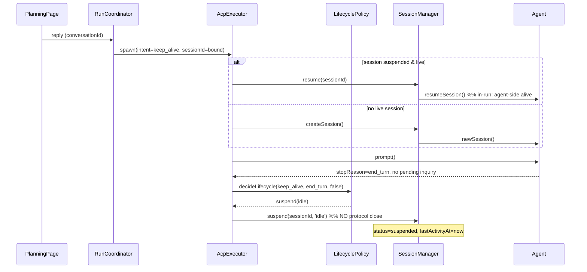

# Architecture Design: ACP Session Lifecycle

## Overview

The ACP session layer currently destroys the agent-side session on every prompt completion (`AcpExecutor.executePrompt()` calls `closeSession()` on all exit paths), so resume never succeeds and every continuation silently falls back to a fresh session — losing tool state, adding latency, and emitting WARN noise. Session state also lives only in an in-memory `Map`, so nothing survives an app restart, and the filesystem/permission context is resolved through a global `__current__` sentinel that is incorrect the moment more than one session is alive at once.

This design reworks the ACP session layer for a greenfield codebase where breaking changes are free and the goal is architectural quality. It establishes:

1. A **persisted session lifecycle** (`acp_sessions` table) owned by Capibara, with the agent remaining the source of truth for session *history* (via `session/load`).
2. A **pure-function lifecycle decision + explicit state machine** replacing inline `if` branches.
3. **Two orthogonal concepts** — session lifecycle (active/suspended/closed/expired) and collaboration waiting (`SessionSuspension`) — that are currently entangled.
4. **Correct per-prompt context resolution**, removing the global "current session" sentinel.
5. **Mode-aware lifecycle intent** supplied explicitly by `RunCoordinator`, supporting planning continuation, task close-on-complete, AI↔AI suspend, and cross-restart recovery (load / rebuild / expire).

### Architectural Concerns

| Concern | Source of Evidence | Priority |
|---------|--------------------|----------|
| Session continuity (planning multi-round, AI↔AI resume) | REQ-P1, REQ-C3 | must |
| Correct suspend-vs-close semantics | REQ-F1, REQ-T1, REQ-T2 | must |
| Concurrency correctness (multiple live sessions) | `__current__` sentinel in spawner; multi-session future | must |
| Persistence / restart recovery | REQ-P3, REQ-F4, REQ-X1 | must |
| Resource cleanup (no leaked agent subprocesses) | REQ-X1, REQ-C6 | must |
| Observability (no false WARNs) | REQ-X2 | should |
| UI state rehydration on re-entry | REQ-P4, BR-13 | should |
| Avoid over-engineering (no ES/microservices) | greenfield quality goal | must |

## Architecture Decision Records

### ADR-1: Persist Session Lifecycle in `acp_sessions`, Replace In-Memory Map

- **Status**: accepted
- **Context**: `AcpSessionManager.sessions` is a plain `Map`. Restart loses all state; idle-TTL sweeping cannot survive restart; lifecycle truth is scattered across the Map, `conversation.externalSessionId`, and `session_suspensions`. REQ-P3/REQ-X1/REQ-X3 all require durable session state.
- **Decision**: Introduce an `acp_sessions` SQLite table and `IAcpSessionRepository` as the single source of truth for Capibara's *view* of session lifecycle. The in-memory Map becomes a write-through cache for live agent connections only (the `connection` object is not persistable). The agent process remains the source of truth for session *history content* (retrieved via `session/load`).
- **Alternatives**:
  - *Binding-only persistence (prior plan D-5)* — persist just `conversation.externalSessionId`. Rejected: cannot drive TTL sweep, restart reconciliation, or accurate status; keeps truth scattered.
  - *Full session serialization incl. capabilities/mcpServers/cwd* — rejected: stores derivable, staleness-prone snapshots (see ADR-6).
- **Consequences**: (+) durable, single-source lifecycle; enables restart recovery and TTL. (−) new table + repository + migration; `/mvt-implement` must wire it into bootstrap DI.

### ADR-2: Lifecycle Decision as a Pure Function + Explicit State Machine

- **Status**: accepted
- **Context**: The suspend/close choice is currently three inline branches inside `executePrompt`, untestable and prone to drift (REQ-F1/F2).
- **Decision**: Extract `decideLifecycle(intent, stopReason, hasPendingInquiry) → LifecycleOutcome` as a pure function, and centralize all transitions in `AcpSessionManager` methods (`suspend`, `resume`, `close`, `expire`) guarded by an explicit state machine. The executor calls `decideLifecycle` then dispatches; it contains no lifecycle policy itself.
- **Alternatives**: Keep inline branches — rejected: not unit-testable, policy duplicated across normal/suspend/error paths.
- **Consequences**: (+) policy is one tested function; executor shrinks to orchestration. (−) one new module + its tests.

### ADR-3: Suspend ≠ Close (Core Fix)

- **Status**: accepted
- **Context**: Protocol `closeSession` permanently destroys the agent-side session; calling it on resumable exits is the root bug (REQ-F1, analysis root cause).
- **Decision**: `suspend` marks the session `suspended` locally and does **not** send protocol `closeSession`; the agent-side session stays alive for direct in-run resume. Protocol close is sent only by `close()` (genuine termination) and by TTL `expire()`.
- **Alternatives**: none viable — this is the defect.
- **Consequences**: (+) resume actually works; tool state preserved; WARN noise gone. (−) live agent sessions now accumulate → mandates TTL sweeping (ADR-7, REQ-X1).

### ADR-4: Resolve FS/Permission Context per Active Prompt, Remove `__current__` Sentinel

- **Status**: accepted
- **Context**: `AcpAgentSpawner` resolves `readTextFile`/`writeTextFile`/`requestPermission` context via `sessionContextResolver('__current__')`, returning the single `activeAcpSessionId`. Once suspend≠close keeps multiple sessions alive (planning + task + collaboration, possibly across orgs), the global "current" session is wrong, leaking the wrong role's `allowedPaths`/`cwd` into another session's file access — a correctness *and* security defect.
- **Decision**: ACP fs callbacks do not carry a sessionId, but exactly one prompt is in flight per agent connection at a time. Track the in-flight `acpSessionId` per agent connection and resolve context against *that* session, not a global sentinel. Resolver keyed by the agent connection's current prompt.
- **Alternatives**: Keep `__current__` — rejected: incorrect under concurrency, which this change explicitly enables.
- **Consequences**: (+) correct multi-session file/permission isolation. (−) spawner must track in-flight prompt per connection; touches a subtle area — needs focused tests.

### ADR-5: Separate Session Lifecycle from Collaboration Waiting (Two Orthogonal Axes)

- **Status**: accepted
- **Context**: "Session kept alive" and "waiting for an inquiry reply" are conflated. TTL exemption for collaboration (REQ-C6) reads as a special case rather than a property.
- **Decision**: Two axes:
  - **Lifecycle** (owned by `acp_sessions`): `active | suspended | closed | expired`, with `suspendReason: 'idle' | 'collaboration'`.
  - **Collaboration waiting** (owned by existing `session_suspensions` + `ChainDepthGuard` + `InquiryAggregator`): references a session, unchanged in mechanism.
  TTL exemption becomes a rule on the lifecycle axis: `suspendReason === 'collaboration'` ⇒ not idle-timed; liveness bound to awaiting state, with a generous absolute cap.
- **Alternatives**: Keep entangled — rejected: TTL/cleanup logic becomes branchy and fragile.
- **Consequences**: (+) clean separation; TTL/cleanup is uniform. (−) `acp_sessions` gains `suspendReason`; sweeper joins both tables for the collaboration cap.

### ADR-6: Rebuild Re-Derives Context; Table Stays Lean

- **Status**: accepted
- **Context**: `rebuild` strategy is an unimplemented `warn` stub (REQ-F3). It is needed when the agent no longer knows a session (post-restart, expired-on-agent).
- **Decision**: `rebuild` = create a fresh agent session (same path as `createSession`, re-deriving `cwd`/`mcpServers`/`allowedPaths` from role+org config) + reconstruct conversational context via `PromptBuilder` from persisted messages (and aggregated inquiry replies for collaboration). Derivable fields are **never** persisted.
- **Alternatives**: Persist full session snapshot to rebuild — rejected: stale snapshots, larger storage, divergence from live config.
- **Consequences**: (+) robust fallback; lean table. (−) `PromptBuilder.buildForConversation` gains a `forceFullContext` flag (breaking internal signature — acceptable, greenfield); tool state is lost on rebuild (text context preserved) — documented limitation.

### ADR-7: Startup Session Reconciliation + Idle-TTL Sweeper

- **Status**: accepted
- **Context**: After ADR-1/ADR-3, persisted sessions may reference dead agent subprocesses (agent dies with app), and idle suspensions must be reclaimed (REQ-X1). The project already marks orphaned runs `interrupted` on startup — reuse that pattern.
- **Decision**:
  - **Startup**: for each persisted non-terminal session, re-spawn agent and attempt `session/load`; on success → `active`-eligible (lazy, on next use), on failure → mark `expired` (rebuild happens on next use). No eager reconnection of all sessions.
  - **Sweeper**: a periodic task closes idle suspensions past `sessionTtlMs` (agent-side `closeSession` + mark `expired`); collaboration suspensions skipped unless past the absolute cap.
- **Alternatives**: Eager reconnect-all on startup — rejected: cost/complexity for sessions the user may never reopen.
- **Consequences**: (+) no leaked subprocesses; consistent restart semantics. (−) new sweeper task + startup hook in bootstrap.

### ADR-8: RunCoordinator Supplies Explicit `LifecycleIntent`

- **Status**: accepted
- **Context**: D-1 decided the decision is unified; the three `RunCoordinator` entry methods already encode the mode (planning / task / resume) but pass nothing explicit (REQ-F2, OPEN-4).
- **Decision**: Add `lifecycleIntent: 'keep_alive' | 'close_on_complete'` to `ExecutorInput`/`RunExecutionParams`. `executeForConversation` → `keep_alive`; `executeForTask` → `close_on_complete`; `executeResume` → inherits the suspended session's original intent. The executor never infers intent from `wakeReason`.
- **Alternatives**: Infer from `wakeReason`/conversation type — rejected: implicit, brittle, duplicates knowledge RunCoordinator already has.
- **Consequences**: (+) explicit, testable intent flow. (−) execution types gain a field threaded through RunEngine → executor.

## Module Design

| Module | Path | Action | Responsibility | Owned Entities | Key Dependencies |
|--------|------|--------|----------------|----------------|------------------|
| ACP — Session Repository | `modules/acp/persistence/` | **new** | Durable CRUD for `acp_sessions`; query by acpSessionId/status/binding | `acp_sessions` row | `ISqliteConnection` |
| ACP — Lifecycle Policy | `modules/acp/client/session-lifecycle.ts` | **new** | Pure `decideLifecycle()` + state-transition validation | — (pure) | none |
| ACP — Session Manager | `modules/acp/client/acp-session.manager.ts` | modify | State machine (suspend/resume/close/expire), rebuild, sweeper, write-through cache | live connection cache | repo, spawner, lifecycle policy |
| ACP — Executor | `modules/acp/client/acp-executor.ts` | modify | Orchestrate prompt; call `decideLifecycle` and dispatch; no inline policy | — | session manager, lifecycle policy |
| ACP — Agent Spawner | `modules/acp/client/acp-agent.spawner.ts` | modify | Detect `sessionCapabilities.list`; per-prompt context resolution (ADR-4) | agent subprocess | — |
| ACP — Types | `modules/acp/types/acp.types.ts` | modify | `expired` status, `suspendReason`, `supportsList`, `LifecycleIntent`, `sessionTtlMs` | type defs | — |
| ACP — Collaboration | `modules/acp/collaboration/*` | modify (light) | TTL-exempt liveness tag on suspend; cap enforcement. Cycle/depth/aggregation unchanged | `session_suspensions` | session repo |
| Orchestrator — RunCoordinator | `modules/orchestrator/run.coordinator.ts` | modify | Inject `LifecycleIntent`; restart-aware resume via manager (load/rebuild) | — | run engine, prompt builder |
| Execution — Types/Engine | `modules/execution/types/execution.types.ts`, `engines/run.engine.ts` | modify | Thread `lifecycleIntent` through to executor | — | — |
| Prompt — Builder | `modules/prompt/builder/prompt.builder.ts` | modify | `forceFullContext` for rebuild reconstruction | — | — |
| Renderer — Planning | `renderer/components/planning/*`, `store/conversation.store.ts` | modify/new | Conversation history list (REQ-P2); rehydrate page state on re-entry without flicker (REQ-P4) | — | IPC: list/get conversations |
| IPC / Preload / Shared API | `ipc-handlers/`, `preload/`, `core/shared` | modify | Channel(s) for planning conversation history list | — | conversation service |

No new architectural style; no new external dependency. New module count: 2 small units within the existing ACP module (repository + pure policy) — within single-module bounds.

## Key Interfaces

```ts
// acp.types.ts
export type AcpSessionStatus = 'active' | 'suspended' | 'closed' | 'expired';
export type SuspendReason = 'idle' | 'collaboration';
export type LifecycleIntent = 'keep_alive' | 'close_on_complete';
export type CloseReason = 'completed' | 'user_closed' | 'expired' | 'error' | 'shutdown';

// Persisted row — lean: only non-derivable lifecycle facts
export interface AcpSessionRecord {
  id: string;                 // internal id
  acpSessionId: string;       // agent-side id (for load/resume)
  agentId: string;
  roleId: string;
  orgId: string;
  runId: string | null;
  conversationId: string | null;   // planning binding (replaces conversation.externalSessionId truth)
  taskId: string | null;
  status: AcpSessionStatus;
  suspendReason: SuspendReason | null;
  resumeStrategy: 'resume' | 'load' | 'rebuild';
  resumeCount: number;
  lastActivityAt: string;     // drives idle TTL
  createdAt: string;
  closedAt: string | null;
  closeReason: CloseReason | null;
}

// session-lifecycle.ts — pure policy (ADR-2)
export interface LifecycleContext {
  intent: LifecycleIntent;
  stopReason: StopReason;
  hasPendingInquiry: boolean;
}
export type LifecycleOutcome =
  | { action: 'suspend'; reason: SuspendReason }
  | { action: 'close'; reason: CloseReason };

export function decideLifecycle(ctx: LifecycleContext): LifecycleOutcome;
// pendingInquiry → suspend(collaboration)
// stopReason !== 'end_turn' → close(error|cancelled-mapped)
// end_turn + keep_alive → suspend(idle)
// end_turn + close_on_complete → close(completed)

// IAcpSessionRepository (new)
export interface IAcpSessionRepository {
  create(rec: Omit<AcpSessionRecord, 'createdAt'>): AcpSessionRecord;
  findById(id: string): AcpSessionRecord | null;
  findByAcpSessionId(acpSessionId: string): AcpSessionRecord | null;
  findByConversationId(conversationId: string): AcpSessionRecord | null;
  findResumable(roleId: string, orgId: string): AcpSessionRecord | null;
  findIdleExpired(beforeIso: string): AcpSessionRecord[];           // sweeper
  findNonTerminal(): AcpSessionRecord[];                            // startup reconcile
  updateStatus(id: string, status: AcpSessionStatus, patch?: Partial<AcpSessionRecord>): void;
  touchActivity(id: string, iso: string): void;
}

// AcpSessionManager — explicit transitions (ADR-2/3/5)
interface IAcpSessionManager {
  createSession(p: CreateSessionParams): Promise<AcpSessionRecord>;
  suspend(sessionId: string, reason: SuspendReason): Promise<void>;       // no protocol close
  resume(sessionId: string): Promise<void>;                                // resume|load|rebuild
  close(sessionId: string, reason: CloseReason): Promise<void>;            // protocol close
  expire(sessionId: string): Promise<void>;                                // TTL → protocol close + 'expired'
  reconcileOnStartup(): Promise<void>;                                     // ADR-7
  sweepIdle(nowIso: string): Promise<void>;                                // ADR-7
}

// RunCoordinator threads intent (ADR-8)
// executeForConversation → keep_alive ; executeForTask → close_on_complete
// PromptBuilder.buildForConversation(conversationId, roleId, locale, { forceFullContext })  // ADR-6
```

## Data Flow

### Flow 1 — Planning multi-round (in-run continuation)


Error paths: prompt throws → `decideLifecycle` not consulted; `close(error)`, drain audit logs, INFO log. resume() fails on a session marked closed/expired → skip to rebuild (no WARN).

### Flow 2 — Task with mid-execution AI↔AI inquiry

```mermaid
sequenceDiagram
  participant EX as AcpExecutor(A)
  participant LM as LifecyclePolicy
  participant SM as SessionManager
  participant SUS as SuspensionManager
  participant CO as ConversationOrchestrator
  participant RC as RunCoordinator
  EX->>EX: prompt() returns; detectPendingInquiries() > 0
  EX->>LM: decideLifecycle(close_on_complete, end_turn, true)
  LM-->>EX: suspend(collaboration)
  EX->>SM: suspend(A, 'collaboration')  %% TTL-exempt, agent-side alive
  EX->>SUS: suspend(awaiting B)  %% existing: chain depth + cycle guard
  Note over CO: B answers → conversation:resolved
  CO->>SUS: onInquiryResolved(convId, reply)
  SUS-->>CO: ResumeDecision(aggregatedReply)
  CO->>RC: executeResume(decision)  %% intent inherited
  RC->>EX: spawn(sessionId=A, intent inherited)
  EX->>SM: resume(A)  %% in-run: direct resumeSession, tool state intact
  EX->>AG: prompt(aggregatedReply)
  AG-->>EX: end_turn, no pending inquiry
  EX->>SM: close(A, 'completed')  %% task truly done
```
Error paths: B times out (`inquiryTimeoutMs`) → awaiting `timed_out`, aggregation proceeds with placeholder (REQ-C5). Cycle/depth violation → `ChainDepthGuard` rejects before suspend (REQ-C4, already implemented).

### Flow 3 — History re-entry after restart (load / rebuild)

1. Trigger: user picks a conversation from history list (REQ-P2) — list sourced from conversation table (D-2).
2. RunCoordinator resolves bound `acpSessionId` from `acp_sessions`.
3. `SessionManager.resume()`: strategy `load` → `connection.loadSession()`. Success → continue with full history.
4. Failure / status `expired` → `rebuild`: fresh session + `PromptBuilder(forceFullContext)` from persisted messages.
5. UI: on entering `chatting`, rehydrate messages + tool-call panels from persisted store before first paint (REQ-P4) — no reset/flicker (BR-13).

Error path: agent unavailable entirely → surface a clear "agent unavailable" state, do not silently spin.

### Flow 4 — Startup reconciliation & idle sweep (ADR-7)

- Startup: `reconcileOnStartup()` walks `findNonTerminal()`; agent subprocess is dead post-restart → mark `expired` (lazy rebuild on next use). (No eager reconnect.)
- Periodic: `sweepIdle(now)` → `findIdleExpired(now - sessionTtlMs)` filtered to `suspendReason='idle'` → `expire()` each. Collaboration sessions only swept past absolute cap.

## File Structure

```
apps/electron/src/core/modules/acp/
  client/
    acp-executor.ts                      (modify) decideLifecycle + dispatch, no inline policy
    acp-session.manager.ts               (modify) state machine, rebuild, sweeper, write-through cache
    acp-agent.spawner.ts                 (modify) detect sessionCapabilities.list; per-prompt context (ADR-4)
    session-lifecycle.ts                 (new)    pure decideLifecycle + transition guards
  persistence/
    sqlite-acp-session.repository.ts      (new)    acp_sessions CRUD
    sqlite-suspension.repository.ts       (modify) light: liveness/cap support
    migrations/*                          (new)    acp_sessions table
  interfaces/
    i-acp-session.repository.ts           (new)
    i-acp-session.manager.ts              (modify) new method signatures
  types/
    acp.types.ts                          (modify) statuses, reasons, intent, config
  collaboration/
    session-suspension.manager.ts         (modify light) tag collaboration liveness; cap
    (chain-depth.guard.ts, inquiry-aggregator.ts: unchanged)

apps/electron/src/core/modules/orchestrator/
  run.coordinator.ts                      (modify) LifecycleIntent; restart-aware resume

apps/electron/src/core/modules/execution/
  types/execution.types.ts                (modify) lifecycleIntent field
  engines/run.engine.ts                   (modify) thread intent to executor

apps/electron/src/core/modules/prompt/builder/
  prompt.builder.ts                       (modify) forceFullContext (ADR-6)

apps/electron/src/core/bootstrap/
  *                                        (modify) register repo, startup reconcile, sweeper task

apps/electron/src/core/{ipc-handlers,preload,shared}/
  *                                        (modify) planning conversation history list channel

apps/electron/src/renderer/
  components/planning/PlanningPage.tsx     (modify) history list entry + rehydration
  components/planning/PlanningHistory.tsx  (new)    history list UI
  store/conversation.store.ts             (modify) persist/rehydrate conversation view state
```

## Implementation Guidelines

Recommended ordering for `/mvt-plan-dev` (dependency-first, each step independently testable):

1. **Types & pure policy** — `acp.types.ts` + `session-lifecycle.ts` (+ unit tests for the decision table). No runtime deps; unblocks everything.
2. **Persistence** — `acp_sessions` migration + repository + interface (+ repo tests).
3. **Session manager** — state machine (suspend/resume/close/expire) over repo + write-through cache; implement `rebuild` last within this step.
4. **Spawner fixes** — `sessionCapabilities.list` detection + per-prompt context resolution (ADR-4); dedicated concurrency tests.
5. **Executor** — replace inline close with `decideLifecycle` dispatch.
6. **Intent threading** — execution types → RunEngine → RunCoordinator entry methods.
7. **Startup reconcile + idle sweeper** — bootstrap wiring.
8. **Collaboration liveness/cap** — light edits; verify existing cycle/depth/aggregation tests still pass.
9. **PromptBuilder `forceFullContext`** — for rebuild.
10. **Renderer** — history list + page rehydration (REQ-P2/P4) last; depends on IPC channel.

Defaults to confirm during implementation (OPEN-2): idle `sessionTtlMs` = 30 min; collaboration absolute cap = 2 h; `maxChainDepth` = 5 (unchanged). `error` status folded into `closed` + `closeReason='error'` (OPEN-3 resolved). OPEN-4 resolved via ADR-8 (explicit intent, no wakeReason inference).

## Change Tracking

| Path | Action | Driver |
|------|--------|--------|
| `acp/types/acp.types.ts` | modify | ADR-5/6/8, REQ-F4/F5 |
| `acp/client/session-lifecycle.ts` | create | ADR-2 |
| `acp/persistence/sqlite-acp-session.repository.ts` | create | ADR-1 |
| `acp/persistence/migrations/* (acp_sessions)` | create | ADR-1 |
| `acp/interfaces/i-acp-session.repository.ts` | create | ADR-1 |
| `acp/client/acp-session.manager.ts` | modify | ADR-1/2/3/5/6/7 |
| `acp/client/acp-executor.ts` | modify | ADR-2/3, REQ-F1/F2 |
| `acp/client/acp-agent.spawner.ts` | modify | ADR-4, REQ-F4 |
| `acp/interfaces/i-acp-session.manager.ts` | modify | ADR-2 |
| `acp/persistence/sqlite-suspension.repository.ts` | modify | ADR-5, REQ-C6/X3 |
| `acp/collaboration/session-suspension.manager.ts` | modify | ADR-5, REQ-C6 |
| `orchestrator/run.coordinator.ts` | modify | ADR-8, REQ-P3/C3 |
| `execution/types/execution.types.ts` | modify | ADR-8 |
| `execution/engines/run.engine.ts` | modify | ADR-8 |
| `prompt/builder/prompt.builder.ts` | modify | ADR-6 |
| `bootstrap/*` | modify | ADR-1/7 |
| `ipc-handlers/*`, `preload/*`, `core/shared/*` | modify | REQ-P2 |
| `renderer/components/planning/PlanningPage.tsx` | modify | REQ-P2/P4 |
| `renderer/components/planning/PlanningHistory.tsx` | create | REQ-P2 |
| `renderer/store/conversation.store.ts` | modify | REQ-P4 |

**Breaking changes (acceptable — greenfield)**: `IAcpSessionManager` method set; `ExecutorInput`/`RunExecutionParams` gain `lifecycleIntent`; `PromptBuilder.buildForConversation` signature; `conversation.externalSessionId` truth migrates into `acp_sessions.conversationId`; `AcpSessionStatus` drops `error` (→ `closed`+`closeReason`).

> ~20 files across core + renderer, 2 new units, new table, breaking interface changes → proceed to `/mvt-plan-dev` for task-level tracking.
