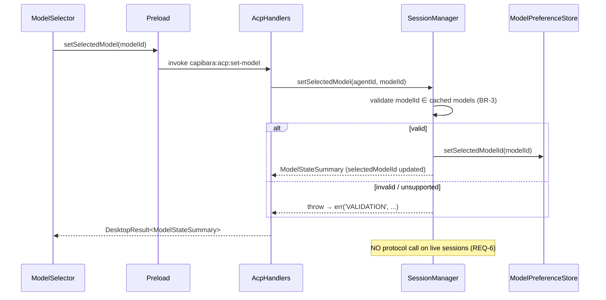
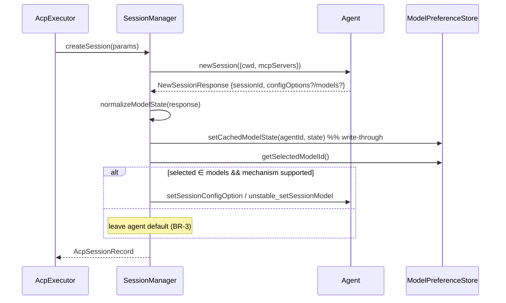

# Architecture Design: ACP Model Selection in Settings

## Overview

The Settings page must let the user pick a single global default AI model for the ACP agent,
where the list of selectable models is discovered dynamically over the Agent Client Protocol
rather than hard-coded. The protocol exposes model information only at the **session level** (in
the `session/new` response, as the optional `configOptions` or `models` fields), so model
discovery is inherently tied to session creation, and model support is a per-agent runtime
capability — exactly like the existing `supportsResume`/`supportsLoad` detection.

The chosen scope (confirmed in analysis) is deliberately small: one application-wide model
preference, applied to the *next* session created (no retroactive switch of a running session),
degrading gracefully to a disabled selector when the active agent advertises no models. This
design builds directly on `[[20260528-acp-session-lifecycle]]` (the `AcpSessionManager` /
`createSession` seam) and reuses the existing settings-persistence and IPC patterns.

### Architectural Concerns

| Concern | Source of Evidence | Priority |
|---------|--------------------|----------|
| Dynamic model discovery over protocol (no hard-coding) | REQ-1, REQ-2 | must |
| Apply preference to new sessions only (no live mutation) | REQ-4, REQ-6, BR-5 | must |
| Graceful degradation when agent advertises no models | REQ-5, BR-2 | must |
| Persistence of preference across restarts | REQ-3, BR-6 | must |
| Session-scoped discovery vs settings-page render timing | analysis Q-3/Q-4, BR-1 | should |
| Layer compliance (IPC pattern, preload passthrough) | REQ-N1 | must |
| Capability-detection parity with existing ACP code | REQ-N2 | should |
| Forward compatibility of protocol mechanism choice | REQ-N3 | should |
| i18n of new UI strings | REQ-N4 | should |

## Architecture Decision Records

### ADR-1: Prefer `setSessionConfigOption` (category `model`); fall back to `unstable_setSessionModel`

- **Status**: accepted
- **Context**: SDK 0.22.1 exposes two session-level model mechanisms (REQ-1/N3). `configOptions`
  (`category: "model"`, `type: "select"`) is the documented "preferred way" and the SDK method
  `connection.setSessionConfigOption` carries no `unstable_` marker. `models`
  (`SessionModelState` + `connection.unstable_setSessionModel`) is purpose-built but
  `@experimental` ("may be removed or changed at any point"). Both `configOptions` and `models`
  are optional ("MAY") agent-advertised fields.
- **Decision**: Detect with precedence `configOptions(category=model)` → `models`, mirroring the
  existing `resume > load > rebuild` degradation chain. Normalize both into a single internal
  `ModelState { models: AvailableModel[]; currentModelId; mechanism; configId? }`. Apply via the
  mechanism that produced the list: `config_option` → `setSessionConfigOption({sessionId,
  configId, value})`; `set_model` → `unstable_setSessionModel({sessionId, modelId})`.
- **Alternatives**:
  - *Only `unstable_setSessionModel`* — rejected: experimental, no config-option future-proofing,
    won't serve agents that expose models via `configOptions`.
  - *Only `configOptions`* — rejected: would silently fail to detect agents that expose models
    only via the dedicated `models` field.
- **Consequences**: (+) works against either agent style; stable path preferred; forward-compatible
  with reasoning-level/mode options later. (−) a normalization layer with two apply branches needs
  focused unit tests; `configOptions` select values may be grouped (`SessionConfigSelectGroup`) —
  must flatten.

### ADR-2: Persist preference and last-seen model cache in the SQLite `settings` table, not `config.json`

- **Status**: accepted
- **Context**: The analysis assumed the preference would live in `CapibaraConfig.agents`
  (`config.json`). Investigation shows **no runtime write-back to `config.json` exists**;
  layered config is read-only at load time. Runtime-mutable settings (locale, `scheduler_paused`)
  are stored in the SQLite `settings` key-value table via `capibara:settings:get/set` (REQ-3, BR-6).
- **Decision**: Persist the selected `modelId` and the last-advertised `ModelState` in the
  `settings` table behind a thin `IModelPreferenceStore` (sqlite impl in the ACP module). Keys:
  `acp:default-model` (string) and `acp:models-cache:<agentId>` (JSON). This supersedes analysis
  BR-6's `config.json` placement.
- **Alternatives**:
  - *`config.json` `agents.defaultModel`* — rejected: no write path; would require building a
    config persister, out of scope.
  - *New dedicated table* — rejected: over-engineering for two key-value rows; the `settings`
    table is the established pattern.
- **Consequences**: (+) reuses the proven persistence path; survives restarts; testable behind an
  interface. (−) one new small unit (store + interface) wired into the ACP module DI.

### ADR-3: `AcpSessionManager` owns all model logic; preference applied at session creation only

- **Status**: accepted
- **Context**: Model state arrives in the `newSession` response, which `AcpSessionManager`
  already consumes in `createSession` (and `rebuild`). REQ-6/BR-5 forbid mutating a running
  session when the preference changes.
- **Decision**: The manager is the single owner of model logic. In `createSession`/`rebuild` it
  normalizes the response's model fields, applies the stored preference if (and only if) the
  `modelId` is in the advertised list and a mechanism is supported (BR-3), and write-through
  caches the `ModelState`. It exposes `getModelState(agentId)` and `setSelectedModel(modelId)`.
  `setSelectedModel` **only persists** the preference — it never calls a protocol set on live
  sessions (REQ-6). The executor and `CreateSessionParams` are left unchanged (no model threading
  through the run pipeline).
- **Alternatives**:
  - *Executor reads preference and threads `modelId` into `CreateSessionParams`* — rejected:
    spreads model logic across executor + manager; the manager already has the `newSession`
    response and connection.
  - *Apply on live sessions when preference changes* — rejected: violates REQ-6 (no retroactive
    switch).
- **Consequences**: (+) minimal blast radius — executor/run-pipeline untouched; one cohesive owner;
  easy to test. (−) manager gains a store dependency and two public methods.

### ADR-4: Cache last-seen models for settings rendering; cold-start shows an empty/disabled state

- **Status**: accepted
- **Context**: Models are session-scoped (BR-1), so before any session has run for the active
  agent there is nothing to list. The Settings page still needs something to render across restarts
  (analysis Q-3/Q-4).
- **Decision**: Treat the persisted `acp:models-cache:<agentId>` (ADR-2) as the source for the
  Settings page. On a cold start with no cache and no live session, the selector renders a
  disabled empty-state ("models will be available after the agent runs once") — the same disabled
  surface used when an agent genuinely advertises no models (REQ-5). The first real session
  populates the cache write-through.
- **Alternatives**:
  - *Probe session on settings open* (spawn agent, `newSession`, read models, close) — rejected
    for this change: spawning an agent subprocess from a config screen is a heavier interaction and
    adds lifecycle edge cases; deferred as a possible future "Detect models" action.
- **Consequences**: (+) no agent spawning from settings; consistent disabled surface for both
  "unsupported" and "not yet known"; survives restarts once populated. (−) documented limitation:
  fresh installs see an empty selector until the first agent run.

### ADR-5: New IPC lives in the `capibara:acp:*` domain, talking only to the manager

- **Status**: accepted
- **Context**: REQ-N1 mandates the standard IPC → handler → service → `DesktopResult` flow with a
  passthrough preload. The Settings page already calls `capibara:system:agent-config`; ACP model
  state is an ACP concern and the `capibara:acp:*` domain already exists (`registerAcpHandlers`).
- **Decision**: Add two additive channels in `registerAcpHandlers` (extended with
  `sessionManager` + the default `agentId`): `capibara:acp:model-state` (get) and
  `capibara:acp:set-model` (set). Both return a `ModelStateSummary` `DesktopResult`. Preload
  exposes `getModelState`/`setSelectedModel` as pure passthroughs; `CapibaraApi` is extended.
- **Alternatives**:
  - *Reuse generic `capibara:settings:set` from the renderer* — rejected: bypasses validation
    (BR-3) and leaks the storage key into the renderer.
  - *Put it in `system.handlers`* — rejected: that handler lacks the session manager; ACP domain
    is the correct boundary.
- **Consequences**: (+) additive, no breaking change; validation centralized server-side. (−)
  `registerAcpHandlers` signature grows; preload parity test must be updated.

## Module Design

| Module | Path | Action | Responsibility | Owned Entities | Key Dependencies |
|--------|------|--------|----------------|----------------|------------------|
| ACP — Model Preference Store | `modules/acp/persistence/sqlite-model-preference.store.ts` | **new** | Persist selected modelId + last-seen ModelState in `settings` table | `settings` rows (`acp:default-model`, `acp:models-cache:*`) | `ISqliteConnection` |
| ACP — Store Interface | `modules/acp/interfaces/i-model-preference.store.ts` | **new** | Contract for the store | — | — |
| ACP — Session Manager | `modules/acp/client/acp-session.manager.ts` | modify | Normalize + apply preference on create/rebuild; write-through cache; `getModelState`/`setSelectedModel` (ADR-1/3/4) | live `ModelState` in runtime context | store, spawner connection |
| ACP — Manager Interface | `modules/acp/interfaces/i-acp-session.manager.ts` | modify | Add `getModelState`/`setSelectedModel` | — | — |
| ACP — Types | `modules/acp/types/acp.types.ts` | modify | `AvailableModel`, `ModelState`, `AgentModelMechanism`; extend `SessionRuntimeContext` | type defs | — |
| ACP — Model Normalizer | `modules/acp/client/model-state.ts` | **new** | Pure `normalizeModelState(response)` from `configOptions`/`models` (ADR-1) | — (pure) | sdk types |
| Bootstrap | `bootstrap/acp.module.ts`, `bootstrap/composition-root.ts` | modify | Construct store, inject into manager | — | store, sqlite |
| IPC — ACP Handlers | `ipc-handlers/acp.handlers.ts` | modify | `capibara:acp:model-state` / `:set-model` (ADR-5) | — | session manager |
| Shared API | `core/shared/types.ts`, `core/shared/api.ts` | modify | `ModelStateSummary`; `getModelState`/`setSelectedModel` on `CapibaraApi` | — | — |
| Preload | `core/preload/index.ts` | modify | Passthrough for the two channels | — | — |
| Renderer — Model Selector | `renderer/components/settings/ModelSelector.tsx` | **new** | Selector UI + disabled/empty state; wire to IPC | — | IPC |
| Renderer — Settings | `renderer/components/settings/AgentConfigPanel.tsx` | modify | Mount `ModelSelector` | — | — |
| Locale | `shared/locale/{en-US,zh-CN,types}.ts` | modify | New strings (REQ-N4) | — | — |

Architecture style: **service-oriented within the existing ACP module** — consistent with the
prior ACP design. No new architectural style, no new external dependency (SDK already present), no
breaking change to any public interface (all IPC additions are additive). New units: 3 small ones
(store + interface + pure normalizer) within the ACP module — within single-module bounds.

## Key Interfaces

```ts
// acp.types.ts
export type AgentModelMechanism = 'config_option' | 'set_model';

export interface AvailableModel {
  id: string;             // modelId (set_model) or config value id (config_option)
  name: string;
  description?: string;
}

export interface ModelState {
  models: AvailableModel[];        // empty ⇒ model selection unsupported (BR-2)
  currentModelId: string | null;   // agent-reported active model
  mechanism: AgentModelMechanism | null;
  configId?: string;               // present only for mechanism === 'config_option'
}

// SessionRuntimeContext gains:  modelState: ModelState | null;

// model-state.ts — pure (ADR-1)
export function normalizeModelState(resp: acp.NewSessionResponse): ModelState;
// precedence: configOptions(category==='model', type==='select') → models → empty
// flattens SessionConfigSelectGroup options

// i-model-preference.store.ts (new, ADR-2)
export interface IModelPreferenceStore {
  getSelectedModelId(): string | null;
  setSelectedModelId(modelId: string | null): void;
  getCachedModelState(agentId: string): ModelState | null;
  setCachedModelState(agentId: string, state: ModelState): void;
}

// IAcpSessionManager (modify, ADR-3)
interface IAcpSessionManager {
  // ...existing...
  getModelState(agentId: string): ModelStateSummary;        // live context ?? cache
  setSelectedModel(agentId: string, modelId: string): ModelStateSummary; // validate ∈ list, persist only
}

// core/shared/types.ts — renderer-facing
export interface ModelStateSummary {
  supported: boolean;              // models.length > 0
  models: AvailableModel[];
  currentModelId: string | null;   // agent-reported active
  selectedModelId: string | null;  // user preference
}

// CapibaraApi (api.ts) — additive
getModelState: () => Promise<DesktopResult<ModelStateSummary>>;
setSelectedModel: (modelId: string) => Promise<DesktopResult<ModelStateSummary>>;

// Channels (ADR-5)
'capibara:acp:model-state'  // get  → ModelStateSummary
'capibara:acp:set-model'    // set(modelId) → ModelStateSummary (validates BR-3)
```

Apply logic inside `AcpSessionManager.createSession`/`rebuild` (after `connection.newSession`):

```text
state = normalizeModelState(response)
store.setCachedModelState(agentId, state)            // write-through (ADR-4)
runtime.modelState = state
selected = store.getSelectedModelId()
if selected && state.mechanism && state.models.some(m => m.id === selected):  // BR-3
   if state.mechanism === 'config_option':
       connection.setSessionConfigOption({ sessionId, configId: state.configId, value: selected })
   else:
       connection.unstable_setSessionModel({ sessionId, modelId: selected })
// else: leave agent default untouched (protocol guarantees a default)
```

## Data Flow

### Flow 1 — User selects a model in Settings (set preference)


Error paths: modelId not in advertised list → `err('VALIDATION')`, UI keeps prior selection and
shows a message. Store write failure → `err('INTERNAL')`.

### Flow 2 — Preference applied on next session creation


Error paths: agent rejects the set call → log WARN, continue with the agent's default model (do not
fail the run — model selection is best-effort, consistent with the "MUST supply a default" rule).
Agent advertises no models → `state.models` empty, nothing applied, cache records unsupported.

### Flow 3 — Settings page open (read state)

1. `ModelSelector` mounts → `getModelState()` → `capibara:acp:model-state`.
2. `SessionManager.getModelState(agentId)` returns the live runtime `ModelState` if a session is
   alive, else the persisted cache (ADR-4), merged with the stored `selectedModelId`.
3. Renderer: `supported === false` (empty models) → render disabled selector + explanatory message
   (REQ-5); else render the dropdown with `selectedModelId` checked and `currentModelId` annotated.

Error path: no cache and no live session (cold start) → `supported: false`, models empty →
empty-state message (ADR-4).

## File Structure

```
apps/electron/src/core/modules/acp/
  client/
    acp-session.manager.ts            (modify) normalize+apply+cache; getModelState/setSelectedModel
    model-state.ts                    (new)    pure normalizeModelState (configOptions/models → ModelState)
  persistence/
    sqlite-model-preference.store.ts  (new)    settings-table-backed store (ADR-2)
  interfaces/
    i-model-preference.store.ts       (new)
    i-acp-session.manager.ts          (modify) new method signatures
  types/
    acp.types.ts                      (modify) AvailableModel, ModelState, AgentModelMechanism; runtime ctx

apps/electron/src/core/bootstrap/
  acp.module.ts                       (modify) construct + inject store
  composition-root.ts                 (modify) pass sqliteConn-backed store

apps/electron/src/core/ipc-handlers/
  acp.handlers.ts                     (modify) capibara:acp:model-state / :set-model (+ sessionManager dep)

apps/electron/src/core/shared/
  types.ts                            (modify) ModelStateSummary, AvailableModel re-export
  api.ts                              (modify) getModelState / setSelectedModel

apps/electron/src/core/preload/
  index.ts                            (modify) passthrough for the two channels

apps/electron/src/renderer/components/settings/
  ModelSelector.tsx                   (new)    selector + disabled/empty state
  AgentConfigPanel.tsx                (modify) mount ModelSelector

apps/electron/src/shared/locale/
  en-US.ts, zh-CN.ts, types.ts        (modify) new strings (REQ-N4)
```

## Implementation Guidelines

Recommended ordering for `/mvt-plan-dev` (dependency-first, each step independently testable):

1. **Types + pure normalizer** — `acp.types.ts` (`AvailableModel`/`ModelState`/`AgentModelMechanism`,
   runtime-context field) + `model-state.ts` `normalizeModelState` with unit tests covering:
   configOptions(category=model) present, grouped options flattened, `models` fallback, neither
   present (empty/unsupported). No runtime deps; unblocks everything.
2. **Store** — `i-model-preference.store.ts` + `sqlite-model-preference.store.ts` over the `settings`
   table (+ store tests: get/set selected, get/set cache JSON round-trip).
3. **Session manager** — wire store dep; apply+cache helper in `createSession` and `rebuild`;
   `getModelState`/`setSelectedModel` (+ manager tests: applies when valid, skips when stale/
   unsupported, no live mutation on set, agent-reject best-effort).
4. **Bootstrap** — construct store in `acp.module.ts`, thread `sqliteConn`; pass default `agentId`.
5. **IPC + shared API + preload** — `capibara:acp:model-state` / `:set-model`; `ModelStateSummary`;
   `CapibaraApi` additions; preload passthrough (+ update preload-api-parity test).
6. **Renderer** — `ModelSelector.tsx` (dropdown + disabled/empty state + current-model annotation),
   mount in `AgentConfigPanel.tsx`; locale strings in both locales last.

Defaults to confirm during implementation: settings keys `acp:default-model` and
`acp:models-cache:<agentId>`; agent-reject on apply is logged WARN and non-fatal; the cold-start
empty-state reuses the same disabled surface as the unsupported-agent case.

## Change Tracking

| Path | Action | Driver |
|------|--------|--------|
| `acp/types/acp.types.ts` | modify | ADR-1/3, REQ-1 |
| `acp/client/model-state.ts` | create | ADR-1 |
| `acp/interfaces/i-model-preference.store.ts` | create | ADR-2 |
| `acp/persistence/sqlite-model-preference.store.ts` | create | ADR-2 |
| `acp/client/acp-session.manager.ts` | modify | ADR-1/3/4, REQ-4/6 |
| `acp/interfaces/i-acp-session.manager.ts` | modify | ADR-3 |
| `bootstrap/acp.module.ts` | modify | ADR-2 |
| `bootstrap/composition-root.ts` | modify | ADR-2 |
| `ipc-handlers/acp.handlers.ts` | modify | ADR-5, REQ-N1 |
| `core/shared/types.ts` | modify | ADR-5 |
| `core/shared/api.ts` | modify | ADR-5 |
| `core/preload/index.ts` | modify | ADR-5, REQ-N1 |
| `renderer/components/settings/ModelSelector.tsx` | create | REQ-2/3/5 |
| `renderer/components/settings/AgentConfigPanel.tsx` | modify | REQ-2/3 |
| `shared/locale/en-US.ts` | modify | REQ-N4 |
| `shared/locale/zh-CN.ts` | modify | REQ-N4 |
| `shared/locale/types.ts` | modify | REQ-N4 |
| `tests/unit/acp/*` (normalizer, store, manager) | create/modify | all ADRs |
| `tests/unit/preload-api-parity.test.ts` | modify | ADR-5 |

**No breaking changes** — all IPC/API additions are additive; `IAcpSessionManager` gains methods
(implementations updated in lockstep); `SessionRuntimeContext` gains an optional field.
**Supersedes** analysis BR-6: preference persists in the SQLite `settings` table (ADR-2), not
`config.json`.

> ~14 files across ACP core + IPC + renderer + locale, 3 new units → proceed to `/mvt-plan-dev`
> for task-level tracking.
