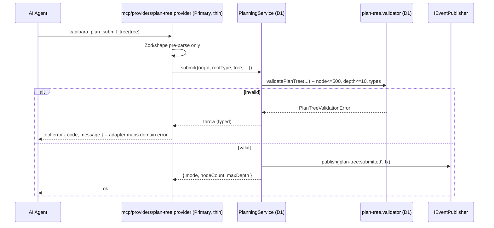
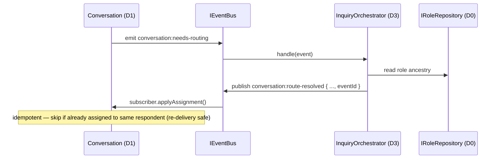

# Architecture Design: Capibara Architecture Refactor (architecture-final-v2)

> Source baseline: `docs/architecture-final-v2.md` (Final 2.0)
> Analysis: `analysis.md` (this change)
> Target branch: `acp-refactor`
> Scope: Full roadmap (Phase 0-4). Breaking changes are **pre-authorized by the user** for this refactor.
> Style: Confirmed existing baseline — Hexagonal (Primary / Domain Core / Secondary) + Domain Core layers D0-D3 + transactional-outbox event-driven. This refactor does NOT introduce a new style; it *enforces* and *completes* the existing one.

## Overview

**Problem statement.** The Capibara main process already follows a hexagonal, layered, event-driven design, but four properties are unenforced or incorrect on the `acp-refactor` branch: (1) layer dependency direction is only hand-drawn, with no mechanical guard; (2) plan-tree domain invariants (node/depth limits) live in the MCP protocol adapter rather than in `PlanningService`, so any non-MCP path bypasses them; (3) task->conversation cascade delete is an app-layer loop over an `ON DELETE SET NULL` FK, which both leaks a hidden cross-module edge and contradicts the intended "task owns conversation" semantics; (4) the architecture relies on at-least-once outbox delivery but never required subscribers to be idempotent, and at least one non-idempotent subscriber exists (`onResponseNeeded`). On top of these correctness prerequisites, protocol mechanics (MCP/ACP) and Notification must be relocated to `infrastructure/`, cross-module concrete-class imports replaced by interfaces, and the active `InquiryRouter` reclassified/renamed to D3.

This refactor lands as a **prerequisite safety net (G-1..G-4)** followed by structural OPs (OP-1/2/3/5/6/7/8/9/10), each an independently revertable PR gated by `arch:check`.

### Architectural concerns

| concern | source-of-evidence | priority |
|---------|--------------------|----------|
| Layer dependency enforcement (no reverse edges, D0 leaf, no D1->D3) | v2 §8; code: no `.dependency-cruiser.cjs` | must |
| Domain invariants enforced in domain, not adapters | v2 §13.1; code: `MAX_TREE_*` only in `plan-tree-tools.ts` | must |
| Cascade-delete correctness & honesty (FK CASCADE) | v2 §13.2; code: `task_id ... ON DELETE SET NULL` + app-loop | must |
| Event-subscriber idempotency under at-least-once delivery | v2 §12.4/§13.3; code: `pending_wakes` no unique key | must |
| Cross-module coupling via interfaces, not concrete classes | v2 §7.1 #2; code: ~11 concrete imports | must |
| Protocol mechanics isolated to infrastructure (C-7) | v2 §6.1; code: MCP/ACP under `modules/` | should |
| Naming reflects active/passive role (D-8) | v2 §11; code: `InquiryRouter` active but Service-less | should |
| No functional regression / no renderer-contract change | v2 §15; analysis "must preserve" rules | must |
| Migration safety on existing user databases | analysis Q1; code: versioned migrations v1-v5 | must |

## Architecture Decision Records

> Most strategic decisions (D-1..D-8) are inherited from the v2 baseline and are **accepted, not re-litigated**. The ADRs below are: (a) one-line confirmations of inherited decisions that this design depends on, and (b) full ADRs for the **implementation-level** decisions this design introduces (migration strategy, idempotency-key shape, guard-rule shape, sequencing). ADRs marked **[breaking]** are pre-authorized by the user.

### ADR-01 — Adopt the v2 hexagonal + D0-D3 baseline as the target (inherited)
- Status: accepted
- Decision: Target architecture = Hexagonal skeleton, Domain Core layers D0-D3, transactional-outbox event-driven, folder convention C-7 (`infrastructure/` = all technical mechanics). Inherits D-1..D-8.
- Consequences: This design only enforces/completes the baseline; it adds no new style.

### ADR-02 — Enforce layering with dependency-cruiser as a per-PR CI gate (G-1)
- Status: accepted
- Context: v2 §8 / concern "layer enforcement". The dependency DAG is currently only a diagram.
- Decision: Add `apps/electron/.dependency-cruiser.cjs` with 4 forbidden rules (no-core-to-adapters, d0-must-stay-leaf, no-upward-d1-to-d3, no-cross-module-concrete) + the §8.2 allowed-edge whitelist. Add `arch:check` npm script. Non-zero exit blocks merge.
- Alternatives: (a) keep grep checks — rejected: cannot express directional graph rules; (b) eslint-plugin-boundaries — rejected: dependency-cruiser is the v2-specified tool and gives a single config + CI exit code.
- Consequences: Every subsequent OP PR must pass `arch:check`. Establishes the safety net before any file moves.

### ADR-03 — Sink plan-tree invariants into PlanningService; MCP becomes a thin forwarder (G-2) [breaking]
- Status: accepted
- Context: v2 §13.1 / A-1. `validatePlanTree()`, `MAX_TREE_NODES/DEPTH`, `countNodes/measureDepth` live in `plan-tree-tools.ts`; `PlanningService` does not enforce limits. Non-MCP paths (IPC, `approvePending`, tests, future adapters) bypass them.
- Decision: Move the structural/limit validation into `PlanningService`, enforced at **both** `submit` and `approvePending` entry points. The MCP handler keeps only Zod/shape pre-parsing and forwards; domain throws a typed `PlanTreeValidationError` which the adapter maps to a tool error. The `validatePlanTree` function + constants move into the planning module (e.g. `planning/validation/plan-tree.validator.ts`); MCP imports nothing tree-limit-related.
- Alternatives: (a) leave validation in MCP, add a second copy in Planning — rejected: duplicated invariant, drift risk; (b) shared util in foundation — rejected: this is domain logic (uses ProcessEngine work-item types), belongs in D1.
- Consequences: **Breaking** to MCP tool error shape (now sourced from domain error -> adapter mapping; the error `code` set is preserved). Must add submit+approve path tests. Unblocks OP-5 (MCP split won't strand domain logic). Also addresses B-5 (add explicit state guard at approve).

### ADR-04 — task->conversation cascade via FK `ON DELETE CASCADE`, table-rebuild migration; delete app-layer cascade (G-3 / OP-10) [breaking]
- Status: accepted (resolves analysis Q1)
- Context: v2 §13.2 / A-2. `conversations.task_id` is `ON DELETE SET NULL`; the real cascade is the `convRepo.delete()` loop in `TaskService.delete()` (a hidden Workflow->Conversation edge). User confirmed **force delete** semantics (delete the conversation row, not orphan it).
- Decision: Migrate `conversations.task_id` FK to `ON DELETE CASCADE` via a **SQLite table-rebuild migration** (new migration version): `PRAGMA foreign_keys=OFF` -> create `conversations_new` with corrected FK -> `INSERT INTO ... SELECT *` -> drop old -> rename -> recreate all indexes -> `PRAGMA foreign_keys=ON`, all inside one transaction. Then delete `TaskService.setConversationRepository`, the `convRepo` field, and the cascade loop in `delete()`. The `IConversationRepository` import is removed from `task.service.ts`. No `task:deleted` event is added.
- Alternatives: (a) keep app-layer loop — rejected: hidden cross-module edge violates no-cross-module-concrete; (b) `ON DELETE SET NULL` + orphan cleanup job — rejected: user chose force-delete, orphans are undesirable; (c) eventize deletion — rejected by v2 (collides with terminal-state guard -> silent failure).
- Consequences: **Breaking** at the DB layer (destructive: deleting a task now deletes its conversations and, by their own FKs, messages/suspensions). FK CASCADE intentionally bypasses `ConversationService.delete()`'s terminal-state guard — this is owner-cascade, a distinct rule from standalone-delete (honest per §13.2). Migration must be tested against a populated DB. Removes the §7 hidden edge.

### ADR-05 — pending_wakes idempotency via COALESCE expression unique index + INSERT OR IGNORE (G-4) [breaking]
- Status: accepted (resolves analysis Q3)
- Context: v2 §13.3 / A-3. `onResponseNeeded()` does an unconditional `pendingWakeRepo.create()` when the gate blocks; the table has no uniqueness. Event re-delivery -> duplicate pending_wake -> duplicate wake/Run/messages/token double-count.
- Decision: Add migration creating `CREATE UNIQUE INDEX ux_pending_wakes_dedup ON pending_wakes(org_id, role_id, COALESCE(task_id,''), COALESCE(conversation_id,''), reason)`. COALESCE-to-sentinel makes NULL columns dedup correctly (plain `UNIQUE` would treat NULLs as distinct). Change the repository insert to `INSERT OR IGNORE` (or upsert) against this index. Existing duplicate rows must be de-duplicated in the same migration before the index is created.
- Alternatives: (a) plain `UNIQUE(...)` with nullable cols — rejected: SQLite treats NULLs as distinct, dedup fails; (b) eventId + processed-set — rejected: heavier, and the natural key already identifies a wake.
- Consequences: **Breaking** at the DB layer (new index; pre-existing dup rows removed). `pendingWakeRepo.create()` becomes idempotent. Must verify the dedup migration doesn't drop wakes that are legitimately distinct.

### ADR-06 — Subscriber idempotency contract as a team standard (G-4)
- Status: accepted
- Decision: Codify v2 §12.4: every `eventBus.on(...)` handler must be idempotent via (a) idempotency key + processed-set, or (b) "exists-or-skip" write semantics. PR template gains a mandatory "how is this subscriber idempotent on re-delivery?" field. Audit existing subscribers; `onResolved`'s accidental idempotency becomes an explicit declaration.
- Consequences: Process/checklist change, no code beyond the audit; ADR-05 is its first concrete instance.

### ADR-07 — Eventize Coordination write-back via `conversation:route-resolved` (OP-3) [breaking]
- Status: accepted
- Context: v2 OP-3 / §7.1 #3. `InquiryRouter.handle()` directly calls `conversationService.assignRespondent(...)` — a D3->D1 concrete-class write that the guard (no-cross-module-concrete) will forbid.
- Decision: Router publishes `conversation:route-resolved { conversationId, respondentRoleId, respondentType, auditReason, eventId }` instead of calling the service. Conversation module subscribes and applies the assignment via its own service. The subscriber is **idempotent** (ADR-06): assignment is a state-guarded upsert (skip if already assigned to the same respondent). New event added to `foundation/events.ts` + Zod schema in `event-schemas.ts`.
- Alternatives: (a) extract `IConversationCommandService` interface and keep the direct call — rejected: still a synchronous D3->D1 write coupling; v2 mandates eventization for cross-module writes (P5).
- Consequences: **Breaking** to InquiryRouter's collaborator set (drops ConversationService dependency). Adds one event + one subscriber. Removes a concrete cross-module import.

### ADR-08 — Relocate protocol mechanics to `infrastructure/`; ToolProviders stay primary (OP-5/OP-8, C-7) [breaking]
- Status: accepted (resolves analysis Q5 cadence)
- Context: v2 §6.1/§9. MCP and ACP currently live under `modules/`. C-7: `infrastructure/` holds all technical mechanics regardless of inbound/outbound direction.
- Decision:
  - **MCP (OP-5):** `mcp-server.builder.ts` + `mcp-http-transport.ts` + tool-registry interface -> `infrastructure/mcp-protocol/`. The `*-tools.ts` handlers become `mcp/providers/*.provider.ts` on the **primary** side (depend on domain interfaces, thin forwarders). Boundary = `i-tool-registry.ts`. Depends on G-2 (ADR-03) and OP-1 (ADR-12) landing first.
  - **ACP (OP-8):** `acp/client/` (spawn/wire/transport/sweeper) -> `infrastructure/acp-protocol/`; `acp/collaboration/`, `acp/policies/`, session lifecycle stay in `modules/acp/` (D1). Fix B-1 (resume try-catch fallback), B-2 (aggregation timeout), B-4 (restrictive policy) in passing.
  - **Cadence (Q5):** each move is one PR: move files -> fix `@core/...` import paths -> `arch:check` -> tests. Large diffs accepted.
- Alternatives: (a) keep protocol in modules — rejected: violates C-7 and pollutes Domain Core with framework detail; (b) move ToolProviders to infrastructure too — rejected: they depend on domain interfaces, they are primary business adapters.
- Consequences: **Breaking** import paths across the codebase (mitigated by path aliases + per-PR fix). `acp-domain` correctly retained in D1 (it depends on `IRoleRepository`).

### ADR-09 — Move Notification to a Secondary Adapter under `infrastructure/notification/` (OP-6) [breaking]
- Status: accepted
- Decision: Move `modules/notification/{event-broadcaster,notification.service}.ts` to `infrastructure/notification/`. It implements `INotificationService`/`IEventBroadcaster` ports and is a driven adapter (domain event -> IPC/desktop notification).
- Consequences: **Breaking** import paths; composition-root wiring updated. Conforms to "Secondary adapters live in infrastructure".

### ADR-10 — Rename `InquiryRouter` -> `InquiryOrchestrator`, reclassify Coordination as D3 (OP-9, D-8) [breaking]
- Status: accepted
- Context: v2 §11/§13.3. `InquiryRouter` is active (subscribes events) but lacks the `Orchestrator` suffix; `InquiryEscalationService` is passive (polled) and correctly keeps `Service`.
- Decision: Rename the class/file to `InquiryOrchestrator` / `inquiry.orchestrator.ts`; relocate Coordination conceptually to D3. `InquiryEscalationService` unchanged.
- Consequences: **Breaking** symbol/file rename; composition-root + any references updated. Naming now signals active vs passive.

### ADR-11 — Migration sequencing: G-3 and G-4 as new migration versions; G-3/OP-10 merged (resolves Q2)
- Status: accepted
- Context: Migrations are incremental & versioned (v1-v5 exist) with `up(db)`. analysis Q2 asks whether the FK change is one step (G-3) or two (G-3 + OP-10).
- Decision: The FK migration lands **once** as a new migration version in Phase 0 (G-3). OP-10 in Phase 2 is reduced to **dead-code removal** (delete the now-unused `convRepo` setter/field/loop from `TaskService`) — no second migration. New migrations are appended as `version: 6` (FK CASCADE rebuild) and `version: 7` (pending_wakes dedup + unique index); existing migrations v1-v5 are never edited.
- Alternatives: (a) edit migration v1 in place — rejected: breaks already-migrated user DBs and the version ledger; (b) two FK migrations — rejected: redundant.
- Consequences: Phase 0 ships the schema changes; Phase 2's OP-10 is a pure code cleanup gated by `arch:check`.

### ADR-12 — Extract Service/Engine interfaces to enforce cross-module decoupling (OP-1/OP-2) [breaking]
- Status: accepted (resolves analysis Q4)
- Context: v2 OP-1/OP-2; concern "cross-module via interfaces". ~11 concrete cross-module imports exist.
- Decision: Extract `ITaskService`, `IConversationCommandService`, `IRoleQueryService`, `IPlanningService` (OP-1) and 3 Engine interfaces (OP-2) into each module's `interfaces/`. Cross-module callers depend on the interface; composition-root binds the concrete. For the guard's "same-module allowed / cross-module forbidden" rule (Q4): **prefer the explicit per-module whitelist edges (§8.2)** as the primary, stable form; the capture-group backref (`pathNot: '$1'`) is a documented optional optimization only if it proves reliable in our dependency-cruiser version.
- Consequences: **Breaking** to import sites (concrete -> interface). Prerequisite for OP-5. Drives the no-cross-module-concrete count toward 0.

## Module Design

> Existing module names reused throughout; only relocations + interface additions. No new Domain Core module is introduced.

| Module | Change | Responsibility after | Owned entities | Key new/changed interface | Depends on |
|--------|--------|----------------------|----------------|---------------------------|------------|
| Planning (D1) | **modified** (G-2/ADR-03) | Owns plan-tree structural+limit validation at submit & approve | PendingPlanTree | `IPlanningService.submit/approvePending` now validate; new `plan-tree.validator.ts` | Workflow (iface), Conversation (event) |
| Workflow (D1) | **modified** (G-3/OP-10/ADR-04) | Task lifecycle; cascade now via DB FK | Task | `TaskService` loses `setConversationRepository`/`convRepo`; add depth<=10 check at `create()` (B-3) | Organization (iface) |
| Conversation (D1) | **modified** (OP-3/ADR-07) | Subscribes `conversation:route-resolved`, applies respondent assignment idempotently | Conversation, Message | new subscriber; `assignRespondent` made idempotent | Organization (iface) |
| Coordination (D3) | **modified** (OP-9/ADR-10) | Active routing; publishes `route-resolved` instead of writing back | none | `InquiryRouter`->`InquiryOrchestrator`; publishes event | Organization (iface); Conversation (event only) |
| Orchestrator (D3) | **modified** (G-4/ADR-05) | `onResponseNeeded` queues idempotently | none (1 wake repo) | `IPendingWakeRepository.create` -> INSERT OR IGNORE | D0/D1/D2 |
| MCP (Primary) | **relocated+thinned** (OP-5/ADR-08) | Thin ToolProviders; zero domain validation | none | `mcp/providers/*.provider.ts` depend on domain ifaces | domain interfaces |
| ACP (D1 + Secondary) | **split** (OP-8/ADR-08) | Domain stays D1; client mechanics -> infra; B-1/B-2/B-4 fixed | Session | `infrastructure/acp-protocol/*` impl `IExecutor`/ports | Organization, Execution (iface) |
| Notification (Secondary) | **relocated** (OP-6/ADR-09) | Driven adapter: domain event -> IPC/desktop | none | implements `INotificationService`/`IEventBroadcaster` | foundation ports |
| Infrastructure/persistence (Secondary) | **modified** (G-3/G-4/ADR-04/05/11) | Migrations v6 (FK CASCADE rebuild) + v7 (pending_wakes dedup) | — | new migration entries | — |
| (build tooling) | **new** (G-1/ADR-02) | dependency-cruiser config + arch:check | — | `.dependency-cruiser.cjs` | — |

## Key Interfaces

```ts
// G-2 / ADR-03 — planning/validation/plan-tree.validator.ts (moved out of mcp)
export const MAX_TREE_NODES = 500;
export const MAX_TREE_DEPTH = 10;
export function validatePlanTree(args: ValidateArgs): PlanTreeValidationError | null; // unchanged signature, relocated

// planning/interfaces/i-planning.service.ts (OP-1)
export interface IPlanningService {
  submit(input: SubmitPlanTreeInput): SubmitResult;          // now runs validatePlanTree(); throws PlanTreeValidationError
  approvePending(input: ApprovePendingInput): ApproveResult;  // re-validates limits + explicit state guard (B-5)
  discard(...): void; refine(...): void;
}

// foundation/events.ts (OP-3 / ADR-07) — new event
'conversation:route-resolved': ConversationRouteResolvedPayload; // { conversationId, respondentRoleId|null, respondentType, auditReason, eventId }

// coordination/routing/inquiry.orchestrator.ts (OP-9 / ADR-10) — renamed; no ConversationService dependency
export class InquiryOrchestrator {
  constructor(roleRepo: IRoleRepository, eventBus: IEventBus, logger: ILogger); // ConversationService removed
}

// orchestrator interfaces (G-4 / ADR-05)
export interface IPendingWakeRepository {
  create(input: CreatePendingWakeInput): void; // implemented as INSERT OR IGNORE against ux_pending_wakes_dedup
}

// workflow/services/task.service.ts (ADR-04) — removed surface
// - setConversationRepository(...)   DELETED
// - private convRepo                  DELETED
// - cascade loop in delete()          DELETED
```

```sql
-- ADR-04 / ADR-11 — migration v6 (table rebuild for FK CASCADE)
PRAGMA foreign_keys=OFF;
CREATE TABLE conversations_new ( /* ...same columns... */
  task_id TEXT REFERENCES tasks(id) ON DELETE CASCADE, /* changed from SET NULL */ ... );
INSERT INTO conversations_new SELECT * FROM conversations;
DROP TABLE conversations; ALTER TABLE conversations_new RENAME TO conversations;
-- recreate every index that existed on conversations
PRAGMA foreign_keys=ON;

-- ADR-05 / ADR-11 — migration v7 (pending_wakes idempotency)
DELETE FROM pending_wakes WHERE id NOT IN (
  SELECT MIN(id) FROM pending_wakes
  GROUP BY org_id, role_id, COALESCE(task_id,''), COALESCE(conversation_id,''), reason);
CREATE UNIQUE INDEX ux_pending_wakes_dedup
  ON pending_wakes(org_id, role_id, COALESCE(task_id,''), COALESCE(conversation_id,''), reason);
```

## Data Flow

### Flow 1 — Plan tree submit after G-2 (validation in domain)


Error path: any non-MCP caller (IPC/`approvePending`/test) now hits the same `validatePlanTree` inside `PlanningService` — limits can no longer be bypassed.

### Flow 2 — Task delete cascade after G-3 (FK CASCADE)

1. Caller -> `TaskService.delete(id)` — transaction begin.
2. Recurse children delete (unchanged, task tree).
3. `taskRepo.delete(id)` — SQLite FK `ON DELETE CASCADE` deletes dependent `conversations` rows; their own FKs cascade to messages/suspensions.
4. No `convRepo` access, no app-layer loop, no `task:deleted` event. — transaction end.

Error path: if the DB rejects (FK off / constraint), the whole delete transaction rolls back — no partial orphans. (Previously the SET NULL path left orphan conversations; that class of bug is eliminated.)

### Flow 3 — Inquiry routing after OP-3 (eventized, idempotent)


Error path: routing failure -> human fallback decision in the published event (no silent drop). Re-delivery -> subscriber no-ops.

### Flow 4 — Gate-blocked wake after G-4 (idempotent queue)

1. `conversation:response-needed` -> `ConversationOrchestrator.onResponseNeeded`.
2. Gate blocked -> `pendingWakeRepo.create(...)` = `INSERT OR IGNORE` against `ux_pending_wakes_dedup`.
3. Event re-delivered -> insert ignored (no duplicate wake). — no duplicate Run/messages/token double-count.

## File Structure

```
apps/electron/
├── .dependency-cruiser.cjs                         # NEW (G-1/ADR-02)
├── package.json                                     # MOD: add "arch:check"
└── src/core/
    ├── mcp/                                          # NEW primary dir (OP-5/ADR-08)
    │   └── providers/{task,conversation,context,plan-tree}-tool.provider.ts  # MOVED+thinned
    ├── modules/
    │   ├── mcp/                                       # DELETED after OP-5 (handlers/builder/transport moved)
    │   ├── planning/
    │   │   ├── planning.service.ts                    # MOD: validate at submit+approve (G-2/B-5)
    │   │   ├── validation/plan-tree.validator.ts      # NEW: moved from mcp handlers
    │   │   └── interfaces/i-planning.service.ts        # NEW (OP-1)
    │   ├── workflow/services/task.service.ts          # MOD: drop convRepo cascade (ADR-04); depth check (B-3)
    │   ├── workflow/interfaces/i-task.service.ts       # NEW (OP-1)
    │   ├── conversation/                               # MOD: route-resolved subscriber (OP-3)
    │   │   └── interfaces/i-conversation-command.service.ts  # NEW (OP-1)
    │   ├── organization/interfaces/i-role-query.service.ts   # NEW (OP-1)
    │   ├── coordination/routing/inquiry.orchestrator.ts      # RENAMED from inquiry.router.ts (OP-9)
    │   └── acp/{collaboration,policies,interfaces,persistence}/  # KEEP in D1; client/ moves out (OP-8)
    ├── infrastructure/
    │   ├── mcp-protocol/{mcp-server.builder,mcp-http-transport}.ts + interfaces/i-tool-registry.ts  # MOVED (OP-5)
    │   ├── acp-protocol/{acp-agent.spawner,acp-session.transport,acp-session.sweeper}.ts            # MOVED (OP-8)
    │   ├── notification/{event-broadcaster,notification.service}.ts                                  # MOVED (OP-6)
    │   └── persistence/sqlite/migrations.ts            # MOD: append v6 (FK CASCADE), v7 (pending_wakes dedup)
    ├── foundation/{events.ts,event-schemas.ts}         # MOD: add conversation:route-resolved (OP-3)
    └── bootstrap/composition-root.ts                   # MOD: rewire moved/renamed/interface-bound units
```

## Implementation Guidelines

Order is dependency-driven; each item = one independently-revertable PR gated by `arch:check`.

**Phase 0 (safety net — must merge before any structural OP):**
1. **G-1 / ADR-02** — add `.dependency-cruiser.cjs` + `arch:check`. Land first so every later PR is gated. (Initially rules may report existing violations; set those to `warn` then flip to `error` as OPs fix them, OR baseline-allow current edges and tighten per-OP — decide at implement time.)
2. **G-2 / ADR-03** — move `validatePlanTree` + constants into Planning; enforce at submit+approve; MCP forwards. Tests for both paths.
3. **G-3 / ADR-04 + ADR-11** — migration v6 (FK CASCADE table rebuild). Test against populated DB. (App-layer loop removal is OP-10 in Phase 2.)
4. **G-4 / ADR-05 + ADR-06** — migration v7 (dedup + unique index); `INSERT OR IGNORE`; idempotency contract + PR checklist.

**Phase 1:** OP-1 (ADR-12, 4 service interfaces) -> OP-2 (3 engine interfaces). Flip relevant guard rules to `error`.

**Phase 2:** OP-3 (ADR-07 eventize routing) · OP-6 (ADR-09 Notification -> infra) · OP-10 (ADR-04/11 delete dead `convRepo` code).

**Phase 3:** OP-5 (ADR-08 MCP split; requires G-2+OP-1) · OP-8 (ADR-08 ACP split; fix B-1/B-2/B-4).

**Phase 4:** OP-7 (relayer to D0-D3) · OP-9 (ADR-10 rename InquiryOrchestrator + Coordination->D3).

Per-PR checklist: move/change -> fix `@core/...` imports -> `npx depcruise ...` exit 0 -> vitest + startup smoke -> independent `git revert`-able.

## Change Tracking

**Created:**
- `apps/electron/.dependency-cruiser.cjs`
- `modules/planning/validation/plan-tree.validator.ts`
- `modules/planning/interfaces/i-planning.service.ts`
- `modules/workflow/interfaces/i-task.service.ts`
- `modules/conversation/interfaces/i-conversation-command.service.ts`
- `modules/organization/interfaces/i-role-query.service.ts`
- 3 engine interface files (OP-2)
- `mcp/providers/{task,conversation,context,plan-tree}-tool.provider.ts`
- `infrastructure/mcp-protocol/*`, `infrastructure/acp-protocol/*`, `infrastructure/notification/*` (relocated targets)

**Modified:**
- `apps/electron/package.json` (arch:check script)
- `infrastructure/persistence/sqlite/migrations.ts` (append v6, v7)
- `modules/planning/planning.service.ts`
- `modules/workflow/services/task.service.ts`
- `modules/mcp/handlers/plan-tree-tools.ts` (thinned, then moved)
- `foundation/events.ts`, `foundation/event-schemas.ts` (route-resolved)
- `modules/coordination/routing/inquiry.router.ts` -> renamed
- `orchestrator/orchestrators/conversation.orchestrator.ts` (idempotent create) + `IPendingWakeRepository` impl
- `bootstrap/composition-root.ts` (rewire all moves/renames/interface bindings)
- cross-module import sites switching concrete -> interface (~11)

**Deleted:**
- `modules/mcp/{handlers,mcp-server.builder.ts,mcp-http-transport.ts}` (after OP-5 relocation)
- `modules/notification/*` (after OP-6 relocation)
- `modules/acp/client/*` (after OP-8 relocation)
- `TaskService.setConversationRepository` / `convRepo` / cascade loop (code-level deletion, OP-10)

> Scope is large (>5 files, multi-module, multiple breaking ADRs). Recommended next step: `/mvt-plan-dev` to decompose into a tracked `plan.yaml` across the 5 phases.
