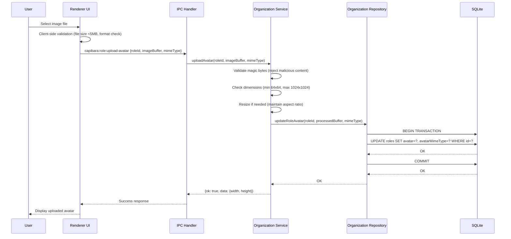
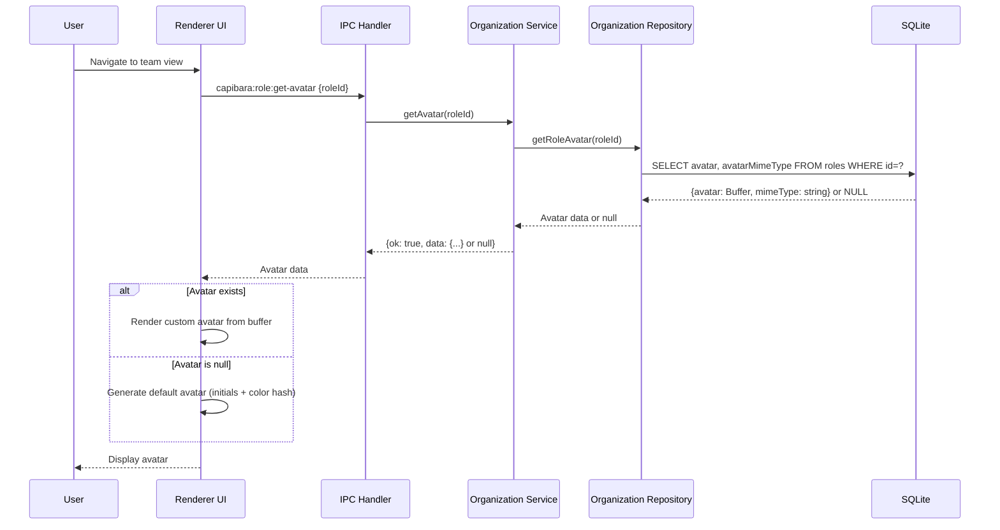
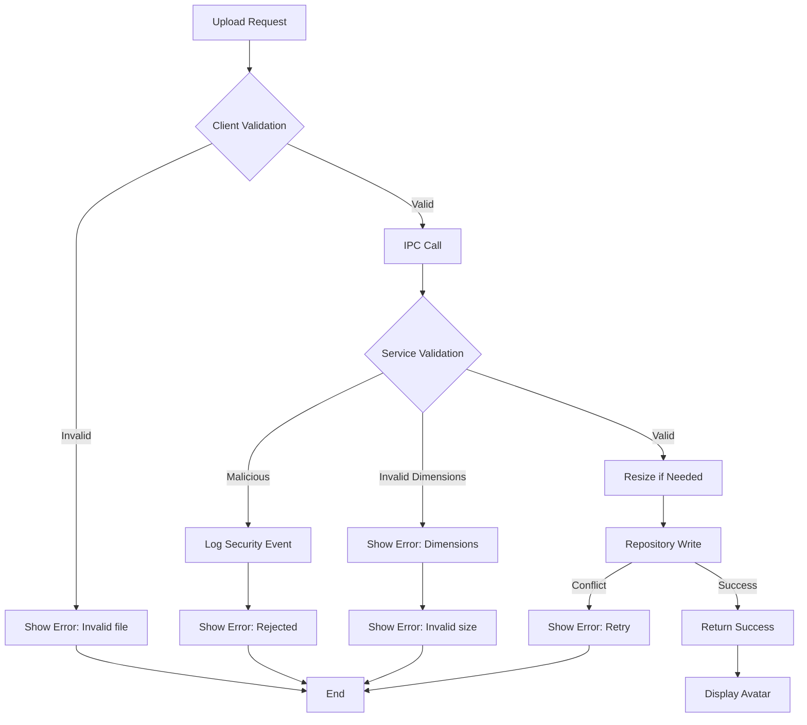

# Architecture Design: Custom Avatar for AI Roles

## Overview

Add optional custom avatar support to the Role entity using SQLite BLOB storage, enabling users to upload and display custom images for AI agent roles across the UI. The feature extends existing Role CRUD operations with image processing capabilities, storing avatar data atomically in the database to avoid filesystem synchronization issues and simplify backup/restore operations.

**Key Design Decisions**:
- Store avatars as BLOB columns in the roles table (not filesystem)
- Process images in-memory before database write
- Generate default avatars in renderer when none provided
- Optional field with no breaking changes to existing data

## Architecture Decision Records

### ADR-001: Use SQLite BLOB for Avatar Storage

**Status**: Accepted

**Context**: Avatar storage decision required balancing atomicity, portability, and simplicity. Filesystem storage would require separate file management, backup coordination, and cleanup logic. User confirmed preference for SQLite BLOB approach.

**Decision**: Store avatar image data as BLOB columns directly in the roles table. Add two columns: `avatar` (BLOB, nullable) and `avatarMimeType` (TEXT, nullable).

**Alternatives Rejected**:
- Filesystem storage: Rejected due to synchronization complexity, backup coordination, and cleanup requirements. Would require new AvatarStorage infrastructure service.
- Separate avatar table: Rejected as over-engineered for optional one-to-one relationship. Single table simpler and faster.

**Consequences**:
- ✓ Atomic operations with role data (single transaction)
- ✓ Simpler backup/restore (just backup SQLite file)
- ✓ No filesystem management code needed
- ✓ No cleanup job required
- ✗ Database file size increases (~5MB max per avatar, acceptable for desktop app)
- ✗ All avatars loaded when querying roles (mitigate with lazy loading if needed)

### ADR-002: Process Images In-Memory

**Status**: Accepted

**Context**: Image validation and resize operations needed before storage. Options were to use infrastructure service or process in organization service. Simpler approach preferred given limited scope.

**Decision**: Perform image processing (validation, resize) directly in the Organization Service layer using in-memory buffers. Use sharp or canvas library for image manipulation.

**Alternatives Rejected**:
- Infrastructure image service: Rejected as unnecessary indirection for simple operations. Would add layer without clear benefit.

**Consequences**:
- ✓ Simpler architecture (no new service or module)
- ✓ Fewer layer violations (service owns domain logic)
- ✓ Faster processing (no IPC overhead)
- ✗ Organization service depends on image processing library (acceptable trade-off)
- ✗ All image logic concentrated in one service (manageable for this scope)

### ADR-003: Generate Default Avatars in Renderer

**Status**: Accepted

**Context**: Default avatar generation (initials-based) could happen server-side or client-side. Decision depends on where role data is available and performance considerations.

**Decision**: Generate default avatars in the renderer layer when avatar data is null. Use role name to compute initials and color hash deterministically.

**Alternatives Rejected**:
- Server-side generation: Rejected because it would require additional IPC calls, complicate service layer, and add unnecessary server load for UI-only feature

**Consequences**:
- ✓ Reduces server load (no avatar generation on every request)
- ✓ Faster rendering (avatars computed locally in renderer)
- ✓ Role name already available in renderer context
- ✗ Default avatar logic duplicated if other clients exist (acceptable per UI-only requirement Q5)

## Module Design

| Module | Responsibility | Owned Entities | Public Interface | Dependencies |
|--------|---------------|----------------|------------------|-------------|
| **Organization (Types)** | Define avatar data structures and interfaces | Role, CreateRoleInput, UpdateRoleInput | AvatarData, RoleAvatar | None |
| **Organization (Service)** | Process and validate avatar data, coordinate storage | None | uploadAvatar(), removeAvatar(), getAvatar() | Organization Repository, Image Processing Lib |
| **Organization (Persistence)** | Store/retrieve avatar BLOBs in SQLite | None | updateRoleAvatar(), getRoleAvatar() | SQLite Connection |
| **IPC Handlers** | Expose avatar API to renderer via IPC channels | None | capibara:role:upload-avatar, capibara:role:remove-avatar, capibara:role:get-avatar | Organization Service |
| **Renderer (Components)** | Display avatars and handle upload UI interactions | None | AvatarDisplay, AvatarUploadDialog | IPC API |
| **Renderer (Store)** | Manage avatar state in Zustand organization store | None | avatar state, avatar actions | IPC API |

## Key Interfaces

### TypeScript Interfaces (Organization Types)

```typescript
export interface AvatarData {
  /** Avatar image data as Buffer */
  data: Buffer;
  /** MIME type (e.g., 'image/jpeg', 'image/png') */
  mimeType: string;
  /** Image width in pixels */
  width: number;
  /** Image height in pixels */
  height: number;
}

export interface Role {
  // ... existing fields ...
  /** Optional avatar BLOB data */
  avatar: Buffer | null;
  /** Optional avatar MIME type */
  avatarMimeType: string | null;
}

export interface CreateRoleInput {
  // ... existing fields ...
  avatar?: AvatarData | null;
}

export interface UpdateRoleInput {
  // ... existing fields ...
  avatar?: AvatarData | null;
}
```

### Service Methods (Organization Service)

```typescript
async uploadAvatar(
  roleId: string,
  imageBuffer: Buffer,
  mimeType: string
): Promise<DesktopResult<{ width: number; height: number }>>

async removeAvatar(roleId: string): Promise<DesktopResult<void>>

async getAvatar(roleId: string): Promise<DesktopResult<{ avatar: Buffer; mimeType: string } | null>>
```

### Repository Methods (SQLite Organization Repository)

```typescript
async updateRoleAvatar(
  roleId: string,
  avatarBuffer: Buffer | null,
  mimeType: string | null
): Promise<DesktopResult<void>>

async getRoleAvatar(roleId: string): Promise<DesktopResult<{ avatar: Buffer; mimeType: string } | null>>
```

### IPC Channel Signatures

```typescript
// Upload avatar for a role
'capibara:role:upload-avatar': (roleId: string, imageBuffer: ArrayBuffer, mimeType: string)
  => Promise<DesktopResult<{ width: number; height: number }>>

// Remove avatar from a role
'capibara:role:remove-avatar': (roleId: string)
  => Promise<DesktopResult<void>>

// Get avatar for a role
'capibara:role:get-avatar': (roleId: string)
  => Promise<DesktopResult<{ avatar: ArrayBuffer; mimeType: string } | null>>
```

## Data Flow

### Upload Avatar Flow



### Display Avatar Flow



### Error Handling Flow



## File Structure

### Files to Modify

| File Path | Changes |
|-----------|---------|
| `apps/electron/src/core/modules/organization/types/organization.types.ts` | Add AvatarData interface, add avatar fields to Role, CreateRoleInput, UpdateRoleInput |
| `apps/electron/src/core/modules/organization/services/role.service.ts` | Add uploadAvatar(), removeAvatar(), getAvatar() methods with image validation/processing |
| `apps/electron/src/core/modules/organization/persistence/sqlite-role.repository.ts` | Add updateRoleAvatar(), getRoleAvatar() methods for BLOB storage |
| `apps/electron/src/ipc-handlers/organization-handlers.ts` | Add IPC handlers for avatar upload/remove/get endpoints |
| `apps/electron/src/preload/exposed-api.ts` | Add avatar methods to exposed API object |
| `apps/electron/src/renderer/store/organization-store.ts` | Add avatar state management and actions |
| `apps/electron/src/renderer/components/team/RoleCard.tsx` | Integrate avatar display component |

### Files to Create

| File Path | Purpose |
|-----------|---------|
| `apps/electron/src/renderer/components/team/AvatarDisplay.tsx` | Reusable component for rendering role avatars (custom or default) |
| `apps/electron/src/renderer/components/team/AvatarUploadDialog.tsx` | Dialog for uploading/selecting avatar images |

### Database Migration

| Change | SQL |
|--------|-----|
| Add avatar columns | `ALTER TABLE roles ADD COLUMN avatar BLOB;` |
| Add MIME type column | `ALTER TABLE roles ADD COLUMN avatarMimeType TEXT;` |

## Implementation Guidelines

### Implementation Order

1. **Database Layer** (P0 - Foundation)
   - Run database migration to add avatar columns
   - Update TypeScript types in organization.types.ts
   - Implement repository methods for avatar storage

2. **Service Layer** (P0 - Core Logic)
   - Implement image validation (magic bytes, dimensions)
   - Implement image resize logic
   - Implement uploadAvatar(), removeAvatar(), getAvatar() in service

3. **IPC Layer** (P1 - API Exposure)
   - Add IPC handlers for avatar endpoints
   - Update preload API to expose avatar methods

4. **UI Layer** (P1 - User Experience)
   - Create AvatarDisplay component with default avatar generation
   - Create AvatarUploadDialog component
   - Integrate into team view and other role display contexts

5. **Testing** (P2 - Quality)
   - Unit tests for image validation/resize
   - Unit tests for repository BLOB operations
   - Integration tests for IPC flow
   - UI tests for upload/display components

### Key Considerations

- **Image Processing Library**: Use `sharp` for image resize and format conversion (recommended for Node.js)
- **Buffer Handling**: Convert between ArrayBuffer (IPC) and Buffer (Node.js) at IPC boundary
- **Base64 Encoding**: Encode BLOB data as base64 string for JSON serialization across IPC
- **Client-Side Validation**: Validate file type and size before upload to provide instant feedback
- **Default Avatar Colors**: Use deterministic color hash based on role name for consistent appearance

## Change Tracking

### Files Impacted

**Modified** (7 files):
1. `apps/electron/src/core/modules/organization/types/organization.types.ts` - Add avatar interfaces and fields
2. `apps/electron/src/core/modules/organization/services/role.service.ts` - Add avatar CRUD logic
3. `apps/electron/src/core/modules/organization/persistence/sqlite-role.repository.ts` - Add BLOB storage methods
4. `apps/electron/src/ipc-handlers/organization-handlers.ts` - Add IPC handlers
5. `apps/electron/src/preload/exposed-api.ts` - Expose avatar API
6. `apps/electron/src/renderer/store/organization-store.ts` - Add avatar state management
7. `apps/electron/src/renderer/components/team/RoleCard.tsx` - Integrate avatar display

**Created** (2 files):
1. `apps/electron/src/renderer/components/team/AvatarDisplay.tsx` - Avatar rendering component
2. `apps/electron/src/renderer/components/team/AvatarUploadDialog.tsx` - Upload dialog component

**Migrated** (1 script):
1. `apps/electron/src/core/database/migrations/XXXX-add-role-avatar.ts` - Database migration

**Total**: 10 files impacted (7 modified + 2 created + 1 migration)

### Estimated Complexity

**Medium-High** (10 files, 2 new modules, clear architecture)

### Next Steps

Recommended implementation approach:
- Use `/mvt-plan-dev` to break down into 5-8 tracked tasks
- Or proceed directly to `/mvt-implement` if preferred for this scope
