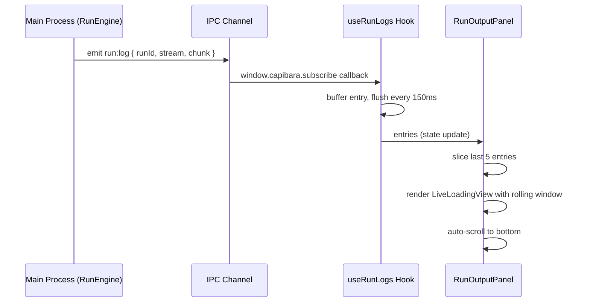
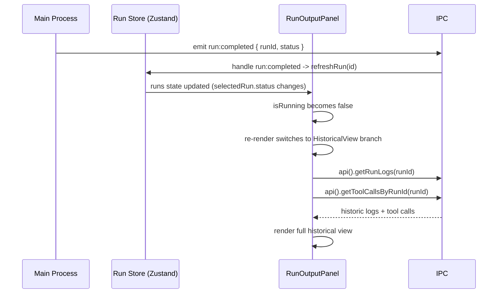

# Architecture Design: Run Output Loading UX Redesign

## Overview

Redesign the `RunOutputPanel` component to display a clean, focused loading experience during active AI agent execution, replacing the current cluttered three-section display (assistant text + tool calls + log terminal). When the run completes, the panel auto-transitions to the full historical view. This is a renderer-only change with zero backend modifications.

## Architecture Decision Records

### ADR-1: Keep `useRunLogs` hook unchanged, filter display in component

**Status**: accepted

**Context**: The `useRunLogs` hook accumulates up to 500 log entries in memory during a running execution. The running-state redesign only needs to display the latest few entries. Two options exist: (A) modify the hook to only retain the last N entries, or (B) keep the hook as-is and render only the tail of the entries array in the component.

**Decision**: Option B -- keep the hook unchanged. The component slices `entries.slice(-LIVE_WINDOW_SIZE)` for rendering.

**Alternatives**: Option A (modify hook) -- rejected because it changes the hook's public contract, could break future consumers that need the full buffer, and the memory cost (500 small string entries) is negligible in an Electron desktop app.

**Consequences**: Positive: zero hook changes, no risk to other consumers. Negative: the hook still accumulates 500 entries in memory even though only ~5 are displayed -- acceptable trade-off.

### ADR-2: Binary display mode with early-return branch in component

**Status**: accepted

**Context**: The panel must show completely different layouts for running vs completed states. Options: (A) conditional rendering within a single JSX tree, (B) early-return branch that returns a completely different JSX structure for the running state.

**Decision**: Option B -- use an early-return branch. When `isRunning` is true, the component returns the live-loading layout before reaching the historical-view JSX. The run selector and "Open Logs Folder" button are rendered in both branches via shared helper elements.

**Alternatives**: Option A (conditional rendering) -- rejected because it leads to deeply nested ternaries and makes each mode harder to understand in isolation.

**Consequences**: Positive: each mode is a self-contained, readable JSX block. Negative: some shared elements (run selector, log dir button) must be duplicated or extracted into small helper components.

### ADR-3: Live log display shows a rolling window of last 5 entries

**Status**: accepted

**Context**: The user described "latest record scrolling" (singular). However, showing only a single log line provides zero context about what the agent is doing. A small rolling window gives the user a sense of progression without overwhelming the clean design.

**Decision**: Display the last 5 log entries in a terminal-styled card during the live-loading state. Each entry fades in with a subtle CSS transition. The container auto-scrolls to the bottom on new entries.

**Alternatives**: Single entry only -- rejected because it lacks context. Full log accumulation (current behavior) -- rejected because it is cluttered and the stated goal is a clean display.

**Consequences**: Positive: clean yet informative. Negative: user cannot see earlier log output during execution -- acceptable because the full log is available immediately upon completion, and the "Open Logs Folder" button provides raw file access at any time.

## Module Design

No new modules are introduced. All changes are within the existing Renderer layer.

| Module | Change Type | Responsibility |
|--------|-------------|----------------|
| `RunOutputPanel.tsx` | Modified | Add live-loading branch with loading animation + rolling log window; move historical view into separate branch; extract shared header (run selector + log dir button) |
| `use-run-logs.ts` | Unchanged | Continues to accumulate entries via IPC events. Component slices the tail for display. |
| `use-tool-calls.ts` | Unchanged | Not invoked during running state (component does not render `ToolCallTimeline` in live mode). |
| `ToolCallTimeline.tsx` | Unchanged | Only rendered in historical mode. |
| `AuditLogPanel.tsx` | Unchanged | Only rendered in historical mode. |

## Key Interfaces

### `RunOutputPanel` -- Internal Structure

```tsx
// Shared header rendered in both modes
function RunOutputHeader({
  runs,
  selectedRunId,
  onSelectRun,
  onOpenLogDir,
}: { ... })

// Live-loading mode (isRunning === true)
function LiveLoadingView({
  entries,
  selectedRun,
}: {
  entries: LogEntry[];
  selectedRun: RunRecord;
})

// Historical mode (isRunning === false)
function HistoricalView({
  selectedRun,
  historicLogs,
  historicToolCalls,
  loadingLogs,
  logContainerRef,
  logEndRef,
}: { ... })
```

### Live Window Constant

```ts
const LIVE_WINDOW_SIZE = 5;
```

## Data Flow

### Flow 1: Running State (Live-Loading Mode)



### Flow 2: Completion Transition



### Error Paths

| Step | Failure | Fallback |
|------|---------|----------|
| `useRunLogs` subscription fails | No entries arrive | Loading animation shows indefinitely with "waiting for output" text (existing behavior) |
| Historical log fetch fails after completion | `historicLogs` remains empty | "No logs recorded" message shown in log terminal section |
| Run status update event missed | `isRunning` stays true while run is actually done | The `run:changed` event (subscribed by run store) also triggers a re-fetch of runs, providing a redundant path to detect completion |

## File Structure

All paths relative to `apps/electron/src/renderer/`.

| File | Action | Description |
|------|--------|-------------|
| `components/tasks/RunOutputPanel.tsx` | Modified | Major refactor: add `LiveLoadingView` branch, extract `RunOutputHeader`, restructure to binary mode rendering |

No new files are created. No files are deleted.

## Implementation Guidelines

### Ordering

1. Extract the run selector + log dir button into a shared `RunOutputHeader` sub-component (used by both branches).
2. Build the `LiveLoadingView` sub-component with:
   - A centered card layout with a pulsing/spinning indicator at the top.
   - A terminal-styled area (`bg-zinc-950`, monospace) showing the last `LIVE_WINDOW_SIZE` entries from `useRunLogs`.
   - Auto-scroll to bottom on new entries.
   - "Waiting for output" state when entries are empty.
3. Restructure `RunOutputPanel` to use early-return: if `isRunning`, render `RunOutputHeader` + `LiveLoadingView`; otherwise, render the existing historical layout (run summary + assistant text + tool calls + audit log + log terminal).
4. Ensure the `run:completed` / `run:suspended` events trigger the transition by verifying that the run store's `runs` state updates propagate to `selectedRun.status`.

### Style Notes

- Use existing Tailwind classes and `@phosphor-icons/react` icons (already imported).
- The loading animation should use `animate-spin` or `animate-pulse` from Tailwind -- no new animation libraries.
- The live log entries should use the same color scheme as the current terminal: `text-green-300` for stdout, `text-red-400` for stderr.
- Match the existing `rounded-lg border border-border` card style used throughout the panel.

## Change Tracking

| File | Action |
|------|--------|
| `apps/electron/src/renderer/components/tasks/RunOutputPanel.tsx` | Modified |

Total: 1 file modified, 0 files created, 0 files deleted.
