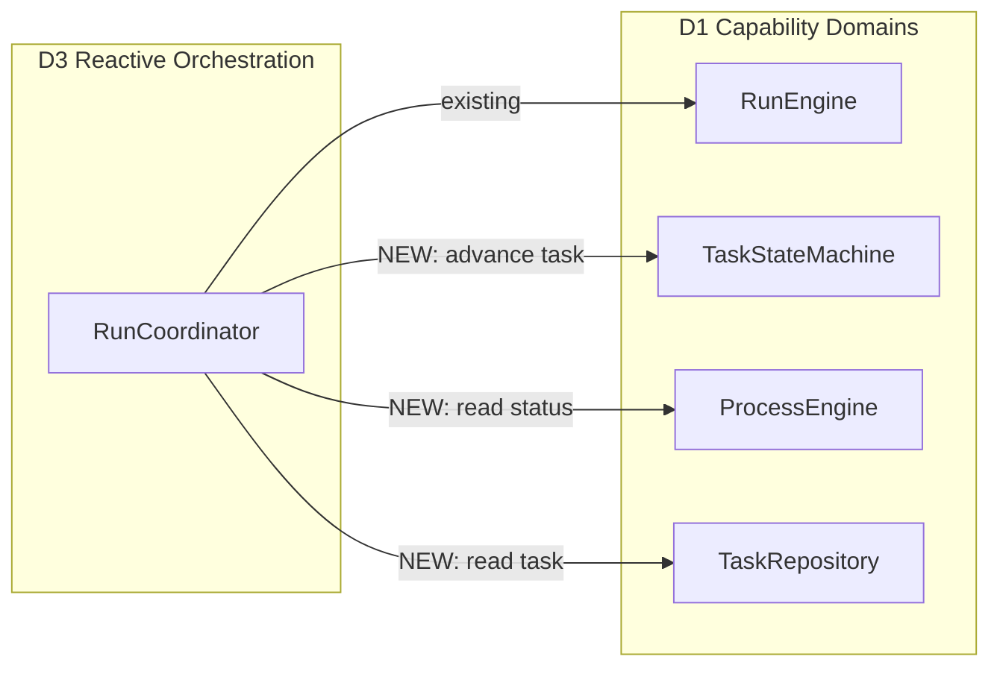
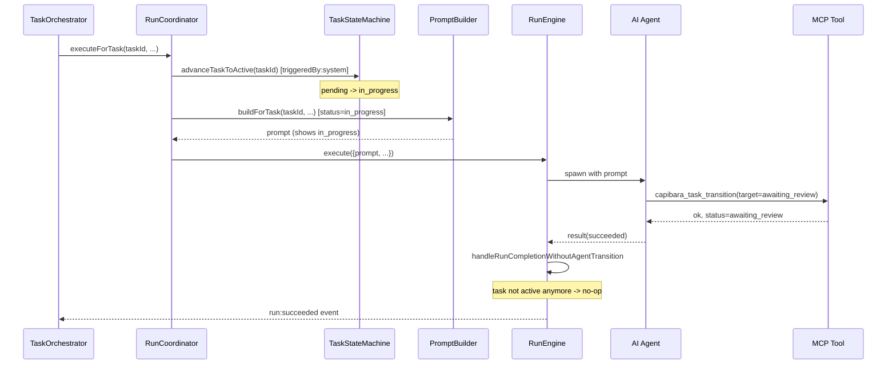
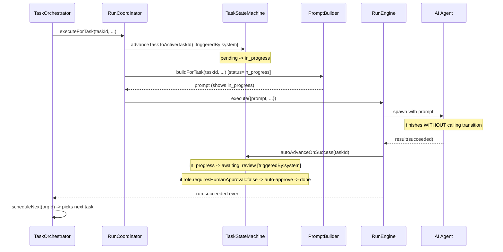

# Architecture Design: Task Execution Status Reliability

## Overview

When an AI agent begins executing a leaf task, the system auto-transitions the task from `initial` (e.g. `pending`) to `active` (e.g. `in_progress`) via `RunEngine.advanceTaskToActive()`. However, the system prompt is built **before** this transition, showing the agent a stale status (`pending`). The agent either (a) does not realize it needs to call `capibara_task_transition` at the end, or (b) attempts the transition from `pending -> in_progress` which fails because the DB already shows `in_progress`. In both cases, when the run ends without a successful agent-initiated transition, `rollbackTaskIfActive()` unconditionally reverts the task to `initial`, causing `TaskScheduler` to pick the same task again -- creating an infinite re-execution loop (bounded only by the circuit breaker at `maxConsecutiveWakes=5`).

**Architectural concerns:**

| Concern | Source of Evidence | Priority |
|---------|-------------------|----------|
| Prompt-DB status timing mismatch | `run.coordinator.ts:31` builds prompt before `run.engine.ts:122` advances status | must |
| Agent non-compliance with transition instruction | `task-prompt.strategy.ts:199-202` only says "when finished" -- no emphasis on mandatory nature | must |
| Unconditional rollback causes re-execution loop | `run.engine.ts:135-137` rolls back to initial on success when agent didn't transition | must |
| advanceTaskToActive silently swallows errors | `run.engine.ts:270-272` logs error but continues, leaving task in initial | should |
| No cross-check between run table and task status at scheduling time | `task.scheduler.ts:69-74` trusts status category alone | nice |

## Architecture Decision Records

### ADR-1: Move task-to-active transition before prompt construction

**Status:** accepted

**Context:** The prompt is constructed in `RunCoordinator.executeForTask()` (line 31) before `RunEngine.execute()` is called. `advanceTaskToActive()` runs inside `RunEngine.execute()` after the agent is spawned (line 122). This means the agent always sees the initial status in its prompt, creating confusion when it tries to transition.

**Decision:** Move the `advanceTaskToActive` call to `RunCoordinator.executeForTask()`, executing it **before** `promptBuilder.buildForTask()`. This ensures the prompt reflects the actual DB state (`in_progress`) that the agent will see.

**Alternatives:**
- Rebuild prompt after advanceTaskToActive inside RunEngine -- rejected: duplicates prompt-building logic, breaks single-responsibility
- Accept timing mismatch and add explanatory text to prompt -- rejected: available transitions table would still show stale `pending -> in_progress`, confusing the agent

**Consequences:**
- Positive: Agent sees correct status and correct available transitions in prompt
- Positive: Eliminates the race condition where agent tries `pending -> in_progress` but DB already shows `in_progress`
- Negative: RunCoordinator gains dependencies on ITaskRepository, IProcessEngine, ITaskStateMachine (acceptable: D3 -> D1 is allowed)
- Downstream: RunEngine.advanceTaskToActive becomes a no-op safety check (kept for defense-in-depth)

### ADR-2: Replace unconditional rollback with smart completion on success

**Status:** accepted

**Context:** When a run succeeds but the agent did not call `capibara_task_transition`, `rollbackTaskIfActive()` reverts the task from `active` to `initial`. The scheduler then picks the same task again, causing re-execution. This loop repeats until the circuit breaker trips.

**Decision:** Differentiate rollback behavior by run outcome:
- **Run succeeded + task still active:** Auto-advance the task to the next approval-category status (if reachable), or the next terminal-category status (if reachable). This treats "agent finished but forgot to transition" as "work done, needs review". For roles with `requiresHumanApproval=false`, the state machine's existing auto-approval logic will cascade the task to completion automatically.
- **Run failed + task still active:** Rollback to initial (current behavior). This correctly allows retry.
- **Run cancelled + task still active:** Rollback to initial (current behavior).

**Alternatives:**
- Always rollback but add a retry counter to prevent infinite loops -- rejected: still wastes compute on re-execution; the work was already done
- Leave task in active state (no rollback, no auto-advance) -- rejected: scheduler skips active leaves, task becomes permanently stuck
- Auto-advance to terminal directly -- rejected: skips human review for roles that require it

**Consequences:**
- Positive: Eliminates the re-execution loop entirely for successful runs
- Positive: Preserves human-in-the-loop review for roles that require approval
- Positive: For AI-only roles, auto-approval cascade completes the task automatically
- Negative: Slightly more complex completion logic in RunEngine
- Downstream: RunOrchestrator's `onRunEnded` flow is unchanged (still calls scheduleNext)

### ADR-3: Enhance prompt instruction with explicit system-auto-start notice

**Status:** accepted

**Context:** The `execute_leaf` prompt instruction says "Execute this task directly. When finished, use `capibara_task_transition` to advance." This does not convey that (a) the system already transitioned the task to `in_progress`, and (b) the final transition is **mandatory**, not optional.

**Decision:** Rewrite the `execute_leaf` instruction to:
1. State that the system has already started the task (status is `in_progress`)
2. Emphasize that calling `capibara_task_transition` when finished is **mandatory**
3. Explicitly say "do NOT attempt to transition from pending to in_progress -- the system has already done this"

**Alternatives:**
- Keep current instruction and rely on agent compliance -- rejected: empirically fails
- Add the notice to the System Context section instead -- rejected: scenario-specific instructions are more visible to the agent

**Consequences:**
- Positive: Agent has correct mental model of task state
- Positive: Reduces wasted tool calls (agent won't try `pending -> in_progress`)
- Negative: Prompt is slightly longer (negligible token cost)

## Module Design

### Modified Modules

| Module | Responsibility Change | Owned Entities | Public Interface Change |
|--------|----------------------|----------------|------------------------|
| **Orchestrator / RunCoordinator** | Takes ownership of task-to-active transition (moved from RunEngine) | None | Constructor gains ITaskRepository, IProcessEngine, ITaskStateMachine |
| **Execution / RunEngine** | Rolls back only on failure/cancel; auto-advances on success | None | `rollbackTaskIfActive` replaced by `handleRunCompletionWithoutAgentTransition` |
| **Prompt / task-prompt.strategy** | Enhanced `execute_leaf` instruction text | None | No interface change (internal string update) |

### Dependency Changes



All new dependencies are D3 -> D1, which is architecturally permitted.

## Key Interfaces

### RunCoordinator -- new private method

```ts
// Added to RunCoordinator class
private advanceTaskToActive(taskId: string, orgId: string): void {
  const task = this.taskRepo.findById(taskId);
  if (!task) return;

  const currentCategory = this.processEngine.getStatusCategory(orgId, task.status);
  if (currentCategory === 'active') return;   // already active (idempotent)
  if (currentCategory !== 'initial') return;   // in approval/terminal -- don't touch

  const transitions = this.processEngine.getAvailableTransitions(orgId, task.status);
  const target = transitions.find(
    (t) => this.processEngine.getStatusCategory(orgId, t.to) === 'active',
  );
  if (!target) return;

  try {
    this.taskStateMachine.transition(taskId, target.to, { triggeredBy: 'system' });
  } catch (err) {
    this.logger.error('Failed to advance task to active', {
      taskId, target: target.to, error: String(err),
    });
  }
}
```

### RunEngine -- replacement for rollbackTaskIfActive

```ts
// Replaces rollbackTaskIfActive for the success path
private autoAdvanceOnSuccess(taskId: string | null | undefined): void {
  if (!taskId) return;
  const task = this.taskRepo.findById(taskId);
  if (!task) return;

  const category = this.processEngine.getStatusCategory(task.orgId, task.status);
  if (category !== 'active') return;  // agent already transitioned -- no-op

  const transitions = this.processEngine.getAvailableTransitions(task.orgId, task.status);

  // Priority: approval > terminal > rollback (fallback)
  const approvalTarget = transitions.find(
    (t) => this.processEngine.getStatusCategory(task.orgId, t.to) === 'approval',
  );
  if (approvalTarget) {
    this.taskStateMachine.transition(taskId, approvalTarget.to, { triggeredBy: 'system' });
    return;
  }

  const terminalTarget = transitions.find(
    (t) => this.processEngine.getStatusCategory(task.orgId, t.to) === 'terminal',
  );
  if (terminalTarget) {
    this.taskStateMachine.transition(taskId, terminalTarget.to, { triggeredBy: 'system' });
    return;
  }

  // Fallback: no approval or terminal reachable -- rollback to initial
  this.logger.warn('No approval/terminal transition found; rolling back to initial', {
    taskId, currentStatus: task.status,
  });
  const initial = this.processEngine.getInitialStatus(task.orgId);
  if (initial) {
    this.taskStateMachine.transition(taskId, initial.name, { triggeredBy: 'system' });
  }
}
```

### RunCoordinator.executeForTask -- updated flow

```ts
async executeForTask(
  taskId: string, roleId: string, orgId: string,
  wakeReason: WakeReason, locale: string,
): Promise<{ runId: string; status: string }> {
  // NEW: advance task BEFORE building prompt
  this.advanceTaskToActive(taskId, orgId);

  const prompt = this.promptBuilder.buildForTask(taskId, roleId, locale, wakeReason);
  if (!prompt) {
    this.logger.error('Failed to build prompt for task', { taskId, roleId });
    return { runId: '', status: 'failed' };
  }

  // ... rest unchanged
}
```

## Data Flow

### Normal flow (agent transitions correctly)



### Degraded flow (agent does NOT transition)



### Error paths

| Step | Failure | Behavior |
|------|---------|----------|
| advanceTaskToActive | Transition fails (schema misconfig) | Log error, continue with prompt build (task stays in initial). Agent sees `pending` -- degraded but functional. RunEngine's defense-in-depth advanceTaskToActive is now a no-op (already attempted). |
| autoAdvanceOnSuccess | No approval/terminal transition reachable | Log warning, rollback to initial (old behavior). This should not happen with well-formed schemas. |
| autoAdvanceOnSuccess | State machine transition throws | Caught by existing try/catch in state machine. Task stays active. Next scheduleNext skips it (active leaf). Task becomes stuck -- requires manual intervention. Acceptable for edge case. |

## File Structure

| File | Action | Description |
|------|--------|-------------|
| `apps/electron/src/core/modules/orchestrator/run.coordinator.ts` | Modify | Add ITaskRepository, IProcessEngine, ITaskStateMachine dependencies; add advanceTaskToActive method; call it before prompt build |
| `apps/electron/src/core/modules/execution/engines/run.engine.ts` | Modify | Replace rollbackTaskIfActive on success path with autoAdvanceOnSuccess; keep rollback for failure/cancel paths; remove advanceTaskToActive call (now in RunCoordinator) or keep as no-op safety |
| `apps/electron/src/core/modules/prompt/strategies/task-prompt.strategy.ts` | Modify | Rewrite execute_leaf instruction string |
| `apps/electron/src/core/bootstrap/composition-root.ts` | Modify | Wire new dependencies into RunCoordinator constructor |

## Implementation Guidelines

1. **Start with RunEngine changes** (step 1): Replace `rollbackTaskIfActive` on the success path with `autoAdvanceOnSuccess`. Keep the existing rollback for failure/cancel paths. This is the most critical change -- it eliminates the re-execution loop even without the other changes.

2. **Then update RunCoordinator** (step 2): Add the three new dependencies and the `advanceTaskToActive` method. Call it before `promptBuilder.buildForTask()`. Remove or neutralize the `advanceTaskToActive` call in `RunEngine.execute()` (line 122) -- either delete it or guard it with a comment explaining it's now a no-op safety check.

3. **Update composition-root** (step 3): Wire ITaskRepository, IProcessEngine, ITaskStateMachine into RunCoordinator's constructor.

4. **Update prompt instruction** (step 4): Rewrite the `execute_leaf` scenario string in `task-prompt.strategy.ts`.

5. **Write/update tests** (step 5):
   - Test `autoAdvanceOnSuccess`: task in `in_progress` -> auto-advances to `awaiting_review` on success
   - Test `autoAdvanceOnSuccess` with no-approval schema: task -> terminal
   - Test rollback still works on failure
   - Test RunCoordinator calls advanceTaskToActive before prompt build
   - Test prompt shows `in_progress` status and correct transitions

## Change Tracking

| File | Action |
|------|--------|
| `apps/electron/src/core/modules/orchestrator/run.coordinator.ts` | Modified |
| `apps/electron/src/core/modules/execution/engines/run.engine.ts` | Modified |
| `apps/electron/src/core/modules/prompt/strategies/task-prompt.strategy.ts` | Modified |
| `apps/electron/src/core/bootstrap/composition-root.ts` | Modified |
| `apps/electron/src/core/modules/execution/engines/run.engine.spec.ts` | Modified (tests) |
| `apps/electron/src/core/modules/orchestrator/run.coordinator.spec.ts` | Modified (tests) |
