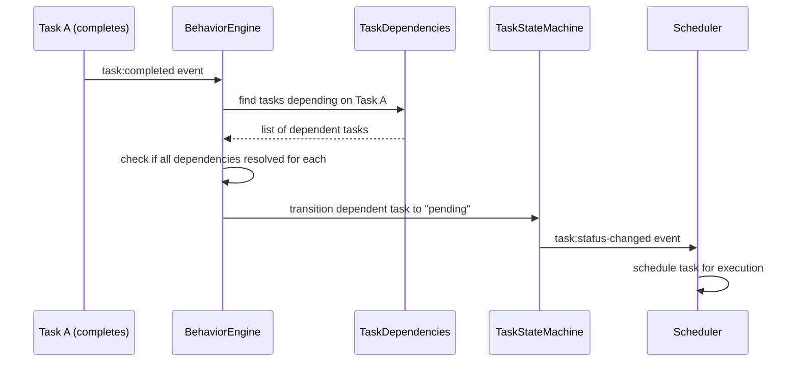

# Requirements Analysis: Task Dependency System

## Feature Overview

Add a task dependency system that allows users to define prerequisite relationships between tasks at any level of the hierarchy. When a task has unresolved dependencies, it enters a "blocked" state and cannot transition to execution. Once all dependencies are resolved (completed), the task becomes unblocked and eligible for scheduling.

The system includes:
- Dependency definition and management (UI + API)
- Dependency validation (cycle detection, cross-level support)
- Dependency resolution workflow (event-driven unblocking)
- Integration with planning mode (dependencies defined during task creation)
- Integration with BehaviorEngine (automatic dependency resolution)

## Actors

| Actor | Description |
|-------|-------------|
| User | Creates and manages task dependencies via UI |
| System | Validates dependencies, enforces blocking rules, resolves dependencies on completion |
| AI Agent | Executes tasks, subject to dependency constraints |
| Planning Assistant | Creates task decomposition with dependency relationships in planning mode |

## Requirements

### Functional Requirements

| ID | Requirement | Priority |
|----|-------------|----------|
| FR-1 | Users can define one or more prerequisite dependencies for any task at any hierarchy level | High |
| FR-2 | Tasks with unresolved dependencies are automatically set to "blocked" status | High |
| FR-3 | Blocked tasks cannot transition from "blocked" to "in_progress" until all dependencies are resolved | High |
| FR-4 | When all dependencies complete (terminal status), the task is automatically unblocked and becomes eligible for scheduling | High |
| FR-5 | Dependency relationships are visualized in the task detail drawer with a dependency selector | Medium |
| FR-6 | Users can add/remove dependencies from the task detail drawer | Medium |
| FR-7 | Circular dependencies are detected and rejected at creation time | High |
| FR-8 | Dependencies are validated again during state transitions (defense in depth) | Medium |
| FR-9 | Planning mode task creation supports defining dependencies alongside task decomposition | High |
| FR-10 | Dependency changes trigger `task:dependency-changed` event | Medium |
| FR-11 | Deleting a task cascades to remove its dependency relationships | Medium |

### Non-Functional Requirements

| ID | Requirement |
|----|-------------|
| NFR-1 | Dependency checks should not significantly impact state transition performance (< 50ms overhead) |
| NFR-2 | Dependency resolution should be event-driven, not polling-based |
| NFR-3 | UI should clearly indicate blocked status and show which dependencies are pending |

## Domain Concepts

| Concept | Description |
|---------|-------------|
| Task Dependency | A directed relationship where Task B depends on Task A, meaning B cannot start until A completes |
| Dependency Graph | The directed graph formed by all dependency relationships; must be acyclic (DAG) |
| Blocked Task | A task in "blocked" status due to unresolved dependencies |
| Dependency Resolution | The process of unblocking a task when all its prerequisites reach terminal status |
| Dependency Selector | UI component in task detail drawer for managing dependencies |
| Planning Mode Dependency | Dependencies defined during AI-assisted task decomposition |

## Business Rules

| ID | Rule |
|----|------|
| BR-1 | Tasks can only depend on other tasks within the same organization (org_id) |
| BR-2 | Circular dependencies are strictly prohibited (A→B→A, A→B→C→A, etc.) |
| BR-3 | Only tasks in terminal status category (done, cancelled) are considered "resolved" for dependency purposes |
| BR-4 | A task cannot depend on itself |
| BR-5 | A task cannot depend on its own descendants (would create implicit cycle) |
| BR-6 | Dependencies are stored in a separate `task_dependencies` table with foreign keys to tasks |
| BR-7 | When a dependency is resolved, the dependent task transitions from "blocked" to "pending" (or initial status) |
| BR-8 | Dependency resolution is handled by BehaviorEngine via `on_dependency_resolved` trigger |
| BR-9 | Planning mode batch create supports dependency specification via `depends_on` field in task input |
| BR-10 | Dependency validation occurs at: (1) dependency creation, (2) state transition attempt |
| BR-11 | Deleting a task removes all dependency relationships where it is either the source or target |

## Ambiguities & Questions

All ambiguities have been resolved through user clarification:

| Question | Resolution |
|----------|------------|
| Dependency granularity - same Story only or cross-level? | **Every level** - tasks at any hierarchy level can have dependencies (cross-Story, cross-Epic supported) |
| Behavior after dependency resolution - auto-start or just unblock? | **Unblock only** - task becomes eligible for scheduling, system triggers execution |
| UI interaction - how to set dependencies? | **Task detail drawer** - add dependency selector component |
| Storage - field vs separate table? | **Separate table** `task_dependencies` |
| BehaviorEngine integration - use existing or new trigger? | **New trigger** `on_dependency_resolved` |
| Cycle detection timing? | **Both** - immediate detection at creation + validation at state transition |
| Planning mode - include dependencies? | **Yes** - planning mode task creation supports dependency specification |

## Technical Considerations

### Database Schema

```sql
CREATE TABLE task_dependencies (
  id TEXT PRIMARY KEY,
  org_id TEXT NOT NULL,
  dependent_task_id TEXT NOT NULL,  -- the task that has the dependency
  dependency_task_id TEXT NOT NULL, -- the task that must be completed first
  created_at TEXT NOT NULL,
  FOREIGN KEY (dependent_task_id) REFERENCES tasks(id) ON DELETE CASCADE,
  FOREIGN KEY (dependency_task_id) REFERENCES tasks(id) ON DELETE CASCADE,
  UNIQUE(dependent_task_id, dependency_task_id)
);

CREATE INDEX idx_task_dependencies_dependent ON task_dependencies(dependent_task_id);
CREATE INDEX idx_task_dependencies_dependency ON task_dependencies(dependency_task_id);
```

### Status Flow

```
pending → blocked (when dependencies added)
blocked → pending (when all dependencies resolved)
pending → in_progress (normal flow, only if no unresolved dependencies)
```

### Event Flow



### Cycle Detection Algorithm

Use DFS-based topological sort validation:
1. Build adjacency list from dependency relationships
2. For each new dependency edge (A→B), check if B can reach A
3. If reachable, cycle detected → reject
4. Time complexity: O(V+E) per check

## Change Tracking

| Field | Value |
|-------|-------|
| Change ID | 20260612-task-dependency |
| Created | 2026-06-12 |
| Status | Analysis Complete |
| Next Step | Architecture Design (/mvt-design) |
