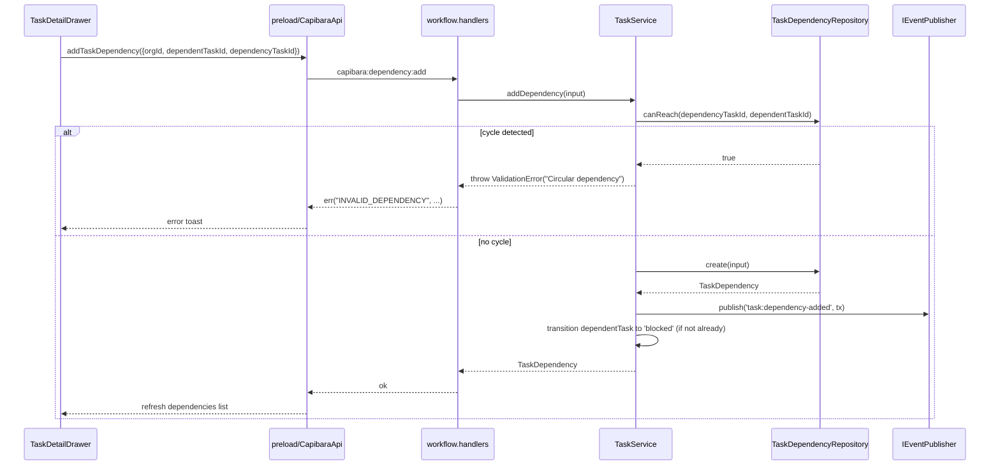
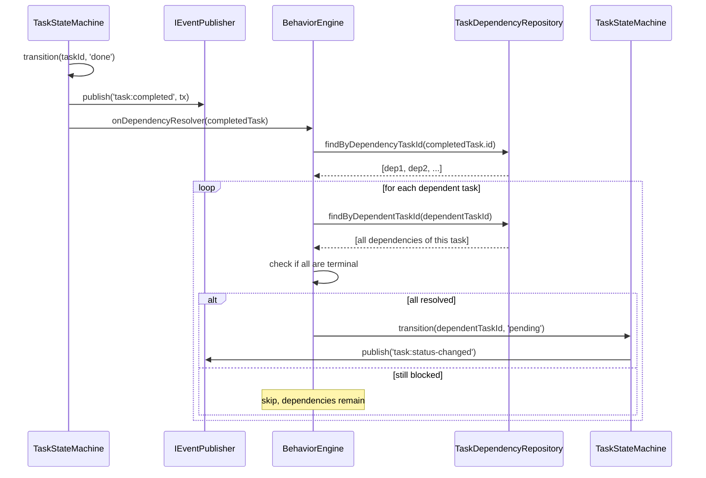
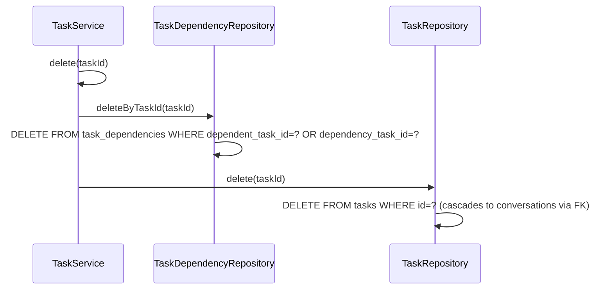
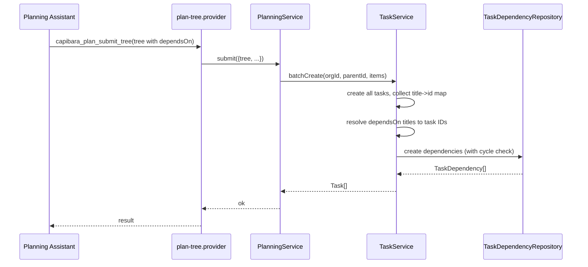

# Architecture Design: Task Dependency System

> Source: `analysis.md` (this change)
> Change ID: `20260612-task-dependency`
> Style: Confirmed existing baseline — Hexagonal + Domain Core D0-D3 + transactional-outbox event-driven.
> This design adds a new domain entity (TaskDependency) within the existing Workflow module; no new module is introduced.

## Overview

**Problem statement.** The Capibara task system currently allows tasks to exist independently — there is no mechanism to express that one task must complete before another can begin. Users building multi-step workflows (e.g., "implement feature X" depends on "design feature X") cannot enforce execution order. When a task's prerequisites are incomplete, the scheduler may pick it up prematurely, wasting agent resources.

This design introduces a task dependency system with:
- A `task_dependencies` table storing directed prerequisite relationships
- A `blocked` status category preventing execution until all dependencies resolve
- Cycle detection at dependency creation time (DFS-based)
- Event-driven dependency resolution via BehaviorEngine (`on_dependency_resolved` trigger)
- UI dependency selector in the TaskDetailDrawer
- Planning mode support for defining dependencies during task decomposition

### Architectural concerns

| concern | source-of-evidence | priority |
|---------|--------------------|----------|
| Dependency storage and query performance | FR-1, FR-5, NFR-1 | must |
| Cycle detection correctness | BR-2, BR-5, FR-7 | must |
| Blocked status integration with state machine | FR-2, FR-3, BR-7 | must |
| Event-driven dependency resolution | FR-4, BR-8, NFR-2 | must |
| UI dependency management | FR-5, FR-6, NFR-3 | should |
| Planning mode dependency support | FR-9, BR-9 | should |
| No layer violation (Workflow module stays D1) | architecture-rules.md | must |
| No functional regression on existing flows | analysis "must preserve" rules | must |

## Architecture Decision Records

### ADR-01 — Add `task_dependencies` table with separate repository (resolves BR-6)
- Status: accepted
- Context: Dependencies are a distinct relationship entity, not a field on Task. A separate table enables efficient querying in both directions (find dependencies OF a task, find tasks depending ON a task) and supports cascade delete via FK constraints.
- Decision: Create `task_dependencies` table with `dependent_task_id` and `dependency_task_id` columns, both referencing `tasks(id) ON DELETE CASCADE`. Add `ITaskDependencyRepository` interface and `SqliteTaskDependencyRepository` implementation under `modules/workflow/`.
- Alternatives: (a) JSON array field on Task — rejected: cannot enforce FK integrity, inefficient for reverse queries, no cascade delete; (b) adjacency list on Task (`depends_on_ids TEXT[]`) — rejected: same issues, plus no uniqueness constraint.
- Consequences: New repository, new migration. Workflow module gains one more entity but stays within D1.

### ADR-02 — Add `blocked` as a new status category with `pending <-> blocked` transitions
- Status: accepted
- Context: Tasks with unresolved dependencies need a distinct state that prevents scheduling. The existing status categories are `initial`, `active`, `approval`, `terminal`. `blocked` fits between `initial` and `active`.
- Decision: Add `blocked` to the `blocked` status category. Add transitions: `pending -> blocked` (when dependencies added), `blocked -> pending` (when all dependencies resolved). The `blocked` category is NOT `active`, so the scheduler's wake gate will skip blocked tasks. The `blocked` category is NOT `terminal`, so parent tasks won't auto-complete.
- Alternatives: (a) reuse `pending` with a `paused_reason` — rejected: `paused_reason` is already used for `approval`; conflating semantics makes the state machine harder to reason about; (b) add a separate `is_blocked` boolean — rejected: denormalized state, race conditions with status.
- Consequences: ProcessSchema templates must include `blocked` status and its transitions. Existing tasks without dependencies are unaffected.

### ADR-03 — Dependency resolution via BehaviorEngine `on_dependency_resolved` trigger
- Status: accepted
- Context: When a task completes, we need to check if any dependent tasks have all their dependencies resolved, and if so, transition them from `blocked` to `pending`. This is a domain rule that should live in BehaviorEngine, consistent with the existing `on_all_children_terminal` pattern.
- Decision: Add `onDependencyResolved(completedTask: Task)` method to `IBehaviorEngine`. Called from `TaskStateMachine` after emitting `task:completed`. The method queries `task_dependencies` for tasks depending on the completed task, checks if all their dependencies are terminal, and transitions qualifying tasks from `blocked` to `pending` via `taskStateMachine.transition()`.
- Alternatives: (a) handle in TaskStateMachine directly — rejected: violates single responsibility; BehaviorEngine already owns rule-based transitions; (b) add a new Orchestrator — rejected: overkill for a simple rule; BehaviorEngine is the right fit.
- Consequences: BehaviorEngine gains a new public method. TaskStateMachine calls it after `task:completed` event. New trigger type `on_dependency_resolved` added to schema (optional — default behavior is hardcoded, not schema-driven, for simplicity).

### ADR-04 — Cycle detection via DFS reachability check at creation time
- Status: accepted
- Context: Circular dependencies (A->B->A) would deadlock the system. We must prevent them at creation time.
- Decision: When adding a dependency edge (dependent_task_id -> dependency_task_id), perform a DFS from `dependency_task_id` following existing dependency edges. If `dependent_task_id` is reachable, a cycle would form — reject. This is O(V+E) per check. Additionally, check that `dependency_task_id` is not a descendant of `dependent_task_id` in the task tree (BR-5).
- Alternatives: (a) topological sort of entire graph — rejected: O(V+E) anyway but more complex; (b) check at state transition time only — rejected: user experience is poor if dependency is accepted then fails later.
- Consequences: `TaskDependencyService.addDependency()` performs cycle check before insert. Error is returned to caller.

### ADR-05 — Dependency validation at state transition (defense in depth)
- Status: accepted
- Context: Even with creation-time checks, we should validate at transition time that a task's dependencies are resolved before allowing `blocked -> pending` or `pending -> in_progress`.
- Decision: In `TaskStateMachine.transition()`, when transitioning TO `in_progress` (or any `active` category status), check that the task has no unresolved dependencies. If unresolved, throw `TaskStateError`. This is a safety net; under normal operation, the task should already be `blocked`.
- Alternatives: (a) trust the blocked status alone — rejected: defense in depth is cheap and prevents edge cases from schema changes or data corruption.
- Consequences: TaskStateMachine gains a dependency check in the transition path. Requires injecting `ITaskDependencyRepository` into TaskStateMachine.

### ADR-06 — Planning mode dependency support via `depends_on` in BatchCreateTaskInput
- Status: accepted
- Context: When AI creates a plan tree, it should be able to specify dependencies between tasks in the tree.
- Decision: Extend `BatchCreateTaskInput` with an optional `dependsOn: string[]` field (task title references within the same tree). After batch create resolves all task IDs, a second pass creates the dependency relationships. The planning service handles the title-to-ID resolution.
- Alternatives: (a) separate API call after batch create — rejected: more round trips, atomicity issues; (b) dependency by index — rejected: fragile if tree structure changes.
- Consequences: `BatchCreateTaskInput` type extended. `TaskService.batchCreate()` gains dependency creation logic. Planning mode UI/schema updated.

## Module Design

> No new module is introduced. All changes stay within the existing `Workflow` module (D1).

| Module | Change | Responsibility after | Owned entities | Key new/changed interface | Depends on |
|--------|--------|----------------------|----------------|---------------------------|------------|
| Workflow (D1) | **modified** | Task lifecycle + dependency management | Task, TaskDependency | `ITaskDependencyRepository`, `ITaskDependencyService`, extended `ITaskService` | Organization (iface) |
| Infrastructure/persistence (Secondary) | **modified** | New migration for `task_dependencies` table | — | new migration entry | — |
| Foundation | **modified** | New domain events for dependency changes | — | new event types in `events.ts` | — |
| IPC Handlers | **modified** | New IPC channels for dependency CRUD | — | `capibara:dependency:*` channels | Workflow (iface) |
| Preload | **modified** | New preload methods for dependency API | — | new methods on `CapibaraApi` | — |
| Renderer/Components | **modified** | Dependency selector in TaskDetailDrawer | — | `DependencySelector` component | — |
| Renderer/Store | **modified** | Task store loads dependencies alongside tasks | — | extended task store | — |

## Key Interfaces

```ts
// modules/workflow/types/workflow.types.ts — extended
export interface TaskDependency {
  id: string;
  orgId: string;
  dependentTaskId: string;   // the task that has the dependency
  dependencyTaskId: string;  // the task that must complete first
  createdAt: string;
}

export interface CreateTaskDependencyInput {
  orgId: string;
  dependentTaskId: string;
  dependencyTaskId: string;
}

// modules/workflow/types/workflow.types.ts — extended BatchCreateTaskInput
export interface BatchCreateTaskInput {
  type: TaskType;
  title: string;
  description: string;
  assigneeRoleId: string | null;
  dependsOn?: string[];  // NEW: titles of sibling tasks this task depends on
  children?: BatchCreateTaskInput[];
}

// modules/workflow/interfaces/i-task-dependency.repository.ts — NEW
export interface ITaskDependencyRepository {
  findById(id: string): TaskDependency | null;
  findByDependentTaskId(taskId: string): TaskDependency[];
  findByDependencyTaskId(taskId: string): TaskDependency[];
  findByOrgId(orgId: string): TaskDependency[];
  create(input: CreateTaskDependencyInput): TaskDependency;
  deleteByDependentTaskId(taskId: string): void;
  deleteByDependencyTaskId(taskId: string): void;
  deleteByTaskId(taskId: string): void;  // deletes both directions
  hasUnresolvedDependencies(taskId: string): boolean;
  canReach(fromTaskId: string, toTaskId: string): boolean;  // for cycle detection
}

// modules/workflow/interfaces/i-task.service.ts — extended
export interface ITaskService {
  // ... existing methods ...
  addDependency(input: CreateTaskDependencyInput): TaskDependency;
  removeDependency(dependencyId: string): void;
  getDependencies(taskId: string): TaskDependency[];
  getDependents(taskId: string): TaskDependency[];
}

// modules/workflow/interfaces/i-behavior.engine.ts — extended
export interface IBehaviorEngine {
  onStatusEnter(task: Task): void;
  onChildCompleted(childTask: Task): void;
  onDependencyResolved(completedTask: Task): void;  // NEW
  evaluateCondition(condition: BehaviorCondition | null | undefined, context: Record<string, unknown>): boolean;
}

// foundation/events.ts — new events
export interface TaskDependencyAddedPayload {
  orgId: string;
  dependentTaskId: string;
  dependencyTaskId: string;
}

export interface TaskDependencyRemovedPayload {
  orgId: string;
  dependencyId: string;
}

export interface TaskDependencyResolvedPayload {
  orgId: string;
  dependentTaskId: string;
  dependencyTaskId: string;
}

// shared/api.ts — new CapibaraApi methods
export interface CapibaraApi {
  // ... existing methods ...
  getTaskDependencies: (taskId: string) => Promise<DesktopResult<TaskDependencyRecord[]>>;
  getTaskDependents: (taskId: string) => Promise<DesktopResult<TaskDependencyRecord[]>>;
  addTaskDependency: (input: unknown) => Promise<DesktopResult<TaskDependencyRecord>>;
  removeTaskDependency: (dependencyId: string) => Promise<DesktopResult<null>>;
}

// shared/types.ts — new record type
export interface TaskDependencyRecord {
  id: string;
  orgId: string;
  dependentTaskId: string;
  dependencyTaskId: string;
  dependentTaskTitle?: string;  // denormalized for UI convenience
  dependencyTaskTitle?: string;
  dependencyTaskStatus?: string;
  createdAt: string;
}
```

## Data Flow

### Flow 1 — Add dependency (with cycle detection)



Error path: cycle detected -> user sees error toast, dependency not created. Task remains in current status.

### Flow 2 — Task completes, dependency resolution



Error path: transition fails (e.g., schema doesn't allow blocked->pending) -> logged as warning, dependent task stays blocked. User can manually intervene.

### Flow 3 — Delete task cascades dependencies



Note: `ON DELETE CASCADE` on the FK would handle this automatically, but we explicitly delete dependency rows first to emit events if needed in the future.

### Flow 4 — Planning mode batch create with dependencies



Error path: dependency cycle in plan tree -> entire submission fails with validation error. User must fix the plan tree.

## File Structure

```
apps/electron/
── src/core/
│   ├── foundation/
│   │   └── events.ts                                    # MOD: add TaskDependency*Payload types + DomainEventMap entries
│   ├── modules/workflow/
│   │   ├── types/workflow.types.ts                      # MOD: add TaskDependency, extend BatchCreateTaskInput
│   │   ├── interfaces/
│   │   │   ├── i-task.repository.ts                     # MOD: (no change — dependency repo is separate)
│   │   │   ├── i-task.service.ts                        # MOD: add addDependency/removeDependency/getDependencies/getDependents
│   │   │   ├── i-behavior.engine.ts                     # MOD: add onDependencyResolved
│   │   │   └── i-task-dependency.repository.ts          # NEW
│   │   ├── persistence/
│   │   │   ├── sqlite-task.repository.ts                # MOD: (no change)
│   │   │   └── sqlite-task-dependency.repository.ts     # NEW
│   │   ├── services/
│   │   │   ├── task.service.ts                          # MOD: add dependency methods, extend batchCreate
│   │   │   └── task-dependency.service.ts               # NEW (cycle detection + dependency management)
│   │   └── engines/
│   │       ├── task.state-machine.ts                    # MOD: inject dep repo, add blocked->pending check, call onDependencyResolved
│   │       └── behavior.engine.ts                       # MOD: add onDependencyResolved method
│   ├── infrastructure/persistence/sqlite/
│   │   └── migrations.ts                                # MOD: add migration for task_dependencies table
│   ├── ipc-handlers/
│   │   └── workflow.handlers.ts                         # MOD: add capibara:dependency:* handlers
│   ├── preload/
│   │   └── index.ts                                     # MOD: add dependency preload methods
│   ├── shared/
│   │   ├── types.ts                                     # MOD: add TaskDependencyRecord
│   │   └── api.ts                                       # MOD: add dependency API methods
│   └── bootstrap/
│       ├── workflow.module.ts                           # MOD: register TaskDependencyRepository + TaskDependencyService
│       └── composition-root.ts                          # MOD: wire new dependencies
├── src/renderer/
│   ├── components/tasks/
│   │   └── TaskDetailDrawer.tsx                         # MOD: add DependencySelector section
│   │   └── DependencySelector.tsx                       # NEW
│   └── store/
│       └── task.store.ts                                # MOD: load dependencies alongside tasks
── tests/
    └── unit/
        └── workflow/
            ├── task-dependency.repository.test.ts       # NEW
            ├── task-dependency.service.test.ts          # NEW
            └── behavior-engine.dependency.test.ts       # NEW
```

## Implementation Guidelines

Order is dependency-driven. Each item can be one PR.

**Phase 1 — Foundation (no UI changes):**
1. **Migration** — add `task_dependencies` table with FK constraints and indexes
2. **Repository** — `ITaskDependencyRepository` + `SqliteTaskDependencyRepository`
3. **Domain types** — extend `workflow.types.ts` with `TaskDependency`, extend `BatchCreateTaskInput`
4. **Service** — `TaskDependencyService` with cycle detection (DFS reachability)
5. **BehaviorEngine** — add `onDependencyResolved` method
6. **TaskStateMachine** — inject dep repo, add blocked status handling, call `onDependencyResolved` after `task:completed`
7. **TaskService** — add dependency CRUD methods, extend `batchCreate` for planning mode

**Phase 2 — API + IPC:**
8. **Events** — add `task:dependency-added/removed/resolved` to `events.ts`
9. **IPC Handlers** — add `capibara:dependency:*` channels
10. **Preload** — add dependency methods to preload bridge
11. **Shared types** — add `TaskDependencyRecord` to `shared/types.ts`
12. **API contract** — extend `CapibaraApi` interface

**Phase 3 — UI:**
13. **Task store** — load dependencies alongside tasks, add dependency CRUD actions
14. **DependencySelector** — new component for task detail drawer
15. **TaskDetailDrawer** — add dependencies section with selector
16. **TasksPage** — show blocked status indicator on task rows

**Phase 4 — Planning mode:**
17. **Plan tree submission** — support `dependsOn` field in tree nodes
18. **Batch create** — resolve title references to task IDs, create dependencies

**Per-PR checklist:** implement -> add tests -> `arch:check` passes -> `tsc` clean -> `vitest` passes

## Change Tracking

**Created:**
- `modules/workflow/interfaces/i-task-dependency.repository.ts`
- `modules/workflow/persistence/sqlite-task-dependency.repository.ts`
- `modules/workflow/services/task-dependency.service.ts`
- `renderer/components/tasks/DependencySelector.tsx`
- `tests/unit/workflow/task-dependency.repository.test.ts`
- `tests/unit/workflow/task-dependency.service.test.ts`
- `tests/unit/workflow/behavior-engine.dependency.test.ts`

**Modified:**
- `infrastructure/persistence/sqlite/migrations.ts` (add task_dependencies table)
- `modules/workflow/types/workflow.types.ts` (TaskDependency, BatchCreateTaskInput extension)
- `modules/workflow/interfaces/i-task.service.ts` (add dependency methods)
- `modules/workflow/interfaces/i-behavior.engine.ts` (add onDependencyResolved)
- `modules/workflow/services/task.service.ts` (dependency CRUD, batchCreate extension)
- `modules/workflow/engines/task.state-machine.ts` (blocked status, dep resolution call)
- `modules/workflow/engines/behavior.engine.ts` (onDependencyResolved implementation)
- `foundation/events.ts` (TaskDependency*Payload types)
- `ipc-handlers/workflow.handlers.ts` (dependency IPC channels)
- `preload/index.ts` (dependency preload methods)
- `shared/types.ts` (TaskDependencyRecord)
- `shared/api.ts` (dependency API methods)
- `bootstrap/workflow.module.ts` (register new repo + service)
- `bootstrap/composition-root.ts` (wire new dependencies)
- `renderer/components/tasks/TaskDetailDrawer.tsx` (add dependency section)
- `renderer/store/task.store.ts` (load dependencies)
- `renderer/components/tasks/TasksPage.tsx` (blocked status indicator)

**Scope**: ~20 files created/modified, 1 new entity, 1 new service, 1 new repository. Recommended next step: `/mvt-plan-dev` to decompose into a tracked plan across the 4 phases.
