# AgentCompany 技术参考文档（AI Agent 友好版）

> **文档目标**：为 AI Agent（如 Claude Code、Cursor、Copilot）提供一份结构化、可检索的项目全景文档，覆盖架构原理、核心组件、交互流程、数据模型与关键设计决策，使 AI 能快速定位代码位置并理解修改影响面。
>
> **最后更新**：2026-03-26

---

## 目录

1. [项目概述](#1-项目概述)
2. [技术栈](#2-技术栈)
3. [三层进程架构](#3-三层进程架构)
4. [目录结构与文件索引](#4-目录结构与文件索引)
5. [启动链路](#5-启动链路)
6. [Service Graph — 服务编排核心](#6-service-graph--服务编排核心)
7. [数据层设计（SQLite + Snapshot）](#7-数据层设计sqlite--snapshot)
8. [IPC 契约与安全边界](#8-ipc-契约与安全边界)
9. [任务执行编排（核心主干）](#9-任务执行编排核心主干)
10. [Prompt 构建与策略注入](#10-prompt-构建与策略注入)
11. [唤醒机制与协作闭环](#11-唤醒机制与协作闭环)
12. [自动化规则引擎](#12-自动化规则引擎)
13. [Agent 协作通信系统](#13-agent-协作通信系统)
14. [连接器与适配器体系](#14-连接器与适配器体系)
15. [API Server（Agent 运行期 HTTP）](#15-api-serveragent-运行期-http)
16. [前端架构](#16-前端架构)
17. [功能模块到代码映射索引](#17-功能模块到代码映射索引)
18. [关键数据流 Mermaid 图](#18-关键数据流-mermaid-图)
19. [测试结构](#19-测试结构)
20. [开发指南：如何修改特定能力](#20-开发指南如何修改特定能力)

---

## 1. 项目概述

AgentCompany 是一个**本地优先的 Electron 桌面应用**，让用户通过输入公司名称、描述、目标和交付物，创建一个**可自主运行的 AI 公司**。

**核心能力（6 类）**：

| 能力域 | 说明 |
|--------|------|
| 公司与组织建模 | 公司、部门、Agent 关系、目标、项目、任务 |
| 自主执行编排 | 任务排队、Agent 唤醒、Worker 执行、失败重试与升级 |
| 审批与治理 | 高风险动作审批、HITL 决策、预算与策略约束 |
| 多运行时连接器 | Claude / Codex / Gemini 本地 CLI 执行 |
| 企业协作工作台 | 消息中心、文档、知识库、会议、冲刺、社媒动作 |
| 桌面安全边界 | Main/Preload/Renderer 隔离、IPC 合同校验、最小权限桥接 |

**核心价值**：零配置自治 AI 公司 — 用户输入目标，Agent 自组织并交付。

---

## 2. 技术栈

| 层级 | 技术 |
|------|------|
| 运行时 | Electron 39.8.0 / Node.js 22+ |
| 语言 | TypeScript 5.9.3（strict mode） |
| 包管理 | pnpm 10.24.0（monorepo） |
| 构建 | electron-vite 5.0.0 / Vite 7.0.0 / electron-builder 26.8.1 |
| UI | React 19.2.4 / TailwindCSS 4.2.1 / Framer Motion 12.36.0 / Phosphor Icons |
| 状态 | Zustand + immer + devtools（6 个切片） |
| 校验 | Zod 4.3.6（所有 IPC payload） |
| 数据库 | SQLite（`node:sqlite` DatabaseSync）WAL 模式 |
| 日志 | electron-log 5.4.3 |
| 测试 | Vitest 4.1.0（单元/集成）/ Playwright 1.58.2（E2E） |
| 适配器 | `@agentcompany/adapter-{claude,codex,gemini,kimi,opencode}-local` + `adapter-utils` |

---

## 3. 三层进程架构

```
┌─────────────────────────────────────────────────────────┐
│ Renderer (src/renderer/)                                │
│  React 19 UI — 组件、hooks、i18n、formatters            │
│  只能调用 preload 暴露的 DesktopApi                      │
│  contextIsolation: true / nodeIntegration: false        │
├─────────────────────────────────────────────────────────┤
│ Preload (src/preload/index.ts)                          │
│  contextBridge 暴露 DesktopApi — 75+ typed IPC channels │
│  事件订阅 API（domain-changed, new-message 等）          │
├─────────────────────────────────────────────────────────┤
│ Main (src/main/)                                        │
│  特权 Node.js — SQLite、ServiceGraph、Orchestration     │
│  Worker (UtilityProcess)、API Server、IPC Handlers      │
│  OS 集成（窗口/通知/文件/托盘）                           │
├─────────────────────────────────────────────────────────┤
│ Shared (src/shared/)                                    │
│  跨层协议 — types.ts / contracts.ts / constants.ts      │
│  Zod schema / IPC channel 常量 / 通用契约               │
└─────────────────────────────────────────────────────────┘
```

**安全规则**：
- Renderer 永远不能直接访问 Node.js API
- 每条 IPC 在 Main 侧做 Zod 校验
- 公司归属校验（`belongsToCompany`）防止跨公司越权
- Agent tokens：签名 JWT 携带 agentId/companyId/runId
- secrets 通过 SecretVault + vault.key（600 权限）存储

---

## 4. 目录结构与文件索引

### 4.1 顶层目录

```
AgentCompany/
├── src/
│   ├── main/              # 45 个 TS 文件 — 主进程全部逻辑
│   ├── preload/           # 1 个文件 — contextBridge 桥接
│   ├── renderer/          # React UI（90+ 组件）
│   │   ├── components/    # 按业务域分子目录
│   │   ├── state/         # Zustand store + 6 slices
│   │   ├── i18n/          # en.ts / zh.ts
│   │   └── lib/           # desktop.ts / formatters / ipc-batcher / keyboard
│   └── shared/            # 6 个文件 — 类型、契约、常量、国际化
├── packages/              # Monorepo 适配器包
│   ├── adapter-claude-local/
│   ├── adapter-codex-local/
│   ├── adapter-gemini-local/
│   ├── adapter-kimi-local/
│   ├── adapter-opencode-local/
│   └── adapter-utils/
├── tests/
│   ├── unit/              # 单元测试
│   ├── integration/       # 集成测试
│   └── e2e/               # Playwright E2E
├── scripts/               # 构建与工具脚本
├── assets/                # 图标、静态资源
└── CLAUDE.md              # 项目约定（本文件）
```

### 4.2 src/main/ 关键文件分类

**核心服务（必须掌握）**：

| 文件 | 职责 |
|------|------|
| `database.ts` | AppDatabase 类，100+ 公共方法，25+ 表，SQLite CRUD |
| `service-graph.ts` | 服务依赖注入图，统一装配所有服务 |
| `orchestration-service.ts` | 任务调度决策、run 创建、workspace 解析、心跳管理 |
| `worker-service.ts` | UtilityProcess Worker 管理、run 执行生命周期 |
| `automation-service.ts` | 自动化规则引擎、事件触发、workflow pipeline |
| `prompt-builder.ts` | 系统提示词动态构建（基于公司状态） |
| `api-server.ts` | Agent 运行期本地 HTTP API |
| `message-dispatch.ts` | Agent 消息路由、唤醒目标计算 |

**IPC Handler 模块（13 个）**：

| 文件 | 覆盖域 |
|------|--------|
| `ipc-core-read-handlers.ts` | snapshot、目录选择、备份恢复、settings、metrics、inbox |
| `ipc-core-work-graph-handlers.ts` | workspace/agent/hire/goal/project/task 增删改 |
| `ipc-core-operations-handlers.ts` | approval、run 启停、log、comment、heartbeat |
| `ipc-core-admin-handlers.ts` | 公司级管理动作 |
| `ipc-onboarding-handlers.ts` | 一键公司创建 |
| `ipc-browser-handlers.ts` | 社媒账号与浏览器动作 |
| `ipc-content-operations-handlers.ts` | 文档/知识/会议/冲刺 |
| `ipc-automation-operations-handlers.ts` | 自动化规则与 workflow |
| `ipc-agent-coordination-handlers.ts` | Agent 消息通信、搜索、已读 |
| `ipc-recovery-handlers.ts` | 故障恢复诊断 |

**连接器与认证**：

| 文件 | 职责 |
|------|------|
| `connectors.ts` | 连接器定义注册（codex/claude/gemini） |
| `connector-health-service.ts` | 连接器健康检查 |
| `connector-auth-service.ts` | 连接器鉴权管理 |
| `connector-matching.ts` | 任务类型到连接器匹配 |
| `agent-auth.ts` | JWT token 生成与校验 |
| `agent-permissions.ts` | Agent 权限检查 |
| `approval-policy.ts` | 审批策略决策 |

**启动与生命周期**：

| 文件 | 职责 |
|------|------|
| `index.ts` | 主进程入口 |
| `main-runtime.ts` | 运行时编排 |
| `bootstrap-application.ts` | 应用初始化（DB/key/服务/恢复） |
| `main-process-setup.ts` | 进程级配置 |
| `runtime-env.ts` | 环境变量与路径解析 |

**其他服务**：

| 文件 | 职责 |
|------|------|
| `onboarding-service.ts` | 公司 bootstrap 全流程 |
| `browser-action-service.ts` | 浏览器动作队列与执行 |
| `browser-manager.ts` | 浏览器实例生命周期 |
| `vault.ts` | SecretVault 密钥管理 |
| `notification-service.ts` | 桌面通知 |
| `default-automation-rules.ts` | 默认自动化规则模板 |
| `orchestrator/worker.ts` | Worker 进程内真实 CLI 调用逻辑 |

### 4.3 src/shared/ 文件

| 文件 | 内容 |
|------|------|
| `types.ts` | 100+ 类型定义（所有 Record、Status、Metrics 类型） |
| `contracts.ts` | `IPC_CHANNELS`（70+ channel）+ Zod schemas + `DesktopResult<T>` |
| `constants.ts` | 部门标签、颜色、选项 |
| `locale.ts` | AppLocale 类型 |
| `localization.ts` | 国际化工具与 prompt 指令 |
| `connector-policy.ts` | 连接器执行就绪策略 |

### 4.4 packages/ 适配器结构

每个适配器包结构一致：
```
adapter-{name}-local/
├── src/
│   ├── cli/           # CLI 接口（format-event）
│   ├── server/        # 服务端执行（execute.ts / parse.ts / test.ts）
│   ├── ui/            # UI 集成（build-config / parse-stdout）
│   └── index.ts       # 主导出
├── package.json
└── tsconfig.json
```

导出路径：`"."` / `"./server"` / `"./ui"` / `"./cli"`

`adapter-utils/` 提供共享类型 `ServerAdapterModule` 和工具函数。

---

## 5. 启动链路

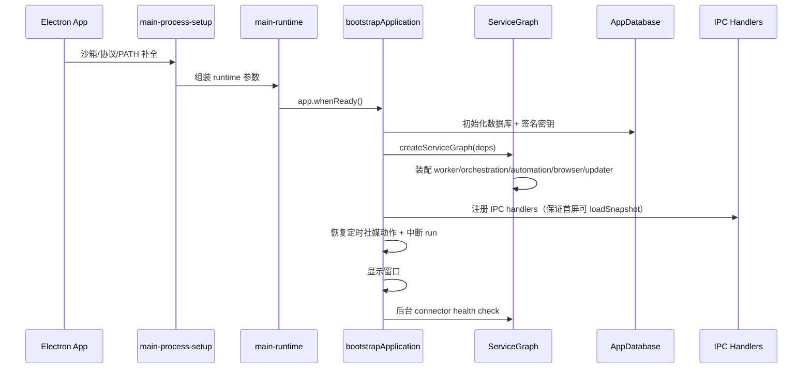

**关键设计**：
- 窗口先显示，重检查后置 — 启动体验优先
- 中断 run 标记与恢复通知 — 崩溃恢复
- `requestSingleInstanceLock` — 单实例控制

**入口文件链**：`index.ts` -> `main-runtime.ts` -> `bootstrap-application.ts` -> `service-graph.ts`

---

## 6. Service Graph — 服务编排核心

**文件**：`src/main/service-graph.ts`

ServiceGraph 是主进程的**依赖注入容器**，统一装配并管理所有服务的生命周期。

```typescript
interface ServiceGraphDependencies {
  db: AppDatabase;
  apiServerRef: { current: AgentApiServer | null };
  browserManagerRef: { current: BrowserManager | null };
  workerPath: string;
  logger: { info, warn, error };
  emitEvent: (event: DesktopEvent) => void;
  publishDomainChanged: () => void;
  notify: (options: NotificationOptions) => void;
  createRunToken: (agentId, companyId, runId) => string;
  seedDefaultAutomationRules: (companyId: string) => void;
  // ... 窗口/preload/icon 等配置
}

export function createServiceGraph(deps: ServiceGraphDependencies)
```

**装配的服务**：desktop-shell / connector-health / worker / orchestration / automation / onboarding / browser-action / updater / lifecycle

---

## 7. 数据层设计（SQLite + Snapshot）

### 7.1 存储模式

| 项目 | 路径 |
|------|------|
| 数据库 | `{profileDir}/profile.sqlite`（WAL 模式，foreign keys） |
| 密钥 | `{profileDir}/vault.key`（600 权限） |
| 日志 | `{profileDir}/logs/` |
| 产物 | `{profileDir}/artifacts/` |
| 备份 | `{profileDir}/backups/` |

### 7.2 实体模型（25+ 表，按业务域）

| 域 | 表 | 对应类型 |
|----|-----|----------|
| 组织 | `companies`, `agents`, `workspaces` | `CompanyRecord`, `AgentRecord`, `WorkspaceRecord` |
| 目标执行 | `goals`, `projects`, `tasks`, `runs`, `cost_entries`, `activity` | `GoalRecord`, `ProjectRecord`, `TaskRecord`, `RunRecord`, `CostRecord`, `ActivityRecord` |
| 治理 | `approvals`, `secrets`, `pending_wakes` | `ApprovalRecord`, `SecretRecord` |
| 协作 | `task_comments`, `agent_messages`, `agent_message_reads` | `CommentRecord`, `AgentMessageRecord` |
| 运营 | `social_accounts`, `browser_actions`, `meetings`, `documents`, `knowledge_base`, `sprints` | `SocialAccountRecord`, `BrowserActionRecord`, `MeetingRecord`, `DocumentRecord`, `KnowledgeEntryRecord`, `SprintRecord` |
| 自动化 | `automation_rules`, `workflow_pipelines` | `AutomationRule`, `WorkflowPipelineRecord` |
| 系统 | `settings` | — |

### 7.3 Snapshot 读取模型

Renderer 不直接拼接复杂查询，而是依赖 `AppDatabase.listRendererSnapshot()` 返回 `ProfileSnapshot`。

```
Main 进程 → SQLite 多表聚合 → ProfileSnapshot → IPC domain-changed → Renderer 刷新
```

**优势**：前端状态简单，刷新逻辑统一，多表聚合集中在 Main。

### 7.4 关键数据库类签名

```typescript
export class AppDatabase {
  constructor(dbPath: string, vault: SecretVault)
  // 组织
  saveCompany(...), getCompany(...), listCompanies(...)
  saveAgent(...), getAgent(...), listAgents(companyId)
  // 执行
  saveGoal(...), saveProject(...), saveTask(...)
  createRun(...), finishRun(...), listRuns(...)
  // 治理
  requestApproval(...), resolveApproval(...)
  // 通信
  sendAgentMessage(...), listAgentMessages(...), markAgentMessageRead(...)
  searchMessages(...)
  // 自动化
  saveAutomationRule(...), listAutomationRules(...)
  // Snapshot
  listRendererSnapshot(): ProfileSnapshot
  // ... 100+ public methods
}
```

---

## 8. IPC 契约与安全边界

### 8.1 契约中心

**文件**：`src/shared/contracts.ts`

- `IPC_CHANNELS`：70+ 通道定义
- Zod schemas：每个 IPC 输入都有对应 schema
- `DesktopResult<T>`：统一返回结构

```typescript
type DesktopResult<T> =
  | { ok: true; data: T }
  | { ok: false; error: { code: string; message: string } };
```

### 8.2 安全策略

1. Renderer 只通过 preload 白名单 API 调用
2. 每条 IPC 在 Main 侧做 **Zod 校验**
3. 大量 **公司归属校验**（`belongsToCompany`）防止跨公司越权
4. `openPath` 受严格路径白名单控制
5. Agent API 使用 **JWT run token** + `X-Agent-Company-Run-Id` 双重校验

### 8.3 新增 IPC 能力的标准流程

1. 在 `src/shared/contracts.ts` 添加 channel 名和 Zod schema
2. 在 `src/main/ipc-*.ts` 添加 handler
3. 在 `src/preload/index.ts` 暴露给 Renderer
4. 在 Renderer 中通过 `window.agentCompany.*` 调用

---

## 9. 任务执行编排（核心主干）

这是整个系统最关键的部分，理解它就理解了 AgentCompany 的核心运行机制。

### 9.1 OrchestrationService — 调度决策

**文件**：`src/main/orchestration-service.ts`

**职责**：
1. 计算任务可执行性（Agent 状态、预算、connector readiness）
2. 解析 workspace 绑定策略（task > agent > project > company fallback）
3. 生成 run 上下文与 system prompt
4. 将任务投递给 worker，并管理 heartbeat 唤醒

**关键类型**：
```typescript
interface EnqueueRunPayload {
  runId: string;
  companyId: string;
  taskId: string;
  taskTitle: string;
  taskDescription: string;
  agentId: string;
  agentName: string;
  connectorId: string;
  workspaceId: string | null;
  workspacePath: string | null;
  workspaceMode: WorkspaceLockMode; // "exclusive" | "shared" | "none"
  command: string;
  model: string | null;
  systemPrompt: string | null;
  trigger: string | null;
  env: Record<string, string>;
  sessionParams: Record<string, unknown> | null;
  thinkingEffort: string | null;
}
```

**保护逻辑**：
- 已有活跃 run 不重复派发
- 预算超限自动暂停 agent
- 待人工 review 时阻断 heartbeat

### 9.2 WorkerService + Worker 进程 — 执行引擎

**文件**：
- `src/main/worker-service.ts`（Worker 管理层）
- `src/main/orchestrator/worker.ts`（Worker 进程内执行逻辑）

**机制**：
1. Worker 作为独立 **UtilityProcess**，避免主进程阻塞
2. 按 agent/workspace 维度**串并行控制**（避免同资源冲突）
3. 流式 run-log 与 run-status 回传
4. 失败自动重试（带冷却）并可沿组织链升级
5. Worker 异常退出时恢复 queued/running run

**run 完成后的回流**（`run-finished` 事件）：
1. `finishRun` + 释放 workspace lock
2. 写 activity 与 UI 事件
3. 失败路径：`< MAX_RETRY_ATTEMPTS` 延时重试 / 超阈值升级 manager -> CEO -> user
4. 消费 `pending_wakes`
5. `automation.processRunCompletion`（子任务回流、审批门控）
6. 无 pending wake 且仍有可执行任务 → `self-wake(task_continuation)`

### 9.3 执行主链路时序

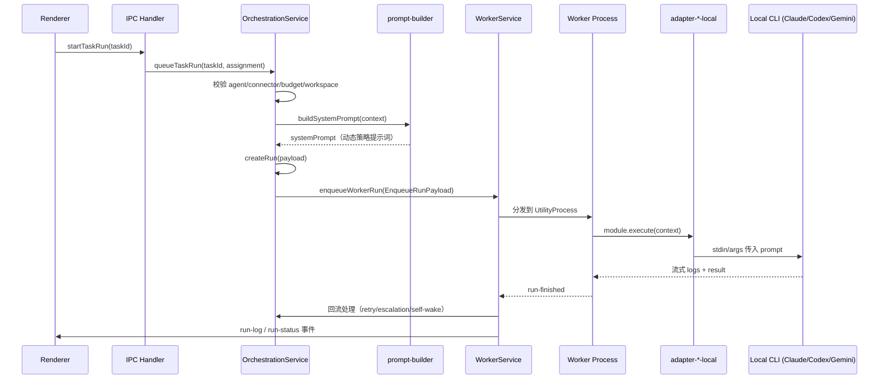

---

## 10. Prompt 构建与策略注入

**文件**：`src/main/prompt-builder.ts`

**核心思想**：Prompt 不是静态常量，而是**基于当前公司状态动态拼装**。

### 10.1 PromptContext（构建上下文）

```typescript
interface PromptContext {
  agent: AgentRecord;              // 当前执行 Agent
  apiUrl: string;                  // Agent API 地址
  apiKey: string;                  // JWT run token
  runId: string;                   // 当前 run ID
  task: TaskRecord | null;         // 当前任务
  companyName: string;             // 公司名称
  companyDescription: string;      // 公司描述
  locale?: AppLocale;              // 语言
  goals: GoalRecord[];             // 公司目标
  projects: ProjectRecord[];       // 项目列表
  directReports: AgentRecord[];    // 直接下属
  chainOfCommand: AgentRecord[];   // 管理链
  assignedTasks: TaskRecord[];     // 已分配任务
  allAgents: AgentRecord[];        // 所有 Agent
  allTasks: TaskRecord[];          // 所有任务
  pendingApprovals: ApprovalRecord[];  // 待审批
  tasksAwaitingReview: TaskRecord[];   // 待评审任务
  wakeReason: string | null;       // 唤醒原因
  recentComments: Array<{ taskId, taskTitle, authorName, body, createdAt }>;
  socialAccounts: Array<{ id, platform, accountName, status, requireApproval }>;
  recentMessages?: AgentMessageRecord[];
  upcomingMeetings?: MeetingRecord[];
  relevantKnowledge?: KnowledgeEntryRecord[];
  activeSprint?: SprintRecord | null;
  recentDocuments?: DocumentRecord[];
  allConnectors?: Array<{ id, label, status }>;
}
```

### 10.2 Prompt 注入内容

系统提示词包含：
1. **Agent 身份与角色定义**
2. **公司状态**（目标、项目、任务、组织层级）
3. **API 工具集**（通过 HTTP API 可执行的操作）
4. **SOP 规范**（Goal -> Project -> Task -> Subtask 拆分流程）
5. **wakeReason 行动指令**（assignment / comment / subtask_completed / retry_failed 等）
6. **协作上下文**（最近消息、评论、审批、会议、知识库）

### 10.3 任务拆分机制

**"提示词驱动拆分 + API 落库"**，而非硬编码规划算法：

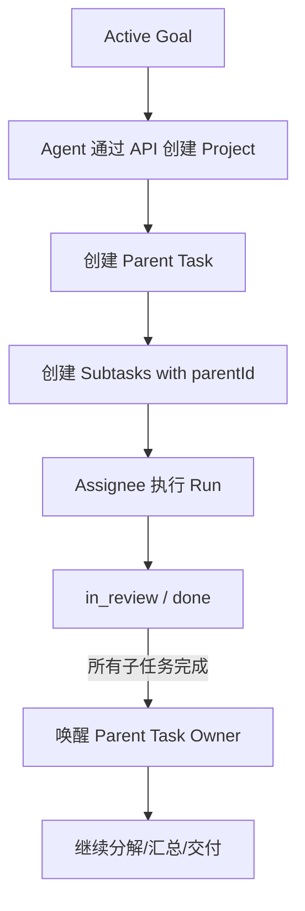

---

## 11. 唤醒机制与协作闭环

**这是让 AI 公司"持续自治运转"的核心机制。**

### 11.1 唤醒触发源

| 触发类型 | 触发点 | trigger 值 |
|----------|--------|------------|
| 消息 | `dispatchAgentMessage` -> `resolveMessageWakeTargets` | `message` |
| 评论 | `addComment` -> 自动化规则 + 直接唤醒 | `comment` |
| 任务创建 | `handleTaskCreated` 自动分配 | `assignment` |
| 任务状态变化 | `handleTaskStatusChange` | `report_blocked` / `subtask_completed` |
| 审批结果 | `handleApprovalResolved` | `approval_resolved` |
| run 完成 | `worker-service.ts` run-finished | `retry_failed` / `report_failed` / `task_continuation` |
| 定时心跳 | `startHeartbeatScheduler`（每 15s tick） | `timer` / `bootstrap` / `agent_idle` |
| 重启恢复 | `bootstrap-application.ts` | `resume` |

### 11.2 唤醒核心算法

**入口**：`orchestration-service.ts` / `wakeAgentIfPossible`

```
1. 校验 agentId 非空
2. 校验 agent 属于目标 company
3. ensureAgentHeartbeatEnabled（被唤醒即加入心跳体系）
4. startAgentHeartbeatRun(agentId, companyId, trigger)
5. 如果未开跑且 agent busy → enqueuePendingWake（不丢信号）
```

### 11.3 startAgentHeartbeatRun 门控条件

只有**全部通过**才创建 run：
1. Worker ready
2. 公司状态 `active`
3. Agent 归属匹配
4. Agent 不能 `terminated/paused/pending_approval`
5. 预算不超限（超限自动 pause）
6. Connector 必须 `execution-ready`
7. Agent 不能有 active run
8. Deliverable review gate（待评审时阻断）

### 11.4 闭环流转

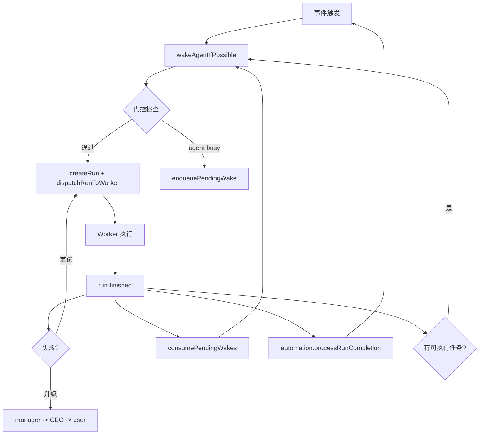

### 11.5 防风暴与稳定性

| 机制 | 说明 |
|------|------|
| 单 Agent 单活跃 run | 同 agent 只允许一个 active run |
| workspace lock | 防止同工作区冲突写 |
| pending_wakes 去重 | 每 agent/company 只保留最近一条 |
| self-wake 熔断 | `MAX_CONSECUTIVE_WAKES = 5`，超过停止并升级（`report_stuck`） |
| stale 清理 | 心跳 scheduler 清理过期 lock 和 pending wake |
| Worker 崩溃恢复 | running -> interrupted, queued 重入队 |

---

## 12. 自动化规则引擎

**文件**：`src/main/automation-service.ts`

这是让系统从"手动操作工具"升级为"可持续自治系统"的关键。

### 12.1 机制

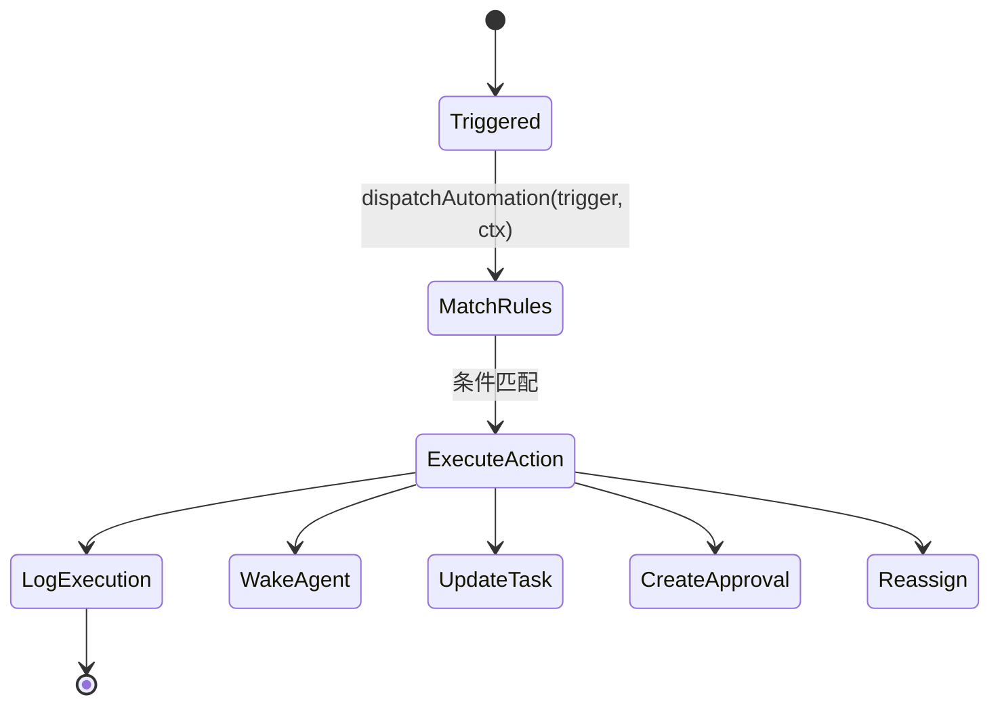

### 12.2 触发器类型

`task_created`, `task_status_changed`, `run_completed`, `run_failed`, `approval_resolved`, `comment_posted`, `document_created`, `sprint_started`, `sprint_completed`, `agent_idle`, `timer`

### 12.3 动作类型

`assign_task`, `create_task`, `send_message`, `create_approval`, `trigger_heartbeat`, `reassign`, `update_status`

### 12.4 默认规则（`default-automation-rules.ts`）

- 新任务自动分配
- 任务 `blocked` 自动升级到 manager
- run 失败重试/重分配
- Agent idle 时自动分派工作
- 任务进入 `todo` 时自动唤醒执行
- 子任务完成回唤父任务负责人

### 12.5 Workflow Pipeline

支持多步骤顺序执行，每步是一个 `AutomationAction`，按 `stepIndex` 依次执行。

---

## 13. Agent 协作通信系统

### 13.1 双通道模型

| 通道 | 表 | 用途 |
|------|----|------|
| 正式消息 | `agent_messages` | 组织内多频道协作（direct/department/company/project/incident） |
| 任务讨论 | `task_comments` | 围绕任务上下文的讨论 |

**核心特性**：通信不仅是展示层，而是**执行编排输入** — 消息/评论直接触发 `wakeAgentIfPossible`。

### 13.2 频道语义与路由

| 频道 | 可见范围 | 唤醒目标 |
|------|----------|----------|
| `direct` | 发送者 + 收件人 | 指定 `toAgentId`（非自己） |
| `department` | 同部门成员 | 部门内非发送者可执行 Agent |
| `company` | 全公司 | 顶层管理者（reportsTo 为空） |
| `project` | 项目相关成员 | 项目 lead + 任务 assignee |
| `incident` | 全公司 | 公司内全部活跃 Agent |

### 13.3 消息处理链路

```
发送方(UI/Agent API) → dispatchAgentMessage
  → normalizeAgentMessageInput（默认值填充）
  → validateAgentMessageInput（归属/频道/recipient 校验）
  → db.sendAgentMessage（持久化）
  → emitEvent(new-message) + publishDomainChanged
  → resolveMessageWakeTargets（计算唤醒目标）
  → wakeAgentIfPossible（逐个唤醒）
```

### 13.4 已读机制

- Board 已读使用 `BOARD_READER_ID`
- Agent 已读使用自身 `agentId`
- UPSERT 到 `agent_message_reads`
- 标记前校验消息存在性与可见性

### 13.5 IPC/API 双入口一致性

| 入口 | 使用方 | 最终汇聚 |
|------|--------|----------|
| IPC `sendAgentMessage` | Board/Renderer | `dispatchAgentMessage` |
| `POST /api/companies/:id/messages` | 运行中 Agent | `dispatchAgentMessage` |

---

## 14. 连接器与适配器体系

### 14.1 连接器注册

**文件**：`src/main/connectors.ts`

当前启用 3 个连接器：

| ID | 标签 | 默认模型 |
|----|------|----------|
| `codex_local` | Codex | gpt-5.3-codex |
| `claude_local` | Claude Code | — |
| `gemini_local` | Gemini | — |

**ConnectorDefinition 接口**：
```typescript
interface ConnectorDefinition {
  id: ConnectorId;
  label: string;
  description: string;
  defaultCommand: string;
  defaultModel: string | null;
  capabilityMatrix: CapabilityMatrix; // code/research/content/management/general 偏好
  module: ServerAdapterModule;        // 来自 adapter 包
  listModels?: () => Promise<Array<{ id, label }>>;
}
```

### 14.2 任务到连接器匹配

**文件**：`src/main/connector-matching.ts`

按 `TaskType`（code/research/content/management/general）与连接器 `CapabilityMatrix` 做优先级匹配。

### 14.3 适配器统一接口

```typescript
// packages/adapter-utils/src/types.ts
interface ServerAdapterModule {
  execute(context: ExecutionContext): Promise<ExecutionResult>;
  testEnvironment(): Promise<EnvironmentTestResult>;
  sessionCodec?: SessionCodec;
}
```

每个适配器将不同 CLI 行为差异封装，主程序通过统一 `ServerAdapterModule` 调用。

### 14.4 执行流程

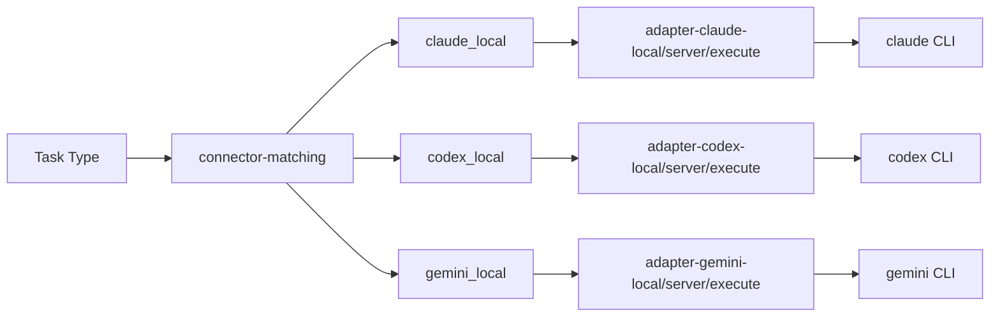

---

## 15. API Server（Agent 运行期 HTTP）

**文件**：`src/main/api-server.ts`

### 15.1 用途

为运行中的 Agent 提供**受控本地 HTTP API**，让 Agent 可以：
- 读写任务、项目、目标
- 创建/解决审批
- 发送消息和评论
- 读取公司状态
- 管理文档和知识库

### 15.2 安全机制

- 仅监听 `127.0.0.1` 随机端口
- JWT run token + `X-Agent-Company-Run-Id` 双重校验
- CORS 白名单（dev origin + `app://-`）
- 请求体大小限制与编码兼容处理（含中文 Windows GBK 回退）

### 15.3 关键路由

```
POST /api/companies/:companyId/tasks          # 创建/更新任务
POST /api/companies/:companyId/messages       # 发送消息
POST /api/companies/:companyId/comments       # 发送评论
POST /api/companies/:companyId/approvals      # 创建审批
POST /api/companies/:companyId/agents/hire    # 请求招聘
GET  /api/companies/:companyId/tasks          # 读取任务列表
GET  /api/companies/:companyId/messages       # 读取消息
...
```

---

## 16. 前端架构

### 16.1 入口与壳

**文件**：`src/renderer/App.tsx`

- 首次 `refresh` 拉取 `ProfileSnapshot`
- 订阅 IPC 事件（`domain-changed`、`run-log`、快捷键等）
- 侧栏 section 路由分发（内部状态驱动，非 react-router）
- 全局命令面板与底部运行控制台

### 16.2 状态管理

**Zustand + immer + devtools**，6 个 slice：

| Slice | 职责 |
|-------|------|
| `navigation` | 当前 section、面板路由 |
| `company` | 公司数据 snapshot |
| `selection` | 选中实体（task/agent/project 等） |
| `ui` | 主题、弹窗、toast |
| `communication` | 消息、频道状态 |
| `social` | 社媒账号与浏览器动作 |

### 16.3 业务面板映射（src/renderer/components/）

| Section | 组件目录 | 核心能力 |
|---------|----------|----------|
| Dashboard | `dashboard/` (13 组件) | 指标、告警、活跃工作、看板 |
| Organization | `organization/` (11 组件) | Agent 列表、组织图、目标、项目 |
| Hiring | `hiring/` (1 组件) | 招聘流水线 |
| Execution | `execution/` (17 组件) | 任务队列、审批、workspace、费用、设置 |
| Runs | `runs/` (4 组件) | 运行中心、日志回看 |
| Communication | `communication/` (7 组件) | Agent 消息中枢 |
| Inbox | `inbox/` (4 组件) | 收件箱、Standup、Performance |
| Automation | `automation/` (5 组件) | 规则、workflow 管理 |
| Company Ops | `company-operations/` (5 组件) | 文档、知识、会议、冲刺 |
| Social | `social/` (4 组件) | 社媒账号、浏览器动作 |
| Onboarding | `CompanyOnboarding/` (9 组件) | 公司创建向导 |

### 16.4 实时刷新机制

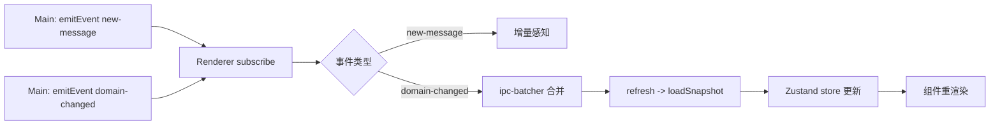

---

## 17. 功能模块到代码映射索引

**快速查找：想改什么能力，优先看哪个文件。**

| 要修改的能力 | 核心文件 |
|-------------|----------|
| 任务调度策略 | `src/main/orchestration-service.ts` |
| 自动化规则触发与动作 | `src/main/automation-service.ts` + `default-automation-rules.ts` |
| 运行日志与失败重试 | `src/main/worker-service.ts` + `orchestrator/worker.ts` |
| Prompt 与 AI 行为 | `src/main/prompt-builder.ts` |
| 审批策略 | `src/main/approval-policy.ts` + `ipc-core-operations-handlers.ts` |
| 社媒浏览器行为 | `src/main/browser-manager.ts` + `browser-action-service.ts` |
| Agent 消息路由 | `src/main/message-dispatch.ts` |
| 前端页面编排 | `src/renderer/App.tsx` |
| 新增 IPC 能力 | `contracts.ts` + `ipc-*.ts` + `preload/index.ts` |
| 新增连接器/模型 | `connectors.ts` + `packages/adapter-*-local/` |
| 数据模型/表结构 | `src/main/database.ts` + `src/shared/types.ts` |
| 组织架构与招聘 | `ipc-core-work-graph-handlers.ts` + `agent-permissions.ts` |
| Onboarding 流程 | `src/main/onboarding-service.ts` + `CompanyOnboarding/` |
| 国际化 | `src/renderer/i18n/en.ts` + `zh.ts` + `src/shared/localization.ts` |

---

## 18. 关键数据流 Mermaid 图

### 18.1 总体架构

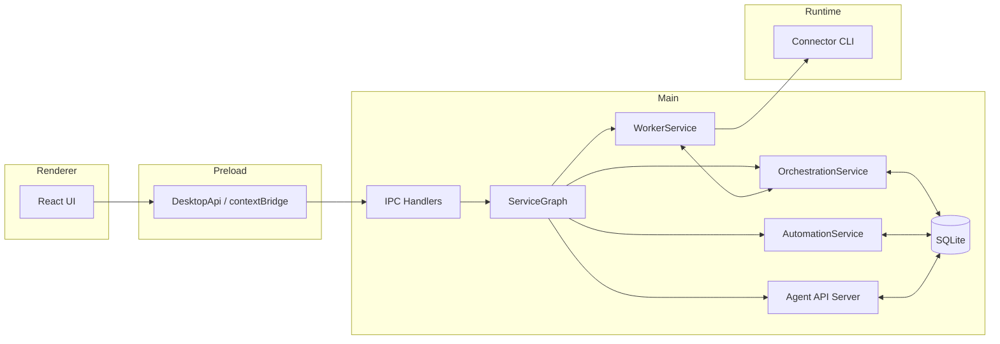

### 18.2 Onboarding（用户目标 -> 首轮执行）

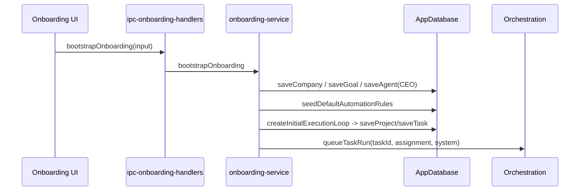

### 18.3 消息发送与唤醒

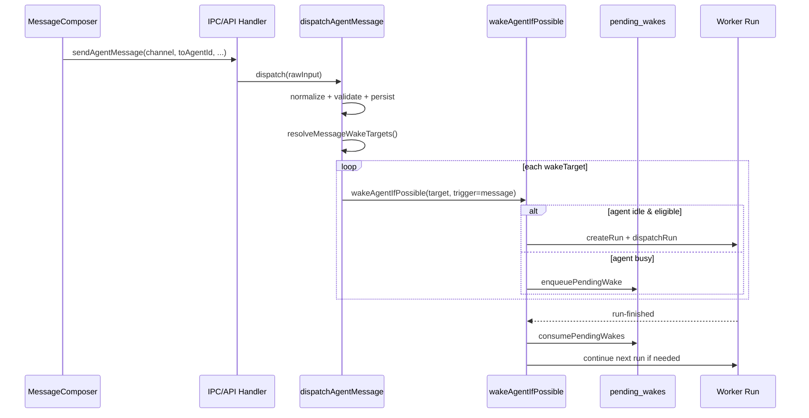

### 18.4 子任务完成驱动父任务推进

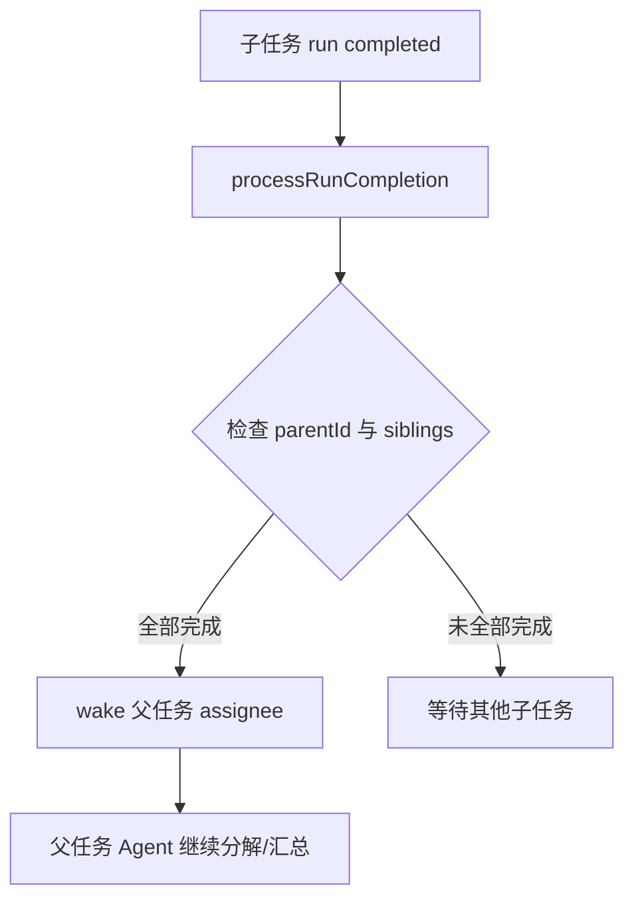

### 18.5 失败升级闭环

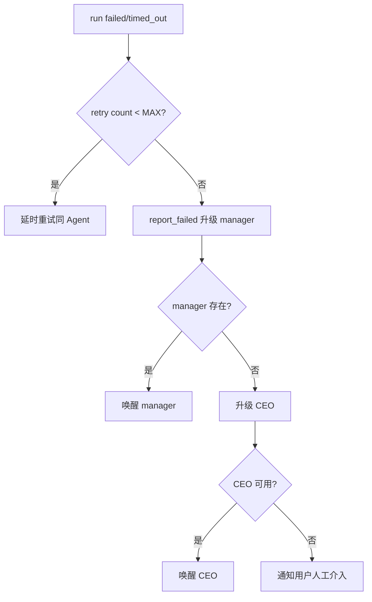

---

## 19. 测试结构

| 层级 | 路径 | 覆盖范围 |
|------|------|----------|
| 单元测试 | `tests/unit/` | database、contracts、store、notification、connector-matching、恢复与升级策略 |
| 集成测试 | `tests/integration/` | autonomous-chain、database 端到端 |
| E2E 测试 | `tests/e2e/` | Playwright desktop smoke |

测试重心偏核心逻辑（数据层/编排层/恢复策略），与项目风险点匹配度较高。

---

## 20. 开发指南：如何修改特定能力

### 20.1 推荐代码阅读路径（2 小时快速上手）

1. `src/main/index.ts` + `main-runtime.ts` + `bootstrap-application.ts` — 建立启动全景
2. `src/main/service-graph.ts` — 建立服务依赖关系图
3. `src/main/database.ts` + `src/shared/types.ts` — 理解实体模型与 snapshot
4. `src/shared/contracts.ts` + `src/preload/index.ts` — 理解 IPC 合同边界
5. `src/main/orchestration-service.ts` + `worker-service.ts` + `orchestrator/worker.ts` — 掌握执行主路径
6. `src/main/prompt-builder.ts` — 理解策略注入
7. `src/main/automation-service.ts` + `default-automation-rules.ts` — 理解自动推进闭环
8. `src/renderer/App.tsx` + 各 components 子目录 — 建立功能按钮到后端能力的映射

### 20.2 新增功能的标准流程

**新增 IPC 能力**：
1. `src/shared/types.ts` — 添加 Record 类型
2. `src/shared/contracts.ts` — 添加 channel 名 + Zod schema
3. `src/main/database.ts` — 添加表和 CRUD 方法
4. `src/main/ipc-*.ts` — 添加 handler
5. `src/preload/index.ts` — 暴露给 Renderer
6. `src/renderer/` — 添加 UI 组件

**新增连接器**：
1. `packages/adapter-{name}-local/` — 创建适配器包（参考已有结构）
2. `src/main/connectors.ts` — 注册 `ConnectorDefinition`
3. `src/shared/types.ts` — 更新 `ConnectorId` 联合类型

**新增自动化规则**：
1. `src/main/default-automation-rules.ts` — 添加规则模板
2. `src/main/automation-service.ts` — 如需新触发器/动作类型，扩展 dispatch/execute

### 20.3 三个最重要的杠杆模块

如果你只能深入理解三个文件，选择这三个：

1. **`orchestration-service.ts`** — 执行调度，理解"任务如何被运行"
2. **`automation-service.ts`** — 自治规则，理解"系统如何自推进"
3. **`database.ts` + `contracts.ts`** — 系统边界与数据契约，理解"数据如何流动"

---

## 附录 A：关键类型速查

```typescript
// 结果模式
type DesktopResult<T> = { ok: true; data: T } | { ok: false; error: { code: string; message: string } };

// 公司状态
type CompanyStatus = "active" | "paused" | "archived";

// Agent 状态
type AgentStatus = "active" | "paused" | "terminated" | "pending_approval";

// 任务状态
type TaskStatus = "backlog" | "todo" | "in_progress" | "blocked" | "in_review" | "done" | "cancelled";

// Run 状态
type RunStatus = "queued" | "running" | "succeeded" | "failed" | "cancelled" | "timed_out" | "interrupted";

// 审批状态
type ApprovalState = "pending" | "approved" | "rejected" | "expired";

// 审批类型
type ApprovalType = "hire" | "deployment" | "social_post" | "document_review" | "deliverable_review" | "general";

// 连接器 ID
type ConnectorId = "codex_local" | "claude_local" | "gemini_local" | "kimi_local" | "opencode_local";

// 频道类型
type MessageChannel = "direct" | "department" | "company" | "project" | "incident";

// 自动化触发器
type AutomationTrigger = "task_created" | "task_status_changed" | "run_completed" | "run_failed" |
  "approval_resolved" | "comment_posted" | "document_created" | "sprint_started" |
  "sprint_completed" | "agent_idle" | "timer";

// Workspace lock
type WorkspaceLockMode = "exclusive" | "shared" | "none";
```

## 附录 B：环境变量

| 变量 | 默认值 | 说明 |
|------|--------|------|
| `AGENTCOMPANY_PROFILE_DIR` | `{userData}/profile` | 数据目录 |
| `AGENTCOMPANY_UPDATE_URL` | — | 自动更新 URL |
| `AGENTCOMPANY_ALLOW_INSECURE_VAULT` | — | 允许非安全 vault |
| `AGENTCOMPANY_DISABLE_UPDATES` | — | 禁用自动更新 |
| `AGENTCOMPANY_DISABLE_SINGLE_INSTANCE` | — | 禁用单实例锁 |

## 附录 C：路径别名

| 别名 | 实际路径 |
|------|----------|
| `@shared` | `src/shared/` |
| `@main` | `src/main/` |
| `@renderer` | `src/renderer/` |
| `@preload` | `src/preload/` |

---

> **给 AI Agent 的提示**：本文档覆盖了 AgentCompany 的完整技术全景。当你需要修改某个功能时，请先查阅第 17 节的映射索引定位核心文件，再查阅第 9-13 节理解该功能在整体架构中的位置和影响面。Prompt 相关修改参考第 10 节，数据模型修改参考第 7 节，新功能开发流程参考第 20 节。
