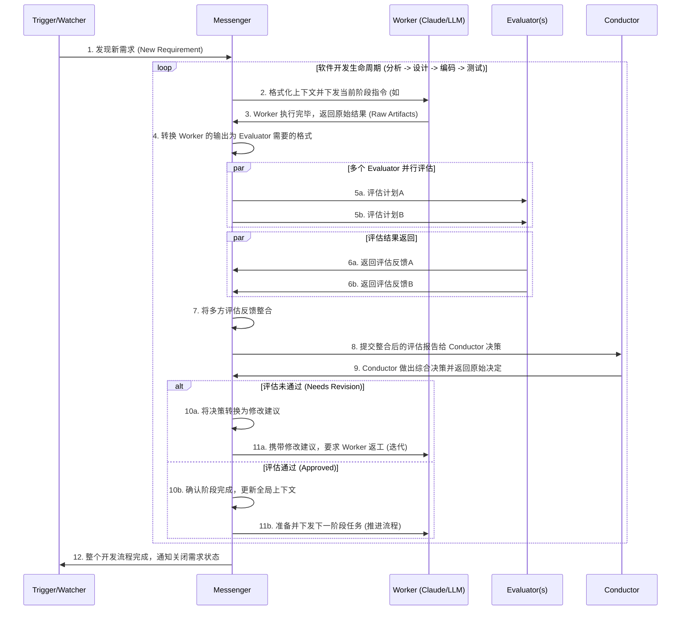

现在利用AI Agent可以完成大部分的代码开发工作。但是很难让一个开发过程完全自动化。比如从“需求分析 -> 设计 -> 编码 -> 测试”这个流程中，虽然AI Agent可以完成大部分的工作，但是需要人工不断的和AI进行交互，来推动整个流程的进行。
Capibara的目标是旨在利用现代AI Agent的能力，在此之上构建一个通用的自动化流转系统，它能够协调AI Agent来完成软件开发过程中的不同阶段的工作。
第一个版本，Capibara将提供MVTT的支持。MVTT是一个基于提示词的Prompt工程，它能够指导AI完成单次任务。MVTT的仓库地址是：https://github.com/uoyoCsharp/My-Virtual-TechTeam 

Capibara的核心设计理念是基于角色抽象和流程自动化。它会利用LLM的能力来进行问题分析和汇总，结合一些常用的Prompt工程来让整个流程能够自动化的进行下去。 因此整个流程就从传统的 “人工输入任务 -> AI Agent执行 -> AI 提出问题等待反馈 -> 人工输入反馈 -> AI Agent继续执行” 这个流程，变成了 “人工输入任务 -> AI Agent执行 -> AI Agent自己分析问题并反馈给执行任务的Agent -> AI Agent继续执行” 这样一个完全自动化的流程。

我现在想做的是将capibara更改成一个基于“公司级组织架构”的全智能助手：
用户可以在这个系统中新建一些“角色”，角色之间会有层级关系，形成类似于公司组织架构的树状结构。“子节点”的角色在完成任务之后，可以交由“父节点”的角色进行审核和批准。 比如CTO下面会有技术经理，技术经理下面会有前端开发、后端开发等角色。前端开发完成一个任务后，可以提交给技术经理进行审核，并由技术经理决定是否交由后端开发人员进行同步开发或者直接提交给CTO进行最终审核和批准。 因此每个角色都会被赋予自己的“知识库”、“技能”、“职责范围”等属性，以便在完成任务时能够更好地协同工作和进行决策。  通过这种协调关系，整个系统就能够高效的完成任务。 
在系统的mvp版本中，我们考虑引入BMAD Method来作为AI助手的基础框架。 因此我们可以让预设一个“公司组织架构”的模板（当然用户也可以根据我们的系统规范进行自定义），比如创建一个包含技术经理、UI/UX、前端开发、后端开发等角色的组织架构模板。 每个角色会应用到BMAD Method的不同"skills"来完成任务，而技术经理最为全局的决策人员，“它会用于BMAD METHOD”的知识库，用于在决策过程中提供参考和指导。
系统支持“全智能”和“半智能”两种模式。在全智能流程下，系统的“决策者”会利用AI来自动完成任务。 而在半智能流程下，在“关键节点”，“决策者”会将问题和人类进行交互，最终按照人类的决策来完成任务。

+ AI 自动创建任务进行分配和追踪，并随着任务的完成自动更新状态和进度。任务的大小级别分别是： Epic -> User Story -> Task -> Subtask。每个任务都会有一个对应的状态，比如：待办、进行中、待审核、已完成等。系统会根据任务的状态来自动更新整个流程的状态和进展，便于用户随时了解整个流程的状态和进展。
+ AI 自动创建讨论组进行沟通和协作，便于用户可以通过讨论组来看到整个流程的状态和进展，并且可以在讨论组中进行沟通和协作，来推动流程的继续进行。通常来说，讨论组是基于“Epic”来创建的，每个Epic都会对应一个讨论组，相关的角色和人员都可以加入到这个讨论组中来进行沟通和协作。

## Design

### Role
**Trigger/Watcher**: 触发器/监听者。负责监听需求库（如 Github Issues, Notion 等）的变化，一旦有新需求，立即唤醒整个自动化工作流。
**Worker**: 实际执行任务的角色。通常是利用prompt engine来驱动LLM完成任务，负责根据需求分析、设计、编码和测试等任务进行操作。
**Messenger**: 负责传递信息的角色。它会把从其他角色处得到的结果利用LLM进行汇总和转换，成为特定的格式，然后再传递给接下来的角色。
**Evaluator**: 负责评估结果的角色。当worker完成一轮指令之后，可能会需要进行问题澄清或者反馈，此时就需要Evaluator来评估worker的结果，并给出反馈或者澄清问题。为了保证整个系统的质量，系统可能会引入多个Evaluator来进行评估。Evaluator通常也是利用LLM来进行评估，评估之后将消息通过Messenger传递给Conductor进行决策。
**Conductor**: 整个系统的指挥者和决策者。接收从messenger处传递来的消息，进行综合分析和决策，决定整个流程的走向。比如：指导worker进行下一个流程；根据多个Evaluator的评估结果进行综合分析，给出最终的决策结果；或者在某些特殊情况下，决定人工介入来进行处理。 它也是利用LLM来进行整个流程的决策和控制。

### Workflow

### Tech Stack
- Typescript: 作为主要的开发语言，适用于构建复杂的系统和处理异步操作。
- Claude Code Cli: 作为LLM的交互平台，负责系统中所有与LLM的交互和处理，确保系统能够利用LLM的能力来完成各种任务。
- Electron: 未来计划使用Electron来构建桌面端应用，提供可视化的界面来展示整个软件开发流程的状态和进展，提升用户体验和系统的可用性。

## System Requirements
1. 系统基于多个Role进行抽象，每个Role负责不同的职责，确保系统的模块化和可维护性。
2. 提供多个平台作为LLM的交互实现，如Github Copilot和Claude Code，确保系统的灵活性和可扩展性。 第一版本只需要考虑Claude Code Cli的适配。
3. 系统支持3种模式来完成人机交互： 1. 全自动 2. 半自动（当Conductor评估需要人工接入时，将停止整个流程等待人工的反馈） 3. 手动（所有的反馈交互都需要人工介入）。

## Keynotes
### 不同任务的上下文隔离
虽然不同的role他们都会通过llm完成（比如claude code），但是不同的角色应该有自己不同的上下文。 比如：当worker在工作的时候，他们是应该有项目的上下文。 但是作为evaluator,为了保证评估的客观性，他们应该是保证公正的上下文，只会有项目的背景信息。 而不是和worker共享同一个上下文。 这样可以保证评估的客观性和公正性。

### 上下文的回复与继续
当整个过程在流转的时候，因为会涉及到不同的Role之间的转换，但是不同角色使用隔离的上下文环境。 所以当状态流转回同一个角色的时候，应该继续使用该角色之前的上下文。 比如：当worker在分析阶段完成了任务之后，进入评估阶段，评估阶段会有一个新的上下文环境。 但是当评估阶段完成之后，流程又回到了worker进行设计阶段的工作，这时候应该继续使用之前worker的上下文环境。 这样可以保证worker在设计阶段的时候，依然可以访问到分析阶段的结果和相关信息。

## Architecture
### Key Points
+ 基于抽象编程，每个Role都是一个抽象类，定义了该角色的职责和接口。 具体的实现可以根据不同的LLM平台进行适配。

## Functional Requirements
1. 需求池： 系统可以让用户自行添加需求到需求池，或者通过集成Github Issues或者Notion等工具来自动同步需求到需求池中。
2. 任务分配： 当有新的需求进入需求池之后，系统会自动触发整个流程，按照预设的流程来分配任务给不同的Role来完成
3. 任务进度反馈： 系统会在任务执行时，提供完整的任务进度反馈和任务执行情况，比如LLM的输出结果，执行结果，评估结果，执行日志等，便于用户随时了解整个流程的状态和进展。
4. 人工介入： 当配置为半自动或者手动时，系统会在需要人工介入的关键点停止流程，并等待用户的反馈和输入，来推动流程的继续进行。当人工介入时，应该展示当前的上下文信息和相关的执行结果，便于用户做出决策和提供反馈。

## Feature Roadmap
+ 未来将使用 electron 构建桌面端应用，便于构建可视化的卡通可视化界面，展示整个软件开发流程的状态和进展。
+ 用户可以基于worker来创建不同的自定义agent角色和workflow，根据自己的需求来协调不同role之间的交互和流程
+ 系统将会在关键点中扩展hook点，便于用户在特定的阶段插入自定义的逻辑或者操作，比如在关键点完成后使用slack或者邮件通知相关人员，或者在评估阶段插入一个新的评估节点来进行特定的评估。