# Capibara 架构设计文档

> 生成日期: 2026-06-01
> 版本: 1.0
> 分支: acp-refactor

---

## 目录

1. [项目概览](#1-项目概览)
2. [技术栈](#2-技术栈)
3. [系统分层架构](#3-系统分层架构)
4. [核心模块总览](#4-核心模块总览)
5. [模块层级关系](#5-模块层级关系)
6. [模块间依赖关系](#6-模块间依赖关系)
7. [DI 装配顺序](#7-di-装配顺序)
8. [Foundation 接口与 Infrastructure 实现](#8-foundation-接口与-infrastructure-实现)
9. [单模块内部结构](#9-单模块内部结构)
10. [各模块详细说明](#10-各模块详细说明)
11. [Renderer 进程架构](#11-renderer-进程架构)
12. [IPC 通信架构](#12-ipc-通信架构)
13. [事件驱动协作机制](#13-事件驱动协作机制)
14. [数据持久化架构](#14-数据持久化架构)
15. [关键业务规则](#15-关键业务规则)
16. [架构观察与风险评估](#16-架构观察与风险评估)

---

## 1. 项目概览

Capibara 是一个 **AI 驱动的组织编排平台**，以 Electron 桌面应用形式交付。它使用户能够：

- 定义 AI Agent 团队（具有人设、技能和权限的角色）
- 将工作分解为层级任务树
- 通过人在回路协作来编排多 Agent 执行
- 支持对话式规划、AI-to-AI 询问链（带深度守卫）、计划树审核/审批工作流
- 通过 MCP 服务器向 AI Agent 暴露工具（任务转换、询问、上下文查询）

### 代码仓库结构

项目为 pnpm monorepo，当前仅包含一个 `apps/electron` 子项目：

```
capibara/
├── .ai-agents/           # MVTT 工作区配置
├── .claude/              # Claude CLI 配置
├── .github/              # CI/CD 工作流
├── apps/
│   └── electron/         # 唯一的应用包
├── docs/                 # 文档
├── tests/                # 跨项目测试（ACP POC）
├── package.json          # 根工作区配置
├── pnpm-workspace.yaml   # 工作区: apps/*, packages/*
└── README.md
```

---

## 2. 技术栈

| 层面 | 技术 | 说明 |
|------|------|------|
| 框架 | Electron | 桌面应用壳 |
| 构建工具 | electron-vite / Vite | 三进程构建 |
| 前端 | React 18 + TypeScript | UI 层 |
| 状态管理 | Zustand | 轻量状态管理 |
| UI 组件库 | shadcn/ui + Tailwind CSS | 组件 + 样式 |
| 后端 | TypeScript (Node.js) | 主进程业务逻辑 |
| 数据库 | better-sqlite3 | 嵌入式关系数据库 |
| 依赖注入 | tsyringe | DI 容器（手动 Composition Root） |
| 事件系统 | Emittery | 内存事件总线 |
| 日志 | Pino | 结构化日志 |
| 配置校验 | Zod | Schema 验证 |
| AI 协议 | ACP (Agent Client Protocol) | Agent 子进程管理 |
| 工具协议 | MCP (Model Context Protocol) | Agent 工具暴露 |
| 测试 | Vitest | 单元/集成测试 |

---

## 3. 系统分层架构

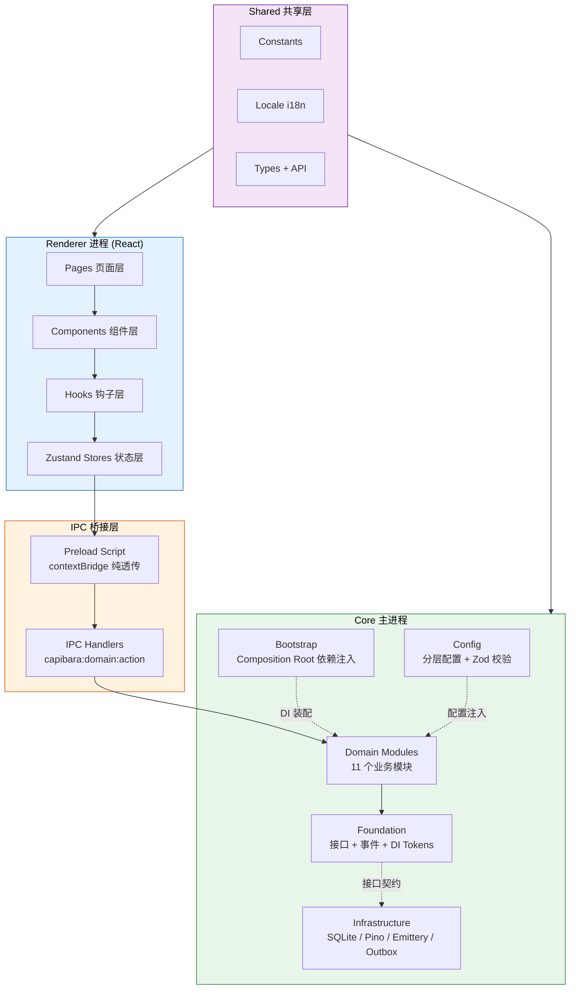

### 各层职责

| 层 | 目录 | 职责 | 关键约束 |
|----|------|------|----------|
| **Renderer** | `src/renderer/` | React UI，用户交互，状态展示 | 所有 API 调用通过 `window.capibara`（Preload 桥接） |
| **Preload** | `src/core/preload/` | `contextBridge.exposeInMainWorld` | 纯透传，零业务逻辑 |
| **IPC Handlers** | `src/core/ipc-handlers/` | `ipcMain.handle()` 注册 | 薄适配层：验证输入 -> 调用服务 -> ok/err |
| **Domain Modules** | `src/core/modules/` | 领域服务、引擎、持久化 | 仅依赖 Foundation 接口，不依赖 Infrastructure |
| **Foundation** | `src/core/foundation/` | 接口、领域事件、错误类型、DI Tokens | 定义契约：`ILogger`、`IEventBus`、`IEventPublisher` |
| **Infrastructure** | `src/core/infrastructure/` | 具体实现 | 实现 Foundation 接口，被 Bootstrap 装配 |
| **Bootstrap** | `src/core/bootstrap/` | Composition Root | 唯一同时知晓接口与实现的地方 |
| **Config** | `src/core/config/` | 分层配置加载 | defaults -> global -> project -> env，Zod 校验 |
| **Shared** | `src/shared/` | 跨进程共享 | `DesktopResult` 类型、`CapibaraApi` 接口、i18n |

---

## 4. 核心模块总览

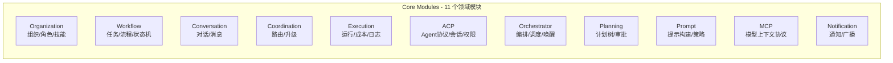

| 模块 | 路径 | 核心职责 | 子目录结构 |
|------|------|----------|-----------|
| **Organization** | `modules/organization/` | 组织/角色/技能 CRUD，角色层级遍历，模板化组织创建 | `interfaces/` `persistence/` `services/` `types/` |
| **Workflow** | `modules/workflow/` | 任务生命周期，流程模式，状态机，行为引擎 | `engines/` `interfaces/` `persistence/` `services/` `types/` |
| **Conversation** | `modules/conversation/` | 多方对话生命周期，状态转换，消息持久化 | `context/` `interfaces/` `persistence/` `services/` `types/` |
| **Coordination** | `modules/coordination/` | 询问路由到响应者，超时升级 | `routing/` |
| **Execution** | `modules/execution/` | Run 生命周期，成本追踪，执行日志 | `engines/` `interfaces/` `logging/` `persistence/` `services/` `types/` |
| **ACP** | `modules/acp/` | Agent 协议：子进程管理，会话，权限，文件访问，协作挂起 | `client/` `collaboration/` `handlers/` `interfaces/` `mcp/` `persistence/` `policies/` `types/` |
| **Orchestrator** | `modules/orchestrator/` | 顶层事件驱动协调：任务调度，唤醒门控，重试，Run 分发 | `interfaces/` `orchestrators/` `persistence/` + 顶层调度文件 |
| **Planning** | `modules/planning/` | 计划树提交，审批，丢弃，优化，过期清理 | `interfaces/` `persistence/` `types/` + 顶层服务 |
| **Prompt** | `modules/prompt/` | 系统提示构建：场景解析，上下文装配，策略渲染 | `builder/` `context/` `strategies/` `types/` |
| **MCP** | `modules/mcp/` | 进程内 MCP 服务器，HTTP/SSE 传输 | `handlers/` + 顶层构建器/传输 |
| **Notification** | `modules/notification/` | 桌面通知，事件广播 | 顶层服务文件 |

---

## 5. 模块层级关系

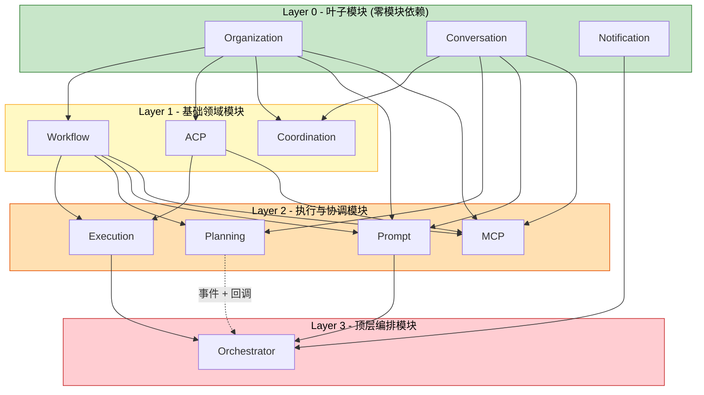

### 层级定义

| 层级 | 模块 | 模块依赖数 | 特征 |
|------|------|-----------|------|
| **L0 叶子层** | Organization, Conversation, Notification | 0 | 不依赖任何其他业务模块，是系统的叶子节点。所有其他模块最终依赖它们 |
| **L1 基础层** | Workflow, ACP, Coordination | 1 | 仅依赖 L0 模块，提供核心领域能力（任务管理、Agent 协议、询问路由） |
| **L2 协调层** | Execution, Planning, Prompt, MCP | 2-4 | 依赖 L0+L1 模块，实现跨域协调与执行（运行引擎、计划审批、提示构建、工具暴露） |
| **L3 编排层** | Orchestrator | 7+ | 依赖所有上层模块，是系统的最终汇聚点和事件驱动调度中心 |

---

## 6. 模块间依赖关系

### 6.1 完整依赖图

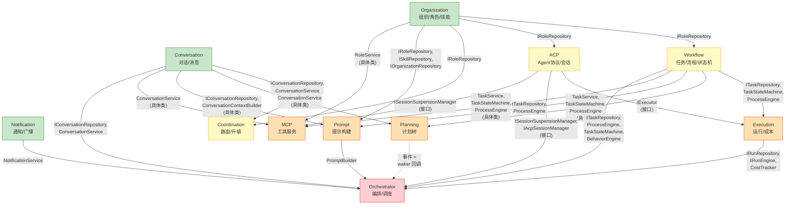

### 6.2 依赖矩阵

下表列出每个模块的依赖方向及依赖方式（接口 vs 具体类）：

| 源模块 | 目标模块 | 依赖方式 | 具体导入 |
|--------|----------|----------|----------|
| Workflow | Organization | 接口 | `IRoleRepository` |
| ACP | Organization | 接口 | `IRoleRepository` |
| Coordination | Organization | 接口 | `IRoleRepository` |
| Coordination | Conversation | 接口 + 具体类 | `IConversationRepository`, `ConversationService` |
| Execution | Workflow | 接口 + 具体类 | `ITaskRepository`, `TaskStateMachine`, `ProcessEngine` |
| Execution | ACP | 接口 | `IExecutor` |
| Planning | Workflow | 具体类 | `TaskService`, `TaskStateMachine`, `ProcessEngine` |
| Planning | Conversation | 具体类 | `ConversationService` |
| Prompt | Workflow | 接口 + 具体类 | `ITaskRepository`, `ProcessEngine` |
| Prompt | Organization | 接口 | `IRoleRepository`, `ISkillRepository`, `IOrganizationRepository` |
| Prompt | Conversation | 接口 + 具体类 | `IConversationRepository`, `ConversationContextBuilder` |
| MCP | Workflow | 具体类 | `TaskService`, `TaskStateMachine`, `ProcessEngine` |
| MCP | Conversation | 具体类 | `ConversationService` |
| MCP | Organization | 具体类 | `RoleService` |
| MCP | ACP | 接口 | `ISessionSuspensionManager` |
| Orchestrator | Workflow | 接口 + 具体类 | `ITaskRepository`, `ProcessEngine`, `TaskStateMachine`, `BehaviorEngine` |
| Orchestrator | Organization | 接口 | `IRoleRepository`, `IOrganizationRepository` |
| Orchestrator | Execution | 接口 + 具体类 | `IRunRepository`, `IRunEngine`, `CostTracker` |
| Orchestrator | Conversation | 接口 + 具体类 | `IConversationRepository`, `ConversationService` |
| Orchestrator | Prompt | 具体类 | `PromptBuilder` |
| Orchestrator | Notification | 具体类 | `NotificationService` |
| Orchestrator | ACP | 接口 | `ISessionSuspensionManager`, `IAcpSessionManager` |
| Orchestrator | Planning | 事件 + 回调 | `tryWake` 回调（setter 注入） |

### 6.3 耦合度统计

| 模块 | 被依赖数 | 依赖数 | 耦合风险 |
|------|---------|--------|----------|
| Organization | 5 | 0 | 低 (叶子) |
| Conversation | 5 | 0 | 低 (叶子) |
| Notification | 1 | 0 | 低 (叶子) |
| Workflow | 5 | 1 | 中 |
| ACP | 3 | 1 | 中 |
| Coordination | 0 | 2 | 低 (终端) |
| Execution | 1 | 2 | 低 |
| Planning | 0 | 2 | 低 (终端) |
| Prompt | 1 | 3 | 中 |
| MCP | 0 | 4 | 低 (终端) |
| **Orchestrator** | **0** | **7+** | **高 (汇聚点)** |

---

## 7. DI 装配顺序

Bootstrap 按依赖拓扑排序，严格按照以下 15 步装配：

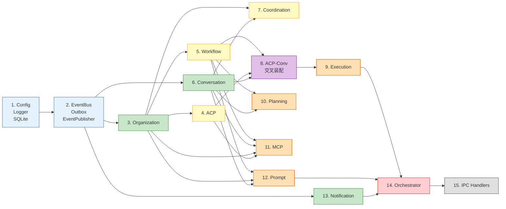

### 装配步骤详解

| 步骤 | 模块 | 依赖 | 说明 |
|------|------|------|------|
| 1 | Config + Logger + SQLite | 无 | 基础设施层启动 |
| 2 | EventBus + OutboxRepo + EventPublisher | 步骤 1 | 事件系统启动 |
| 3 | Organization | 步骤 1-2 | 叶子模块，无模块依赖 |
| 4 | ACP | 步骤 3 | 需要 `IRoleRepository` |
| 5 | Workflow | 步骤 3 | 需要 `IRoleRepository` |
| 6 | Conversation | 步骤 1-2 | 叶子模块，无模块依赖 |
| 7 | Coordination | 步骤 3, 6 | 需要 Organization + Conversation |
| 8 | ACP-Conv 交叉装配 | 步骤 4, 6 | ACP Executor 需要 Conversation 仓库 |
| 9 | Execution | 步骤 5, 4 | 需要 Workflow + ACP (IExecutor) |
| 10 | Planning | 步骤 5, 6 | 需要 Workflow + Conversation |
| 11 | MCP | 步骤 5, 6, 3, 4 | 需要 Workflow + Conversation + Organization + ACP |
| 12 | Prompt | 步骤 5, 3, 6 | 需要 Workflow + Organization + Conversation |
| 13 | Notification | 步骤 2 | 仅依赖 EventBus |
| 14 | Orchestrator | 步骤 5-13 | 汇聚所有模块 |
| 15 | IPC Handlers | 步骤 3-14 | 暴露所有服务到 Renderer |

### 后装配钩子

装配完成后，通过 setter 注入解决循环引用：

| 钩子 | 注入方 | 被注入方 | 用途 |
|------|--------|----------|------|
| `PlanningService.setWaker()` | `TaskOrchestrator.tryWake` | PlanningService | 计划审批后触发任务唤醒 |
| `RunContext.setFeedbackProvider()` | `PlanningService.consumePendingFeedback` | RunContext | AI 运行时获取计划反馈 |
| `OrgTemplateService.setProcessSchemaProvider()` | `ProcessEngine.saveSchema` | OrgTemplateService | 模板加载时保存流程模式 |

---

## 8. Foundation 接口与 Infrastructure 实现

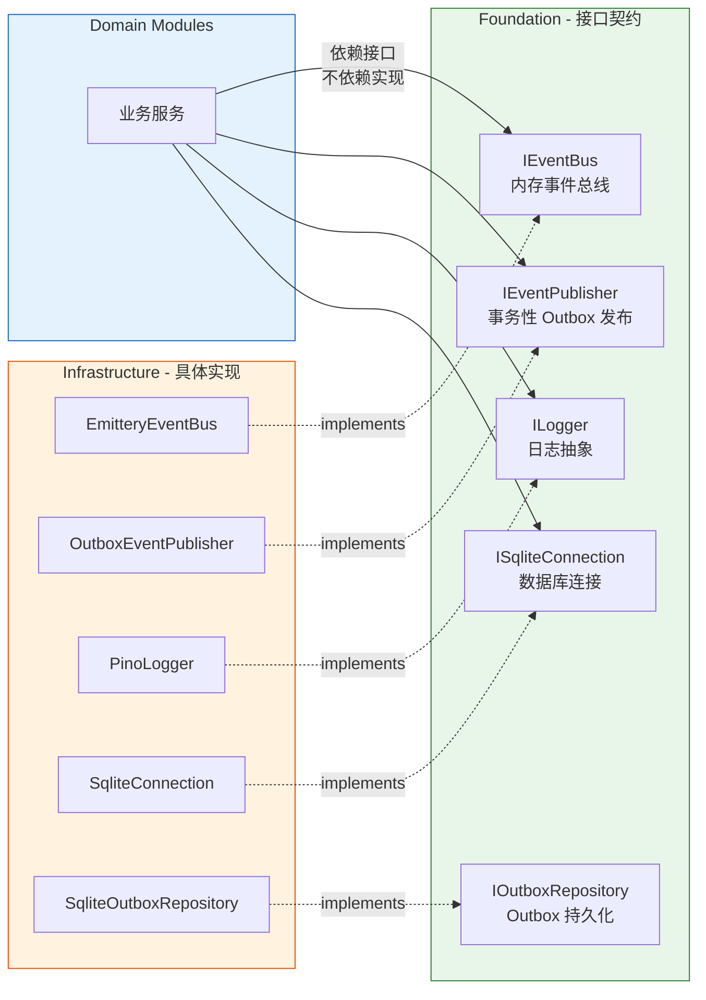

### Foundation 目录结构

```
foundation/
├── errors/
│   └── capibara.errors.ts       # 统一错误类型
├── interfaces/
│   ├── i-event-bus.ts           # IEventBus: 内存事件总线 (emit/on/off)
│   ├── i-event-publisher.ts     # IEventPublisher: 事务性 Outbox 发布
│   ├── i-logger.ts              # ILogger: 日志抽象 (info/warn/error/debug/child)
│   ├── i-outbox.repository.ts   # IOutboxRepository: Outbox 持久化
│   └── i-sqlite-connection.ts   # ISqliteConnection: 数据库连接
├── events.ts                    # 领域事件定义 (~30 种类型化事件)
├── event-schemas.ts             # Zod 事件 Schema
└── tokens.ts                    # DI Token 常量
```

### Infrastructure 目录结构

```
infrastructure/
├── observability/
│   ├── emittery-event-bus.ts          # EmitteryEventBus (implements IEventBus)
│   ├── outbox.publisher.ts            # OutboxEventPublisher (implements IEventPublisher)
│   └── pino-logger.ts                 # PinoLogger (implements ILogger)
├── persistence/
│   └── sqlite/
│       ├── migration-backup.ts        # 迁移备份
│       ├── migrations.ts              # 数据库 Schema 迁移
│       ├── sqlite-connection.ts       # SqliteConnection (implements ISqliteConnection)
│       └── sqlite-outbox.repository.ts # SqliteOutboxRepository (implements IOutboxRepository)
└── auto-updater.ts                    # 应用自动更新
```

### 关键架构规则

| 规则 | 说明 |
|------|------|
| 接口隔离 | 模块仅依赖 Foundation 接口，绝不直接依赖 Infrastructure 实现 |
| 单一装配点 | Bootstrap/Composition-Root 是唯一同时知晓接口与实现的地方 |
| 发布 vs 订阅 | `IEventPublisher`（服务发布）vs `IEventBus`（基础设施订阅） |
| 事务性保证 | Outbox 保证跨进程重启的至少一次事件投递 |
| 跨进程安全 | 所有 IPC 响应使用 `DesktopResult` 判别联合类型，异常不跨进程边界 |

---

## 9. 单模块内部结构

每个模块遵循一致的六边形架构（Hexagonal / Ports & Adapters）模式：

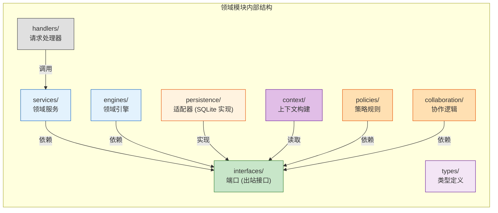

### 各模块子目录一览

| 模块 | interfaces | persistence | services | engines | 其他子目录 |
|------|:----------:|:-----------:|:--------:|:-------:|-----------|
| Organization | 3 个 | 3 个 | 5 个 | - | - |
| Workflow | 2 个 | 2 个 | 2 个 | 3 个 | - |
| Conversation | 2 个 | 3 个 | 1 个 | - | context/ |
| Coordination | - | - | - | - | routing/ |
| Execution | 4 个 | 2 个 | 1 个 | 1 个 | logging/ |
| ACP | 5 个 | 4 个 | - | - | client/, collaboration/, handlers/, mcp/, policies/ |
| Orchestrator | 1 个 | 1 个 | - | - | orchestrators/ |
| Planning | 1 个 | 1 个 | 1 个 | - | - |
| Prompt | - | - | - | - | builder/, context/, strategies/ |
| MCP | - | - | - | - | handlers/ |
| Notification | - | - | - | - | - |

---

## 10. 各模块详细说明

### 10.1 Organization Module

```
modules/organization/
├── interfaces/
│   ├── i-organization.repository.ts
│   ├── i-role.repository.ts
│   └── i-skill.repository.ts
├── persistence/
│   ├── sqlite-organization.repository.ts
│   ├── sqlite-role.repository.ts
│   └── sqlite-skill.repository.ts
├── services/
│   ├── organization.service.ts
│   ├── role.service.ts
│   ├── skill.service.ts
│   ├── org-template.service.ts
│   └── skill-seeder.ts
└── types/
    └── organization.types.ts
```

| 组件 | 职责 |
|------|------|
| `OrganizationService` | 组织 CRUD，创建事件发布 |
| `RoleService` | 角色管理，层级遍历 |
| `SkillService` | 技能管理（全局唯一命令） |
| `OrgTemplateService` | 从 JSON 模板创建组织（含自动创建 Planning Assistant 角色） |
| `SkillSeeder` | 内置/模板技能种子数据 |

**核心业务规则：**
- Skill 命令必须全局唯一
- 仅 custom-source 技能可删除
- `autoStartOnCreate` 驱动首次根任务创建时自动调度

---

### 10.2 Workflow Module

```
modules/workflow/
├── engines/
│   ├── behavior.engine.ts       # 规则引擎：条件评估 + 动作执行
│   ├── process.engine.ts        # 流程模式引擎
│   └── task.state-machine.ts    # 任务状态机
├── interfaces/
│   ├── i-process-schema.repository.ts
│   └── i-task.repository.ts
├── persistence/
│   ├── sqlite-process-schema.repository.ts
│   └── sqlite-task.repository.ts
├── services/
│   ├── task.service.ts
│   └── process-template.service.ts
└── types/
    └── workflow.types.ts
```

| 组件 | 职责 |
|------|------|
| `TaskStateMachine` | 任务状态转换：验证转换合法性，计算深度，发布事件 |
| `ProcessEngine` | 流程模式 CRUD，模板加载 |
| `BehaviorEngine` | 状态变更时评估条件并执行动作（如自动转换） |
| `TaskService` | 任务 CRUD，转换，取消，审批/拒绝 |

**核心业务规则：**
- 仅叶任务可进入审批状态；非叶任务自动审批
- AI 角色 (`requiresHumanApproval=false`) 跳过审批
- 系统驱动转换 (`triggeredBy='system'`) 不触发重新唤醒
- 任务深度 = 父深度 + 1，最大遍历深度 10

---

### 10.3 Conversation Module

```
modules/conversation/
├── context/
│   └── conversation-context.builder.ts
├── interfaces/
│   ├── i-conversation-message.repository.ts
│   └── i-conversation.repository.ts
├── persistence/
│   ├── conversation-event.logger.ts
│   ├── sqlite-conversation-message.repository.ts
│   └── sqlite-conversation.repository.ts
├── services/
│   └── conversation.service.ts
└── types/
    ├── conversation-metadata.schema.ts
    └── conversation.types.ts
```

| 组件 | 职责 |
|------|------|
| `ConversationService` | 对话生命周期：创建、添加消息、路由、解决、取消 |
| `ConversationContextBuilder` | 为 AI 运行构建对话上下文 |
| `ConversationEventLogger` | 对话事件持久化日志 |

**对话类型：** `inquiry` (AI 问人/同伴)、`planning` (人描述项目)、`adhoc`、`plan_review`

---

### 10.4 Coordination Module

```
modules/coordination/
└── routing/
    ├── inquiry-escalation.service.ts
    ├── inquiry.router.ts
    └── routing.types.ts
```

| 组件 | 职责 |
|------|------|
| `InquiryRouter` | 订阅 `conversation:needs-routing`，沿角色祖先树路由询问到响应者 |
| `InquiryEscalationService` | 扫描超时询问，沿层级升级 |

**路由规则：** 沿角色祖先树上溯，跳过暂停/缺失的父节点；人类兜底是最后手段。

---

### 10.5 Execution Module

```
modules/execution/
├── engines/
│   └── run.engine.ts
├── interfaces/
│   ├── i-cost-entry.repository.ts
│   ├── i-executor.ts
│   ├── i-run-engine.ts
│   └── i-run.repository.ts
├── logging/
│   └── file-log.service.ts
├── persistence/
│   ├── sqlite-cost-entry.repository.ts
│   └── sqlite-run.repository.ts
├── services/
│   └── cost-tracker.ts
└── types/
    └── execution.types.ts
```

| 组件 | 职责 |
|------|------|
| `RunEngine` | Run 生命周期：启动/完成/失败/取消/挂起，驱动 `IExecutor` |
| `CostTracker` | Token 成本统计 |
| `FileLogService` | 执行日志文件写入 |

**核心业务规则：**
- 失败 Run 获得指数退避重试，最多 `maxRetryOnFailure` 次（默认 3）
- 孤儿 Run（崩溃导致）在启动时标记为 interrupted
- 挂起（未失败/取消）的 Run 不回退任务状态

---

### 10.6 ACP Module

```
modules/acp/
├── client/
│   ├── acp-agent.spawner.ts       # Agent 子进程管理
│   ├── acp-executor.ts            # IExecutor 实现，桥接 RunEngine 与 ACP 会话
│   ├── acp-session.manager.ts     # 会话生命周期状态机
│   ├── acp-session.sweeper.ts     # 空闲/协作 TTL 清理
│   ├── model-state.ts
│   └── session-lifecycle.ts
├── collaboration/
│   ├── chain-depth.guard.ts       # AI-to-AI 链深度守卫 (默认 max 5)
│   ├── inquiry-aggregator.ts      # 多响应者回复聚合
│   ├── session-suspension.manager.ts  # 会话挂起/恢复管理
│   └── suspension.types.ts
├── handlers/
│   ├── acp-filesystem.handler.ts  # 文件系统访问控制
│   ├── acp-permission.handler.ts  # 权限请求处理
│   └── acp-update.handler.ts      # ACP 流更新处理
├── interfaces/
│   ├── i-acp-session.manager.ts
│   ├── i-acp-session.repository.ts
│   ├── i-model-preference.store.ts
│   ├── i-session-suspension.manager.ts
│   └── i-suspension.repository.ts
├── mcp/
│   └── acp-mcp.config.ts          # ACP 会话的 MCP 服务器配置
├── persistence/
│   ├── acp-audit.repository.ts
│   ├── sqlite-acp-session.repository.ts
│   ├── sqlite-model-preference.store.ts
│   └── sqlite-suspension.repository.ts
├── policies/
│   ├── file-access.policy.ts      # 三层文件访问策略
│   └── tool-permission.policy.ts  # 工具权限策略
└── types/
    └── acp.types.ts
```

| 组件 | 职责 |
|------|------|
| `AcpExecutor` | 实现 `IExecutor`，将 `RunEngine` 与 ACP 会话桥接 |
| `AcpSessionManager` | 会话状态机：创建/挂起/恢复/关闭/过期 |
| `AcpAgentSpawner` | Agent 子进程生命周期管理 |
| `AcpUpdateHandler` | 处理 ACP 流更新，转发到 EventBus + 回调 |
| `SessionSuspensionManager` | AI-to-AI 协作挂起/恢复 |
| `ChainDepthGuard` | 链深度限制，防止递归爆炸 |
| `InquiryAggregator` | 多响应者回复聚合 (`all` / `any` 模式) |
| `FileAccessPolicy` | cwd 边界 + 角色 allowlist (glob) + 全局 denylist |
| `ToolPermissionPolicy` | permissive / restrictive / ask_user 模式 |

**核心业务规则：**
- 链深度默认最大 5（可配置），超出抛出错误
- 循环询问检测防止直接和间接递归链
- 会话恢复策略优先级：`supportsResume` > `supportsLoad` > `rebuild`
- 文件访问三层防护：cwd 边界、角色 allowlist (glob)、全局 denylist (.env, secrets, .git)
- 危险命令 denylist（rm -rf, drop table 等）

---

### 10.7 Orchestrator Module

```
modules/orchestrator/
├── interfaces/
│   └── i-pending-wake.repository.ts
├── orchestrators/
│   ├── conversation.orchestrator.ts  # 对话生命周期，ACP 会话恢复，人类兜底
│   ├── run.orchestrator.ts           # Run 结束排水链，重试调度
│   └── task.orchestrator.ts          # 任务生命周期事件驱动协调
├── persistence/
│   └── sqlite-pending-wake.repository.ts
├── retry.scheduler.ts               # 指数退避重试调度
├── run.coordinator.ts               # 将编排意图翻译为 RunEngine 调用
├── task.scheduler.ts                # 查找下一个可调度任务
└── wake-gate.validator.ts           # 唤醒门控验证
```

| 组件 | 职责 |
|------|------|
| `TaskOrchestrator` | 事件驱动任务协调，触发唤醒和调度 |
| `ConversationOrchestrator` | 对话生命周期，ACP 会话恢复，人类兜底 |
| `RunOrchestrator` | Run 结束后排水链，触发下一轮调度 |
| `RunCoordinator` | 将编排意图翻译为 `RunEngine` 调用 |
| `WakeGateValidator` | 并发门控：每组织一个活跃 Run |
| `TaskScheduler` | 查找下一个可调度任务 |
| `RetryScheduler` | 指数退避重试 |

**核心业务规则：**
- 每组织同时仅一个活跃 Run
- 任何任务处于审批状态时，组织暂停调度
- 唤醒门控阻止条件：调度器暂停、角色暂停、组织有活跃 Run、角色超出 `maxConsecutiveWakes`
- 待处理唤醒每排水周期消费一个（Run 结束 -> 排水 -> 下一个唤醒）
- 快速唤醒事件按 `taskId+roleId` 对 200ms 去抖

---

### 10.8 Planning Module

```
modules/planning/
├── interfaces/
│   └── i-pending-plan-tree.repository.ts
├── persistence/
│   └── sqlite-pending-plan-tree.repository.ts
├── planning.service.ts
└── types/
    └── pending-plan-tree.types.ts
```

| 组件 | 职责 |
|------|------|
| `PlanningService` | 计划树提交/审批/丢弃/优化/过期 |

**核心业务规则：**
- 最大 500 节点，最大深度 10，禁止自嵌套
- 每个节点必须有 `assigneeRoleId`
- 根类型必须匹配任务类型（或 `allowedAtRoot`）
- 子类型必须在父级的 `allowedChildren` 中；叶节点不能有子节点
- 乐观锁：审批接受 `expectedVersion`，不匹配则拒绝
- 待处理反馈是一次性的：消费后避免重新注入
- 计划树 24 小时后过期，过期树自动清理

---

### 10.9 Prompt Module

```
modules/prompt/
├── builder/
│   └── prompt.builder.ts         # 策略模式构建提示
├── context/
│   └── run.context.ts            # 装配完整运行上下文
├── strategies/
│   ├── conversation-prompt.strategy.ts  # 对话策略
│   ├── scenario.ts                       # 9 种执行场景
│   └── task-prompt.strategy.ts           # 任务策略
└── types/
    └── prompt.types.ts
```

| 组件 | 职责 |
|------|------|
| `PromptBuilder` | 根据场景选择策略构建系统提示 |
| `RunContext` | 从任务/角色/技能/对话/工作流数据装配完整上下文 |
| `TaskPromptStrategy` | 任务执行场景的提示策略 |
| `ConversationPromptStrategy` | 对话场景的提示策略 |

**9 种执行场景 (Scenario)：** execute_leaf, preview_decomposition, conversation_reply 等

---

### 10.10 MCP Module

```
modules/mcp/
├── handlers/
│   ├── context-tools.ts          # capibara_context 工具
│   ├── conversation-tools.ts     # capibara_ask_question, capibara_broadcast_question
│   ├── plan-tree-tools.ts        # capibara_plan_submit_tree 工具
│   └── task-tools.ts             # capibara_task_transition, capibara_task_create_child
├── mcp-http-transport.ts         # SSE + Streamable HTTP 传输
└── mcp-server.builder.ts         # MCP 服务器构建器
```

| 工具名 | 功能 |
|--------|------|
| `capibara_task_transition` | 转换任务状态；失败时返回可用转换 |
| `capibara_task_create_child` | 在父任务下创建子任务 |
| `capibara_ask_question` | 创建单目标询问（带链深度和循环检测） |
| `capibara_broadcast_question` | 创建多目标广播询问（all/any 等待模式） |
| `capibara_context` | 查询任务、角色、任务详情、角色详情 |
| `capibara_plan_submit_tree` | 提交完整任务分解树 |

---

### 10.11 Notification Module

```
modules/notification/
├── event-broadcaster.ts      # 域事件 -> 桌面 IPC 事件映射
└── notification.service.ts   # Electron 桌面通知
```

| 组件 | 职责 |
|------|------|
| `EventBroadcaster` | 将领域事件映射并转发为 Renderer IPC 事件 |
| `NotificationService` | 通过 Electron API 发送桌面通知 |

---

## 11. Renderer 进程架构

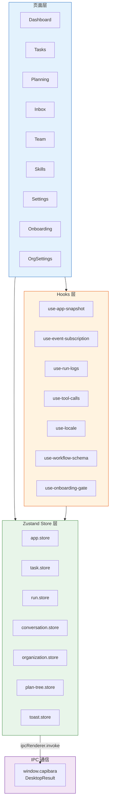

### Store 职责

| Store | 职责 |
|-------|------|
| `app.store` | 应用全局状态，快照，调度器状态 |
| `task.store` | 任务列表，任务详情，审批/拒绝操作 |
| `run.store` | Run 列表，流式输出，工具调用 |
| `conversation.store` | 对话列表，消息，路由状态 |
| `organization.store` | 组织/角色/技能数据 |
| `plan-tree.store` | 计划树数据，审批/丢弃操作 |
| `toast.store` | 通知 Toast 状态 |

### Hooks 职责

| Hook | 职责 |
|------|------|
| `use-app-snapshot` | 周期性获取工作区快照 |
| `use-event-subscription` | IPC 事件订阅分发 |
| `use-run-logs` | Run 日志流 |
| `use-tool-calls` | 工具调用时间线 |
| `use-locale` | i18n 语言切换 |
| `use-workflow-schema` | 流程模式数据 |
| `use-onboarding-gate` | 新手引导门控 |

### 页面组件映射

| 页面 | 核心组件 | 主要 Store |
|------|---------|-----------|
| Dashboard | `DashboardPage` | app, task |
| Tasks | `TasksPage`, `TaskDetailDrawer`, `TaskCreateModal` | task, run |
| Planning | `PlanningPage`, `PlanningChat`, `PlanTreeReview` | plan-tree, conversation |
| Inbox | `InboxPage` | conversation |
| Team | `TeamPage`, `RoleCard`, `RoleDrawer` | organization |
| Skills | `SkillsPage` | organization |
| Settings | `SettingsPage`, `ModelSelector`, `AgentConfigPanel` | app, organization |
| Onboarding | `OnboardingWizard`, `NamingTemplateStep`, `HealthCheckStep` | app, organization |
| DevPanel | `DevPanel` | app |

---

## 12. IPC 通信架构

### 12.1 通道命名规范

所有 IPC 通道遵循 `capibara:<domain>:<action>` 格式：

| 域 | 通道前缀 | 数量 | 关键操作 |
|----|---------|------|---------|
| Organization | `capibara:org:*` | 16 | 组织/角色/技能/模板 CRUD |
| Workflow | `capibara:task:*`, `capibara:process:*` | 13 | 任务 CRUD/转换/取消/审批/拒绝，流程模式 |
| Conversation | `capibara:conversation:*` | 10 | 列表/获取/消息/添加/解决/取消/询问/临时/规划 |
| Execution | `capibara:run:*`, `capibara:cost:*`, `capibara:log:*` | 11 | Run 列表/获取/取消，成本汇总，日志，中断计数，恢复 |
| Plan Tree | `capibara:plan-tree:*` | 8 | 按 taskId/conversationId 获取/审批/丢弃/优化 |
| System | `capibara:scheduler:*`, `capibara:setting:*`, `capibara:system:*` | 10 | 调度器暂停/恢复，设置，健康检查，对话框，快照，语言 |
| ACP | `capibara:acp:*` | 5 | 按 runId/orgId 审计工具调用/文件访问，活跃挂起 |

### 12.2 请求-响应模式

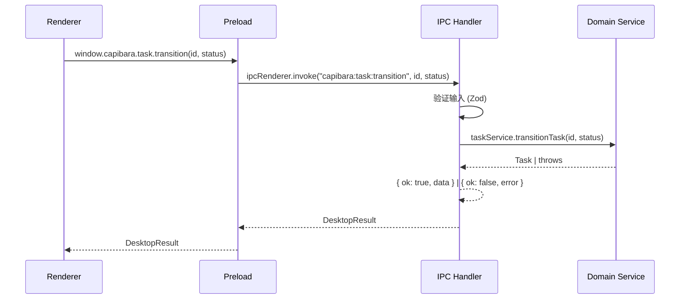

### 12.3 主进程 -> 渲染进程事件

| 事件类型 | 触发时机 |
|----------|---------|
| `snapshot:updated` | 周期性工作区状态刷新 |
| `org:changed` | 组织数据变更 |
| `task:changed`, `task:entered-approval` | 任务状态转换 |
| `run:changed`, `run:log`, `run:assistant-text`, `run:tool-call`, `run:completed`, `run:suspended`, `run:resumed` | Run 生命周期和流式输出 |
| `conversation:changed`, `conversation:response-needed` | 对话更新 |
| `plan-tree:ready`, `plan-tree:approved`, `plan-tree:discarded` | 计划树生命周期 |
| `notification` | 桌面通知触发 |

---

## 13. 事件驱动协作机制

### 13.1 事务性 Outbox 模式

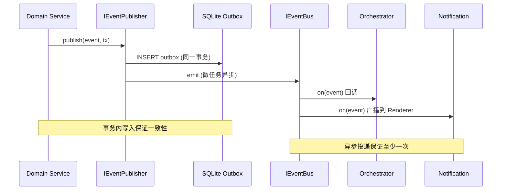

### 13.2 事件流转示例：任务状态转换

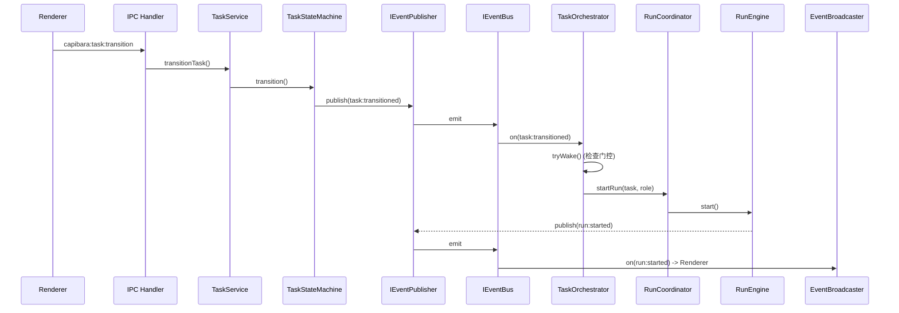

### 13.3 领域事件分类

约 30 种类型化领域事件，分为 5 个域：

| 域 | 事件示例 |
|----|---------|
| Organization | `org:created`, `role:created`, `skill:assigned` |
| Task | `task:created`, `task:transitioned`, `task:entered-approval` |
| Conversation | `conversation:created`, `conversation:needs-routing`, `conversation:response-needed` |
| Run | `run:started`, `run:completed`, `run:failed`, `run:suspended`, `run:resumed` |
| PlanTree | `plan-tree:submitted`, `plan-tree:approved`, `plan-tree:discarded` |

所有事件携带类型化负载，反序列化时通过 Zod Schema 校验。

---

## 14. 数据持久化架构

### 14.1 存储层

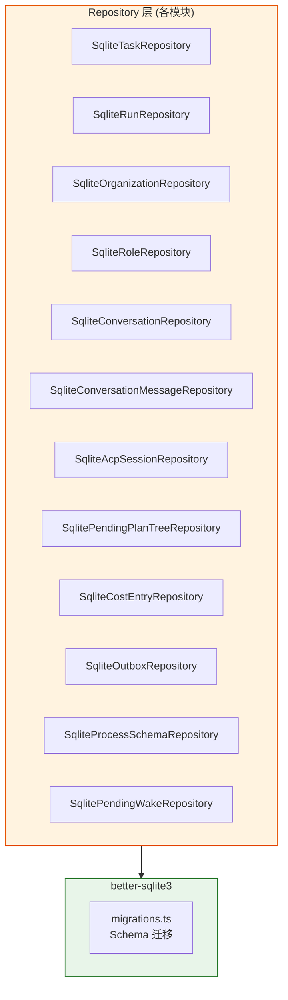

### 14.2 数据库迁移

- 所有 Schema 变更通过 `infrastructure/persistence/sqlite/migrations.ts` 管理
- 迁移前自动备份 (`migration-backup.ts`)
- 迁移在同一 SQLite 连接的事务中执行

---

## 15. 关键业务规则

### 15.1 任务生命周期

- 任务遵循由组织的 `ProcessSchema` 管理的状态机
- 仅叶任务可进入审批状态；非叶任务自动审批
- AI 角色 (`requiresHumanApproval=false`) 跳过审批
- 系统驱动转换 (`triggeredBy='system'`) 不触发重新唤醒
- 任务深度 = 父深度 + 1，最大遍历深度 10

### 15.2 调度与唤醒门控

- 每组织同时仅一个活跃 Run
- 任何任务处于审批状态时，组织暂停调度
- 唤醒门控阻止条件：调度器暂停、角色暂停、组织有活跃 Run、角色超出 `maxConsecutiveWakes`（熔断器）
- 待处理唤醒每排水周期消费一个
- 快速唤醒事件按 `taskId+roleId` 对 200ms 去抖

### 15.3 AI-to-AI 协作

- 链深度默认最大 5（可配置），超出抛出错误
- 循环询问检测防止直接和间接递归链
- `aggregationMode` 为 `all` 时需要所有询问解决；`any` 时至少一个
- ACP 会话恢复策略优先级：`supportsResume` > `supportsLoad` > `rebuild`

### 15.4 计划树

- 最大 500 节点，最大深度 10，禁止自嵌套
- 每个节点必须有 `assigneeRoleId`
- 乐观锁防止并发冲突
- 待处理反馈一次性消费
- 24 小时后过期，自动清理

### 15.5 文件访问与权限

- 三层文件访问：cwd 边界、角色 allowlist (glob)、全局 denylist
- 工具权限策略模式：permissive、restrictive、ask_user
- 危险命令 denylist 强制执行

### 15.6 配置

- 分层加载：defaults -> global config -> project config -> 环境变量
- 所有配置通过 Zod Schema 在加载时校验

---

## 16. 架构观察与风险评估

### 16.1 优势

| 维度 | 评价 |
|------|------|
| 依赖方向 | 严格 DAG，无循环依赖。Orchestrator 是唯一汇聚点 |
| 接口抽象 | Foundation 接口清晰，模块间依赖以接口为主 |
| 事件解耦 | Coordination 通过事件与 Conversation 解耦，是良好实践 |
| Outbox 模式 | 事务性 Outbox 保证事件不丢失，是核心可靠性机制 |
| Renderer 隔离 | Preload 纯透传，零业务逻辑，IPC 边界清晰 |
| 进程安全 | 所有 IPC 响应使用 `DesktopResult`，异常不跨进程边界 |
| 模块一致性 | 所有模块遵循统一的六边形架构组织模式 |

### 16.2 风险点

| 编号 | 风险 | 严重度 | 说明 | 影响 |
|------|------|--------|------|------|
| R1 | 具体类耦合 | 中 | Planning、MCP、Prompt 模块直接导入具体类（`TaskService`、`ConversationService`、`ConversationContextBuilder`）而非接口 | 替换实现困难，测试需要 mock 具体类 |
| R2 | Orchestrator 汇聚点 | 中 | Orchestrator 依赖 7+ 个模块，是系统的唯一瓶颈 | 修改任何上游模块都可能影响编排逻辑 |
| R3 | 手动 Composition Root | 低 | 15 步手动装配顺序，无框架保障 | 装配顺序错误难以诊断，新增模块需严格遵守顺序 |
| R4 | ACP 交叉装配 | 低 | ACP Executor 需要 Conversation 仓库，通过后置 setter 注入 | 延迟注入时序需要人工保证，容易遗漏 |
| R5 | Planning-Orchestrator 半解耦 | 低 | 通过 setter 注入 waker 回调连接 | 不如事件驱动方式一致，是隐性耦合 |
| R6 | Monorepo 单包 | 低 | `pnpm-workspace.yaml` 声明了 `apps/*` 和 `packages/*`，但仅 `apps/electron/` 存在 | 未来拆分时需要考虑共享代码提取 |

### 16.3 改进建议

| 编号 | 建议 | 优先级 | 对应风险 |
|------|------|--------|---------|
| S1 | 为 `TaskService`、`ConversationService`、`ConversationContextBuilder` 提取接口 | 高 | R1 |
| S2 | 考虑将 Orchestrator 拆分为更细粒度的子编排器 | 中 | R2 |
| S3 | 评估引入 tsyringe 自动装配或模块化 DI 框架 | 低 | R3 |
| S4 | 统一 Planning-Orchestrator 的通信方式为事件驱动 | 低 | R5 |

---

> 文档结束。如有疑问或需更新，请通过 `/mvt-help` 查看可用工作流技能。
