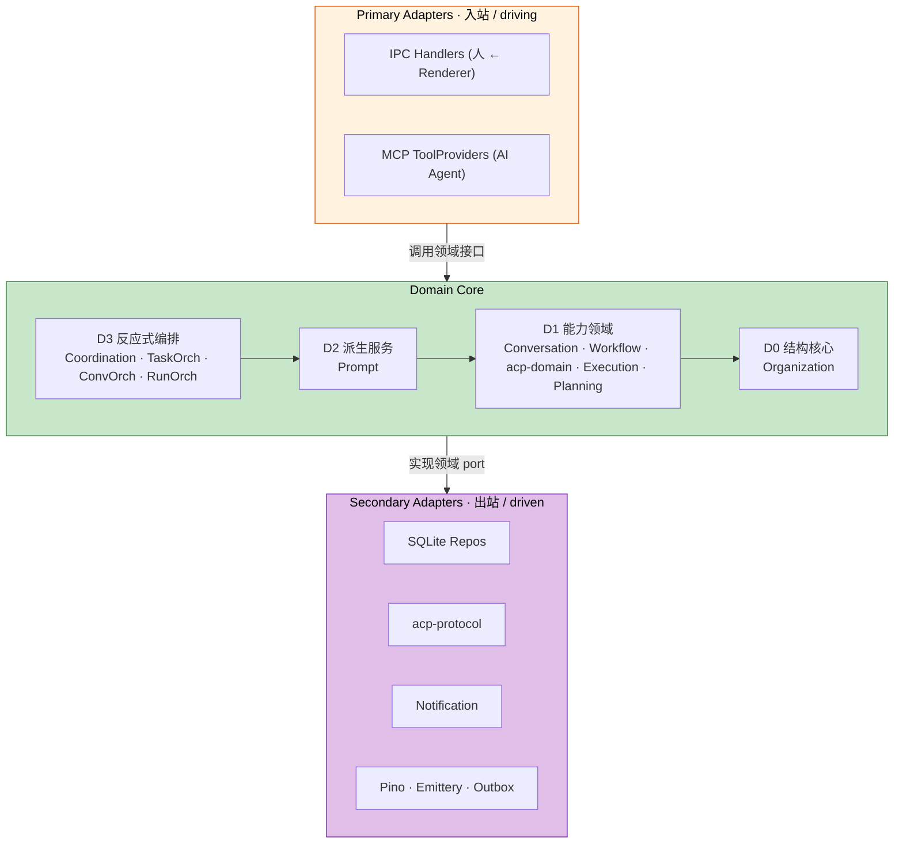
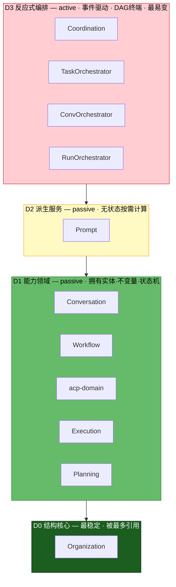
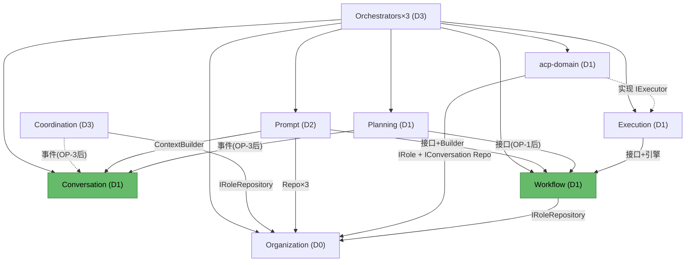
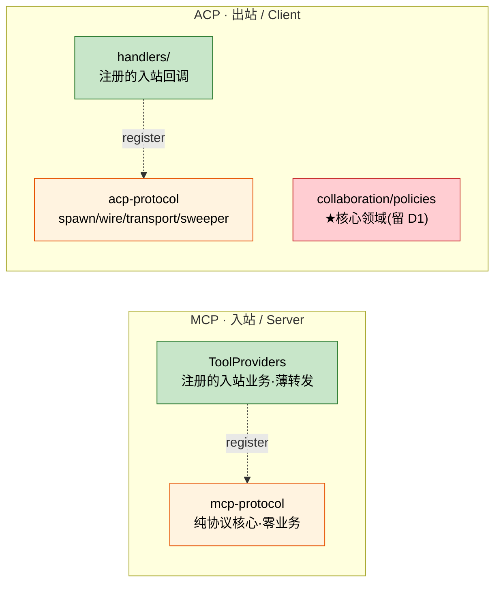
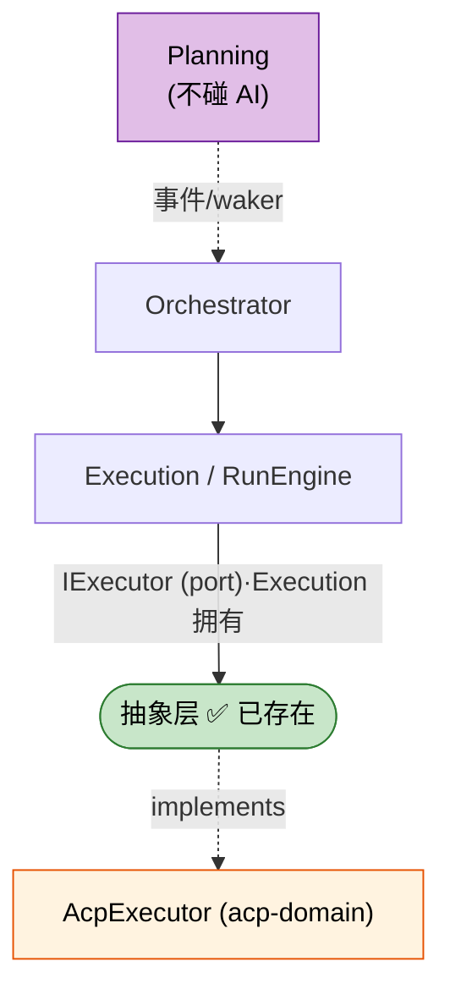
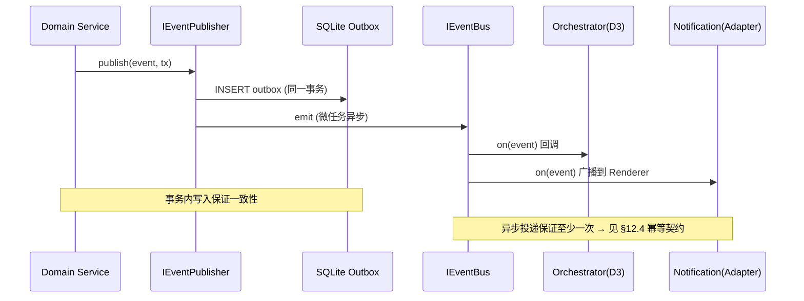
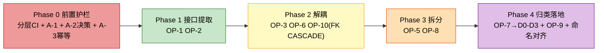

# Capibara 架构设计 —— 最终基线 v2

> 文档版本: Final 2.0
> 日期: 2026-06-02
> 基线分支: acp-refactor
> 性质: 决策已敲定的架构基线。供开发团队据此实施与讨论实现细节。
> 演进脉络: v1 设计 → 优化提案 → 评审意见 → v2 修订 → v3 探讨 → Final 1.0 → **本文档（Final 2.0，吸收独立审核 + 业务正确性评估）**
>
> **本版相对 Final 1.0 的核心变化**（详见 §0 变更摘要）：
> - 修正 1 处事实性错误（"循环 re-export"实为单向、规避环而设）
> - OP-4 标注为已完成，路线图工作量修正
> - 新增 **分层 CI 护栏**（dependency-cruiser），把 D-1 的 DAG 从"手画图"升级为机器可校验规则
> - 重新权衡 D-6（级联删除），改为 **FK CASCADE 优先**
> - 订正 D-8 改名焦点（被动的 `InquiryEscalationService` 保留 Service；active 的 `InquiryRouter` 才需归类）
> - 新增 **3 项 A 类业务正确性前置**（A-1 计划树不变量下沉、A-2 级联删除状态守卫、A-3 订阅者幂等契约）

---

## 目录

1. [变更摘要（v1→v2）](#0-变更摘要v1v2)
2. [决策定稿（8 项，已修订）](#1-决策定稿8-项已修订)
3. [架构总览](#2-架构总览)
4. [统一骨架：Hexagonal](#3-统一骨架hexagonal)
5. [Domain Core 分层（D0-D3）](#4-domain-core-分层d0-d3)
6. [模块职责总表](#5-模块职责总表)
7. [目标目录结构](#6-目标目录结构)
8. [真实依赖图与待清理项](#7-真实依赖图与待清理项)
9. [分层强制：依赖护栏（新增）](#8-分层强制依赖护栏新增)
10. [MCP 与 ACP：协议适配器](#9-mcp-与-acp协议适配器)
11. [AI 交互抽象边界](#10-ai-交互抽象边界)
12. [命名约定](#11-命名约定)
13. [事件驱动与持久化 + 幂等契约](#12-事件驱动与持久化--幂等契约新增)
14. [业务正确性前置（A 类，新增）](#13-业务正确性前置a-类新增)
15. [实施路线图](#14-实施路线图)
16. [明确不做的事](#15-明确不做的事)
17. [术语表](#16-术语表)

---

## 0. 变更摘要（v1→v2）

本版是 Final 1.0 经过**独立审核（结构维度）+ 业务正确性评估**后的修订。所有改动均有代码实证支撑（见 `architecture-final-review.md`）。

| 类别 | 编号 | Final 1.0 的问题 | v2 的处置 |
|------|------|-----------------|----------|
| 事实订正 | C-1 | §7.1 #4 把 `acp.types ↔ execution.types` 称为"循环 re-export" | 实为**单向**、且注释明说是**为规避环**而设；改为"低优先类型整洁项（当前无环）" |
| 路线图订正 | C-2 | OP-4（Orchestrator 拆 3）列为 Phase 3 待办 | 代码中**已完成**（3 个独立类已装配）；标注 ✅ 完成，移出 Phase 3 |
| **结构护栏** | C-3 | D-1 放弃"层=依赖秩"后，依赖方向只靠手画 DAG，无强制手段 | **新增 §8 dependency-cruiser CI 规则**，开工前置 |
| 决策重权衡 | C-4 | D-6 默认"级联删除事件化"，权衡天平摆错 | **定稿 FK `ON DELETE CASCADE`**（业务已确认"强制删除 + 无审计需求"，见 §1.2 / §13.2） |
| 命名订正 | C-5 | D-8 要求给被动的 `InquiryEscalationService` 去 Service | 该类**本就被动**，保留 Service 正确；改名/归类焦点改为 active 的 `InquiryRouter` |
| 措辞澄清 | C-6 | MCP 目标结构（ToolProviders/mcp-protocol）写得像现状 | 显式标注"目标态"，现状为 `handlers/*-tools.ts` 函数式注册 |
| 目录约定 | C-7 | `adapters/` 仅装 AI 入站，与"所有 Secondary 叫 infrastructure"不自洽；两个 `*-protocol` 被分到两处 | **改用"infrastructure = 一切技术/框架细节"约定**：`mcp-protocol` 与 `acp-protocol` 同归 `infrastructure/`；面向业务的 ToolProviders/IPC 仍留 primary 侧。**控制流方向（MCP 入站 / ACP 出站）仍是概念模型，不靠文件夹编码**（见 §6.1） |
| **业务正确性** | A-1 | D-4 用"500 节点/深度 10 硬不变量"证明 Planning 是领域，但**该校验在 MCP 适配器里，不在 Planning** | 把校验**下沉到 PlanningService**；D-4 论据修订（见 §13.1） |
| **业务正确性** | A-2 | D-6 事件化会撞上 `ConversationService.delete()` 的"仅终端态可删"守卫 | 与 C-4 合并：业务确认"强制删除"→ FK CASCADE 即数据库层强制级联，语义诚实（见 §13.2） |
| **业务正确性** | A-3 | 架构依赖 Outbox"至少一次"，却从未要求订阅者幂等；已存在非幂等订阅者 | **新增 §12.4 订阅者幂等契约** + 立即修 `onResponseNeeded`（见 §13.3） |
| 知情备案 | A-4 | "每组织一活跃 Run"靠单线程兜底，未声明 | §5.3 / §13.4 加注运行时依赖 |

> **开工前置（必须先于任何 OP 落地）**：C-3（分层护栏）、A-1、A-2 决策、A-3 幂等契约。其余随对应 OP 实施。

---

## 1. 决策定稿（8 项，已修订）

下表是本架构的全部已敲定决策。每项均取经过代码实证与论证的方案。**开发团队讨论聚焦于"如何实施"，而非"是否采纳"。** 若需翻案，请回到 `architecture-design-v3.md` 的 A/B 对照。

| # | 决策 | 定稿 | 一句话依据 | v2 修订 |
|---|------|------|-----------|:------:|
| **D-1** | 分层轴 | **按角色+稳定性+主被动分 D0-D3**；依赖秩交给 DAG 图**并由 CI 护栏强制** | 依赖数是结果非原则，会引发边界抖动与 `L2-F` 补丁 | ✏️ 加护栏 |
| **D-2** | MCP 定性 | **入站协议适配器**，与 IPC Handlers 同级，移出 `modules/` | MCP=AI 侧 driving adapter，耦合业务是天职 | — |
| **D-3** | ACP 拆分 | **内部一分为二**：`acp-protocol`(出站适配器) + `acp-domain`(D1) | acp-domain 依赖 `IRoleRepository`=领域铁证，不可整体下沉 | — |
| **D-4** | Planning 归类 | **D1 能力领域**（非门面） | 乐观锁/一次性反馈/24h 过期/`allowedChildren` 等领域不变量（**节点/深度上限须下沉至领域，见 A-1**） | ✏️ 论据订正 |
| **D-5** | Coordination 归类 | **D3 反应式编排**（与 orchestrator 同物种） | 0 实体/0 持久化/事件进事件出 | — |
| **D-6** | 级联删除 | **FK `ON DELETE CASCADE`（定稿）** | 业务确认"强制删除 + 无审计需求"→ 纯结构级联用外键最可靠、零时序风险；事件化会撞对话状态守卫 | ✏️ 重权衡→定稿 |
| **D-7** | AI 抽象层 | **不新增共享抽象**；`IExecutor` 已是边界 | Planning 对 AI 零引用，对称性不存在 | — |
| **D-8** | D3 命名 | **保持 `Orchestrator` 后缀**；归类焦点对准 active 的 `InquiryRouter` | `Service` 专指被动服务，改名抹掉 active 信号 | ✏️ 焦点订正 |

### 1.1 D-4 论据订正（A-1）

Final 1.0 用"500 节点/深度 10 等硬领域不变量"作为 Planning 是领域模块的论据。**代码实证：这两条上限的校验逻辑当前在 `modules/mcp/handlers/plan-tree-tools.ts`（MCP 适配器层），不在 Planning。** Planning 服务里的 `countNodes()`/`measureDepth()` 仅用于事件报数，不做拒绝。

- **结论不变**：Planning 仍是 D1 领域模块——它有乐观锁、一次性反馈、24h 过期、`allowedChildren` 等**确在领域内强制**的不变量。
- **论据与实现须修正**：节点/深度上限的校验**必须下沉到 `PlanningService`**（提交 + 审批两个入口都校验），MCP 处理器只转发。详见 §13.1。

### 1.2 D-6 定稿：FK CASCADE（C-4 / A-2，已拍板）

**两项业务前提已确认**：(1) 删任务时**强制删除**关联对话（含非终端态）；(2) **不存在**"对话删除需进领域审计 / 通知 Renderer"的需求。

→ **定稿采用方案 C：SQLite FK `ON DELETE CASCADE`**。理由：

- "强制删除非终端态对话" = 主动绕过 `ConversationService.delete()` 的"仅终端态可删"守卫。FK CASCADE **就是**数据库层的纯结构级联，语义与"强制删"完全一致、诚实。
- 零时序风险、零新事件、最少代码；不引入"至少一次"窗口，也无需为级联补幂等。

**落地**：
- `conversation` 表 `task_id` 外键加 `ON DELETE CASCADE`（迁移脚本）。
- 删除 `task.service.ts` 的 `setConversationRepository` / `convRepo` / 级联删除循环。
- `task:deleted` 事件**不新增**（§7 依赖图中相应红线移除）。

> Final 1.0 默认事件化是错的：它会撞上 `ConversationService.delete()` 的"仅终端态可删"守卫，对非终端态对话级联静默失败 → 孤儿对话（§13.2）。v2 已据确认的业务前提定稿为 FK CASCADE。

### 1.3 D-8 命名焦点订正（C-5）

- `InquiryEscalationService` **本就被动**（靠 `scanAndEscalate()` 被周期调用，不订阅事件）→ **保留 `Service` 后缀正确，不改名**。
- 真正违反契约的是 **`InquiryRouter`**：它订阅 `conversation:needs-routing`、是 active D3 单元，命名未体现 → 建议改 `InquiryOrchestrator`，或保留 `Router` 但在目录/文档显式标注归 D3 主动单元。

---

## 2. 架构总览

### 2.1 全景



### 2.2 设计原则

| 原则 | 一句话 | 体现 |
|------|--------|------|
| P1 依赖倒置 | 依赖接口不依赖实现 | Foundation 接口 + 单一 Composition Root |
| P2 AI≠infra | AI 协作规则是核心领域 | acp-domain 留 D1，不下沉 |
| P3 协议在边缘 | 协议机制是技术细节，不入领域 | mcp-protocol / acp-protocol 同归 `infrastructure/`（C-7） |
| P4 层=角色 | 层解释"为什么在这"，依赖秩由 **CI 护栏**强制 | D0-D3 + DAG 图 + dependency-cruiser（§8） |
| P5 事件优先 | 跨模块写优先事件化，**但订阅者必须幂等** | 路由事件化；§12.4 幂等契约 |
| **P6 不变量在领域** | 领域硬不变量在领域服务强制，不在适配器 | 计划树节点/深度下沉 Planning（A-1） |

---

## 3. 统一骨架：Hexagonal

主进程是一个六边形：外层协议适配器（入站/出站），内层领域与编排。**先有骨架，各模块归属由此推导**——消解了 v1 中"MCP/ACP/Notification 三套标准"的不一致。

> **概念层（Hexagonal 角色） vs 物理层（文件夹）**：Hexagonal 的 Primary/Secondary 是**概念角色**（按控制流方向）；本设计的**文件夹**则按"技术 vs 业务"分组（C-7，§6.1）。下表给出概念角色——它**不等于**文件夹位置（例如 `mcp-protocol` 概念上是 Primary 机制，物理上落在 `infrastructure/`）。

| 概念角色 | 方向 | 职责 | 成员（含物理位置） |
|----|------|------|------|
| **Primary Adapters** | 入站 driving | 外部请求 → 领域调用 | IPC Handlers（`ipc-handlers/`）, MCP ToolProviders（`mcp/providers/`）, mcp-protocol 机制（物理在 `infrastructure/`） |
| **Domain Core** | — | 全部业务规则与编排（D0-D3） | 11 个领域/编排单元（`modules/`） |
| **Secondary Adapters** | 出站 driven | 实现领域定义的 port | SQLite, acp-protocol, Notification, 可观测性（均在 `infrastructure/`） |

**对称性核对（概念角色，全部归位）：**

| 适配器 | 方向 | 概念归类 | 物理位置 |
|--------|------|------|---------|
| IPC Handlers | 入站 | Primary ✅ | `ipc-handlers/` |
| MCP ToolProviders | 入站 | Primary ✅（D-2） | `mcp/providers/` |
| MCP 协议核心 | 入站机制 | Primary ✅ | `infrastructure/mcp-protocol/`（C-7） |
| Notification | 出站 | Secondary ✅ | `infrastructure/notification/` |
| acp-protocol | 出站 | Secondary ✅（D-3） | `infrastructure/acp-protocol/` |
| SQLite / Pino / Emittery | 出站 | Secondary ✅ | `infrastructure/` |

---

## 4. Domain Core 分层（D0-D3）

### 4.1 模型



| 层 | 分类标准 | 主/被动 | 成员 |
|----|---------|:------:|------|
| **D0** 结构核心 | 最稳定，组织/角色骨架，被最多引用 | 被查询 | Organization |
| **D1** 能力领域 | 拥有实体+不变量+状态机，可独立存在 | 被查询 | Conversation, Workflow, acp-domain, Execution, Planning |
| **D2** 派生服务 | 无实体无持久化，读多域算结果 | 被查询 | Prompt |
| **D3** 反应式编排 | 事件驱动主动单元，DAG 终端，最易变 | 主动订阅 | Coordination, TaskOrch, ConvOrch, RunOrch |

### 4.2 归层判据（代码实证）

| 模块 | 文件数 | 有实体 | 有持久化 | 工作方式 | 归层 |
|------|:-----:|:-----:|:-------:|---------|:----:|
| Organization | 12 | 角色/技能/组织 | 3 repo | 被查询 | D0 |
| Workflow | 10 | Task | 2 repo | 被查询 | D1 |
| Execution | 10 | Run/Cost | 2 repo | 被查询 | D1 |
| acp-domain | 26 中领域部分 | Session | 4 repo | 被查询 | D1 |
| Conversation | 9 | Conv/Message | 3 repo | 被查询 | D1 |
| Planning | 4（单文件 528 行） | PendingPlanTree | 1 repo | 被查询 | D1 |
| Prompt | 6 | 无 | 无 | 被调用算结果 | D2 |
| Coordination | 3 | 无 | 无 | 订阅→算→发事件 | D3 |
| Orchestrator×3 | 9 | 无 | 1(wake) | 订阅→门控→调度 | D3 |

### 4.3 分层的语义约定（D-1 定稿）

| 关注点 | 由谁表达 |
|--------|---------|
| 模块种类/角色（"为什么在这层"） | D0-D3 四层 |
| 实际依赖边（含同层依赖，如 Execution→Workflow） | §7 依赖 DAG 图 + **§8 CI 护栏（强制真相）** |

> 层 = **角色标签**，不编码严格依赖秩。允许同层依赖。依赖关系的真相是 §7 的 DAG 图，并**由 §8 的 dependency-cruiser 规则强制**——这是 Final 1.0 缺失、v2 补齐的关键护栏。

---

## 5. 模块职责总表

### 5.1 Primary Adapters（入站）

| 模块 | 核心职责 | 关键依赖 |
|------|---------|---------|
| IPC Handlers | Renderer IPC → 领域调用；Zod 校验；返回 `DesktopResult` | 领域服务接口 |
| MCP ToolProviders | 领域操作暴露为 MCP 工具；**薄转发，不含领域校验**（A-1） | `ITaskService` / `IConversationCommandService` / `IRoleQueryService` / `IPlanningService` |

> 注：`mcp/providers/*.provider.ts`（业务侧）与 `infrastructure/mcp-protocol/`（机制侧）为 **OP-5 目标态**（目录约定见 §6.1 / C-7）。现状为 `modules/mcp/handlers/*-tools.ts` + `register*Tools()` 函数式注册，尚未拆分（C-6）。

### 5.2 D0 / D1 / D2

| 层 | 模块 | 核心职责 | 关键不变量 |
|----|------|---------|-----------|
| D0 | Organization | 组织/角色/技能 CRUD，层级遍历，模板化创建 | Skill 命令全局唯一；仅 custom 可删；`autoStartOnCreate` 驱动首次调度 |
| D1 | Conversation | 多方对话生命周期、消息持久化、上下文构建 | 类型 inquiry/planning/adhoc/plan_review；**仅终端态可删（见 A-2）** |
| D1 | Workflow | 任务生命周期、流程模式、状态机、行为引擎 | 仅叶任务进审批；AI 角色跳过；深度=父+1，最大 10（**创建时应校验，见 B-3**） |
| D1 | acp-domain | AI-to-AI 协作语义、会话挂起/恢复、文件与工具权限策略 | 链深 max 5；循环检测；恢复 resume>load>rebuild；文件三层防护 |
| D1 | Execution | Run 生命周期、成本、日志；经 `IExecutor` 驱动 AI | 失败退避重试≤3；孤儿 Run interrupted；挂起不回退任务 |
| D1 | Planning | 计划树提交/审批/丢弃/优化/过期 | **500 节点/深度 10/禁自嵌套（须在 PlanningService 强制，见 A-1）**；乐观锁；反馈一次性；24h 过期 |
| D2 | Prompt | 按场景选策略构建提示；装配 RunContext | 无状态；被 Orchestrator 按需调用；9 种执行场景 |

### 5.3 D3 反应式编排

| 模块 | 核心职责 | 性质 |
|------|---------|------|
| Coordination | 订阅 `needs-routing`，沿角色祖先树路由询问；超时升级 | active；D-6/OP-3 后无具体类依赖 |
| TaskOrchestrator | 任务事件驱动协调，准入判定与唤醒（**前门**） | active；每组织一活跃 Run；唤醒门控 |
| ConversationOrchestrator | 对话生命周期、ACP 会话恢复、人类兜底 | active；**`onResponseNeeded` 须幂等，见 A-3** |
| RunOrchestrator | Run 结束排水链、重试调度（**后门**） | active；待处理唤醒每周期消费一个 |

> **并发不变量备案（A-4）**："每组织一活跃 Run"由 `WakeGateValidator.validate()`（查 `findActiveByOrgId`）+ `RunEngine` 内存 `activeOrgs` Set 二次防护实现；查与建之间**非原子**，当前由 Electron 主进程**单线程串行**兜底。若未来引入 worker/多进程调度，须改为 DB 层 `UNIQUE(org_id) WHERE status='running'` 约束。属知情备案，非阻断。

### 5.4 Secondary Adapters（出站）

| 模块 | 核心职责 | 实现 Port |
|------|---------|----------|
| SQLite Repositories | 各实体 better-sqlite3 持久化；迁移管理；**conversation.task_id 外键 ON DELETE CASCADE（D-6 方案 C）** | `I*Repository` |
| acp-protocol | 子进程 spawn、wire protocol、session 传输、sweeper | acp-domain 内部 port |
| Notification | 领域事件→IPC 映射；Electron 桌面通知 | `INotificationService` / `IEventBroadcaster` |
| Pino / Emittery / Outbox | 日志、内存事件总线、事务性 Outbox | `ILogger` / `IEventBus` / `IEventPublisher` |

### 5.5 共享调度组件（Orchestrator 拆分后保留 — OP-4 ✅ 已完成）

| 组件 | 核心职责 |
|------|---------|
| WakeGateValidator | 并发门控：每组织一个活跃 Run，校验唤醒阻止条件 |
| TaskScheduler | 查找下一个可调度任务 |
| RetryScheduler | 指数退避重试调度 |
| RunCoordinator | 把编排意图翻译为 RunEngine 调用 |
| IPendingWakeRepository | 待处理唤醒持久化（3 个编排器共享） |

---

## 6. 目标目录结构

> 体现 D-2/D-3/D-5/D-6 的物理落地。`★` = 相对当前结构的变动。

### 6.1 目录约定（C-7：infrastructure = 一切技术/框架细节）

本设计的顶层文件夹按**"技术细节 vs 业务"**而非**"入站 vs 出站"**分组：

| 顶层文件夹 | 含义 | 成员 |
|-----------|------|------|
| `ipc-handlers/` + `mcp/` | **面向业务的入站适配器**（Primary）——含领域语义、依赖领域接口 | IPC Handlers（人）、MCP ToolProviders（AI） |
| `modules/` | **Domain Core**（D0-D3） | 11 个领域/编排单元 |
| `infrastructure/` | **一切技术/框架机制**——纯协议、持久化、可观测性、通知，**不分进出** | mcp-protocol, acp-protocol, sqlite, observability, notification |
| `foundation/` + `bootstrap/` | 接口/事件/DI + Composition Root | — |

**两条关键约定（避免误读）：**

1. **`mcp-protocol` 与 `acp-protocol` 同归 `infrastructure/`**——它们都是"纯协议机制、零业务"的技术细节，按本约定理应团聚。这正是本次相对 Final 1.0 的 C-7 调整。
2. **但 MCP 仍一分为二**：纯协议核心（`mcp-protocol`）是技术细节 → 进 `infrastructure/`；而 **ToolProviders 依赖 `ITaskService` 等领域接口、是面向业务的入站适配器 → 留在 primary 侧的 `mcp/`**，**不进 infrastructure**。换约定只挪动了协议核心的位置，并未消除这道拆分。

> **方向语义不丢失**：MCP 是入站 Server、ACP 是出站 Client——这仍是理解系统的**概念模型**（§9），只是不再用文件夹名编码。依赖方向的**强制**真相在 §8 的 CI 护栏，与文件夹分组方式无关。

### 6.2 结构

```
apps/electron/src/core/
├── ipc-handlers/                      # 入站适配器（人）— Primary
│
├── mcp/                               # ★ 入站适配器（AI）— Primary · OP-5 目标态
│   └── providers/                     # ★ ToolProviders（薄转发，零领域校验 — A-1）
│       ├── task-tool.provider.ts      #    依赖 ITaskService 等领域接口 → 留 primary 侧
│       ├── conversation-tool.provider.ts
│       ├── context-tool.provider.ts
│       └── plan-tree-tool.provider.ts #    节点/深度校验已下沉 Planning（A-1），此处仅转发
│
├── modules/                           # Domain Core
│   ├── organization/                  # D0
│   ├── conversation/                  # D1
│   ├── workflow/                      # D1（★ 移除 Conversation setter，见 D-6 方案 C）
│   ├── execution/                     # D1
│   ├── planning/                      # D1（★ 从 L2-F 归正；★ 节点/深度校验下沉至此 — A-1）
│   ├── acp/                           # D1 acp-domain（★ 仅保留领域部分）
│   │   ├── collaboration/
│   │   ├── policies/
│   │   ├── interfaces/
│   │   └── persistence/
│   ├── prompt/                        # D2
│   ├── coordination/                  # D3（★ 归类调整；InquiryRouter 命名待对齐 — D-8）
│   ├── orchestrator/                  # OP-4 ✅ 已完成（3 独立类 + shared 已就位）
│   │   ├── orchestrators/             # task / conversation / run .orchestrator.ts
│   │   ├── wake-gate.validator.ts
│   │   ├── *.scheduler.ts / run.coordinator.ts
│   │   └── interfaces/
│   └── ...
│
├── infrastructure/                    # ★ 一切技术/框架机制（不分进出 — C-7）
│   ├── mcp-protocol/                  # ★ MCP 纯协议核心（D-2）— 入站 Server 机制
│   │   ├── mcp-server.builder.ts
│   │   ├── mcp-http-transport.ts
│   │   └── interfaces/i-tool-registry.ts
│   ├── acp-protocol/                  # ★ ACP 协议机制（D-3）— 出站 Client 机制
│   │   ├── acp-agent.spawner.ts
│   │   ├── acp-session.transport.ts
│   │   └── acp-session.sweeper.ts
│   ├── persistence/sqlite/            # ★ conversation FK ON DELETE CASCADE（D-6）
│   ├── observability/                 # Pino / Emittery / Outbox
│   └── notification/                  # ★ OP-6
│       ├── event-broadcaster.ts
│       └── notification.service.ts
│
├── foundation/                        # 接口 + 事件 + DI Tokens
└── bootstrap/                         # Composition Root
```

> `mcp-protocol`（机制）与 `mcp/providers`（业务）虽分两处，但物理上是同一条 MCP 链路——前者是"MCP server 怎么收发"，后者是"收到后调哪个领域服务"。二者的边界即 `i-tool-registry.ts`（协议核心暴露的注册口，ToolProviders 向它注册）。

---

## 7. 真实依赖图与待清理项



> 注：Final 1.0 图中的 `WF -.->|task:deleted 事件| CONV` 红线已移除——D-6 改为 FK CASCADE（数据库层），不再是模块间事件边。

### 7.1 待清理项与处置（已订正）

| # | 问题 | 处置 | 关联 |
|---|------|------|------|
| 1 | Workflow→Conversation 隐藏 setter（级联删除） | **FK ON DELETE CASCADE**（D-6 方案 C），删除 setter/convRepo/级联循环 | D-6 / OP-10 |
| 2 | Planning/MCP/Coordination 导入具体类（约 5 个去重类，11 处） | 接口提取 | OP-1 / OP-2 |
| 3 | Coordination→Conversation 具体类写回 | 事件化 `conversation:route-resolved`（**订阅者须幂等**） | OP-3 |
| 4 | ~~acp.types ↔ execution.types 循环 re-export~~ | **订正（C-1）：当前为单向、且为规避环而设，无环可破**。可选低优先：将 `LifecycleIntent` 等共享类型提取到 `foundation/types/`（注意当前并无循环） | Phase 2 低优先 |
| 5 | **计划树节点/深度校验在 MCP 适配器（A-1）** | 下沉到 `PlanningService`（提交+审批两入口） | **开工前置 / §13.1** |

---

## 8. 分层强制：依赖护栏（新增）

> 这是 Final 1.0 最大的缺口：D-1 把"层"退化为角色标签后，依赖方向的唯一真相是一张**手画的 mermaid DAG**——图会过时，下一个 PR 引入反向边时没有任何机制报错。v2 用 `dependency-cruiser` 把 §7 的 DAG 落成 **CI 可校验规则**，作为所有 OP 的安全网。**此项须在任何 OP 动工前落地。**

### 8.1 规则（`.dependency-cruiser.cjs`）

```js
// apps/electron/.dependency-cruiser.cjs
const C = 'apps/electron/src/core';
module.exports = {
  forbidden: [
    // 1. 任何适配器都不被 Domain Core 反向 import（合并 C-7 后，进/出站不再分文件夹，
    //    一条规则即覆盖：领域核心只依赖 foundation 端口，不得 import infrastructure 或入站适配器）
    {
      name: 'no-core-to-adapters',
      severity: 'error',
      comment: 'Domain Core 只能依赖 foundation 端口，不得 import infrastructure / mcp / ipc-handlers',
      from: { path: `^${C}/modules/` },
      to:   { path: `^${C}/(infrastructure|mcp|ipc-handlers)/` },
    },
    // 2. D0（Organization）保持叶子：不得 import 其它领域模块
    {
      name: 'd0-must-stay-leaf',
      severity: 'error',
      from: { path: `^${C}/modules/organization/` },
      to:   { path: `^${C}/modules/(?!organization)[^/]+/`, pathNot: `^${C}/foundation/` },
    },
    // 3. D1 能力领域不得依赖 D3 编排（禁止向上反向边）
    {
      name: 'no-upward-d1-to-d3',
      severity: 'error',
      from: { path: `^${C}/modules/(conversation|workflow|execution|acp|planning)/` },
      to:   { path: `^${C}/modules/(coordination|orchestrator)/` },
    },
    // 4. 跨模块禁止 import 具体 service/engine 实现类（强制走 foundation 接口）— 守住 OP-1/OP-2
    {
      name: 'no-cross-module-concrete',
      severity: 'error',
      comment: '跨模块只能依赖 interfaces/，不得 import 他模块的 services/ 或 engines/ 具体类',
      from: { path: `^${C}/modules/([^/]+)/`, },
      to:   {
        path: `^${C}/modules/([^/]+)/(services|engines)/`,
        // 同模块内部允许；跨模块（捕获组不同）禁止
        pathNot: '$1',
      },
    },
  ],
  options: {
    tsConfig: { fileName: 'apps/electron/tsconfig.json' },
    doNotFollow: { path: 'node_modules' },
  },
};
```

> 规则 4 的"同模块允许、跨模块禁止"在 dependency-cruiser 中用捕获组回引实现；若该写法在本仓版本下不稳定，退化为对每个模块显式列白名单边（见 8.2）。
>
> 注（C-7）：合并约定后，"领域核心不许 import 任何适配器"由**单条** `no-core-to-adapters` 覆盖——无论适配器在 `infrastructure/`（出站机制）还是 `mcp/`（入站业务）。进/出站方向不再产生不同的 lint 规则，规则数从 Final 1.0 草案的 5 条减到 4 条。

### 8.2 D 层之间允许的边（白名单）

护栏的正向真相——只有下表的边被允许，其余一律红线：

| from | 允许 → to | 依据 |
|------|-----------|------|
| D1 Workflow | D0 Organization（`IRoleRepository`） | §7 |
| D1 acp-domain | D0 Organization；D1 Execution（实现 `IExecutor`） | §7 |
| D1 Execution | D1 Workflow（接口+引擎） | §7 |
| D1 Planning | D1 Workflow（接口）；Conversation（仅事件） | §7 |
| D2 Prompt | D1 Workflow / Conversation；D0 Organization | §7 |
| D3 Coordination | D0 Organization；Conversation（仅事件） | §7 |
| D3 Orchestrator×3 | D0/D1/D2 全部（编排是 DAG 终端） | §7 |

### 8.3 CI 接入与验收

```bash
# package.json scripts
#   "arch:check": "depcruise apps/electron/src/core --config apps/electron/.dependency-cruiser.cjs"
npx depcruise apps/electron/src/core --config apps/electron/.dependency-cruiser.cjs
# 退出码非 0 即阻断 CI
```

§14.3 验收要点新增："`arch:check` 通过"为每个 OP PR 的合并门槛。这取代 Final 1.0 仅有的一条 `grep` 检查。

---

## 9. MCP 与 ACP：协议适配器

> **概念模型 vs 物理位置（C-7）**：本节描述的"MCP 入站 / ACP 出站"是**控制流方向的概念模型**，用于理解系统；它**不再**由文件夹编码。物理上，两者的协议核心都在 `infrastructure/`（§6.1）。方向语义在这里讲清，依赖约束由 §8 护栏强制——两者解耦。

### 9.1 对称但反向（D-2 + D-3）



| | 角色 | 方向 | 协议核心 | 注册的业务 | 类比 |
|---|------|------|---------|-----------|------|
| MCP | Server（AI 来调） | 入站 | `mcp-protocol` | ToolProviders | IPC 机制 + Handlers |
| ACP | Client（驱动子进程） | 出站 | `acp-protocol` | `handlers/` | HTTP 客户端 + 回调 |

> 二者只在"边缘协议适配器"这一抽象层对称，方向相反——**不共用基类**。
> **A-1 提醒**：OP-5 把 MCP 拆成"纯协议核心 + 薄 ToolProviders"时，`plan-tree-tools.ts` 里的节点/深度校验**不能留在 ToolProvider**——必须先按 §13.1 下沉到 Planning，否则拆分会把领域校验留在适配器或丢失。

### 9.2 ACP 内部分层（D-3）

| ACP 子部分 | 性质 | 归属 |
|-----------|------|------|
| `client/`（spawn/wire/transport/sweeper） | 出站机制 | `infrastructure/acp-protocol/`（Secondary） |
| `collaboration/`（链深/挂起/聚合） | 核心领域 | `modules/acp/`（D1） |
| `policies/`（文件/工具权限，依赖角色） | 核心领域 | `modules/acp/`（D1） |
| session 生命周期状态机 | 领域语义 | `modules/acp/`（D1） |

> **B 类缺陷提醒（随 OP-8 搬动时修）**：`acp-session.manager.ts:176-208` 的 `resume()` 调 `resumeSession()`/`loadSession()` **无 try-catch 回退到 rebuild**，协议层一次抖动即令挂起会话永久卡死——与"resume>load>rebuild 优雅降级"宣称不符（降级只在创建时选策略，运行时失败不降级）。详见 §13.5。

---

## 10. AI 交互抽象边界

### 10.1 抽象层已存在：IExecutor（D-7 定稿）

| 模块 | ACP/AI 引用 | 如何触达 AI |
|------|:-----------:|------------|
| Execution | 仅经 `IExecutor` | `executor.spawn(...)`，由 `AcpExecutor` 实现 |
| Planning | **0 引用** | **完全不触达 AI**（经事件让 Orchestrator 调度） |



**结论**：不新增共享 AI 抽象。换 AI 后端只需新写 `IExecutor` 实现，Execution 不改一行。

### 10.2 一个可选改进（非必须）

| # | 观察 | 处置 |
|---|------|------|
| 1 | `ExecutorInput/Output` 泄漏 `sessionId`/`acpSessionId` 等 ACP 概念 | 待定：触发条件=出现第二种非 ACP 后端，否则 YAGNI |
| 2 | execution.types ← acp.types **单向** re-export `LifecycleIntent` | 低优先：可将共享类型提取到 `foundation/types/`（**注：当前为单向、规避环，并无循环 — C-1**） |

---

## 11. 命名约定

### 11.1 后缀即角色契约（D-8 定稿）

| 后缀 | 角色 | 主/被动 | 所在层 | 示例 |
|------|------|:------:|-------|------|
| `Service` | 领域服务 | 被动 | D0/D1 | TaskService, ConversationService, PlanningService, **InquiryEscalationService（被动周期任务，保留正确）** |
| `Engine` | 有状态领域规则 | 被动 | D1 | TaskStateMachine, ProcessEngine, BehaviorEngine |
| `Builder` | 装配/构建 | 被动 | D2 | PromptBuilder, ConversationContextBuilder |
| `Coordinator` | 编排意图→执行 | 被动 | D3(共享) | RunCoordinator |
| `Orchestrator` | 订阅事件自驱 | **主动** | **D3** | TaskOrchestrator, RunOrchestrator, ConvOrchestrator |

**约定（强制）：**
- D3 主动编排单元一律 `Orchestrator` 后缀；**不可用 `Service`**（会抹掉 active 信号、误导"可直接调它"）。
- **命名对齐焦点订正（C-5）**：`InquiryEscalationService` 为**被动**周期任务（`scanAndEscalate()` 被周期调用，不订阅事件）→ **保留 `Service` 后缀正确，不改名**。真正与契约冲突的是 **`InquiryRouter`**——它订阅 `conversation:needs-routing`、是 active D3，命名未体现 → 建议改 `InquiryOrchestrator`，或保留 `Router` 但在目录/文档显式标注归 D3 主动单元（随 OP-9）。

### 11.2 TaskOrchestrator vs RunOrchestrator（前门/后门）

| 维度 | TaskOrchestrator | RunOrchestrator |
|------|-----------------|-----------------|
| 订阅事件 | `task:*` + `plan-tree:approved` | `run:failed/succeeded/cancelled/suspended` |
| 阶段 | Run **之前**（准入） | Run **之后**（接续） |
| 核心方法 | `scheduleNext`/`tryWake`（去抖+门控+入队） | `onRunEnded`（重试+排水+触发下一轮） |
| 失败处理 | 不管 | `run:failed` → RetryScheduler |
| 队列 | 门控不过 → **写入** pending_wakes | Run 结束 → **排出** pending_wakes（每次一个） |
| 依赖方向 | 被持有 | 持有 TaskOrchestrator（单向回调 scheduleNext） |

---

## 12. 事件驱动与持久化 + 幂等契约（新增）

### 12.1 事务性 Outbox



### 12.2 Foundation 接口与实现

| Foundation 接口 | Infrastructure 实现 |
|----------------|-------------------|
| `IEventBus` | `EmitteryEventBus` |
| `IEventPublisher` | `OutboxEventPublisher` |
| `ILogger` | `PinoLogger` |
| `ISqliteConnection` | `SqliteConnection` |
| `IOutboxRepository` | `SqliteOutboxRepository` |

### 12.3 领域事件（约 30 种，5 域）

| 域 | 事件示例 |
|----|---------|
| Organization | `org:created`, `role:created`, `skill:assigned` |
| Task | `task:created`, `task:status-changed`, `task:entered-approval`（`task:deleted` 改为 FK CASCADE 后**不再需要**，见 D-6） |
| Conversation | `conversation:created`, `conversation:needs-routing`, **`conversation:route-resolved`（OP-3 新增）** |
| Run | `run:started`, `run:succeeded`, `run:failed`, `run:suspended`, `run:resumed` |
| PlanTree | `plan-tree:submitted`, `plan-tree:approved`, `plan-tree:discarded` |

### 12.4 订阅者幂等契约（新增 — A-3）

> **架构原则**：Outbox 保证**至少一次**投递（崩溃恢复时同一事件可能重投）。其唯一安全前提是——**所有 `eventBus.on(...)` 处理器必须对重复投递安全（幂等）**。这是"至少一次"的对偶义务，Final 1.0 全文未认领，v2 将其固化为架构约束。

**强制要求：**

1. 每个事件订阅者在实现/评审时必须声明并满足幂等性。标准手段二选一：
   - **(a) 幂等键 + 已处理集**：事件携带 `eventId`，订阅侧记录已处理 ID，重复即跳过。
   - **(b) 写操作"存在即跳过"语义**：用唯一约束 + upsert / `INSERT OR IGNORE`，使重复写入无副作用。
2. 典型反例（**必须修，见 §13.3**）：`ConversationOrchestrator.onResponseNeeded()` 在 gate 阻塞时**无条件 `pendingWakeRepo.create()`**，无去重键。`conversation:response-needed` 一旦重投，就插入两条相同 pending_wake → 重复唤醒 → 重复 Run、重复消息、Token 双计。
3. **code review checklist 强制项**：任何新增 `eventBus.on(...)` 必须在 PR 描述中说明"重投时如何保持幂等"。
4. **验收**（§14.3）：新增"幂等性 review"门槛。

---

## 13. 业务正确性前置（A 类，新增）

> 本章是 Final 1.0 完全缺失、由业务正确性评估补入的内容。**A-1/A-2 决策/A-3 三项须在对应 OP 动工前处理**——它们影响"能否照基线施工"，与 §8 分层护栏同级。B 类（§13.5）随对应 OP 搬动时顺带修。

### 13.1 A-1：计划树节点/深度不变量下沉至 Planning【开工前置】

**问题**：`MAX_TREE_NODES = 500`、`MAX_TREE_DEPTH = 10` 及其校验逻辑在 `modules/mcp/handlers/plan-tree-tools.ts:7,8,104-118`（MCP 适配器层）；`PlanningService` 的 `countNodes()`/`measureDepth()` 仅用于事件报数，不拒绝。后果：任何不经 MCP 的路径（IPC、`approvePending`、测试、未来其它入站适配器）都绕过这两条上限，且与 D-4 论据、OP-5 拆分相撞。

**修法**：
- 把节点数/深度上限**校验**从 `plan-tree-tools.ts` 下沉到 `PlanningService`，在**提交（submit）与审批（approvePending）两个入口**都强制；MCP 处理器只做转发。
- MCP `plan-tree-tools.ts` 删除常量与校验，改为调用 `PlanningService`（领域抛出校验错误 → 适配器转成工具错误返回）。

**验收**：
```bash
# 校验逻辑应出现在 Planning，而非 MCP handlers
grep -rn "MAX_TREE_NODES\|MAX_TREE_DEPTH\|measureDepth" apps/electron/src/core/modules/planning/
# MCP handler 不应再持有上限常量
grep -n "MAX_TREE_NODES\|MAX_TREE_DEPTH" apps/electron/src/core/modules/mcp/handlers/plan-tree-tools.ts
# 期望：第二条无输出（或仅剩对 PlanningService 错误的转发）
```

### 13.2 A-2：级联删除与对话状态守卫【已定稿：FK CASCADE】

**问题**：`conversation.service.ts:292-302` 的 `delete()` 有业务守卫——**仅终端态（resolved/cancelled/completed/timed_out/escalated）可删**。当前隐藏 setter 走 `convRepo.delete()`（绕过守卫），能删任意状态对话。若按 Final 1.0 把 D-6 事件化改走 `ConversationService.delete()`，**非终端态对话会抛 `ConversationStateError` → 级联静默失败 → 孤儿对话**（正是 D-6 想消灭的问题）。

**业务前提（已确认）**：删任务时，**非终端态的关联对话也强制删除**；且**不存在**"对话删除需进领域审计/通知 Renderer"的需求。

**定稿**：采用 **FK `ON DELETE CASCADE`**。"强制删除非终端态对话"本质就是主动绕过那条终端态守卫——FK CASCADE 正是数据库层的纯结构级联，语义与业务意图一致，且零异步窗口、最少代码、无需为级联补幂等。删除 `task.service.ts` 的 `setConversationRepository`/`convRepo`/级联循环。

> 备注：FK CASCADE 绕过 `ConversationService.delete()` 是**有意为之**且语义诚实的——它表达"任务是对话的拥有者，任务消失则对话随之消失"，与对话**自身**生命周期的终端态守卫是两条独立规则（后者管"能否单独删一个对话"，前者管"拥有者级联")。

**验收（方案 C）**：
```bash
# 迁移后 task.service 不应再持有 convRepo
grep -n "convRepo\|ConversationRepository" apps/electron/src/core/modules/workflow/services/task.service.ts
# 期望无输出
# 迁移脚本应含 conversation.task_id 的 ON DELETE CASCADE
grep -rn "ON DELETE CASCADE" apps/electron/src/core/infrastructure/persistence/sqlite/
```

### 13.3 A-3：修复非幂等订阅者 + 落地幂等契约【开工前置】

**问题**：`conversation.orchestrator.ts:54-83` 的 `onResponseNeeded()` 在 gate 阻塞时无去重 `pendingWakeRepo.create()`。事件重投 → 重复 pending_wake → 重复唤醒。

**修法（最小）**：
- 给 `pending_wakes` 加唯一约束 `UNIQUE(org_id, role_id, task_id, conversation_id, reason)`（NULL 用哨兵值或部分索引处理），插入改 `INSERT OR IGNORE` / upsert。
- 同时落地 §12.4 的幂等契约为团队规范。

**验收**：
```bash
grep -rn "UNIQUE\|INSERT OR IGNORE\|onConflict" apps/electron/src/core/infrastructure/persistence/sqlite/ | grep -i wake
# 期望：pending_wakes 有唯一约束 + 冲突忽略
```

> 公允备案：`onResolved()` 的 ACP 恢复路径**碰巧幂等**（靠 `findSuspensionByInquiry()` + 状态检查挡住重放），但这是"意外正确"而非设计保证；纳入幂等契约后应显式声明。

### 13.4 A-4：并发不变量运行时依赖（知情备案）

见 §5.3 备案。低优先，非阻断。文档已为"每组织一活跃 Run"加注"依赖主进程单线程串行；引入 worker/多进程须改 DB 层 `UNIQUE(org_id) WHERE status='running'`"。

### 13.5 B 类实现缺陷（随对应 OP 搬动时修，不阻断架构）

| # | 缺陷 | 位置 | 业务后果 | 建议时机 |
|---|------|------|---------|---------|
| B-1 | `resume()` 无 try-catch 回退到 rebuild；失败则会话停在 suspended | `acp-session.manager.ts:176-208` | 协议层抖动 → 挂起会话永久卡死（与"resume>load>rebuild 优雅降级"宣称不符） | OP-8 |
| B-2 | `aggregationMode='all'` 无聚合级超时；一应答者崩溃则永不 ready | `session-suspension.manager.ts` / `inquiry-aggregator.ts` | 多方询问一方失联 → 发起方挂起至 session TTL（默认 30min）才被动回收 | OP-8 |
| B-3 | 任务 `depth=parent+1` 在 `create()` 不校验 ≤10，仅调度器 warn 跳过 | `task.service.ts:57` / `task.scheduler.ts:46` | 可创建深度 >10 任务，永不调度，静默堆积 | 随 Workflow 接口提取 |
| B-4 | `restrictive` 工具策略未实现，回退 `permissive`；denylist 仅 5 条 | `tool-permission.policy.ts:55,74` | restrictive 角色实际无限制（按产品定位评估严重度） | OP-8 |
| B-5 | 计划树状态合法性靠仓储查询 `findActiveByRootTaskId` 隐式保证，无显式状态机守卫 | `planning.service.ts:87` | discarded/expired 树若被其它路径取到仍可能被审批；当前靠查询过滤兜住，脆弱 | 随 A-1 下沉一并加守卫 |

> B 类清单不求穷尽——来自针对性抽查。**完整业务正确性审计应作为独立任务另行展开**，不在本架构基线范围内。

---

## 14. 实施路线图

### 14.1 阶段（按依赖排序）



> **新增 Phase 0**：在任何重构 OP 动工前，先落地"安全网"。OP-4 已完成，从 Phase 3 移除。

### 14.2 OP 总表（已订正）

| OP | 内容 | 关联决策 | Phase |
|----|------|---------|:-----:|
| **G-1** | **分层 CI 护栏（dependency-cruiser，§8）** | D-1 | **0（前置）** |
| **G-2** | **A-1 计划树不变量下沉 Planning（§13.1）** | D-4 | **0（前置）** |
| **G-3** | **A-2 级联删除：加 FK `ON DELETE CASCADE` + 删 setter（§13.2，业务已定稿）** | D-6 | **0（前置）** |
| **G-4** | **A-3 幂等契约 + 修 onResponseNeeded（§12.4/§13.3）** | P5 | **0（前置）** |
| OP-1 | Service 接口提取（4 个） | D-2/D-4 前置 | 1 |
| OP-2 | Engine 接口提取（3 个） | OP-5 前置 | 1 |
| OP-3 | Coordination 事件化（订阅者幂等） | D-5 | 2 |
| OP-6 | Notification → Secondary Adapter | — | 2 |
| OP-10 | Workflow→Conversation 级联删除 → **FK CASCADE** | D-6 | 2 |
| OP-4 | ~~Orchestrator 拆 3~~ | D-1 | **✅ 已完成（acp-refactor）** |
| OP-5 | MCP 拆分并移出 modules/：协议核心 → `infrastructure/mcp-protocol/`，ToolProviders → `mcp/providers/`（C-7；**依赖 G-2 先完成**） | D-2 | 3 |
| OP-8 | ACP 内部分层（协议→infra，领域→D1；顺带修 B-1/B-2/B-4） | D-3 | 3 |
| OP-7 | 层级重定义 → D0-D3 | D-1 | 4 |
| OP-9 | Coordination 上移 D3 + 命名对齐（InquiryRouter） | D-5/D-8 | 4 |

### 14.3 验收要点（已加强）

| 指标 | 当前 | 目标 | 验证 |
|------|------|------|------|
| **分层依赖规则** | 无 | 全绿 | **`npx depcruise ... ` 退出码 0（每 PR 门槛，§8.3）** |
| 跨模块具体类导入 | ~11 处 | 0 | `arch:check` 规则 5 + grep 复核 |
| **计划树不变量位置** | MCP handler | PlanningService | grep（§13.1 验收） |
| **pending_wakes 幂等** | 无去重 | 唯一约束 | grep（§13.3 验收） |
| MCP 协议核心位置 | modules/mcp/handlers | infrastructure/mcp-protocol | 路径检查（C-7） |
| MCP ToolProviders 位置 | modules/mcp/handlers | mcp/providers（primary 侧） | 路径检查 |
| acp-protocol 位置 | modules/acp/client | infrastructure/acp-protocol | 路径检查 |
| Workflow→Conversation 隐藏边 | 存在 | 消除（FK CASCADE） | grep task.service.ts 无 convRepo |
| Notification 位置 | modules/ | infrastructure/ | 路径检查 |
| **新增订阅者幂等** | — | 每个 `eventBus.on` 声明幂等策略 | code review checklist |
| 现有功能 | — | 无回归 | vitest + 启动冒烟测试 |

### 14.4 风险与回滚

| 风险 | 缓解 |
|------|------|
| 接口提取遗漏方法 | `implements` 编译期校验 + 运行期冒烟 |
| **A-1 下沉改变 MCP 错误返回形态** | 领域抛校验错误 → 适配器统一转工具错误；补提交/审批两路径测试 |
| **FK CASCADE 删除范围超预期** | 迁移前先在测试库验证级联范围；保留删除审计日志（DB 触发器可选） |
| 文件移动导致导入路径大面积变更 | 逐 OP 独立 PR，移动后立即修路径 + 跑 `arch:check` + 测试 |
| DI 装配顺序错误 | 每改 composition-root 后跑启动冒烟 |

> **原则**：每个 OP 独立 PR，可独立 `git revert`，不产生级联回滚。Phase 0 的 G-1~G-4 是后续所有 OP 的安全网，必须先合并。

---

## 15. 明确不做的事

| 不做 | 原因 |
|------|------|
| 重新切分 11 个模块 | 边界合理，重切只增 churn 与回归风险 |
| 为 Planning/Execution 造共享 AI 抽象 | D-7：Planning 不调 AI，对称性不存在 |
| 引入 DI 自动装配框架 | 手动 Composition Root 可控，YAGNI |
| 泛化 IExecutor 的 session 概念 | 仅在出现第二种非 ACP 后端时触发 |
| 拆分 `planning.service.ts`（528 行） | 文件级臃肿，不影响模块边界；可后续按用例拆，非本轮目标 |
| **把 D-6 默认做成事件化** | v2 改为 FK CASCADE 优先；事件化是收益最小、语义最复杂的选项 |
| **提取 acp.types/execution.types"循环"** | 当前为单向、规避环，无环可破（C-1）；类型整洁项为可选低优先 |
| 全量业务正确性审计 | 本基线只做针对性抽查（§13）；完整审计须独立立项 |
| 改 IPC 通道 / Renderer | 不在本架构调整范围（DB Schema 例外：D-6 需加 FK CASCADE） |

---

## 16. 术语表

| 术语 | 含义 |
|------|------|
| Primary / Secondary Adapter | 入站（被外部调用）/ 出站（实现领域 port）适配器 |
| D0-D3 | 按角色+稳定性划分的 Domain Core 四层 |
| 能力领域 | 拥有实体、不变量、状态机的领域模块 |
| 派生服务 | 无状态、读多域算结果的被动服务 |
| 反应式编排 | 事件驱动、主动订阅、DAG 终端的协调单元 |
| acp-protocol / acp-domain | ACP 协议机制（出站适配器）/ 领域规则（D1） |
| 主动 vs 被动 | 主动=订阅事件自驱（Orchestrator）；被动=被调用（Service/Engine/Builder） |
| 前门 / 后门 | TaskOrchestrator（Run 前·准入）/ RunOrchestrator（Run 后·接续） |
| Outbox 模式 | 事务内写事件表 + 异步投递，保证至少一次 |
| **至少一次 / 幂等** | Outbox 投递语义；对偶义务是订阅者幂等（§12.4） |
| **分层护栏** | dependency-cruiser CI 规则，把依赖 DAG 从图升级为强制（§8） |
| Port / Adapter | 领域定义的接口 / 实现接口的具体类 |

---

> 文档结束。Final 2.0 在 Final 1.0 基础上吸收独立审核（结构维度）与业务正确性评估的全部结论：修正 1 处事实错误、标注 OP-4 完成、新增分层 CI 护栏、重权衡 D-6、订正 D-8 焦点，并引入 3 项 A 类业务正确性前置（A-1/A-2/A-3）。**Phase 0 的四项前置（G-1~G-4）须先于任何重构 OP 落地。**
