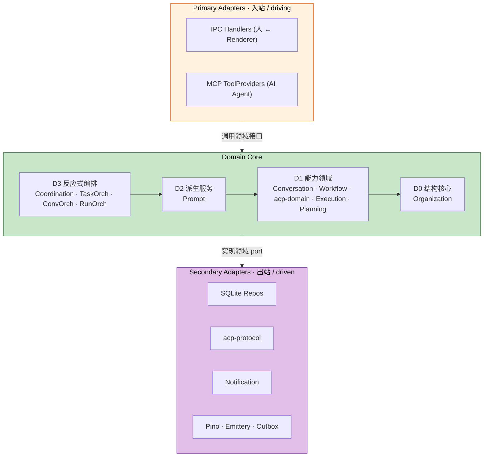
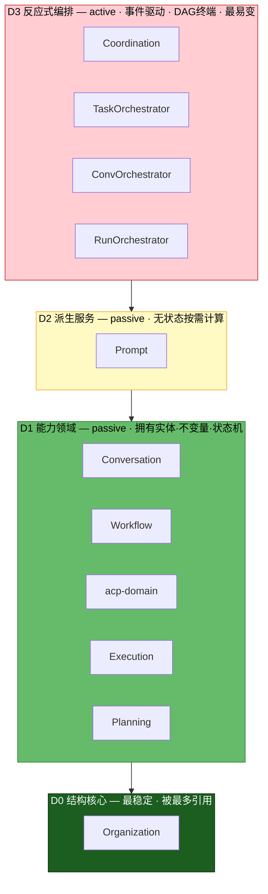
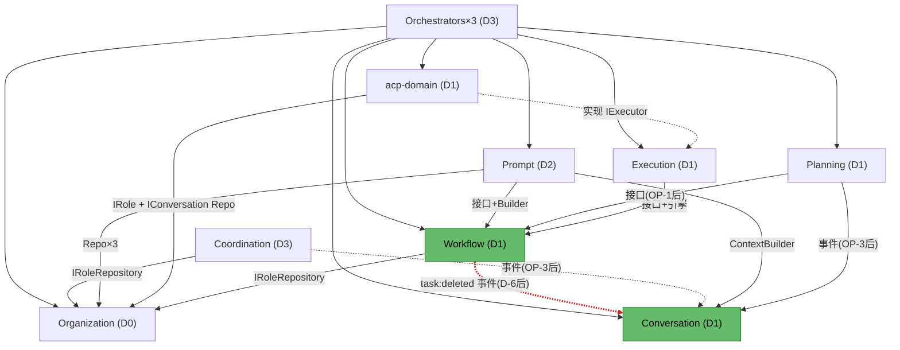
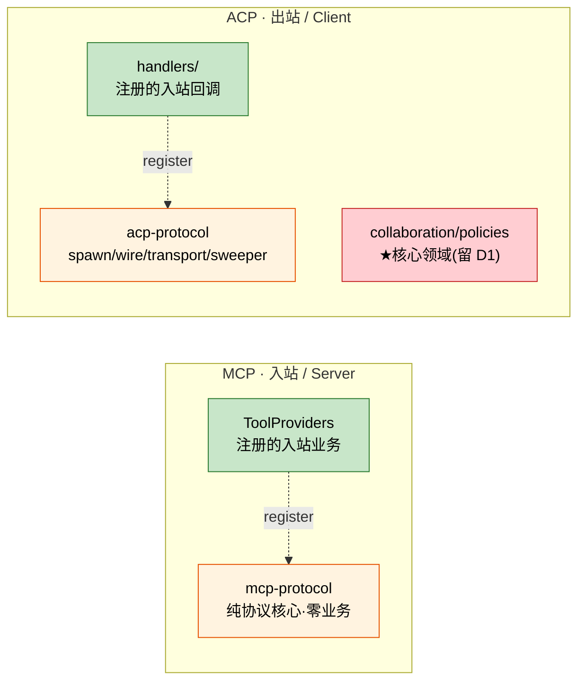
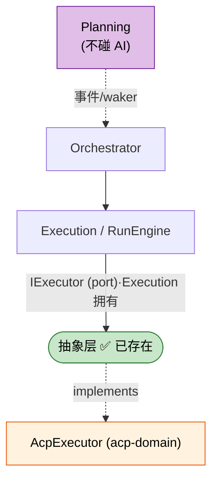
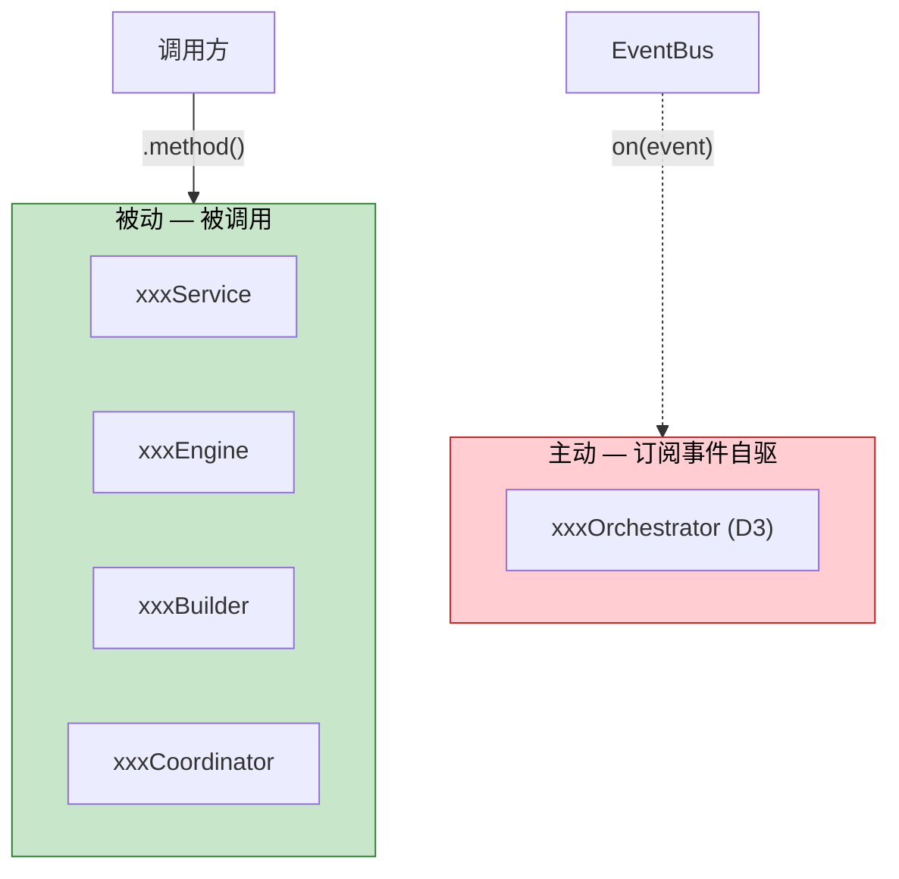
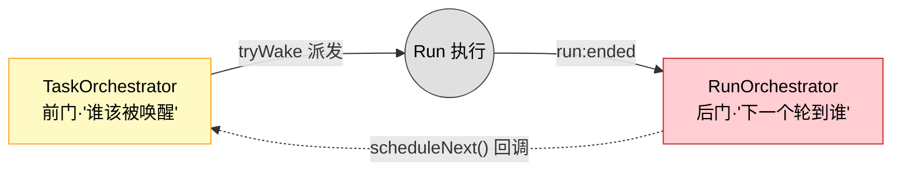
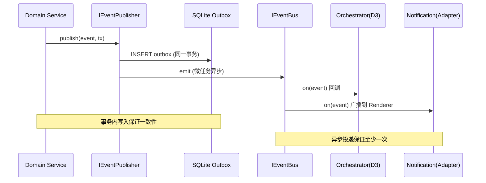
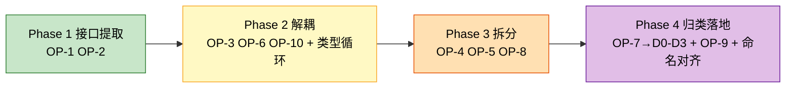

# Capibara 架构设计 —— 最终基线

> 文档版本: Final 1.0
> 日期: 2026-06-02
> 基线分支: acp-refactor
> 性质: 决策已敲定的架构基线。供开发团队据此实施与讨论实现细节。
> 演进脉络: v1 设计 → 优化提案 → 评审意见 → v2 修订 → v3 探讨 → **本文档（决策定稿）**

---

## 目录

1. [决策定稿（8 项）](#1-决策定稿8-项)
2. [架构总览](#2-架构总览)
3. [统一骨架：Hexagonal](#3-统一骨架hexagonal)
4. [Domain Core 分层（D0-D3）](#4-domain-core-分层d0-d3)
5. [模块职责总表](#5-模块职责总表)
6. [目标目录结构](#6-目标目录结构)
7. [真实依赖图与待清理项](#7-真实依赖图与待清理项)
8. [MCP 与 ACP：协议适配器](#8-mcp-与-acp协议适配器)
9. [AI 交互抽象边界](#9-ai-交互抽象边界)
10. [命名约定](#10-命名约定)
11. [事件驱动与持久化](#11-事件驱动与持久化)
12. [实施路线图](#12-实施路线图)
13. [明确不做的事](#13-明确不做的事)
14. [术语表](#14-术语表)

---

## 1. 决策定稿（8 项）

下表是本架构的全部已敲定决策。每项均取经过代码实证与论证的方案。**开发团队讨论聚焦于"如何实施"，而非"是否采纳"。** 若需翻案，请回到 `architecture-design-v3.md` 的 A/B 对照。

| # | 决策 | 定稿 | 一句话依据 |
|---|------|------|-----------|
| **D-1** | 分层轴 | **按角色+稳定性+主被动分 D0-D3**；依赖秩交给 DAG 图 | 依赖数是结果非原则，会引发边界抖动与 `L2-F` 补丁 |
| **D-2** | MCP 定性 | **入站协议适配器**，与 IPC Handlers 同级，移出 `modules/` | MCP=AI 侧 driving adapter，耦合业务是天职 |
| **D-3** | ACP 拆分 | **内部一分为二**：`acp-protocol`(出站适配器) + `acp-domain`(D1) | acp-domain 依赖 `IRoleRepository`=领域铁证，不可整体下沉 |
| **D-4** | Planning 归类 | **D1 能力领域**（非门面） | 500节点/深度/乐观锁等硬领域不变量 |
| **D-5** | Coordination 归类 | **D3 反应式编排**（与 orchestrator 同物种） | 0 实体/0 持久化/事件进事件出 |
| **D-6** | 级联删除 | **事件化**：`task:deleted` → Conversation 自行清理 | 消除隐藏 setter 边，所有权方向回正 |
| **D-7** | AI 抽象层 | **不新增共享抽象**；`IExecutor` 已是边界 | Planning 对 AI 零引用，对称性不存在 |
| **D-8** | D3 命名 | **保持 `Orchestrator` 后缀**；Coordination 向其靠拢 | `Service` 专指被动服务，改名抹掉 active 信号 |

### D-6 唯一实现注意点

事件化使删除变为**异步最终一致**。开发团队需在实现前确认：是否存在"删除任务后立即查询关联对话、预期返回空"的同步路径（IPC 同步返回或测试断言）。

- 若**无**此预期 → 直接采用事件化（推荐路径）。
- 若**有** → 该路径改用编排层 use-case 同步协调删除（v3 方案 B），其余仍走事件化。

---

## 2. 架构总览

### 2.1 全景



### 2.2 设计原则

| 原则 | 一句话 | 体现 |
|------|--------|------|
| P1 依赖倒置 | 依赖接口不依赖实现 | Foundation 接口 + 单一 Composition Root |
| P2 AI≠infra | AI 协作规则是核心领域 | acp-domain 留 D1，不下沉 |
| P3 协议在边缘 | 协议机制是适配器 | mcp-protocol / acp-protocol 在适配器层 |
| P4 层=角色 | 层解释"为什么在这"，不编码依赖秩 | D0-D3 + 独立 DAG 图 |
| P5 事件优先 | 跨模块写优先事件化 | 路由事件化、级联删除事件化 |

---

## 3. 统一骨架：Hexagonal

主进程是一个六边形：外层协议适配器（入站/出站），内层领域与编排。**先有骨架，各模块归属由此推导**——消解了 v1 中"MCP/ACP/Notification 三套标准"的不一致。

| 层 | 方向 | 职责 | 成员 |
|----|------|------|------|
| **Primary Adapters** | 入站 driving | 外部请求 → 领域调用 | IPC Handlers, MCP ToolProviders |
| **Domain Core** | — | 全部业务规则与编排（D0-D3） | 11 个领域/编排单元 |
| **Secondary Adapters** | 出站 driven | 实现领域定义的 port | SQLite, acp-protocol, Notification, 可观测性 |

**对称性核对（全部归位）：**

| 适配器 | 方向 | 归类 |
|--------|------|------|
| IPC Handlers | 入站 | Primary ✅ |
| MCP | 入站 | Primary ✅（D-2） |
| Notification | 出站 | Secondary ✅ |
| acp-protocol | 出站 | Secondary ✅（D-3） |
| SQLite / Pino / Emittery | 出站 | Secondary ✅ |

---

## 4. Domain Core 分层（D0-D3）

### 4.1 模型



| 层 | 分类标准 | 主/被动 | 成员 |
|----|---------|:------:|------|
| **D0** 结构核心 | 最稳定，组织/角色骨架，被最多引用 | 被查询 | Organization |
| **D1** 能力领域 | 拥有实体+不变量+状态机，可独立存在 | 被查询 | Conversation, Workflow, acp-domain, Execution, Planning |
| **D2** 派生服务 | 无实体无持久化，读多域算结果 | 被查询 | Prompt |
| **D3** 反应式编排 | 事件驱动主动单元，DAG 终端，最易变 | 主动订阅 | Coordination, TaskOrch, ConvOrch, RunOrch |

### 4.2 归层判据（代码实证）

| 模块 | 文件数 | 有实体 | 有持久化 | 工作方式 | 归层 |
|------|:-----:|:-----:|:-------:|---------|:----:|
| Organization | 12 | 角色/技能/组织 | 3 repo | 被查询 | D0 |
| Workflow | 10 | Task | 2 repo | 被查询 | D1 |
| Execution | 10 | Run/Cost | 2 repo | 被查询 | D1 |
| acp-domain | 26 中领域部分 | Session | 4 repo | 被查询 | D1 |
| Conversation | 9 | Conv/Message | 3 repo | 被查询 | D1 |
| Planning | 4（单文件 528 行） | PendingPlanTree | 1 repo | 被查询 | D1 |
| Prompt | 6 | 无 | 无 | 被调用算结果 | D2 |
| Coordination | 3 | 无 | 无 | 订阅→算→发事件 | D3 |
| Orchestrator×3 | 9 | 无 | 1(wake) | 订阅→门控→调度 | D3 |

### 4.3 分层的语义约定（D-1 定稿）

| 关注点 | 由谁表达 |
|--------|---------|
| 模块种类/角色（"为什么在这层"） | D0-D3 四层 |
| 实际依赖边（含同层依赖，如 Execution→Workflow） | §7 依赖 DAG 图（唯一真相） |

> 层 = **角色标签**，不编码严格依赖秩。允许同层依赖。依赖关系的唯一真相是 §7 的 DAG 图。

---

## 5. 模块职责总表

### 5.1 Primary Adapters（入站）

| 模块 | 核心职责 | 关键依赖 |
|------|---------|---------|
| IPC Handlers | Renderer IPC → 领域调用；Zod 校验；返回 `DesktopResult` | 领域服务接口 |
| MCP ToolProviders | 领域操作暴露为 MCP 工具；薄转发 | `ITaskService` / `IConversationCommandService` / `IRoleQueryService` / `IPlanningService` |

### 5.2 D0 / D1 / D2

| 层 | 模块 | 核心职责 | 关键不变量 |
|----|------|---------|-----------|
| D0 | Organization | 组织/角色/技能 CRUD，层级遍历，模板化创建 | Skill 命令全局唯一；仅 custom 可删；`autoStartOnCreate` 驱动首次调度 |
| D1 | Conversation | 多方对话生命周期、消息持久化、上下文构建 | 类型 inquiry/planning/adhoc/plan_review |
| D1 | Workflow | 任务生命周期、流程模式、状态机、行为引擎 | 仅叶任务进审批；AI 角色跳过；深度=父+1，最大 10 |
| D1 | acp-domain | AI-to-AI 协作语义、会话挂起/恢复、文件与工具权限策略 | 链深 max 5；循环检测；恢复 resume>load>rebuild；文件三层防护 |
| D1 | Execution | Run 生命周期、成本、日志；经 `IExecutor` 驱动 AI | 失败退避重试≤3；孤儿 Run interrupted；挂起不回退任务 |
| D1 | Planning | 计划树提交/审批/丢弃/优化/过期 | 500 节点/深度 10/禁自嵌套；乐观锁；反馈一次性；24h 过期 |
| D2 | Prompt | 按场景选策略构建提示；装配 RunContext | 无状态；被 Orchestrator 按需调用；9 种执行场景 |

### 5.3 D3 反应式编排

| 模块 | 核心职责 | 性质 |
|------|---------|------|
| Coordination | 订阅 `needs-routing`，沿角色祖先树路由询问；超时升级 | active；D-6/OP-3 后无具体类依赖 |
| TaskOrchestrator | 任务事件驱动协调，准入判定与唤醒（**前门**） | active；每组织一活跃 Run；唤醒门控 |
| ConversationOrchestrator | 对话生命周期、ACP 会话恢复、人类兜底 | active |
| RunOrchestrator | Run 结束排水链、重试调度（**后门**） | active；待处理唤醒每周期消费一个 |

### 5.4 Secondary Adapters（出站）

| 模块 | 核心职责 | 实现 Port |
|------|---------|----------|
| SQLite Repositories | 各实体 better-sqlite3 持久化；迁移管理 | `I*Repository` |
| acp-protocol | 子进程 spawn、wire protocol、session 传输、sweeper | acp-domain 内部 port |
| Notification | 领域事件→IPC 映射；Electron 桌面通知 | `INotificationService` / `IEventBroadcaster` |
| Pino / Emittery / Outbox | 日志、内存事件总线、事务性 Outbox | `ILogger` / `IEventBus` / `IEventPublisher` |

### 5.5 共享调度组件（Orchestrator 拆分后保留）

| 组件 | 核心职责 |
|------|---------|
| WakeGateValidator | 并发门控：每组织一个活跃 Run，校验唤醒阻止条件 |
| TaskScheduler | 查找下一个可调度任务 |
| RetryScheduler | 指数退避重试调度 |
| RunCoordinator | 把编排意图翻译为 RunEngine 调用 |
| IPendingWakeRepository | 待处理唤醒持久化（3 个编排器共享） |

---

## 6. 目标目录结构

> 体现 D-2/D-3/D-5/D-6 的物理落地。`★` = 相对当前结构的变动。

```
apps/electron/src/core/
├── ipc-handlers/                      # Primary Adapter（人）
│
├── adapters/                          # ★ Primary Adapter（AI）
│   ├── mcp-protocol/                  # ★ 纯协议核心（D-2）
│   │   ├── mcp-server.builder.ts
│   │   ├── mcp-http-transport.ts
│   │   └── interfaces/i-tool-registry.ts
│   └── capibara-mcp/                  # ★ ToolProviders（依赖领域接口）
│       ├── task-tool.provider.ts
│       ├── conversation-tool.provider.ts
│       ├── context-tool.provider.ts
│       └── plan-tree-tool.provider.ts
│
├── modules/                           # Domain Core
│   ├── organization/                  # D0
│   ├── conversation/                  # D1
│   ├── workflow/                      # D1（★ 移除 Conversation setter，见 D-6）
│   ├── execution/                     # D1
│   ├── planning/                      # D1（★ 从 L2-F 归正）
│   ├── acp/                           # D1 acp-domain（★ 仅保留领域部分）
│   │   ├── collaboration/
│   │   ├── policies/
│   │   ├── interfaces/
│   │   └── persistence/
│   ├── prompt/                        # D2
│   ├── coordination/                  # D3（★ 归类调整，命名待对齐）
│   ├── task-orchestrator/             # ★ OP-4 拆分
│   ├── conversation-orchestrator/     # ★ OP-4 拆分
│   ├── run-orchestrator/              # ★ OP-4 拆分
│   └── orchestrator-shared/           # ★ WakeGate/Scheduler/Retry/Coordinator
│
├── infrastructure/                    # Secondary Adapters
│   ├── observability/                 # Pino / Emittery / Outbox
│   ├── persistence/sqlite/
│   ├── acp-protocol/                  # ★ ACP 协议机制（D-3）
│   │   ├── acp-agent.spawner.ts
│   │   ├── acp-session.transport.ts
│   │   └── acp-session.sweeper.ts
│   └── notification/                  # ★ OP-6
│       ├── event-broadcaster.ts
│       └── notification.service.ts
│
├── foundation/                        # 接口 + 事件 + DI Tokens
└── bootstrap/                         # Composition Root
```

---

## 7. 真实依赖图与待清理项

> 红线 = v1 文档遗漏、本版处理的边。



### 7.1 待清理项与处置

| # | 问题 | 处置 | 关联 |
|---|------|------|------|
| 1 | Workflow→Conversation 隐藏 setter（级联删除） | 事件化 `task:deleted` | D-6 / OP-10 |
| 2 | Planning/MCP/Coordination 导入具体类（8 个） | 接口提取 | OP-1 / OP-2 |
| 3 | Coordination→Conversation 具体类写回 | 事件化 `conversation:route-resolved` | OP-3 |
| 4 | acp.types ↔ execution.types 循环 re-export | 共享类型提取到中性位置 | Phase 2 |

---

## 8. MCP 与 ACP：协议适配器

### 8.1 对称但反向（D-2 + D-3）



| | 角色 | 方向 | 协议核心 | 注册的业务 | 类比 |
|---|------|------|---------|-----------|------|
| MCP | Server（AI 来调） | 入站 | `mcp-protocol` | ToolProviders | IPC 机制 + Handlers |
| ACP | Client（驱动子进程） | 出站 | `acp-protocol` | `handlers/` | HTTP 客户端 + 回调 |

> 二者只在"边缘协议适配器"这一抽象层对称，方向相反——**不共用基类**。

### 8.2 ACP 内部分层（D-3）

| ACP 子部分 | 性质 | 归属 |
|-----------|------|------|
| `client/`（spawn/wire/transport/sweeper） | 出站机制 | `infrastructure/acp-protocol/`（Secondary） |
| `collaboration/`（链深/挂起/聚合） | 核心领域 | `modules/acp/`（D1） |
| `policies/`（文件/工具权限，依赖角色） | 核心领域 | `modules/acp/`（D1） |
| session 生命周期状态机 | 领域语义 | `modules/acp/`（D1） |

---

## 9. AI 交互抽象边界

### 9.1 抽象层已存在：IExecutor（D-7 定稿）

| 模块 | ACP/AI 引用 | 如何触达 AI |
|------|:-----------:|------------|
| Execution | 仅经 `IExecutor` | `executor.spawn(...)`，由 `AcpExecutor` 实现 |
| Planning | **0 引用** | **完全不触达 AI**（经事件让 Orchestrator 调度） |



**结论**：不新增共享 AI 抽象。换 AI 后端只需新写 `IExecutor` 实现，Execution 不改一行。

### 9.2 两个可选改进（非必须）

| # | 观察 | 处置 |
|---|------|------|
| 1 | `ExecutorInput/Output` 泄漏 `sessionId`/`acpSessionId` 等 ACP 概念 | 待定：触发条件=出现第二种非 ACP 后端，否则 YAGNI |
| 2 | execution.types ↔ acp.types re-export | 低优先：共享类型提取到中性位置（Phase 2） |

---

## 10. 命名约定

### 10.1 后缀即角色契约（D-8 定稿）



| 后缀 | 角色 | 主/被动 | 所在层 | 示例 |
|------|------|:------:|-------|------|
| `Service` | 领域服务 | 被动 | D0/D1 | TaskService, ConversationService, PlanningService |
| `Engine` | 有状态领域规则 | 被动 | D1 | TaskStateMachine, ProcessEngine, BehaviorEngine |
| `Builder` | 装配/构建 | 被动 | D2 | PromptBuilder, ConversationContextBuilder |
| `Coordinator` | 编排意图→执行 | 被动 | D3(共享) | RunCoordinator |
| `Orchestrator` | 订阅事件自驱 | **主动** | **D3** | TaskOrchestrator, RunOrchestrator, ConvOrchestrator |

**约定（强制）：**
- D3 主动编排单元一律 `Orchestrator` 后缀；**不可用 `Service`**（会抹掉 active 信号、误导"可直接调它"）。
- Coordination 的 `InquiryEscalationService` 后缀与"被动"矛盾，重命名去 `Service`；`InquiryRouter` 可保留或改 `InquiryOrchestrator`，但须在文档/目录标注归 D3。

### 10.2 TaskOrchestrator vs RunOrchestrator（前门/后门）



| 维度 | TaskOrchestrator | RunOrchestrator |
|------|-----------------|-----------------|
| 订阅事件 | `task:*` + `plan-tree:approved` | `run:failed/succeeded/cancelled/suspended` |
| 阶段 | Run **之前**（准入） | Run **之后**（接续） |
| 核心方法 | `scheduleNext`/`tryWake`（去抖+门控+入队） | `onRunEnded`（重试+排水+触发下一轮） |
| 失败处理 | 不管 | `run:failed` → RetryScheduler |
| 队列 | 门控不过 → **写入** pending_wakes | Run 结束 → **排出** pending_wakes（每次一个） |
| 依赖方向 | 被持有 | 持有 TaskOrchestrator（单向回调 scheduleNext） |

---

## 11. 事件驱动与持久化

### 11.1 事务性 Outbox



### 11.2 Foundation 接口与实现

| Foundation 接口 | Infrastructure 实现 |
|----------------|-------------------|
| `IEventBus` | `EmitteryEventBus` |
| `IEventPublisher` | `OutboxEventPublisher` |
| `ILogger` | `PinoLogger` |
| `ISqliteConnection` | `SqliteConnection` |
| `IOutboxRepository` | `SqliteOutboxRepository` |

### 11.3 领域事件（约 30 种，5 域）

| 域 | 事件示例 |
|----|---------|
| Organization | `org:created`, `role:created`, `skill:assigned` |
| Task | `task:created`, `task:status-changed`, `task:entered-approval`, **`task:deleted`（D-6 新增）** |
| Conversation | `conversation:created`, `conversation:needs-routing`, **`conversation:route-resolved`（OP-3 新增）** |
| Run | `run:started`, `run:succeeded`, `run:failed`, `run:suspended`, `run:resumed` |
| PlanTree | `plan-tree:submitted`, `plan-tree:approved`, `plan-tree:discarded` |

---

## 12. 实施路线图

### 12.1 阶段（按依赖排序）



### 12.2 OP 总表

| OP | 内容 | 关联决策 | Phase |
|----|------|---------|:-----:|
| OP-1 | Service 接口提取（4 个） | D-2/D-4 前置 | 1 |
| OP-2 | Engine 接口提取（3 个） | OP-4/OP-5 前置 | 1 |
| OP-3 | Coordination 事件化 | D-5 | 2 |
| OP-6 | Notification → Secondary Adapter | — | 2 |
| OP-10 | Workflow→Conversation 级联删除事件化 | D-6 | 2 |
| OP-4 | Orchestrator 拆 3（理由：职责隔离/可测试） | D-1 | 3 |
| OP-5 | MCP 拆 mcp-protocol + ToolProviders，移出 modules/ | D-2 | 3 |
| OP-8 | ACP 内部分层（协议→infra，领域→D1） | D-3 | 3 |
| OP-7 | 层级重定义 → D0-D3 | D-1 | 4 |
| OP-9 | Coordination 上移 D3 + 命名对齐 | D-5/D-8 | 4 |

### 12.3 验收要点

| 指标 | 当前 | 目标 | 验证 |
|------|------|------|------|
| 跨模块具体类导入 | 8 | 0 | grep `from.*modules/.*/(services\|engines)/` |
| MCP 位置 | modules/mcp | adapters/ | 路径检查 |
| acp-protocol 位置 | modules/acp/client | infrastructure/acp-protocol | 路径检查 |
| Workflow→Conversation 隐藏边 | 存在 | 消除 | grep task.service.ts 无 convRepo |
| Notification 位置 | modules/ | infrastructure/ | 路径检查 |
| 现有功能 | — | 无回归 | vitest + 启动冒烟测试 |

### 12.4 风险与回滚

| 风险 | 缓解 |
|------|------|
| 接口提取遗漏方法 | `implements` 编译期校验 + 运行期冒烟 |
| 级联删除事件化引入时序问题 | `task:deleted` 走 Outbox 事务性投递；先确认无同步预期（见 D-6） |
| 文件移动导致导入路径大面积变更 | 逐 OP 独立 PR，移动后立即修路径 + 跑测试 |
| DI 装配顺序错误 | 每改 composition-root 后跑启动冒烟 |

> **原则**：每个 OP 独立 PR，可独立 `git revert`，不产生级联回滚。

---

## 13. 明确不做的事

| 不做 | 原因 |
|------|------|
| 重新切分 11 个模块 | 边界合理，重切只增 churn 与回归风险 |
| 为 Planning/Execution 造共享 AI 抽象 | D-7：Planning 不调 AI，对称性不存在 |
| 引入 DI 自动装配框架 | 手动 Composition Root 可控，YAGNI |
| 泛化 IExecutor 的 session 概念 | 仅在出现第二种非 ACP 后端时触发 |
| 拆分 `planning.service.ts`（528 行） | 文件级臃肿，不影响模块边界；可后续按用例拆，非本轮目标 |
| 改 IPC 通道 / 数据库 Schema / Renderer | 不在本架构调整范围 |

---

## 14. 术语表

| 术语 | 含义 |
|------|------|
| Primary / Secondary Adapter | 入站（被外部调用）/ 出站（实现领域 port）适配器 |
| D0-D3 | 按角色+稳定性划分的 Domain Core 四层 |
| 能力领域 | 拥有实体、不变量、状态机的领域模块 |
| 派生服务 | 无状态、读多域算结果的被动服务 |
| 反应式编排 | 事件驱动、主动订阅、DAG 终端的协调单元 |
| acp-protocol / acp-domain | ACP 协议机制（出站适配器）/ 领域规则（D1） |
| 主动 vs 被动 | 主动=订阅事件自驱（Orchestrator）；被动=被调用（Service/Engine/Builder） |
| 前门 / 后门 | TaskOrchestrator（Run 前·准入）/ RunOrchestrator（Run 后·接续） |
| Outbox 模式 | 事务内写事件表 + 异步投递，保证至少一次 |
| Port / Adapter | 领域定义的接口 / 实现接口的具体类 |

---

> 文档结束。本文档为决策定稿基线，供开发团队按 §12 路线图实施。实现层面的细节问题（如具体接口签名、PR 切分粒度）在团队讨论中细化，不改变本文档的架构决策。
