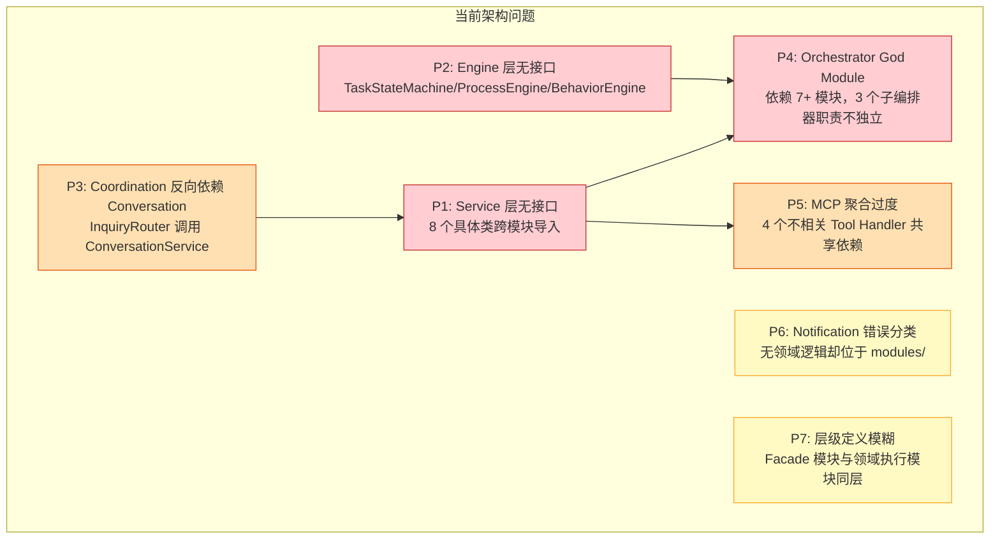
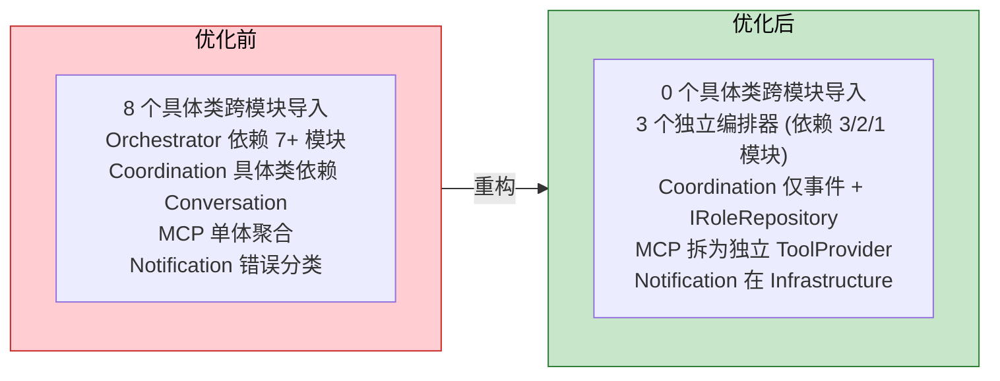
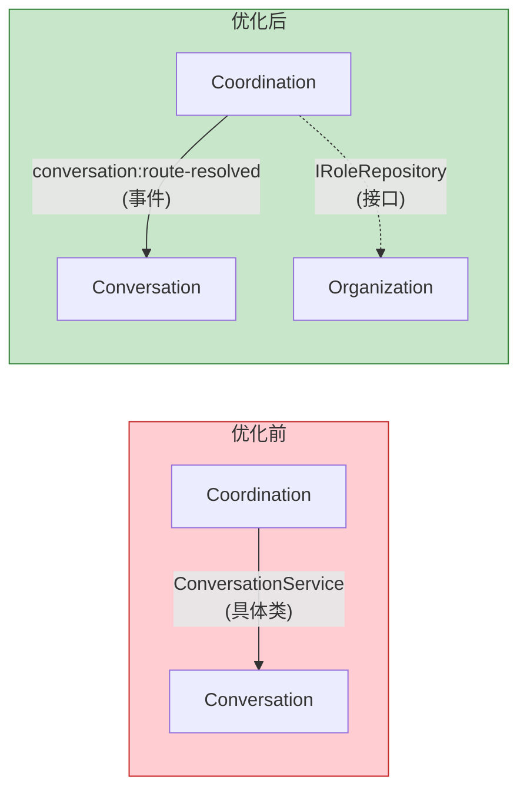
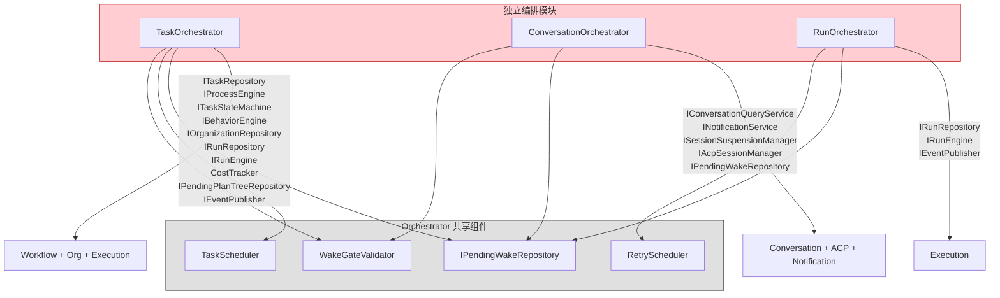
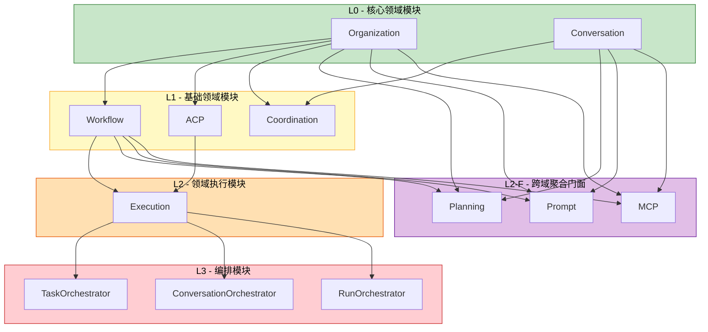
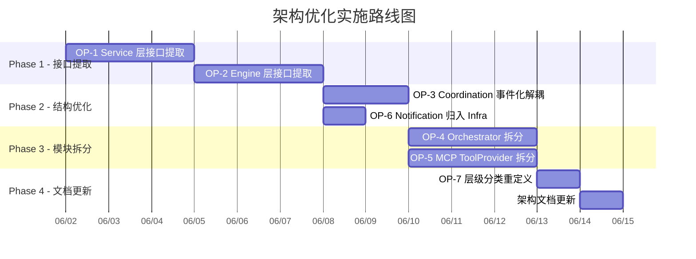
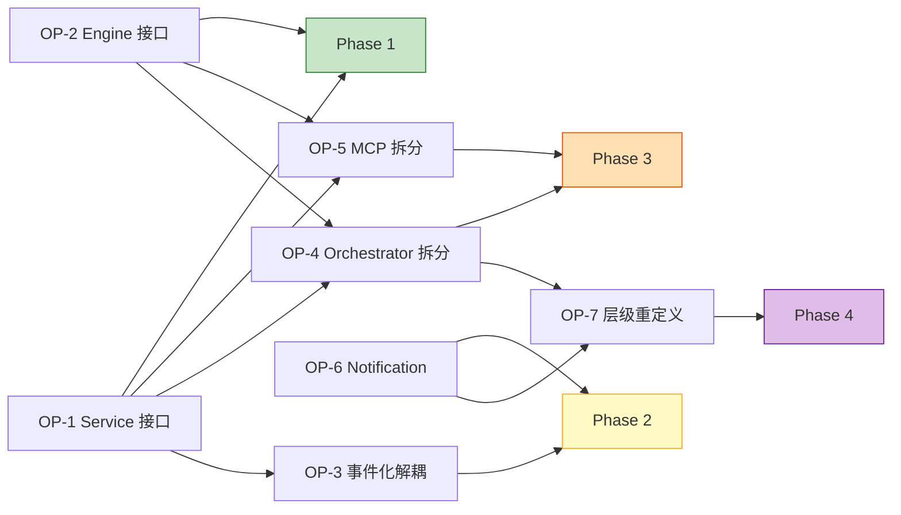

# Capibara 架构优化提案

> 文档版本: 1.0
> 提案日期: 2026-06-01
> 基线分支: acp-refactor
> 状态: 待审核

---

## 目录

1. [提案背景与目标](#1-提案背景与目标)
2. [当前架构问题清单](#2-当前架构问题清单)
3. [优化方案总览](#3-优化方案总览)
4. [OP-1: Service 层接口提取](#4-op-1-service-层接口提取)
5. [OP-2: Engine 层接口提取](#5-op-2-engine-层接口提取)
6. [OP-3: Coordination 事件化解耦](#6-op-3-coordination-事件化解耦)
7. [OP-4: Orchestrator 拆分](#7-op-4-orchestrator-拆分)
8. [OP-5: MCP ToolProvider 拆分](#8-op-5-mcp-toolprovider-拆分)
9. [OP-6: Notification 归入 Infrastructure](#9-op-6-notification-归入-infrastructure)
10. [OP-7: 层级分类重定义](#10-op-7-层级分类重定义)
11. [实施路线图](#11-实施路线图)
12. [风险评估与回滚策略](#12-风险评估与回滚策略)
13. [验收标准](#13-验收标准)

---

## 1. 提案背景与目标

### 1.1 背景

Capibara 的核心主进程采用六边形架构，11 个领域模块通过 Foundation 接口和事件系统协作。当前架构在 Repository 层的接口隔离做得较好，但 Service 层和 Engine 层几乎全部通过具体类耦合，导致模块间层级边界名存实亡。

逐文件依赖审计发现：

- **8 个具体类**被跨模块直接导入（无接口隔离）
- **1 个模块**（Orchestrator）依赖 7+ 个其他模块，承担了不成比例的复杂度
- **1 个模块**（Notification）无领域逻辑，不应位于领域层
- **1 条依赖**（Coordination -> Conversation）可完全通过事件消除

### 1.2 目标

| 目标 | 衡量标准 |
|------|---------|
| 消除跨模块具体类依赖 | 具体类跨模块导入数从 8 降至 0 |
| 降低 Orchestrator 复杂度 | 依赖模块数从 7+ 降至 3/2/1（拆分后） |
| 消除可事件化的直接依赖 | Coordination 对 Conversation 的具体类依赖降至 0 |
| 修正模块分类 | Notification 不再出现在 modules/ 目录 |
| 提升架构可理解性 | 层级分类能准确反映模块性质 |

### 1.3 非目标

- 不改变 IPC 通信机制
- 不改变 Renderer 架构
- 不改变 Foundation 接口定义
- 不改变数据库 Schema
- 不改变外部 API（MCP 工具、IPC 通道）

---

## 2. 当前架构问题清单

### 2.1 问题全景



### 2.2 具体类依赖清单

| 具体类 | 使用方 | 使用的方法 | 问题 |
|--------|--------|-----------|------|
| `ConversationService` | Planning, MCP, Coordination, Orchestrator | `findById`, `createPlanReview`, `addMessage`, `resolve`, `complete`, `cancel`, `assignRespondent`, `getLatestMessages`, `createInquiry` | 最广泛的具体类耦合 |
| `TaskService` | Planning, MCP | `findById`, `batchCreate`, `create`, `findByOrgId`, `findChildren` | 写路径耦合 |
| `TaskStateMachine` | Planning, MCP, Orchestrator | `transition` | 引擎层无接口 |
| `ProcessEngine` | Planning, MCP, Prompt, Orchestrator | `getAvailableTransitions`, `getStatusCategory`, `getWorkItemType`, `validateTransition`, `getSchema`, `getInitialStatus` | 最多方法的具体类 |
| `BehaviorEngine` | Orchestrator | `onChildCompleted` | 单方法，极易提取接口 |
| `ConversationContextBuilder` | Prompt | `build` | 单方法，极易提取接口 |
| `RoleService` | MCP | `findByOrgId`, `findById`, `findChildren` | 只读查询 |
| `NotificationService` | Orchestrator | `send` | 单方法，19 行实现 |

### 2.3 问题间的依赖关系

```
P1 (Service 无接口) ──是──> P4 (Orchestrator God Module) 的前提
P2 (Engine 无接口) ──是──> P4 (Orchestrator God Module) 的前提
P1 (Service 无接口) ──是──> P5 (MCP 聚合过度) 的前提
P3 (Coordination 反向依赖) ──加剧──> P1 (增加 ConversationService 使用方)
```

**结论：** P1 和 P2 是根因问题，必须先解决，其他优化才能有效推进。

---

## 3. 优化方案总览

| 编号 | 名称 | 优先级 | 影响模块 | 工作量 | 前置依赖 |
|------|------|--------|---------|--------|---------|
| OP-1 | Service 层接口提取 | P0 | 4 | 中 | 无 |
| OP-2 | Engine 层接口提取 | P0 | 4 | 中 | 无 |
| OP-3 | Coordination 事件化解耦 | P1 | 2 | 低 | OP-1 |
| OP-4 | Orchestrator 拆分 | P1 | 1->3 | 中 | OP-1, OP-2 |
| OP-5 | MCP ToolProvider 拆分 | P2 | 1->4+ | 中 | OP-1, OP-2 |
| OP-6 | Notification 归入 Infrastructure | P2 | 1 | 低 | 无 |
| OP-7 | 层级分类重定义 | P3 | 文档 | 极低 | OP-4, OP-6 |

### 优化前后对比



---

## 4. OP-1: Service 层接口提取

### 4.1 问题描述

4 个 Service 类被跨模块以具体类型导入，导致：

- 修改 Service 签名时，所有使用方必须同步修改
- 无法在不修改消费方代码的情况下替换实现
- 单元测试需要 mock 具体类而非接口

### 4.2 方案

为每个跨模块使用的 Service 提取接口。接口定义在提供方模块的 `interfaces/` 目录中，仅暴露外部消费者需要的方法（接口隔离原则）。

#### 4.2.1 IConversationService

**定义位置：** `modules/conversation/interfaces/i-conversation.service.ts`

```typescript
// 对外暴露的查询方法
export interface IConversationQueryService {
  findById(id: string): Promise<Conversation | null>;
  getLatestMessages(conversationId: string, limit: number): Promise<ConversationMessage[]>;
}

// 对外暴露的命令方法
export interface IConversationCommandService {
  createInquiry(params: CreateInquiryParams): Promise<Conversation>;
  createPlanReview(taskId: string, orgId: string): Promise<Conversation>;
  addMessage(conversationId: string, content: string, role: MessageRole): Promise<ConversationMessage>;
  resolve(conversationId: string): Promise<void>;
  complete(conversationId: string): Promise<void>;
  cancel(conversationId: string): Promise<void>;
  assignRespondent(conversationId: string, roleId: string, type: RespondentType, reason: string): Promise<void>;
}

// 联合接口（供需要查询+命令的消费方）
export type IConversationService = IConversationQueryService & IConversationCommandService;
```

**使用方映射：**

| 使用方 | 需要的子接口 | 方法 |
|--------|-------------|------|
| Planning | `IConversationCommandService` + `IConversationQueryService` | `findById`, `createPlanReview`, `addMessage`, `resolve`, `complete`, `cancel` |
| MCP | `IConversationCommandService` | `createInquiry` |
| Coordination | `IConversationCommandService` | `assignRespondent` |
| Orchestrator | `IConversationQueryService` | `findById`, `getLatestMessages` |

#### 4.2.2 ITaskService

**定义位置：** `modules/workflow/interfaces/i-task.service.ts`

```typescript
export interface ITaskQueryService {
  findById(id: string): Promise<Task | null>;
  findByOrgId(orgId: string): Promise<Task[]>;
  findChildren(parentId: string): Promise<Task[]>;
}

export interface ITaskCommandService {
  create(params: CreateTaskParams): Promise<Task>;
  batchCreate(items: CreateTaskParams[]): Promise<Task[]>;
}

export type ITaskService = ITaskQueryService & ITaskCommandService;
```

**使用方映射：**

| 使用方 | 需要的子接口 | 方法 |
|--------|-------------|------|
| Planning | `ITaskCommandService` + `ITaskQueryService` | `findById`, `batchCreate` |
| MCP | `ITaskService` (全部) | `findById`, `create`, `findByOrgId`, `findChildren` |

#### 4.2.3 IRoleService

**定义位置：** `modules/organization/interfaces/i-role.service.ts`

```typescript
export interface IRoleQueryService {
  findByOrgId(orgId: string): Promise<Role[]>;
  findById(id: string): Promise<Role | null>;
  findChildren(parentId: string): Promise<Role[]>;
}
```

**使用方映射：**

| 使用方 | 需要的子接口 | 方法 |
|--------|-------------|------|
| MCP | `IRoleQueryService` | `findByOrgId`, `findById`, `findChildren` |

#### 4.2.4 INotificationService

**定义位置：** `modules/notification/interfaces/i-notification.service.ts`（若 Notification 暂不移入 Infrastructure）或 `infrastructure/interfaces/i-notification.service.ts`

```typescript
export interface INotificationService {
  send(title: string, body: string): void;
}
```

**使用方映射：**

| 使用方 | 方法 |
|--------|------|
| Orchestrator (ConversationOrchestrator) | `send` |

### 4.3 变更范围

| 文件 | 变更类型 | 说明 |
|------|---------|------|
| `modules/conversation/interfaces/i-conversation.service.ts` | 新增 | 接口定义 |
| `modules/conversation/services/conversation.service.ts` | 修改 | 实现 `IConversationService` |
| `modules/workflow/interfaces/i-task.service.ts` | 新增 | 接口定义 |
| `modules/workflow/services/task.service.ts` | 修改 | 实现 `ITaskService` |
| `modules/organization/interfaces/i-role.service.ts` | 新增 | 接口定义 |
| `modules/organization/services/role.service.ts` | 修改 | 实现 `IRoleQueryService` |
| `modules/notification/interfaces/i-notification.service.ts` | 新增 | 接口定义 |
| `modules/notification/notification.service.ts` | 修改 | 实现 `INotificationService` |
| `modules/planning/planning.service.ts` | 修改 | 导入 `IConversationService` + `ITaskService` |
| `modules/mcp/handlers/task-tools.ts` | 修改 | 导入 `ITaskService` |
| `modules/mcp/handlers/conversation-tools.ts` | 修改 | 导入 `IConversationCommandService` |
| `modules/mcp/handlers/context-tools.ts` | 修改 | 导入 `ITaskQueryService` + `IRoleQueryService` |
| `modules/mcp/mcp-server.builder.ts` | 修改 | 类型签名更新 |
| `modules/coordination/routing/inquiry.router.ts` | 修改 | 导入 `IConversationCommandService` |
| `modules/orchestrator/orchestrators/conversation.orchestrator.ts` | 修改 | 导入 `IConversationQueryService` + `INotificationService` |
| `bootstrap/composition-root.ts` | 修改 | 注册接口绑定 |

### 4.4 向后兼容

- 具体类同时实现新旧接口，内部行为不变
- Composition Root 中将具体实例注册为接口类型
- 不改变任何 IPC 通道或外部 API

---

## 5. OP-2: Engine 层接口提取

### 5.1 问题描述

3 个 Engine 类被跨模块以具体类型导入。Engine 与 Service 的区别在于：Engine 封装的是有状态的领域规则（状态机、行为评估、流程查询），其替换可能性更高（例如未来可能引入不同的流程引擎实现）。

### 5.2 方案

#### 5.2.1 ITaskStateMachine

**定义位置：** `modules/workflow/interfaces/i-task-state-machine.ts`

```typescript
export interface ITaskStateMachine {
  transition(
    taskId: string,
    targetStatus: string,
    triggeredBy: TransitionActor,
    options?: TransitionOptions
  ): Promise<Task>;
}
```

**使用方映射：**

| 使用方 | 方法 |
|--------|------|
| Planning | `transition` |
| MCP | `transition` |
| Orchestrator (TaskOrchestrator) | `transition` |

#### 5.2.2 IProcessEngine

**定义位置：** `modules/workflow/interfaces/i-process-engine.ts`

分析 4 个使用方对 `ProcessEngine` 的方法调用，发现全部是只读查询：

```typescript
export interface IProcessSchemaQuery {
  getSchema(orgId: string): Promise<ProcessSchema | null>;
  getWorkItemType(orgId: string, typeName: string): Promise<WorkItemType | null>;
  getInitialStatus(orgId: string, typeName: string): Promise<string | null>;
}

export interface IProcessTransitionQuery {
  getAvailableTransitions(orgId: string, typeName: string, currentStatus: string): Promise<Transition[]>;
  getStatusCategory(orgId: string, statusName: string): Promise<StatusCategory | null>;
  validateTransition(orgId: string, typeName: string, fromStatus: string, toStatus: string): Promise<boolean>;
}

export type IProcessEngine = IProcessSchemaQuery & IProcessTransitionQuery;
```

**使用方映射：**

| 使用方 | 需要的子接口 | 方法 |
|--------|-------------|------|
| Planning | `IProcessTransitionQuery` + `IProcessSchemaQuery` | `getAvailableTransitions`, `getStatusCategory`, `getWorkItemType` |
| MCP | `IProcessTransitionQuery` | `getStatusCategory`, `validateTransition`, `getAvailableTransitions` |
| Prompt (RunContext) | `IProcessSchemaQuery` | `getWorkItemType`, `getSchema` |
| Orchestrator (TaskOrchestrator) | `IProcessTransitionQuery` | `getStatusCategory` |

#### 5.2.3 IBehaviorEngine

**定义位置：** `modules/workflow/interfaces/i-behavior.engine.ts`

```typescript
export interface IBehaviorEngine {
  onChildCompleted(parentTaskId: string): Promise<void>;
}
```

**使用方映射：**

| 使用方 | 方法 |
|--------|------|
| Orchestrator (TaskOrchestrator) | `onChildCompleted` |

#### 5.2.4 IConversationContextBuilder

**定义位置：** `modules/conversation/interfaces/i-conversation-context.builder.ts`

```typescript
export interface IConversationContextBuilder {
  build(conversationId: string, maxMessages?: number): Promise<ConversationContext>;
}
```

**使用方映射：**

| 使用方 | 方法 |
|--------|------|
| Prompt (RunContext) | `build` |

### 5.3 变更范围

| 文件 | 变更类型 | 说明 |
|------|---------|------|
| `modules/workflow/interfaces/i-task-state-machine.ts` | 新增 | 接口定义 |
| `modules/workflow/engines/task.state-machine.ts` | 修改 | 实现接口 |
| `modules/workflow/interfaces/i-process-engine.ts` | 新增 | 接口定义 |
| `modules/workflow/engines/process.engine.ts` | 修改 | 实现接口 |
| `modules/workflow/interfaces/i-behavior.engine.ts` | 新增 | 接口定义 |
| `modules/workflow/engines/behavior.engine.ts` | 修改 | 实现接口 |
| `modules/conversation/interfaces/i-conversation-context.builder.ts` | 新增 | 接口定义 |
| `modules/conversation/context/conversation-context.builder.ts` | 修改 | 实现接口 |
| `modules/planning/planning.service.ts` | 修改 | 导入接口 |
| `modules/mcp/handlers/task-tools.ts` | 修改 | 导入接口 |
| `modules/mcp/mcp-server.builder.ts` | 修改 | 类型签名更新 |
| `modules/prompt/context/run.context.ts` | 修改 | 导入接口 |
| `modules/orchestrator/orchestrators/task.orchestrator.ts` | 修改 | 导入接口 |
| `bootstrap/composition-root.ts` | 修改 | 注册接口绑定 |

### 5.4 设计参考

Workflow 模块内 `ProcessEngine` 的写方法（`saveSchema`, `updateSchema` 等）不在接口中暴露，因为没有任何外部模块需要调用它们。这些写方法仅由 Organization 模块的 `OrgTemplateService` 通过 setter 注入的回调间接使用（参见后装配钩子）。这符合接口隔离原则：消费者只看到它需要的方法。

---

## 6. OP-3: Coordination 事件化解耦

### 6.1 问题描述

`InquiryRouter` 当前的工作流：

```
1. 订阅 conversation:needs-routing 事件 (好 - 事件驱动)
2. 内部计算路由目标角色 (好 - 自身职责)
3. 调用 ConversationService.assignRespondent() 写回结果 (坏 - 具体类依赖)
```

步骤 3 违反了事件驱动架构的一致性：订阅用事件，写回用直接调用。如果 Coordination 发布路由结果事件，由 Conversation 自行订阅更新，则 Coordination 可以完全消除对 Conversation 具体类的依赖。

### 6.2 方案

#### 6.2.1 新增领域事件

**定义位置：** `foundation/events.ts`

```typescript
export const ConversationEvents = {
  // ... 现有事件
  ROUTE_RESOLVED: 'conversation:route-resolved',
} as const;

// 事件负载
export interface ConversationRouteResolvedPayload {
  conversationId: string;
  respondentRoleId: string;
  respondentType: RespondentType;
  auditReason: string;
}
```

**Schema 定义：** `foundation/event-schemas.ts` 中添加对应的 Zod Schema。

#### 6.2.2 修改 InquiryRouter

**当前：**

```typescript
class InquiryRouter {
  constructor(
    private roleRepository: IRoleRepository,
    private conversationService: ConversationService, // 具体类
    private eventBus: IEventBus,
    private logger: ILogger,
  ) {}

  async handleRoutingNeeded(event: ConversationNeedsRoutingEvent): Promise<void> {
    const respondent = await this.findRespondent(event);
    await this.conversationService.assignRespondent( // 直接调用
      event.conversationId,
      respondent.roleId,
      respondent.type,
      respondent.reason,
    );
  }
}
```

**优化后：**

```typescript
class InquiryRouter {
  constructor(
    private roleRepository: IRoleRepository,
    private eventPublisher: IEventPublisher,  // 替换 ConversationService
    private logger: ILogger,
  ) {}

  async handleRoutingNeeded(event: ConversationNeedsRoutingEvent): Promise<void> {
    const respondent = await this.findRespondent(event);
    await this.eventPublisher.publish( // 发布事件
      'conversation:route-resolved',
      {
        conversationId: event.conversationId,
        respondentRoleId: respondent.roleId,
        respondentType: respondent.type,
        auditReason: respondent.reason,
      },
    );
  }
}
```

#### 6.2.3 Conversation 模块新增事件订阅

**定义位置：** `modules/conversation/services/conversation.service.ts` 新增方法

```typescript
class ConversationService implements IConversationService {
  // ... 现有方法

  async handleRouteResolved(event: ConversationRouteResolvedPayload): Promise<void> {
    await this.assignRespondent(
      event.conversationId,
      event.respondentRoleId,
      event.respondentType,
      event.auditReason,
    );
  }
}
```

**注册位置：** `bootstrap/conversation.module.ts`

```typescript
eventBus.subscribe('conversation:route-resolved', (payload) =>
  conversationService.handleRouteResolved(payload),
);
```

### 6.3 变更范围

| 文件 | 变更类型 | 说明 |
|------|---------|------|
| `foundation/events.ts` | 修改 | 新增 `conversation:route-resolved` 事件 |
| `foundation/event-schemas.ts` | 修改 | 新增 Zod Schema |
| `modules/coordination/routing/inquiry.router.ts` | 修改 | 移除 ConversationService，改用 IEventPublisher |
| `modules/conversation/services/conversation.service.ts` | 修改 | 新增 handleRouteResolved |
| `bootstrap/coordination.module.ts` | 修改 | 移除 ConversationService 参数 |
| `bootstrap/conversation.module.ts` | 修改 | 新增事件订阅 |

### 6.4 效果



**Coordination 的模块依赖：**

| 优化前 | 优化后 |
|--------|--------|
| Organization (IRoleRepository) | Organization (IRoleRepository) |
| Conversation (ConversationService 具体类) | **无** (仅通过事件通信) |

---

## 7. OP-4: Orchestrator 拆分

### 7.1 问题描述

Orchestrator 模块当前包含 3 个职责完全不同的子编排器，但它们共享同一个模块级依赖声明，导致：

- 模块级依赖膨胀（7+ 个模块）
- 修改任一子编排器都可能触发整个模块重新装配
- 无法独立测试/部署子编排器

### 7.2 方案

将 3 个子编排器拆为独立的模块级目录，共享组件保留在公共目录中。

#### 7.2.1 拆分后的目录结构

```
modules/
├── orchestrator/                  # 共享调度组件 (保留)
│   ├── interfaces/
│   │   └── i-pending-wake.repository.ts
│   ├── persistence/
│   │   └── sqlite-pending-wake.repository.ts
│   ├── wake-gate.validator.ts
│   ├── task.scheduler.ts
│   └── retry.scheduler.ts
│
├── task-orchestrator/             # 新模块
│   └── task.orchestrator.ts
│
├── conversation-orchestrator/     # 新模块
│   └── conversation.orchestrator.ts
│
├── run-orchestrator/              # 新模块
│   └── run.orchestrator.ts
```

#### 7.2.2 各模块依赖（OP-1 + OP-2 完成后）



#### 7.2.3 各编排器依赖详情

**TaskOrchestrator：**

| 依赖 | 类型 | 来源 |
|------|------|------|
| `ITaskRepository` | 接口 | Workflow |
| `IProcessEngine` | 接口 | Workflow (OP-2) |
| `ITaskStateMachine` | 接口 | Workflow (OP-2) |
| `IBehaviorEngine` | 接口 | Workflow (OP-2) |
| `IOrganizationRepository` | 接口 | Organization |
| `IRunRepository` | 接口 | Execution |
| `IRunEngine` | 接口 | Execution |
| `IPendingPlanTreeRepository` | 接口 | Planning |
| `CostTracker` | 具体类 | Execution (可后续提取接口) |
| `IEventPublisher` | 接口 | Foundation |
| `ILogger` | 接口 | Foundation |

**ConversationOrchestrator：**

| 依赖 | 类型 | 来源 |
|------|------|------|
| `IConversationQueryService` | 接口 | Conversation (OP-1) |
| `INotificationService` | 接口 | Notification (OP-1) |
| `ISessionSuspensionManager` | 接口 | ACP |
| `IAcpSessionManager` | 接口 | ACP |
| `IPendingWakeRepository` | 接口 | Orchestrator 共享 |
| `IEventBus` | 接口 | Foundation |
| `ILogger` | 接口 | Foundation |

**RunOrchestrator：**

| 依赖 | 类型 | 来源 |
|------|------|------|
| `IRunRepository` | 接口 | Execution |
| `IRunEngine` | 接口 | Execution |
| `IEventPublisher` | 接口 | Foundation |
| `ILogger` | 接口 | Foundation |

### 7.3 变更范围

| 文件 | 变更类型 | 说明 |
|------|---------|------|
| `modules/orchestrator/orchestrators/task.orchestrator.ts` | 移动 | -> `modules/task-orchestrator/task.orchestrator.ts` |
| `modules/orchestrator/orchestrators/conversation.orchestrator.ts` | 移动 | -> `modules/conversation-orchestrator/conversation.orchestrator.ts` |
| `modules/orchestrator/orchestrators/run.orchestrator.ts` | 移动 | -> `modules/run-orchestrator/run.orchestrator.ts` |
| `modules/orchestrator/run.coordinator.ts` | 移动 | -> `modules/task-orchestrator/run.coordinator.ts` (仅 TaskOrchestrator 使用) |
| `bootstrap/orchestrator.module.ts` | 拆分 | -> 3 个独立 module 文件 + 共享 module |
| `bootstrap/composition-root.ts` | 修改 | 更新装配步骤 |
| `ipc-handlers/system.handlers.ts` | 修改 | 更新导入路径 |

### 7.4 依赖数量对比

| 编排器 | 优化前 (模块级) | 优化后 | 降幅 |
|--------|---------------|--------|------|
| TaskOrchestrator | 7+ | 3 (Workflow + Organization + Execution) | -57% |
| ConversationOrchestrator | 7+ | 2 (Conversation + ACP) | -71% |
| RunOrchestrator | 7+ | 1 (Execution) | -86% |

---

## 8. OP-5: MCP ToolProvider 拆分

### 8.1 问题描述

MCP 模块当前是一个单体聚合器，4 个 Tool Handler 各自依赖不同的领域模块，但被捆绑在一起。修改任何一个 Tool Handler 都可能影响整个 MCP 模块的依赖图。

### 8.2 方案

将 MCP 拆分为一个核心 Server 注册器 + 多个独立 ToolProvider。

#### 8.2.1 拆分后的目录结构

```
modules/mcp/
├── mcp-server.builder.ts              # Server 注册器 (仅负责组装)
├── mcp-http-transport.ts              # 传输层 (不变)
├── interfaces/
│   └── i-tool-provider.ts             # ToolProvider 接口
└── providers/                         # 独立 ToolProvider
    ├── task-tool.provider.ts          # 依赖 ITaskService + ITaskStateMachine + IProcessEngine
    ├── conversation-tool.provider.ts  # 依赖 IConversationCommandService + ISessionSuspensionManager
    ├── context-tool.provider.ts       # 依赖 ITaskQueryService + IRoleQueryService
    └── plan-tree-tool.provider.ts     # 依赖 PlanningService (内部模块)
```

#### 8.2.2 ToolProvider 接口

**定义位置：** `modules/mcp/interfaces/i-tool-provider.ts`

```typescript
import { McpServer } from '@modelcontextprotocol/sdk/server/index.js';

export interface IToolProvider {
  register(server: McpServer): void;
}
```

#### 8.2.3 各 ToolProvider 依赖

| ToolProvider | 依赖 (全部接口) |
|-------------|----------------|
| `TaskToolProvider` | `ITaskService`, `ITaskStateMachine`, `IProcessTransitionQuery` |
| `ConversationToolProvider` | `IConversationCommandService`, `ISessionSuspensionManager` |
| `ContextToolProvider` | `ITaskQueryService`, `IRoleQueryService` |
| `PlanTreeToolProvider` | `IPlanningService` (需 OP-1 同步提取) |

#### 8.2.4 MCP Server Builder 简化

**优化后：**

```typescript
export function buildCapibaraMcpServer(deps: {
  logger: ILogger;
  eventPublisher: IEventPublisher;
  providers: IToolProvider[];  // 仅接收 Provider 列表
}): McpServer {
  const server = new McpServer({ name: 'capibara', version: '1.0.0' });
  for (const provider of deps.providers) {
    provider.register(server);
  }
  return server;
}
```

### 8.3 变更范围

| 文件 | 变更类型 | 说明 |
|------|---------|------|
| `modules/mcp/interfaces/i-tool-provider.ts` | 新增 | ToolProvider 接口 |
| `modules/mcp/handlers/task-tools.ts` | 移动+修改 | -> `providers/task-tool.provider.ts`，导入接口 |
| `modules/mcp/handlers/conversation-tools.ts` | 移动+修改 | -> `providers/conversation-tool.provider.ts`，导入接口 |
| `modules/mcp/handlers/context-tools.ts` | 移动+修改 | -> `providers/context-tool.provider.ts`，导入接口 |
| `modules/mcp/handlers/plan-tree-tools.ts` | 移动+修改 | -> `providers/plan-tree-tool.provider.ts`，导入接口 |
| `modules/mcp/mcp-server.builder.ts` | 修改 | 简化为接收 Provider 列表 |
| `bootstrap/mcp.module.ts` | 修改 | 分别创建 Provider 实例，注入到 builder |

---

## 9. OP-6: Notification 归入 Infrastructure

### 9.1 问题描述

Notification 模块仅包含：
- `EventBroadcaster`：领域事件 -> IPC 事件的映射（纯适配器）
- `NotificationService`：19 行代码，封装 Electron `Notification` API（纯基础设施封装）

无领域逻辑、无领域接口、无持久化。它与 `EmitteryEventBus`、`PinoLogger` 的性质完全相同——是主进程内的基础设施适配器，不属于领域层。

### 9.2 方案

将 Notification 从 `modules/` 移入 `infrastructure/`。

#### 9.2.1 移动后的目录结构

```
infrastructure/
├── observability/
│   ├── emittery-event-bus.ts
│   ├── outbox.publisher.ts
│   └── pino-logger.ts
├── persistence/
│   └── sqlite/...
├── notification/                        # 新位置
│   ├── event-broadcaster.ts
│   └── notification.service.ts
└── auto-updater.ts
```

#### 9.2.2 接口定义

在 `foundation/interfaces/` 中新增接口（若 OP-1 尚未完成）：

```typescript
// foundation/interfaces/i-notification.service.ts
export interface INotificationService {
  send(title: string, body: string): void;
}

// foundation/interfaces/i-event-broadcaster.ts
export interface IEventBroadcaster {
  start(): void;
}
```

### 9.3 变更范围

| 文件 | 变更类型 | 说明 |
|------|---------|------|
| `modules/notification/event-broadcaster.ts` | 移动 | -> `infrastructure/notification/event-broadcaster.ts` |
| `modules/notification/notification.service.ts` | 移动 | -> `infrastructure/notification/notification.service.ts` |
| `modules/notification/` | 删除 | 空目录 |
| `foundation/interfaces/i-notification.service.ts` | 新增 | 接口定义 |
| `foundation/interfaces/i-event-broadcaster.ts` | 新增 | 接口定义 |
| `bootstrap/notification.module.ts` | 移动+修改 | -> `infrastructure/notification/notification.module.ts` |
| `bootstrap/composition-root.ts` | 修改 | 更新导入路径 |

---

## 10. OP-7: 层级分类重定义

### 10.1 问题描述

当前 L2 层混合了两种性质不同的模块：领域执行模块（Execution）和跨域聚合门面模块（Planning、Prompt、MCP）。这种混淆导致架构层级无法准确表达模块间的真实关系。

### 10.2 方案

重新定义层级分类，将 Facade 模块独立标记。此优化仅影响文档和架构认知，不涉及代码变更。

#### 10.2.1 新层级定义



#### 10.2.2 层级分类标准

| 层级 | 标记 | 分类标准 | 模块 |
|------|------|---------|------|
| L0 | 核心领域 | 零跨模块依赖，定义核心领域概念 | Organization, Conversation |
| L1 | 基础领域 | 仅依赖 L0，提供基础领域能力 | Workflow, ACP, Coordination |
| L2 | 领域执行 | 依赖 L0+L1，拥有独立领域逻辑和状态机 | Execution |
| L2-F | 跨域聚合门面 | 依赖 L0+L1+L2，无独立领域逻辑，仅组合多领域能力 | Planning, Prompt, MCP |
| L3 | 编排 | 依赖所有上层模块，事件驱动调度 | TaskOrchestrator, ConversationOrchestrator, RunOrchestrator |

**L2 与 L2-F 的关键区别：**

| 维度 | L2 (Execution) | L2-F (Planning/Prompt/MCP) |
|------|----------------|---------------------------|
| 领域逻辑 | 有（Run 生命周期状态机） | 无（仅翻译和组合） |
| 独立存在意义 | 有（即使没有上层模块也可工作） | 无（失去上游模块则失去意义） |
| 修改频率 | 低（领域规则稳定） | 高（随上游模块 API 变化而变） |
| 测试方式 | 可独立单元测试 | 需要集成测试 |

---

## 11. 实施路线图

### 11.1 阶段规划



### 11.2 依赖关系



### 11.3 各阶段验证检查点

| 阶段 | 检查点 | 验证方法 |
|------|--------|---------|
| Phase 1 | 无具体类跨模块导入 | `grep -r "from.*modules/.*services/" modules/` 返回 0 结果 |
| Phase 1 | 所有 Service/Engine 实现对应接口 | TypeScript 编译检查 `implements` |
| Phase 1 | 现有测试全部通过 | `vitest run` |
| Phase 2 | Coordination 不导入 Conversation 模块 | `grep -r "conversation" modules/coordination/` 仅匹配事件名 |
| Phase 2 | Notification 不在 modules/ 目录中 | `ls modules/notification/` 不存在 |
| Phase 3 | 3 个编排器可独立实例化 | 各自的 bootstrap module 可独立调用 |
| Phase 3 | MCP builder 仅接收 IToolProvider[] | 类型检查 |
| Phase 4 | 架构文档与代码一致 | 人工审核 |

---

## 12. 风险评估与回滚策略

### 12.1 风险矩阵

| 编号 | 风险 | 概率 | 影响 | 缓解措施 |
|------|------|------|------|---------|
| RK-1 | 接口提取遗漏方法导致运行时错误 | 中 | 高 | 对每个接口做编译期 + 运行期验证；提取前先用 TypeScript 的 `implements` 确保具体类满足接口 |
| RK-2 | 事件化解耦引入时序问题 | 低 | 高 | `conversation:route-resolved` 在 Outbox 内事务性投递，与现有 assignRespondent 的调用时序等价 |
| RK-3 | Orchestrator 拆分后共享组件归属不清 | 中 | 中 | WakeGateValidator/TaskScheduler/RetryScheduler 保留在 orchestrator/ 共享目录 |
| RK-4 | 移动文件导致导入路径大面积变更 | 高 | 低 | 逐个 PR 移动，每次移动后立即修复导入路径并运行测试 |
| RK-5 | DI 装配顺序错误 | 低 | 高 | 每次修改 composition-root.ts 后执行启动冒烟测试 |

### 12.2 回滚策略

| 场景 | 回滚方式 |
|------|---------|
| 单个优化项引入回归 | `git revert` 对应 PR |
| Phase 1 整体失败 | 回退所有接口提取 PR，恢复具体类导入 |
| 事件化解耦后时序问题 | 临时回退 InquiryRouter 直接调用，保留事件定义以备后续 |
| 拆分后共享组件冲突 | 将子编排器移回 orchestrator/ 目录 |

**原则：** 每个优化项独立提交 PR，可独立回滚，不产生级联回滚。

---

## 13. 验收标准

### 13.1 定量标准

| 指标 | 当前值 | 目标值 | 验证方法 |
|------|--------|--------|---------|
| 跨模块具体类导入数 | 8 | 0 | `grep -r "from.*modules/.*/(services\|engines\|context)/" modules/` |
| Orchestrator 依赖模块数 | 7+ | 3/2/1 (拆分后) | 检查各编排器构造函数参数 |
| Coordination 对 Conversation 的依赖 | 具体类 | 仅事件 | 检查 inquiry.router.ts 导入 |
| Notification 模块位置 | `modules/notification/` | `infrastructure/notification/` | 路径检查 |
| Service 层接口覆盖率 | 0% | 100% | 所有跨模块 Service 有对应接口 |

### 13.2 定性标准

| 标准 | 验证方法 |
|------|---------|
| 所有模块遵循"仅依赖接口"原则 | 代码审查 |
| 替换任一 Service/Engine 实现无需修改消费方 | 修改具体类内部实现，确认消费方不受影响 |
| 架构层级分类准确反映模块性质 | 人工审核层级图 |
| 现有功能无回归 | 全量测试通过 + 手动冒烟测试 |

### 13.3 非验收项

以下不在本提案验收范围内：

- 性能优化（非本提案目标）
- Renderer 架构变更
- IPC 通道变更
- 数据库 Schema 变更
- 新功能开发

---

> 文档结束。审核通过后，按实施路线图 Phase 1 启动。
