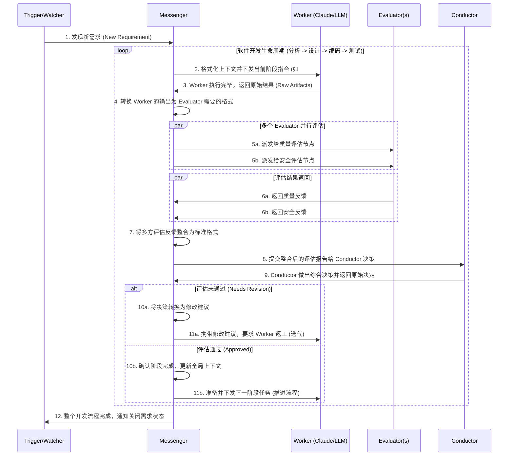

我现在基于Prompt工程创建了一个名为“My Virtual Tech Team”的AI Agent的项目。 当使用 “#analyze”等命令的时候，它将会指导LLM来完成任务。
现在我已经打通了整个软件开发的过程，从需求分析到设计，再到编码和测试。但是现在整个过程我都是手动操作，我需要和AI Agent进行交互，比如我会和analyst进行需求分析，等到他反馈了结果后，我再和architecture进行深度的讨论，直至完成整个软件开发过程。

现在我想要将整个流程自动化，当我在我的需求库中添加了需求的时候，AI Agent就可以自动从需求库中读取新的需求，然后完成整个开发过程。当前的Prompt工程已经适配了“Github Copilot”和“Claude Code”这两个平台。

## Design

### Role
**Trigger/Watcher**: 触发器/监听者。负责监听需求库（如 Github Issues, Notion 等）的变化，一旦有新需求，立即唤醒整个自动化工作流。
**Worker**: LLM agent, 实际执行任务的角色。比如 Claude Code 就是一个 Worker，负责根据需求分析、设计、编码和测试等任务进行操作。
**Messenger**: 负责传递信息的角色。 它会把从其他角色出得到的结果进行汇总和转换，成为系统需要的格式，然后再传递给接下来的角色。同时它也充当了**上下文管理器 (Context Manager)** 的职责。
**Evaluator**: 负责评估结果的角色。当worker完成一轮指令之后，可能会需要进行问题澄清或者反馈，此时就需要Evaluator来评估worker的结果，并给出反馈或者澄清问题。为了保证整个系统的质量，系统可能会引入多个Evaluator来进行评估。
**Conductor**: 当多个Evaluator给出反馈之后，Conductor会对这些反馈进行汇总和分析，最终给出一个综合的反馈结果，指导Worker进行下一步的操作。或者在评估通过时，推进到下一个开发阶段（如从分析进入设计）。

### Workflow

### Tech Stack
- Typescript: 作为主要的开发语言，适用于构建复杂的系统和处理异步操作。
- Claude Code Cli: 作为第一版中worker的实现

## System Requirements
1. 系统基于多个Role进行抽象，每个Role负责不同的职责，确保系统的模块化和可维护性。
2. Worker可以适配到多个不同的LLM平台，如Github Copilot和Claude Code，确保系统的灵活性和可扩展性。 第一版本只需要考虑Claude Code Cli的适配。
3. 系统支持3种模式来完成人机交互： 1. 全自动 2. 半自动（当worker的反馈需要评估者澄清时，人工介入） 3. 手动（所有的反馈交互都需要人工介入）。

## Keynotes
### 不同任务的上下文隔离
虽然不同的role他们都会通过llm完成（比如claude code），但是不同的角色应该有自己不同的上下文。 比如：当worker在工作的时候，他们是应该有项目的上下文。 但是作为evaluator,为了保证评估的客观性，他们应该是保证公正的上下文，只会有项目的背景信息。 而不是和worker共享同一个上下文。 这样可以保证评估的客观性和公正性。

### 上下文的回复与继续
当整个过程在流转的时候，因为会涉及到不同的Role之间的转换，但是不同角色使用隔离的上下文环境。 所以当状态流转回同一个角色的时候，应该继续使用该角色之前的上下文。 比如：当worker在分析阶段完成了任务之后，进入评估阶段，评估阶段会有一个新的上下文环境。 但是当评估阶段完成之后，流程又回到了worker进行设计阶段的工作，这时候应该继续使用之前worker的上下文环境。 这样可以保证worker在设计阶段的时候，依然可以访问到分析阶段的结果和相关信息。

## Architecture
### Key Points
+ 基于抽象编程，每个Role都是一个抽象类，定义了该角色的职责和接口。 具体的实现可以根据不同的LLM平台进行适配。

## Feature Roadmap
+ 未来将使用 electron 构建桌面端应用，便于构建可视化的卡通可视化界面，展示整个软件开发流程的状态和进展。
+ 用户可以自定义workflow，根据自己的需求来协调不同role之间的交互和流程
+ 系统将会在关键点中扩展hook点，便于用户在特定的阶段插入自定义的逻辑或者操作，比如在关键点完成后使用slack或者邮件通知相关人员，或者在评估阶段插入一个新的评估节点来进行特定的评估。