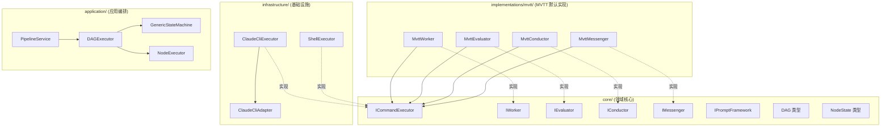

# Capibara Developer Handbook

> 版本: v2 (2026-03-20)
> 适用架构: ICommandExecutor + DAG Pipeline + MVTT 实现层

---

## 目录

1. [项目概述](#1-项目概述)
2. [技术栈](#2-技术栈)
3. [架构总览](#3-架构总览)
4. [目录结构](#4-目录结构)
5. [核心概念](#5-核心概念)
6. [数据流与执行流程](#6-数据流与执行流程)
7. [DI 容器与 Token](#7-di-容器与-token)
8. [配置参考](#8-配置参考)
9. [扩展指南](#9-扩展指南)
10. [编码规范](#10-编码规范)
11. [常见问题](#11-常见问题)

---

## 1. 项目概述

Capibara 是一个**自动化开发编排引擎**，通过角色协作（Worker、Evaluator、Conductor、Messenger）和 DAG Pipeline 驱动软件开发生命周期的各个阶段（分析、设计、实现、审查、测试）。

系统的核心理念：

- **角色分离** — 每个角色（Worker、Evaluator、Conductor、Messenger）有明确职责
- **执行可插拔** — 所有角色通过 `ICommandExecutor` 执行底层命令，后端可替换
- **编排灵活** — Pipeline 基于 DAG（有向无环图），支持线性、并行、条件分支
- **实现可替换** — 角色实现收敛在独立文件夹中（如 `implementations/mvtt/`），可整体替换

---

## 2. 技术栈

| 类别 | 技术 |
|------|------|
| 语言 | TypeScript 5.x (strict, ESM) |
| 运行时 | Node.js >= 22 LTS |
| DI 容器 | tsyringe |
| CLI 框架 | commander |
| 校验 | zod |
| 日志 | pino |
| 事件总线 | emittery |
| 测试 | vitest |
| 包管理 | pnpm |
| 构建 | tsc (ES2023, NodeNext) |

---

## 3. 架构总览

### 3.1 三层解耦模型

```
┌─────────────────────────────────────────────────────────┐
│  角色接口层 (core/interfaces/)                            │
│  IWorker, IEvaluator, IConductor, IMessenger             │
│  定义"做什么" — 纯领域契约，不关心执行方式                │
└────────────────────────┬────────────────────────────────┘
                         │ 实现
┌────────────────────────▼────────────────────────────────┐
│  实现层 (implementations/mvtt/)                          │
│  MvttWorker, MvttEvaluator, MvttConductor, MvttMessenger│
│  定义"做什么的具体逻辑" — prompt 组装 + 结果解析          │
│  薄层：仅组装 prompt，委托 ICommandExecutor 执行          │
└────────────────────────┬────────────────────────────────┘
                         │ 委托
┌────────────────────────▼────────────────────────────────┐
│  执行层 (infrastructure/executors/)                       │
│  ClaudeCliExecutor, ShellExecutor, (未来 HttpApiExecutor) │
│  定义"怎么执行" — 具体的命令执行后端                      │
│  实现 ICommandExecutor 接口                               │
└─────────────────────────────────────────────────────────┘
```

### 3.2 分层依赖规则

| 层级 | 允许依赖 | 禁止依赖 |
|------|----------|----------|
| `core/` | 无外部依赖（仅自身子模块） | application, implementations, infrastructure, config |
| `implementations/` | `core/` | infrastructure, application |
| `infrastructure/` | `core/` | implementations, application |
| `application/` | `core/` | implementations, infrastructure（通过 DI 注入） |
| `composition-root.ts` | 所有层（唯一允许跨层的文件） | — |

### 3.3 模块关系图



---

## 4. 目录结构

```
src/
├── core/                          # 领域核心（零外部依赖）
│   ├── interfaces/                # 角色 & 基础设施接口
│   │   ├── command-executor.interface.ts   ★ 通用命令执行接口
│   │   ├── worker.interface.ts
│   │   ├── evaluator.interface.ts
│   │   ├── conductor.interface.ts
│   │   ├── messenger.interface.ts
│   │   ├── prompt-framework.interface.ts
│   │   ├── event-bus.interface.ts
│   │   ├── state-store.interface.ts
│   │   ├── artifact-store.interface.ts
│   │   ├── trigger.interface.ts
│   │   └── index.ts
│   ├── types/                     # 所有类型定义
│   │   ├── command-executor.types.ts      ★ CommandRequest / CommandResponse
│   │   ├── dag.types.ts                   ★ PipelineDefinition / PipelineNode
│   │   ├── node-state.types.ts            ★ NodeState / PipelineExecutionState
│   │   ├── worker.types.ts
│   │   ├── evaluation.types.ts
│   │   ├── conductor.types.ts
│   │   ├── config.types.ts
│   │   ├── pipeline.types.ts
│   │   ├── cli.types.ts
│   │   └── ...
│   ├── constants/                 # 常量（权限、阶段）
│   └── errors/                    # 自定义错误类
│
├── implementations/               # 角色实现包
│   └── mvtt/                      # "My Virtual Tech Team" 默认实现
│       ├── mvtt-worker.ts
│       ├── mvtt-evaluator.ts          (基类)
│       ├── mvtt-quality-evaluator.ts
│       ├── mvtt-security-evaluator.ts
│       ├── mvtt-consistency-evaluator.ts
│       ├── mvtt-conductor.ts
│       ├── mvtt-messenger.ts
│       ├── mvtt-output-parser.ts
│       └── index.ts                   ★ registerMvtt() 工厂函数
│
├── infrastructure/                # 基础设施实现
│   ├── executors/                 # 命令执行器
│   │   ├── claude-cli.executor.ts     ★ Claude CLI 执行器
│   │   └── shell.executor.ts          ★ Shell 命令执行器
│   ├── cli-adapter/               # Claude CLI 底层适配器
│   │   └── claude-cli.adapter.ts
│   ├── pipeline/                  # Pipeline 定义加载
│   │   ├── pipeline-definition.loader.ts
│   │   └── default-pipeline.factory.ts
│   ├── persistence/               # 状态 & 产物持久化
│   ├── observability/             # 日志、事件、成本追踪
│   └── prompt-framework/          # Prompt 工程框架适配
│
├── application/                   # 应用编排层
│   ├── pipeline/
│   │   ├── pipeline.service.ts        ★ Pipeline 主入口
│   │   ├── dag-executor.ts            ★ DAG 编排引擎
│   │   └── node-executor.ts           ★ 单节点执行器
│   ├── state-machine/
│   │   └── generic-state-machine.ts   ★ 通用状态机
│   ├── context/                   # 上下文管理
│   └── human-interaction/         # 人工干预策略
│
├── config/                        # 配置加载 & 校验
├── roles/
│   └── trigger/                   # Trigger 独立于 MVTT
│       └── github-issues.trigger.ts
│
├── composition-root.ts            # DI 组装（唯一跨层文件）
├── tokens.ts                      # DI Token 定义
└── main.ts                        # CLI 入口
```

> ★ 标记为本次架构改造的核心文件

---

## 5. 核心概念

### 5.1 ICommandExecutor — 通用命令执行接口

所有角色（Worker、Evaluator、Conductor、Messenger）的底层执行都通过此接口，是整个架构的**核心抽象**。

```typescript
interface ICommandExecutor {
  readonly type: string;                              // 'claude-cli' | 'shell-command' | ...
  execute(request: CommandRequest): Promise<CommandResponse>;
  validate(): Promise<boolean>;
}
```

**CommandRequest** — 通用请求格式：

```typescript
interface CommandRequest {
  input: string;                    // 用户 prompt / 命令参数
  systemPrompt?: string;            // 系统提示（LLM 类执行器）
  systemPromptFile?: string;        // 系统提示文件路径（大 prompt 优先使用）
  cwd?: string;                     // 工作目录
  timeout?: number;                 // 超时（毫秒）
  options: Record<string, unknown>; // 执行器特有参数
}
```

**CommandResponse** — 通用响应格式：

```typescript
interface CommandResponse {
  success: boolean;
  output: string;                   // 原始输出
  duration: number;                 // 耗时（毫秒）
  metadata: Record<string, unknown>;// 执行器特有元数据
}
```

**当前可用执行器：**

| 执行器 | `type` | 说明 |
|--------|--------|------|
| `ClaudeCliExecutor` | `'claude-cli'` | 通过 Claude CLI 执行 LLM 调用（默认） |
| `ShellExecutor` | `'shell-command'` | 执行任意 Shell 命令 |

### 5.2 角色（Roles）

| 角色 | 接口 | 职责 |
|------|------|------|
| **Worker** | `IWorker` | 执行开发阶段的核心工作（分析、设计、编码等） |
| **Evaluator** | `IEvaluator` | 评估 Worker 产出物的质量/安全/一致性 |
| **Conductor** | `IConductor` | 基于评估结果做决策：approve / revise / escalate |
| **Messenger** | `IMessenger` | 角色间消息格式化、LLM 摘要、反馈综合 |
| **Trigger** | `ITrigger` | 外部事件源（GitHub Issues 等） |

### 5.3 MVTT 实现层

MVTT（My Virtual Tech Team）是角色的**默认实现包**，位于 `src/implementations/mvtt/`。

每个 MVTT 角色实现是一个**薄包装层**，仅做两件事：

1. **组装 prompt** — 使用 `IPromptFramework` 获取角色定义 + 知识库
2. **委托执行** — 将命令交给 `ICommandExecutor` 执行

```
MvttWorker.executeCommand(command)
  └─→ this.executor.execute({ input, systemPrompt, options })
        └─→ ClaudeCliExecutor → ClaudeCliAdapter → claude CLI 进程
```

### 5.4 DAG Pipeline

Pipeline 定义基于**有向无环图（DAG）**，由节点和边组成：

```typescript
interface PipelineDefinition {
  id: string;
  name: string;
  nodes: PipelineNodeDefinition[];  // 节点列表
  edges: PipelineEdgeDefinition[];  // 边列表（依赖关系）
  settings?: { defaultExecutorType?: string; budgetLimit?: number; ... };
}

interface PipelineNodeDefinition {
  id: string;
  type: 'worker' | 'evaluator' | 'aggregator' | 'gate';
  name: string;
  phase?: string;              // 关联的开发阶段
  executorType?: string;       // 覆盖默认执行器
  config: Record<string, unknown>;
}

interface PipelineEdgeDefinition {
  from: string;               // 源节点 ID
  to: string;                 // 目标节点 ID
  condition?: string;         // 条件表达式（未来支持）
}
```

**默认 Pipeline**（未配置自定义文件时自动生成）：

```
node-analyze → node-design → node-implement → node-review → node-test
```

### 5.5 GenericStateMachine

通用状态机替代了硬编码的状态枚举。状态由 `PipelineDefinition` 的节点列表**动态生成**：

```typescript
// 每个节点的运行时状态
type NodeStatus = 'pending' | 'ready' | 'running' | 'evaluating'
                | 'completed' | 'failed' | 'cancelled';
```

**状态转移：**
```
pending ──(所有依赖 completed)──→ running ──→ completed
                                       └──→ failed ──→ cancelled (所有兄弟)
```

---

## 6. 数据流与执行流程

### 6.1 整体执行流程

```
main.ts (CLI)
  └─→ bootstrap()                     # DI 组装
        └─→ PipelineService.run()     # Pipeline 入口
              ├─→ PipelineDefinitionLoader.load()  # 加载 DAG 定义
              ├─→ GenericStateMachine.initialize()  # 初始化节点状态
              └─→ DAGExecutor.execute()             # DAG 编排
                    └─→ 循环: getReadyNodes() → 并行执行
                          └─→ NodeExecutor.execute()      # 单节点执行
                                └─→ 反馈循环:
                                      1. Messenger.formatForWorker()
                                      2. Worker.executeCommand()
                                      3. Messenger.formatForEvaluator()
                                      4. Evaluator[].evaluate()  (并行)
                                      5. Messenger.synthesizeFeedback()
                                      6. Conductor.decide()
                                      7. approve → 完成 | revise → 回到 1
```

### 6.2 单节点反馈循环详解

```
┌─────────────────────────────────────────────────────┐
│                   NodeExecutor                       │
│                                                     │
│   ┌──────────┐    ┌──────────┐    ┌───────────┐    │
│   │ Messenger │───→│  Worker  │───→│ Messenger │    │
│   │ format   │    │ execute  │    │ format    │    │
│   │ ForWorker│    │ Command  │    │ ForEval   │    │
│   └──────────┘    └──────────┘    └─────┬─────┘    │
│                                         │           │
│                                         ▼           │
│   ┌──────────┐    ┌──────────┐    ┌───────────┐    │
│   │Conductor │◄───│ Messenger│◄───│ Evaluator │    │
│   │ decide() │    │ synthesize│   │ evaluate()│    │
│   └────┬─────┘    │ Feedback │    │  (并行)   │    │
│        │          └──────────┘    └───────────┘    │
│        │                                            │
│   approve → ✅ 完成                                 │
│   revise  → 🔄 回到 Messenger.formatForWorker       │
│   escalate→ ⚠️ 人工干预                             │
└─────────────────────────────────────────────────────┘
```

---

## 7. DI 容器与 Token

所有 Token 定义在 `src/tokens.ts`，所有注册在 `src/composition-root.ts`。

### 7.1 Token 清单

| Token | 类型 | 说明 |
|-------|------|------|
| `WORKER_TOKEN` | `IWorker` | Worker 角色 |
| `EVALUATOR_TOKEN` | `IEvaluator[]` | Evaluator 角色数组 |
| `CONDUCTOR_TOKEN` | `IConductor` | Conductor 角色 |
| `MESSENGER_TOKEN` | `IMessenger` | Messenger 角色 |
| `TRIGGER_TOKEN` | `ITrigger` | 事件触发器 |
| `COMMAND_EXECUTOR_TOKEN` | `ICommandExecutor` | 默认命令执行器 |
| `CLI_ADAPTER_TOKEN` | `ClaudeCliAdapter` | Claude CLI 底层适配器 |
| `STATE_STORE_TOKEN` | `IStateStore` | 状态持久化 |
| `ARTIFACT_STORE_TOKEN` | `IArtifactStore` | 产物存储 |
| `EVENT_BUS_TOKEN` | `IEventBus` | 事件总线 |
| `PROMPT_FRAMEWORK_TOKEN` | `IPromptFramework` | Prompt 工程框架 |
| `COST_TRACKER_TOKEN` | `CostTracker` | 成本追踪 |
| `PIPELINE_DEFINITION_LOADER_TOKEN` | `PipelineDefinitionLoader` | Pipeline 定义加载器 |
| `CONFIG_TOKEN` | `AutomationConfig` | 全局配置 |
| `LOGGER_TOKEN` | `Logger` | Pino 日志 |

### 7.2 注册顺序

`composition-root.ts` 中的注册顺序很重要：

```
1. Config (CONFIG_TOKEN)
2. Logger (LOGGER_TOKEN)
3. Infrastructure (CLI_ADAPTER_TOKEN, STATE_STORE_TOKEN, ...)
4. Command Executors (COMMAND_EXECUTOR_TOKEN)
5. Prompt Framework (PROMPT_FRAMEWORK_TOKEN)
6. MVTT Role Implementations → registerMvtt(container)
7. Pipeline Infrastructure (PIPELINE_DEFINITION_LOADER_TOKEN)
8. Trigger (TRIGGER_TOKEN)
9. PipelineService ← container.resolve()
```

---

## 8. 配置参考

配置文件路径通过 CLI `--config` 参数指定，支持 JSON 格式。

### 8.1 完整配置结构

```jsonc
{
  "cli": {
    "cliPath": "claude",           // Claude CLI 可执行文件路径
    "projectDir": ".",             // 项目工作目录
    "maxConcurrentProcesses": 3    // 最大并发进程数
  },
  "worker": {
    "defaultMaxTurns": 25,         // 默认最大 agentic 轮次
    "defaultTimeout": 600000       // 默认超时（毫秒，10 分钟）
  },
  "evaluator": {
    "dimensions": ["quality"],     // 评估维度: quality | security | consistency
    "maxTurns": 3,                 // 评估器最大轮次
    "parseRetries": 2              // 输出解析重试次数
  },
  "messenger": {
    "maxTurns": 2,                 // Messenger LLM 调用最大轮次
    "summarizeThreshold": 5000,    // 触发 LLM 摘要的字符阈值
    "fallbackToRaw": true          // 摘要失败时返回原文
  },
  "conductor": {
    "maxAttemptsPerPhase": 3,      // 每阶段最大重试次数
    "autoApproveThreshold": 80,    // 自动通过的分数阈值
    "escalateThreshold": 2,        // 触发人工干预的阈值
    "maxTurns": 1                  // Conductor LLM 调用最大轮次
  },
  "trigger": {
    "type": "manual"               // manual | github_issues
  },
  "pipeline": {
    "mode": "semi-auto",           // auto | semi-auto | manual
    "definitionFile": null,        // Pipeline DAG 定义文件路径（可选）
    "budgetLimit": 50              // 预算上限（美元）
  },
  "persistence": {
    "stateDir": ".pipeline/state", // 状态快照目录
    "logDir": ".pipeline/logs"     // 日志目录
  },
  "promptFramework": {
    "type": "ai-agents",           // Prompt 框架类型
    "rootDir": ".ai-agents"        // 框架根目录
  },
  "executor": {
    "defaultType": "claude-cli"    // 默认执行器类型
  }
}
```

### 8.2 自定义 Pipeline 定义文件

创建 JSON 或 YAML 文件，在 `pipeline.definitionFile` 中指定路径：

```json
{
  "id": "custom-pipeline",
  "name": "Custom Development Pipeline",
  "nodes": [
    { "id": "analyze", "type": "worker", "name": "Analysis", "phase": "analyze", "config": {} },
    { "id": "design", "type": "worker", "name": "Design", "phase": "design", "config": {} },
    { "id": "impl-a", "type": "worker", "name": "Implement Module A", "phase": "implement", "config": {} },
    { "id": "impl-b", "type": "worker", "name": "Implement Module B", "phase": "implement", "config": {} },
    { "id": "review", "type": "worker", "name": "Review", "phase": "review", "config": {} }
  ],
  "edges": [
    { "from": "analyze", "to": "design" },
    { "from": "design", "to": "impl-a" },
    { "from": "design", "to": "impl-b" },
    { "from": "impl-a", "to": "review" },
    { "from": "impl-b", "to": "review" }
  ],
  "settings": {
    "defaultExecutorType": "claude-cli"
  }
}
```

上面的例子中 `impl-a` 和 `impl-b` 会**并行执行**（都依赖 `design`，互不依赖），然后 `review` 等待两者完成。

---

## 9. 扩展指南

### 9.1 添加新的命令执行器

**场景：** 添加一个 HTTP API 执行器，调用外部 REST API。

**步骤 1** — 创建执行器文件 `src/infrastructure/executors/http-api.executor.ts`：

```typescript
import type { ICommandExecutor } from '../../core/interfaces/command-executor.interface.js';
import type { CommandRequest, CommandResponse } from '../../core/types/command-executor.types.js';

export class HttpApiExecutor implements ICommandExecutor {
  readonly type = 'http-api';

  async execute(request: CommandRequest): Promise<CommandResponse> {
    const url = request.options.url as string;
    const method = (request.options.method as string) ?? 'POST';
    const headers = request.options.headers as Record<string, string> ?? {};

    const startTime = Date.now();
    const response = await fetch(url, {
      method,
      headers: { 'Content-Type': 'application/json', ...headers },
      body: JSON.stringify({ input: request.input }),
    });

    const output = await response.text();
    return {
      success: response.ok,
      output,
      duration: Date.now() - startTime,
      metadata: { statusCode: response.status },
    };
  }

  async validate(): Promise<boolean> { return true; }
}
```

**步骤 2** — 在 `composition-root.ts` 中注册：

```typescript
import { HttpApiExecutor } from './infrastructure/executors/http-api.executor.js';

// 在 executor registry 中添加
executorRegistry.set('http-api', new HttpApiExecutor());
```

完成。所有角色实现无需任何修改即可使用新的执行器。

### 9.2 添加新的角色实现包

**场景：** 创建一套 "Custom Team" 角色实现，替换 MVTT。

**步骤 1** — 创建 `src/implementations/custom-team/` 文件夹：

```
src/implementations/custom-team/
  ├── custom-worker.ts
  ├── custom-evaluator.ts
  ├── custom-conductor.ts
  ├── custom-messenger.ts
  └── index.ts              # registerCustomTeam()
```

**步骤 2** — 每个角色实现对应的 `core/` 接口：

```typescript
// custom-worker.ts
import type { IWorker } from '../../core/interfaces/worker.interface.js';
import type { ICommandExecutor } from '../../core/interfaces/command-executor.interface.js';

export class CustomWorker implements IWorker {
  constructor(private executor: ICommandExecutor, /* ... */) {}

  async executeCommand(command) {
    // 你的自定义 prompt 组装逻辑
    return this.executor.execute({ input: ..., options: { ... } });
  }
  // ...
}
```

**步骤 3** — 提供注册工厂：

```typescript
// index.ts
export function registerCustomTeam(container: DependencyContainer): void {
  container.register(WORKER_TOKEN, { useFactory: (c) => new CustomWorker(...) });
  container.register(EVALUATOR_TOKEN, { useValue: [...] });
  container.register(CONDUCTOR_TOKEN, { useFactory: (c) => new CustomConductor(...) });
  container.register(MESSENGER_TOKEN, { useFactory: (c) => new CustomMessenger(...) });
}
```

**步骤 4** — 在 `composition-root.ts` 中替换注册调用：

```typescript
// 替换
// import { registerMvtt } from './implementations/mvtt/index.js';
// registerMvtt(container);

// 为
import { registerCustomTeam } from './implementations/custom-team/index.js';
registerCustomTeam(container);
```

### 9.3 添加新的评估维度

**步骤 1** — 在 `core/types/evaluation.types.ts` 中添加维度名：

```typescript
export type EvaluationDimension = 'quality' | 'security' | 'consistency' | 'performance';
```

**步骤 2** — 创建 `implementations/mvtt/mvtt-performance-evaluator.ts`：

```typescript
import { MvttEvaluator } from './mvtt-evaluator.js';

export class MvttPerformanceEvaluator extends MvttEvaluator {
  protected readonly dimension = 'performance' as const;

  protected buildSystemPrompt(): string {
    return `你是性能评估专家。关注：响应时间、内存使用、N+1 查询、缓存策略...`;
  }
}
```

**步骤 3** — 在 `implementations/mvtt/index.ts` 中注册：

```typescript
import { MvttPerformanceEvaluator } from './mvtt-performance-evaluator.js';

// 在 evaluatorMap 中添加
const evaluatorMap = {
  quality: MvttQualityEvaluator,
  security: MvttSecurityEvaluator,
  consistency: MvttConsistencyEvaluator,
  performance: MvttPerformanceEvaluator,  // ← 新增
};
```

**步骤 4** — 配置文件中启用：

```json
{
  "evaluator": {
    "dimensions": ["quality", "security", "performance"]
  }
}
```

---

## 10. 编码规范

### 10.1 命名规则

| 对象 | 规则 | 示例 |
|------|------|------|
| 接口 | `I` + PascalCase | `IWorker`, `ICommandExecutor` |
| 类型/枚举 | PascalCase | `Phase`, `NodeStatus`, `CommandRequest` |
| 类 | PascalCase | `MvttWorker`, `ClaudeCliExecutor` |
| DI Token | UPPER_SNAKE + `_TOKEN` | `WORKER_TOKEN`, `COMMAND_EXECUTOR_TOKEN` |
| 文件 | kebab-case | `claude-cli.executor.ts`, `mvtt-worker.ts` |
| 目录 | kebab-case | `cli-adapter/`, `state-machine/` |

### 10.2 导入规则

```typescript
// ✅ 正确：使用 type-only import
import type { IWorker } from '../../core/interfaces/worker.interface.js';

// ✅ 正确：使用 .js 扩展名（ESM 要求）
import { MvttWorker } from './mvtt-worker.js';

// ❌ 错误：缺少 .js 扩展名
import { MvttWorker } from './mvtt-worker';

// ❌ 错误：跨层导入（非 composition-root）
import { ClaudeCliAdapter } from '../../infrastructure/cli-adapter/claude-cli.adapter.js';
```

### 10.3 DI 规则

- 所有 Token 定义在 `src/tokens.ts`
- 所有注册在 `src/composition-root.ts`（或由 `registerMvtt()` 等工厂函数）
- 不在 `composition-root.ts` 以外使用 `container.resolve()`
- 单元测试直接注入 mock，不使用真实容器

### 10.4 错误处理

- 自定义错误继承 `AppError`（`core/errors/base.error.ts`）
- Pipeline 错误先通过 EventBus 发出事件再抛出
- 外部边界（用户输入、API 响应）才做校验，内部代码信任框架保证

---

## 11. 常见问题

### Q: 如何更换默认执行器？

在配置文件中设置：
```json
{ "executor": { "defaultType": "shell-command" } }
```

### Q: 如何让特定 Pipeline 节点使用不同的执行器？

在 Pipeline 定义的节点上指定 `executorType`：
```json
{ "id": "lint", "type": "worker", "name": "Linter", "executorType": "shell-command", "config": {} }
```

> 注意：当前版本 NodeExecutor 使用全局注入的默认执行器，节点级执行器选择需要后续实现。

### Q: 如何查看 Pipeline 执行的实时状态？

通过 EventBus 订阅事件。所有关键节点都会发出事件：
- `pipeline:started` / `pipeline:completed` / `pipeline:failed`
- `phase:started` / `phase:completed` / `phase:retry`
- `worker:started` / `worker:completed`
- `evaluator:started` / `evaluator:completed`
- `conductor:decided`

### Q: `systemPromptFile` 什么时候使用？

当系统提示词（角色定义 + 知识库 + 规则）超过 Windows 命令行长度限制（~8K）时。优先级：
1. 如果 `systemPromptFile` 已提供 → 直接使用文件路径
2. 如果仅 `systemPrompt` → ClaudeCliAdapter 自动写入临时文件

### Q: Pipeline resume 功能是否可用？

当前版本 `resume()` 未实现（DAG 状态恢复需要额外设计）。如需恢复中断的 Pipeline，请重新启动。

### Q: 配置变更后需要重启吗？

是的。所有执行器和角色实现在启动时通过 DI 注册，运行时不支持热更新。
