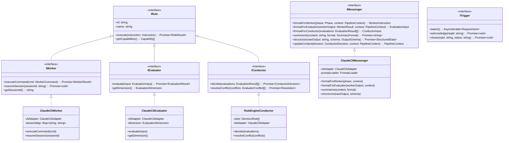
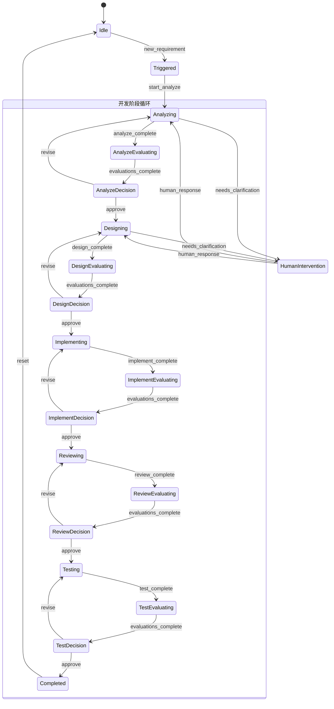

# My Virtual Tech Team — 自动化落地详细设计文档

> **版本**: v1.1  
> **日期**: 2026-03-14  
> **状态**: 设计评估阶段

---

## 目录

1. [执行摘要](#1-执行摘要)
2. [关键技术决策评估](#2-关键技术决策评估)
   - 2.1 [Claude Code CLI vs Anthropic SDK](#21-claude-code-cli-vs-anthropic-sdk)
   - 2.2 [各 Role 的 LLM 实现策略](#22-各-role-的-llm-实现策略)
   - 2.3 [系统架构支撑方案](#23-系统架构支撑方案)
3. [系统架构设计](#3-系统架构设计)
   - 3.1 [整体架构](#31-整体架构)
   - 3.2 [核心模块设计](#32-核心模块设计)
   - 3.3 [数据流与状态管理](#33-数据流与状态管理)
   - 3.4 [上下文隔离与恢复机制](#34-上下文隔离与恢复机制)
4. [Claude Code CLI 实现层方案](#4-claude-code-cli-实现层方案)
   - 4.1 [CLI 交互模型](#41-cli-交互模型)
   - 4.2 [会话管理](#42-会话管理)
   - 4.3 [进程池与并发控制](#43-进程池与并发控制)
   - 4.4 [输出解析](#44-输出解析)
   - 4.5 [工具权限控制](#45-工具权限控制)
5. [各 Role 实现方案](#5-各-role-实现方案)
6. [三种交互模式设计](#6-三种交互模式设计)
7. [风险点与关注点](#7-风险点与关注点)
8. [实施路线图](#8-实施路线图)
9. [附录：核心接口定义](#9-附录核心接口定义)

---

## 1. 执行摘要

本文档是对 "My Virtual Tech Team" 自动化方案的深度落地评估。当前项目已构建了一套成熟的 Prompt 工程框架（6 个 Agent、14 条命令、知识库、工作流定义），可在 GitHub Copilot 和 Claude Code 两个平台上通过人工 `#command` 驱动运行。

**自动化目标**：将现有的手动 `#analyze → #design → #implement → #review → #test` 流程，升级为从需求库自动触发、多角色协作、带评估反馈环的全自动/半自动软件开发管道。

**核心结论**：

| 决策点 | 推荐方案 | 理由 |
|--------|---------|------|
| Worker 实现 | Claude Code CLI | 已内置文件编辑、终端执行等编码工具，无需重建 |
| Evaluator 实现 | Claude Code CLI（只读模式） | 通过 `--disallowedTools` 限制为只读，独立 session 保证评估客观性，且可直接读取项目文件验证产出 |
| Conductor 实现 | 本地规则引擎 + Claude Code CLI（兜底） | 决策逻辑可预编码，复杂冲突场景 fallback 到 CLI 调用 |
| Messenger 实现 | TypeScript 逻辑 + Claude Code CLI（汇总/转换） | 基础格式转换用代码完成；复杂的内容汇总、摘要和结构化转换需要 LLM 能力 |
| Trigger 实现 | 纯 TypeScript 逻辑层 | GitHub API 轮询（第一版）→ Webhook（后续），无需 LLM |

---

## 2. 关键技术决策评估

### 2.1 Claude Code CLI vs Anthropic SDK

这是整个方案中最关键的技术决策。经过深入评估，**统一使用 Claude Code CLI** 作为所有需要 LLM 能力的角色的实现层，通过 CLI 的参数组合（`--session-id`、`--disallowedTools`、`--system-prompt`、`--max-turns`）实现角色间的能力差异和上下文隔离。

#### 2.1.1 Claude Code CLI 特性分析

```
claude [选项] [提示内容]
```

**关键能力：**

| 能力 | CLI 参数 | 说明 |
|------|---------|------|
| 非交互模式 | `--print` / `-p` | 单轮对话，执行后退出，适合自动化 |
| 会话恢复 | `--resume` / `--continue` | 恢复最近一次对话，保持上下文连续性 |
| 会话 ID | `--session-id <id>` | 指定恢复特定会话，支持多会话并行 |
| 系统提示 | `--system-prompt <text>` | 注入自定义系统提示，可用于角色设定 |
| 自定义指令追加 | `--append-system-prompt <text>` | 在默认系统提示后追加内容 |
| 工具控制 | `--allowedTools <tools>` | 限制可用工具集合（文件编辑、终端等） |
| 不允许的工具 | `--disallowedTools <tools>` | 禁止使用的工具集合 |
| 输出格式 | `--output-format json\|text\|stream-json` | JSON 格式便于程序解析 |
| 最大轮次 | `--max-turns <n>` | 限制 agent 循环次数，防止无限执行 |
| MCP 配置 | `--mcp-config <file>` | 加载 MCP 服务器配置 |
| 工作目录 | `--cwd <dir>` | 指定执行的工作目录 |
| 无权限确认 | `--dangerously-skip-permissions` | 跳过权限确认（自动化模式必需） |

**优势：**
- ✅ **内置完整编码工具链**：文件读写、终端命令、代码搜索等，无需自行实现
- ✅ **会话管理已内建**：`--session-id` + `--resume` 直接支持上下文恢复
- ✅ **JSON 输出**：`--output-format json` 结构化输出易于程序解析
- ✅ **权限控制粒度细**：可精确控制 Worker 能访问哪些工具
- ✅ **零额外开发成本**：开箱即用，spawn 进程即可

**劣势：**
- ❌ **进程级别调用**：每次调用都是一个独立进程，资源开销较大
- ❌ **输出解析风险**：即使 JSON 格式，内容仍可能包含非结构化文本
- ❌ **会话持久化依赖 CLI 内部机制**：crash 后会话恢复不可控
- ❌ **无法精确控制 token 消耗**：CLI 内部的上下文管理对外透明
- ❌ **并行限制**：同一工作目录可能产生文件冲突

#### 2.1.2 Anthropic SDK 特性分析

```typescript
import Anthropic from '@anthropic-ai/sdk';
const client = new Anthropic();
```

**优势：**
- ✅ **完全可编程**：消息级别控制，精确构造上下文
- ✅ **上下文隔离天然支持**：每次调用独立，可精确注入不同上下文
- ✅ **成本可控**：精确统计 token，可实现预算管理
- ✅ **并行友好**：多个 API 调用可并发执行
- ✅ **结构化输出**：可使用 tool_use 强制结构化响应
- ✅ **流式响应**：支持 streaming，实时获取进度

**劣势：**
- ❌ **无内置编码工具**：文件编辑、终端执行需全部自行实现
- ❌ **上下文管理复杂**：需要自行管理消息历史和 token 窗口
- ❌ **API Key 管理**：需要额外的密钥管理
- ❌ **工具开发成本高**：如果 Worker 需要编码能力，相当于重建 Claude Code

#### 2.1.3 统一 CLI 策略（最终结论）

```
┌──────────────────────────────────────────────────────────────────────────┐
│                     统一 Claude Code CLI 调用策略                         │
├─────────────┬──────────────────┬──────────────────┬─────────────────────┤
│   Role      │   实现方式        │   会话策略        │   工具权限           │
├─────────────┼──────────────────┼──────────────────┼─────────────────────┤
│ Worker      │ Claude Code CLI  │ 持久会话(resume)  │ 全部(按阶段调整)      │
│ Evaluator   │ Claude Code CLI  │ 一次性会话(隔离)   │ 只读(禁止写和执行)    │
│ Conductor   │ 规则引擎 + CLI   │ 一次性会话        │ 无文件操作            │
│ Messenger   │ TS逻辑 + CLI     │ 一次性会话        │ 只读                 │
│ Trigger     │ 纯 TypeScript    │ —                │ —                   │
└─────────────┴──────────────────┴──────────────────┴─────────────────────┘
```

**统一 CLI 的核心优势**：
- **架构简洁**：所有 LLM 调用通过同一个 `ClaudeCliAdapter`，一套接口统一管理
- **认证统一**：CLI 自身管理认证，无需额外管理 API Key
- **Evaluator 可读项目文件**：比 SDK 方案更强——Evaluator 可以直接读取源文件验证 Worker 的产出是否真实存在
- **调试便利**：每个角色的 session 都可独立 `--resume` 回溯排查

**角色隔离通过三个 CLI 参数组合实现**：
- `--session-id`：独立会话 ID，确保不同角色的上下文隔离
- `--disallowedTools`：按角色禁用工具，限制能力边界
- `--system-prompt`：注入不同角色的 persona 和约束
- `--max-turns`：控制执行深度，防止非核心角色过度执行

### 2.2 各 Role 的 LLM 实现策略

#### 2.2.1 Worker 的 LLM 策略

Worker 是执行实际开发任务的核心角色，**必须**使用 Claude Code CLI。

**指令传递方式**：
```typescript
// Worker 接收的指令格式
interface WorkerInstruction {
  command: string;        // "#analyze", "#design", "#implement", "#review", "#test"
  input: string;          // 命令参数（如需求文档内容）
  systemPrompt: string;   // 角色设定 + 项目约束
  sessionId?: string;     // 会话恢复 ID
  maxTurns?: number;      // 最大执行轮次
  allowedTools?: string[]; // 允许的工具集
}
```

**上下文构造**：
```
System Prompt = 基础角色设定 (来自 agents/{agent}.md)
              + 共享规则 (来自 agents/_shared.md)
              + 命令指令 (来自 agents/_commands/{command}.md)
              + 项目上下文 (来自 workspace/project-context.yaml)
              + 当前阶段的知识库内容 (来自 knowledge/)
```

Worker 的 LLM 通过 CLI 的 `--system-prompt` 参数注入已有框架的 agent prompt，形成了 **框架 Prompt 复用**——现有的 `.ai-agents/` 下的所有 prompt 文件直接作为自动化系统的输入，无需重写。

#### 2.2.2 Evaluator 的 LLM 策略

Evaluator **必须**使用 Anthropic SDK 直接调用，原因：

1. **上下文隔离**：Evaluator 不应看到 Worker 的完整对话历史，只看到输出物
2. **客观性保证**：独立的 API 调用没有"先入为主"的上下文污染
3. **并行执行**：多个 Evaluator 可同时评估，SDK 调用天然支持并发
4. **成本优化**：Evaluator 的上下文远小于 Worker，可使用更小的模型/更少的 token

**Evaluator 上下文构造**：
```
System Prompt = 评估角色设定
              + 评估维度（质量/安全/性能/一致性）
              + 评估标准（来自 knowledge/core/review-principles.md）

User Message  = 项目简介（project-context.yaml 的 project 段）
              + 当前阶段需求摘要
              + Worker 的输出产物（待评估内容）
              + 评估问题模板
```

**多 Evaluator 并行模型**：

| Evaluator | 评估维度 | 输入上下文 | 评估标准来源 |
|-----------|---------|-----------|------------|
| Quality Evaluator | 代码质量、设计合理性 | Worker 输出 + 需求摘要 | review-principles.md |
| Security Evaluator | 安全漏洞、敏感数据 | Worker 输出 + 安全规范 | OWASP Top 10 |
| Consistency Evaluator | 与需求/设计的一致性 | Worker 输出 + 原始需求 + 设计文档 | project-context.yaml |

#### 2.2.3 Conductor 的 LLM 策略

Conductor 采用**规则优先、CLI LLM 兜底**的混合策略：

**可预编码的决策（规则引擎处理，约80% 场景）**：
```typescript
// 80% 的场景可以用规则处理，零 LLM 成本
if (allEvaluatorsApproved()) {
  return { decision: 'approve', nextPhase: getNextPhase() };
}
if (anyCriticalIssue()) {
  return { decision: 'revise', feedback: collectCriticalFeedback() };
}
if (allMinorIssues()) {
  return { decision: 'approve_with_notes', notes: collectMinorFeedback() };
}
```

**需要 LLM 的场景（CLI 调用，约20% 场景）**：
```bash
# 例如：多个 Evaluator 意见冲突，需要综合判断
claude --print \
  --system-prompt "你是决策协调者。根据多方评估结果做出综合决策。输出 JSON: {action, reason, feedback[]}" \
  --disallowedTools "Edit,MultiEdit,Bash,Write,Read" \  # 禁止所有文件/终端操作
  --output-format json \
  --max-turns 1 \
  "请分析以下评估结果并做出决策: ..."
```

Conductor 的 CLI 调用禁用所有工具（包括 Read），因为它不需要访问项目文件，只需要对输入的评估数据进行分析和决策。

#### 2.2.4 Messenger 的 LLM 策略

Messenger 采用 **TypeScript 逻辑优先、CLI LLM 辅助** 的策略。大部分格式转换可用代码完成，但以下场景需要 LLM 能力：

**需要 LLM 的场景**：

| 场景 | 说明 | 示例 |
|------|------|------|
| **内容汇总** | 将 Worker 的大量原始输出压缩为精简摘要 | Worker 的 implement 输出可能有数千行，需要缩减为 Evaluator 可消化的摘要 |
| **结构化转换** | 将非结构化的 LLM 输出转换为程序可处理的 JSON | Worker 的自由文本输出需要提取关键信息并结构化 |
| **反馈整合** | 将多个 Evaluator 的反馈整合为 Worker 可理解的修改建议 | 多维度评估结果需要融合、去重、排序后生成统一的修改指导 |
| **上下文摘要** | 当 Worker session token 溢出时生成历史摘要 | 将前序阶段的关键产出物压缩为摘要注入新 session |

**Messenger CLI 调用方式**：
```bash
claude --print \
  --system-prompt "你是一个专业的内容处理助手。你的职责是将输入内容进行汇总、摘要或结构化转换。严格按照要求的 JSON 格式输出。" \
  --disallowedTools "Edit,MultiEdit,Bash,Write" \  # 只读，不修改文件
  --output-format json \
  --max-turns 2 \
  "请将以下内容汇总为...格式: ..."
```

**Messenger 的双层处理模型**：
```
输入数据 ──▶ TypeScript 逻辑层（快速路径）
              │
              ├── 简单格式转换 → 直接输出（无需 LLM）
              │   例如: JSON 字段映射、模板填充
              │
              └── 复杂内容处理 → CLI LLM 调用后输出（需要 LLM）
                  例如: 内容摘要、多源汇总、自由文本结构化
```

### 2.3 系统架构支撑方案

#### 2.3.1 架构模式选型

**推荐：事件驱动 + 状态机 (Event-Driven + State Machine)**

理由：
1. **软件开发生命周期本质是状态流转**：`analyze → design → implement → review → test`，每个阶段是有限状态
2. **状态机保证流程正确性**：防止非法状态跳转，确保每个阶段有明确的前置条件和产出
3. **事件驱动支撑解耦**：各 Role 之间通过事件通信，不直接依赖
4. **天然支持重试和恢复**：状态持久化后，crash 后可从最后状态恢复

**不推荐的替代方案及理由**：

| 方案 | 不推荐原因 |
|------|-----------|
| 简单队列（FIFO） | 无法处理评估反馈环的循环逻辑 |
| 工作流引擎（如 Temporal） | 过重，引入额外基础设施，第一版不需要 |
| 纯 Actor 模型 | 调试困难，状态分散 |
| 简单脚本串联 | 无法处理失败重试、并行评估、人工介入 |

#### 2.3.2 核心架构约束

1. **单一需求串行处理**（第一版）：一次只处理一个需求，避免并发文件冲突
2. **幂等操作设计**：任何阶段都可以安全重试
3. **Crash Recovery**：基于持久化状态，进程重启后自动恢复到最后稳定状态
4. **可观测性**：每个状态转移都产生日志事件

---

## 3. 系统架构设计

### 3.1 整体架构

```
┌─────────────────────────────────────────────────────────────────────┐
│                        Automation Engine                            │
│                                                                     │
│  ┌──────────┐   ┌──────────────┐   ┌──────────────────────────┐    │
│  │ Trigger  │──▶│  Messenger   │──▶│     Pipeline Engine       │    │
│  │ (Watcher)│   │ (Context Mgr)│   │  ┌────────────────────┐  │    │
│  └──────────┘   └──────┬───────┘   │  │  State Machine     │  │    │
│                        │           │  │  ┌──┐ ┌──┐ ┌──┐    │  │    │
│                        │           │  │  │A │→│D │→│I │→...│  │    │
│                        │           │  │  └──┘ └──┘ └──┘    │  │    │
│                        │           │  └────────────────────┘  │    │
│                        │           │           │               │    │
│  ┌──────────┐          │           │     ┌─────┴─────┐        │    │
│  │  Worker  │◀─────────┼───────────┤     │ Conductor │        │    │
│  │ (Claude  │          │           │     └─────┬─────┘        │    │
│  │  Code    │──────────┼───────────┤           │               │    │
│  │  CLI)    │          │           │  ┌────────┴────────┐     │    │
│  └──────────┘          │           │  │ Evaluator Pool  │     │    │
│                        │           │  │ ┌───┐ ┌───┐ ┌───┐│     │    │
│                        │           │  │ │E1 │ │E2 │ │E3 ││     │    │
│                        │           │  │ └───┘ └───┘ └───┘│     │    │
│                        │           │  └─────────────────┘     │    │
│                        │           └──────────────────────────┘    │
│                        │                                           │
│  ┌─────────────────────┴──────────────────────────────────┐       │
│  │              Persistence Layer                          │       │
│  │  ┌──────────┐ ┌──────────────┐ ┌────────────────┐     │       │
│  │  │ State DB │ │ Artifact     │ │ Session        │     │       │
│  │  │ (JSON)   │ │ Store (fs)   │ │ Store (CLI)    │     │       │
│  │  └──────────┘ └──────────────┘ └────────────────┘     │       │
│  └────────────────────────────────────────────────────────┘       │
│                                                                     │
│  ┌─────────────────────────────────────────────────────────┐       │
│  │              Observability Layer                         │       │
│  │  ┌──────────┐ ┌──────────────┐ ┌────────────────┐     │       │
│  │  │ Logger   │ │ Event Bus    │ │ Metrics        │     │       │
│  │  └──────────┘ └──────────────┘ └────────────────┘     │       │
│  └─────────────────────────────────────────────────────────┘       │
└─────────────────────────────────────────────────────────────────────┘
```

### 3.2 核心模块设计

#### 3.2.1 模块职责矩阵

```
src/
├── core/                          # 核心抽象层
│   ├── interfaces/                # 所有角色的抽象接口
│   │   ├── role.interface.ts      # Role 基础接口
│   │   ├── worker.interface.ts    # Worker 接口
│   │   ├── evaluator.interface.ts # Evaluator 接口
│   │   ├── conductor.interface.ts # Conductor 接口
│   │   ├── messenger.interface.ts # Messenger 接口
│   │   └── trigger.interface.ts   # Trigger 接口
│   ├── types/                     # 类型定义
│   │   ├── pipeline.types.ts      # 流水线相关类型
│   │   ├── context.types.ts       # 上下文类型
│   │   └── evaluation.types.ts    # 评估结果类型
│   └── state-machine/             # 状态机引擎
│       ├── states.ts              # 状态定义
│       ├── transitions.ts         # 转移规则
│       └── engine.ts              # 状态机运行时
│
├── roles/                         # 角色实现层
│   ├── worker/
│   │   ├── worker.base.ts         # Worker 基类
│   │   └── claude-cli.worker.ts   # Claude Code CLI 实现 (持久会话)
│   ├── evaluator/
│   │   ├── evaluator.base.ts      # Evaluator 基类
│   │   ├── quality.evaluator.ts   # 质量评估器 (CLI 只读模式)
│   │   ├── security.evaluator.ts  # 安全评估器 (CLI 只读模式)
│   │   └── consistency.evaluator.ts # 一致性评估器 (CLI 只读模式)
│   ├── conductor/
│   │   ├── conductor.base.ts      # Conductor 基类
│   │   └── rule-engine.conductor.ts # 规则引擎 + CLI LLM 兜底
│   ├── messenger/
│   │   ├── messenger.base.ts      # Messenger 基类
│   │   ├── claude-cli.messenger.ts # CLI LLM 实现 (汇总/结构化)
│   │   └── output-parser.ts       # CLI 输出解析器 (多策略)
│   └── trigger/
│       ├── trigger.base.ts        # Trigger 基类
│       └── github-issues.trigger.ts # GitHub Issues 触发器
│
├── cli-adapter/                   # 统一 CLI 适配层
│   ├── claude-cli.adapter.ts      # CLI 调用封装
│   ├── process-pool.ts            # 进程池 (Semaphore 控制并发)
│   └── output-parser.ts           # 多策略输出解析器
│
├── pipeline/                      # 流水线编排层
│   ├── pipeline.ts                # 流水线主控
│   ├── phase-executor.ts          # 阶段执行器
│   └── feedback-loop.ts           # 评估反馈环
│
├── context/                       # 上下文管理层
│   ├── context-manager.ts         # 上下文管理器
│   ├── context-builder.ts         # 上下文构造器(为不同Role构建不同上下文)
│   └── session-store.ts           # 会话存储
│
├── persistence/                   # 持久化层
│   ├── state-store.ts             # 状态持久化
│   ├── artifact-store.ts          # 产物存储
│   └── log-store.ts               # 日志存储
│
├── config/                        # 配置层
│   ├── config.ts                  # 配置管理
│   └── config.schema.ts           # 配置 Schema 验证
│
└── index.ts                       # 入口
```

#### 3.2.2 核心类关系



### 3.3 数据流与状态管理

#### 3.3.1 状态机定义



#### 3.3.2 状态持久化结构

```typescript
interface PipelineState {
  id: string;                          // Pipeline 实例 ID
  requirementId: string;               // 需求 ID (如 GitHub Issue #)
  changeId: string;                    // 变更 ID: {YYYYMMDD}-{slug}
  currentState: PipelineStateName;     // 当前状态机状态
  currentPhase: Phase;                 // 当前开发阶段
  phaseAttempts: Record<Phase, number>; // 每个阶段的重试次数
  
  context: {
    requirement: RequirementData;       // 原始需求数据
    artifacts: Record<Phase, string>;   // 每个阶段的产出物路径
    evaluations: Record<Phase, EvaluationResult[]>; // 每个阶段的评估结果
    decisions: Record<Phase, ConductorDecision[]>;  // Conductor 的决策记录
  };
  
  sessions: {
    workerSessionId: string;            // Worker 的 CLI 会话 ID
    workerSessionPhase: Phase;          // Worker 会话对应的阶段
  };

  metadata: {
    createdAt: string;
    updatedAt: string;
    status: 'running' | 'paused' | 'completed' | 'failed';
    mode: 'auto' | 'semi-auto' | 'manual';
    totalTokensUsed: number;
    totalCost: number;
  };
}
```

### 3.4 上下文隔离与恢复机制

这是设计文档中明确提出的关键需求，实现方案如下：

#### 3.4.1 上下文隔离模型

```
┌────────────────────────────────────────────────────────────┐
│                    Context Isolation Model                   │
│           (所有角色均通过 CLI，用参数组合实现隔离)               │
│                                                              │
│  ┌──────────────── Worker Context ────────────────────┐     │
│  │ ✅ 完整项目源代码                                      │     │
│  │ ✅ 完整对话历史（通过 CLI session 维护）                 │     │
│  │ ✅ Agent Prompt (analyst.md / developer.md / ...)     │     │
│  │ ✅ 知识库 (knowledge/ 目录)                            │     │
│  │ ✅ 项目上下文 (project-context.yaml)                   │     │
│  │ ✅ 前序阶段的产出物 (artifacts/)                        │     │
│  │ ✅ 全部工具（按阶段调整）                                │     │
│  │ 🔄 持久会话（跨阶段 resume）                            │     │
│  └────────────────────────────────────────────────────────┘     │
│                                                              │
│  ┌──────────── Evaluator Context (隔离) ────────────────┐   │
│  │ ✅ 项目简介（project-context.yaml 的 project 段）       │   │
│  │ ✅ 当前阶段需求摘要（精简版）                             │   │
│  │ ✅ Worker 的输出产物（被评估对象）                        │   │
│  │ ✅ 评估标准（评估维度的规则和检查清单）                     │   │
│  │ ✅ Read/Search 工具（可读取项目文件验证产出）              │   │
│  │ ❌ 不含完整对话历史                                      │   │
│  │ ❌ 不含 Worker 的内部推理过程                             │   │
│  │ ❌ 无写/编辑/终端工具                                   │   │
│  │ 🔄 一次性会话（每次评估独立 session）                    │   │
│  └──────────────────────────────────────────────────────┘   │
│                                                              │
│  ┌──────────── Messenger Context ─────────────────────┐   │
│  │ ✅ 各角色的原始输出（待汇总/转换的内容）                  │   │
│  │ ✅ 目标格式约束（JSON Schema / 模板）                    │   │
│  │ ✅ Read 工具（可读取 artifacts 文件）                      │   │
│  │ ❌ 不含完整对话历史                                      │   │
│  │ ❌ 无写/编辑/终端工具                                   │   │
│  │ 🔄 一次性会话（每次调用独立 session）                    │   │
│  └──────────────────────────────────────────────────────┘   │
│                                                              │
│  ┌──────────── Conductor Context ─────────────────────┐     │
│  │ ✅ 所有 Evaluator 的评估结果                           │     │
│  │ ✅ 当前阶段的基本信息（阶段名称、重试次数）                │     │
│  │ ✅ 历史决策记录                                        │     │
│  │ ❌ 不含项目源代码                                       │     │
│  │ ❌ 不含 Worker 的原始输出                               │     │
│  │ ❌ 无任何文件/终端工具                                  │     │
│  │ 🔄 一次性会话（规则引擎无法处理时才调用 CLI）            │     │
│  └────────────────────────────────────────────────────────┘     │
└────────────────────────────────────────────────────────────┘
```

#### 3.4.2 Worker 上下文恢复机制

```typescript
class WorkerSessionManager {
  // 每个 Pipeline 维护一个 Worker 会话
  private sessionMap: Map<string, string> = new Map(); // pipelineId → sessionId
  
  /**
   * 恢复 Worker 会话
   * 当流程从 Evaluator/Conductor 回到 Worker 时，
   * 恢复之前的 CLI 会话，保持上下文连续性
   */
  async resumeOrCreate(pipelineId: string, phase: Phase): Promise<string> {
    const existingSessionId = this.sessionMap.get(pipelineId);
    
    if (existingSessionId) {
      // 恢复已有会话 — Worker 可以看到之前所有阶段的对话
      return existingSessionId;
    }
    
    // 首次创建会话
    const newSessionId = generateSessionId(pipelineId);
    this.sessionMap.set(pipelineId, newSessionId);
    return newSessionId;
  }
}
```

**关键设计决策**：Worker 贯穿整个 Pipeline 使用同一个 CLI Session。这意味着：
- Worker 在 `#analyze` 阶段建立的上下文，在 `#design` 阶段依然可见
- 评估环节不会污染 Worker 的上下文（因为评估使用独立的 CLI session，与 Worker session 完全隔离）
- 如果 CLI session 因 token 限制被截断，通过 Messenger（借助 LLM）生成关键上下文摘要注入新 session 来补偿

---

## 4. Claude Code CLI 实现层方案

### 4.1 CLI 交互模型

#### 4.1.1 调用封装

```typescript
import { spawn } from 'child_process';

interface ClaudeCliOptions {
  prompt: string;
  systemPrompt?: string;
  appendSystemPrompt?: string;
  sessionId?: string;
  resume?: boolean;
  outputFormat?: 'json' | 'text' | 'stream-json';
  maxTurns?: number;
  allowedTools?: string[];
  disallowedTools?: string[];
  cwd?: string;
  timeout?: number;  // 毫秒
}

interface ClaudeCliResult {
  success: boolean;
  output: string;           // 完整输出
  sessionId: string;        // 会话 ID（用于后续恢复）
  tokensUsed?: number;      // 消耗的 token 数
  costUsd?: number;         // 消耗的费用
  exitCode: number;
}

class ClaudeCliAdapter {
  private cliPath: string;
  
  async execute(options: ClaudeCliOptions): Promise<ClaudeCliResult> {
    const args = this.buildArgs(options);
    
    return new Promise((resolve, reject) => {
      const proc = spawn(this.cliPath, args, {
        cwd: options.cwd,
        env: { ...process.env },
        stdio: ['pipe', 'pipe', 'pipe'],
      });
      
      let stdout = '';
      let stderr = '';
      
      proc.stdout.on('data', (data) => { stdout += data.toString(); });
      proc.stderr.on('data', (data) => { stderr += data.toString(); });
      
      // 超时控制
      const timer = options.timeout 
        ? setTimeout(() => { proc.kill('SIGTERM'); }, options.timeout)
        : null;
      
      proc.on('close', (code) => {
        if (timer) clearTimeout(timer);
        resolve({
          success: code === 0,
          output: stdout,
          sessionId: this.extractSessionId(stdout, options),
          exitCode: code ?? 1,
        });
      });
      
      proc.on('error', (err) => {
        if (timer) clearTimeout(timer);
        reject(err);
      });
      
      // 发送 prompt 到 stdin（如果以 pipe 模式传入）
      if (options.prompt) {
        proc.stdin.write(options.prompt);
        proc.stdin.end();
      }
    });
  }

  private buildArgs(options: ClaudeCliOptions): string[] {
    const args: string[] = ['--print', '--output-format', options.outputFormat ?? 'json'];
    
    if (options.systemPrompt) {
      args.push('--system-prompt', options.systemPrompt);
    }
    if (options.appendSystemPrompt) {
      args.push('--append-system-prompt', options.appendSystemPrompt);
    }
    if (options.sessionId) {
      args.push('--session-id', options.sessionId);
    }
    if (options.resume) {
      args.push('--resume');
    }
    if (options.maxTurns) {
      args.push('--max-turns', String(options.maxTurns));
    }
    if (options.allowedTools?.length) {
      args.push('--allowedTools', options.allowedTools.join(','));
    }
    if (options.disallowedTools?.length) {
      args.push('--disallowedTools', options.disallowedTools.join(','));
    }

    // 自动化模式必须跳过权限确认
    args.push('--dangerously-skip-permissions');
    
    // prompt 作为最后一个参数
    args.push(options.prompt);
    
    return args;
  }
}
```

### 4.2 会话管理

#### 4.2.1 会话生命周期

```
Pipeline 创建 ──▶ 首次 Worker 调用 ──▶ 创建 Claude CLI Session
                                          │
                     ┌────────────────────┘
                     ▼
              Worker: #analyze         (session-id: abc-123)
                     │
                     ▼
              [Messenger 汇总产出]      (独立 CLI session, 用于内容摘要/结构化)
                     │
                     ▼
              [Evaluator 评估]          (独立 CLI session, 只读模式, 不影响 Worker session)
                     │
                     ▼
              [Conductor 决策]          (规则引擎 / 独立 CLI session)
                     │
                     ▼
              Worker: #design          (resume session: abc-123)
                     │                  ▲ Worker 可看到 analyze 阶段的对话
                     ▼
              [Messenger 汇总产出]      (独立 CLI session)
                     │
                     ▼
              [Evaluator 评估]          (独立 CLI session)
                     │
                     ▼
              Worker: #implement       (resume session: abc-123)
                     │                  ▲ Worker 可看到 analyze + design 的对话
                     ▼
              ... 以此类推 ...
                     │
              Pipeline 完成 ──▶ 会话归档
```

> **关键设计点**：只有 Worker 使用持久会话（resume）。Messenger、Evaluator、Conductor 每次调用都是独立的一次性 session，确保彼此上下文完全隔离。

#### 4.2.2 会话 Token 溢出处理

Claude Code CLI 有 context window 限制。当长时间运行的 session 积累过多上下文时：

```typescript
class SessionOverflowStrategy {
  private readonly TOKEN_THRESHOLD = 150_000; // 接近限制时触发
  
  async handleOverflow(pipelineId: string, context: PipelineContext): Promise<void> {
    // 策略1: 让 Messenger 使用 LLM 生成当前状态摘要
    const summary = await this.messenger.summarize(
      this.collectPhaseOutputs(context),
      { style: 'context-recovery', template: RECOVERY_SUMMARY_TEMPLATE }
    );
    
    // 策略2: 创建新 session，注入摘要作为 system prompt 的一部分
    const newSessionId = generateSessionId(pipelineId + '-continued');
    
    await this.worker.execute({
      prompt: `继续之前的工作。以下是之前阶段的摘要：\n${summary}`,
      sessionId: newSessionId,
      systemPrompt: this.buildSystemPrompt(context),
    });
    
    // 更新 session 映射
    this.sessionMap.set(pipelineId, newSessionId);
  }
}
```

### 4.3 进程池与并发控制

多个角色（尤其是并行 Evaluator）会同时 spawn CLI 进程，需要控制并发：

```typescript
class CliProcessPool {
  private semaphore: Semaphore;
  private cliAdapter: ClaudeCliAdapter;
  
  constructor(maxConcurrent: number = 3) {
    this.semaphore = new Semaphore(maxConcurrent);
    this.cliAdapter = new ClaudeCliAdapter();
  }
  
  async execute(options: ClaudeCliOptions): Promise<ClaudeCliResult> {
    await this.semaphore.acquire();
    try {
      return await this.cliAdapter.execute(options);
    } finally {
      this.semaphore.release();
    }
  }
  
  /**
   * 并行执行多个 CLI 调用，受 semaphore 控制
   * 用于多 Evaluator 并行评估场景
   */
  async executeParallel(optionsList: ClaudeCliOptions[]): Promise<ClaudeCliResult[]> {
    return Promise.all(optionsList.map(opts => this.execute(opts)));
  }
}
```

### 4.4 输出解析

#### 4.4.1 JSON 输出结构

当使用 `--output-format json` 时，Claude Code CLI 返回：

```typescript
interface ClaudeCliJsonOutput {
  type: 'result';
  subtype: 'success' | 'error_max_turns';
  is_error: boolean;
  duration_ms: number;
  duration_api_ms: number;
  num_turns: number;
  result: string;          // 最终文本输出
  total_cost_usd: number;  // 累计费用（会话级别）
  session_id: string;
}
```

#### 4.4.2 产出物提取策略

Worker 的输出包含在 `result` 字段中，但真正的产出物（代码文件、设计文档等）已经通过 CLI 的文件操作工具写入了文件系统。Messenger 的提取策略：

```typescript
class ArtifactExtractor {
  /**
   * 从 Worker 执行后的文件系统中提取产出物
   * 而不是从 CLI 的文本输出中解析
   */
  async extractArtifacts(phase: Phase, changeId: string): Promise<Artifact[]> {
    const artifactDir = path.join(this.workspaceDir, 'workspace', 'artifacts', changeId);
    
    // 读取 Worker 更新后的 project-context.yaml
    const projectContext = await this.readProjectContext();
    
    // 读取 Worker 更新后的 session.yaml
    const sessionState = await this.readSessionState();
    
    // 读取阶段特定的产出物
    const phaseArtifacts = await this.readPhaseArtifacts(artifactDir, phase);
    
    // 对于 implement 阶段，还需要收集变更的源代码文件
    if (phase === 'implement') {
      const changedFiles = await this.detectChangedFiles();
      phaseArtifacts.push(...changedFiles);
    }
    
    return phaseArtifacts;
  }
}
```

### 4.5 工具权限控制

所有使用 CLI 的角色通过 `--disallowedTools` 参数实现能力边界控制：

#### 4.5.1 Worker 工具权限（按阶段）

| 阶段 | 允许的工具 | 禁止的工具 | 理由 |
|------|-----------|-----------|------|
| `#analyze` | Read, Search, Write (artifacts only) | Edit source code, Terminal | 分析阶段不应修改源代码 |
| `#design` | Read, Search, Write (artifacts only) | Edit source code, Terminal | 设计阶段不应修改源代码 |
| `#implement` | Read, Write, Edit, Terminal, Search | — | 实现阶段需要所有编码工具 |
| `#review` | Read, Search, Write (artifacts only) | Edit source code, Terminal | 审查阶段不应修改代码 |
| `#test` | Read, Write, Edit, Terminal, Search | — | 测试阶段需要编写和运行测试 |

#### 4.5.2 各角色工具权限总表

| 角色 | Read | Search | Write | Edit | Bash | max-turns | 会话策略 |
|------|------|--------|-------|------|------|-----------|---------|
| **Worker** | ✅ | ✅ | ✅ | 按阶段 | 按阶段 | 25 | 持久(resume) |
| **Evaluator** | ✅ | ✅ | ❌ | ❌ | ❌ | 3 | 一次性 |
| **Messenger** | ✅ | ❌ | ❌ | ❌ | ❌ | 2 | 一次性 |
| **Conductor** | ❌ | ❌ | ❌ | ❌ | ❌ | 1 | 一次性 |

```typescript
// Worker 按阶段的权限
const WORKER_PHASE_PERMISSIONS: Record<Phase, { disallowed?: string[] }> = {
  analyze:   { disallowed: ['Edit', 'MultiEdit', 'Bash'] },
  design:    { disallowed: ['Edit', 'MultiEdit', 'Bash'] },
  implement: { /* 所有工具都允许 */ },
  review:    { disallowed: ['Edit', 'MultiEdit', 'Bash'] },
  test:      { /* 所有工具都允许 */ },
};

// 非 Worker 角色的权限
const ROLE_PERMISSIONS: Record<string, { disallowed: string[], maxTurns: number }> = {
  evaluator:  { disallowed: ['Edit', 'MultiEdit', 'Bash', 'Write'], maxTurns: 3 },
  messenger:  { disallowed: ['Edit', 'MultiEdit', 'Bash', 'Write', 'Search'], maxTurns: 2 },
  conductor:  { disallowed: ['Edit', 'MultiEdit', 'Bash', 'Write', 'Read', 'Search'], maxTurns: 1 },
};
```

---

## 5. 各 Role 实现方案

### 5.1 Trigger (GitHub Issues 触发器)

```typescript
class GitHubIssuesTrigger implements ITrigger {
  private octokit: Octokit;
  private pollInterval: number;    // 默认 60 秒
  private filterLabels: string[];  // 如 ['auto-dev', 'requirement']
  
  /**
   * 轮询 GitHub Issues，返回新需求
   * 匹配标签 + 状态为 open + 未被处理的 issue
   */
  async *watch(): AsyncIterable<Requirement> {
    while (true) {
      const issues = await this.octokit.issues.listForRepo({
        owner: this.owner,
        repo: this.repo,
        labels: this.filterLabels.join(','),
        state: 'open',
        sort: 'created',
        direction: 'asc',
      });
      
      for (const issue of issues.data) {
        if (!await this.isProcessed(issue.number)) {
          yield this.toRequirement(issue);
        }
      }
      
      await this.sleep(this.pollInterval);
    }
  }
  
  async acknowledge(reqId: string): Promise<void> {
    // 给 Issue 添加 "in-progress" 标签
    await this.octokit.issues.addLabels({
      owner: this.owner, repo: this.repo,
      issue_number: parseInt(reqId),
      labels: ['in-progress'],
    });
  }
  
  async close(reqId: string, status: string): Promise<void> {
    // 完成后关闭 Issue 并添加评论
    await this.octokit.issues.update({
      owner: this.owner, repo: this.repo,
      issue_number: parseInt(reqId),
      state: 'closed',
    });
  }
}
```

### 5.2 Messenger (上下文管理器 + LLM 辅助)

Messenger 采用双层处理模型：简单格式转换用 TypeScript 代码完成，复杂的内容汇总/摘要/结构化转换通过 CLI LLM 调用完成。

```typescript
class ClaudeCliMessenger implements IMessenger {
  private cliAdapter: ClaudeCliAdapter;    // 统一的 CLI 适配器
  private promptLoader: PromptLoader;      // 加载 .ai-agents/ 下的 prompt 文件
  private contextBuilder: ContextBuilder;   // 构建不同 Role 的上下文
  
  /**
   * 为 Worker 构建指令
   * 复用现有 .ai-agents/ 框架的 prompt 文件
   */
  formatForWorker(phase: Phase, context: PipelineContext): WorkerInstruction {
    const agentFile = this.getAgentFile(phase);      // analyst.md / developer.md / ...
    const commandFile = this.getCommandFile(phase);   // analyze.md / design.md / ...
    const sharedRules = this.promptLoader.load('agents/_shared.md');
    const knowledge = this.loadKnowledge(phase);
    
    // 组装 system prompt: Agent定义 + 共享规则 + 命令 + 知识库
    const systemPrompt = [
      this.promptLoader.load(agentFile),
      sharedRules,
      this.promptLoader.load(commandFile),
      knowledge,
    ].join('\n\n---\n\n');
    
    // 用户输入: 需求内容 + 上一阶段产物（如果有）
    const userPrompt = this.buildUserPrompt(phase, context);
    
    return {
      command: `#${phase}`,
      input: userPrompt,
      systemPrompt,
      sessionId: context.workerSessionId,
      maxTurns: this.getMaxTurns(phase),
      allowedTools: WORKER_PHASE_PERMISSIONS[phase]?.allowed,
      disallowedTools: WORKER_PHASE_PERMISSIONS[phase]?.disallowed,
    };
  }

  /**
   * 为 Evaluator 构建评估输入
   * 注意：刻意排除 Worker 的对话历史，只提供输出产物
   */
  formatForEvaluator(
    workerOutput: WorkerResult,
    context: PipelineContext
  ): EvaluationInput {
    return {
      projectSummary: this.extractProjectSummary(context),  // 精简项目信息
      phaseSummary: this.extractPhaseSummary(context),      // 当前阶段摘要
      artifact: workerOutput.artifact,                       // Worker 的产出物
      evaluationCriteria: this.loadEvaluationCriteria(context.currentPhase),
    };
  }

  /**
   * 【LLM 辅助】将 Worker 的大量原始输出汇总为精简摘要
   * 用于传递给 Evaluator 或在 session 溢出时注入新会话
   */
  async summarize(content: string, format: SummaryFormat): Promise<string> {
    const result = await this.cliAdapter.execute({
      prompt: `请将以下内容汇总为${format.style}格式，保留关键信息，去除冗余细节：\n\n${content}\n\n输出格式要求：${format.template}`,
      systemPrompt: MESSENGER_SYSTEM_PROMPT,
      disallowedTools: ROLE_PERMISSIONS.messenger.disallowed,
      maxTurns: ROLE_PERMISSIONS.messenger.maxTurns,
      outputFormat: 'json',
      cwd: this.projectDir,
    });
    
    return this.parseCliOutput(result).summary;
  }

  /**
   * 【LLM 辅助】将非结构化的 LLM 输出转换为程序可处理的结构化数据
   * 用于将 Worker/Evaluator 的自由文本输出转为 JSON 结构
   */
  async structurize(rawOutput: string, schema: OutputSchema): Promise<StructuredData> {
    const result = await this.cliAdapter.execute({
      prompt: `请将以下内容转换为指定的 JSON 格式。\n\n原始内容：\n${rawOutput}\n\n目标 JSON Schema：\n${JSON.stringify(schema)}\n\n请严格按照 Schema 输出 JSON，不要包含额外文字。`,
      systemPrompt: MESSENGER_SYSTEM_PROMPT,
      disallowedTools: ROLE_PERMISSIONS.messenger.disallowed,
      maxTurns: ROLE_PERMISSIONS.messenger.maxTurns,
      outputFormat: 'json',
      cwd: this.projectDir,
    });
    
    return this.parseStructuredOutput(result, schema);
  }

  /**
   * 【LLM 辅助】将多个 Evaluator 的反馈整合为 Worker 可理解的修改建议
   * 融合、去重、排序后生成统一的修改指导
   */
  async synthesizeFeedback(
    evaluations: EvaluationResult[],
    context: PipelineContext
  ): Promise<string> {
    const rawFeedback = evaluations.map(e => 
      `[${e.dimension}评估 - ${e.verdict}]\n${e.issues.map(i => 
        `- [${i.severity}] ${i.category}: ${i.description}${i.suggestion ? ` → ${i.suggestion}` : ''}`
      ).join('\n')}`
    ).join('\n\n');
    
    const result = await this.cliAdapter.execute({
      prompt: `请将以下多个评估者的反馈整合为一份统一的修改建议。要求：\n1. 合并重复问题\n2. 按严重程度排序（critical > major > minor > suggestion）\n3. 为每个问题给出明确的修改指导\n4. 输出为 JSON 数组格式\n\n评估反馈：\n${rawFeedback}`,
      systemPrompt: MESSENGER_SYSTEM_PROMPT,
      disallowedTools: ROLE_PERMISSIONS.messenger.disallowed,
      maxTurns: ROLE_PERMISSIONS.messenger.maxTurns,
      outputFormat: 'json',
      cwd: this.projectDir,
    });
    
    return this.parseCliOutput(result).feedback;
  }
  
  /**
   * 根据 Conductor 决策更新全局上下文
   * 纯 TypeScript 逻辑，不需要 LLM
   */
  updateContext(
    decision: ConductorDecision,
    context: PipelineContext
  ): PipelineContext {
    if (decision.action === 'approve') {
      return {
        ...context,
        completedPhases: [...context.completedPhases, context.currentPhase],
        currentPhase: this.getNextPhase(context.currentPhase),
      };
    } else {
      return {
        ...context,
        revisionFeedback: decision.feedback,
        phaseAttempts: {
          ...context.phaseAttempts,
          [context.currentPhase]: (context.phaseAttempts[context.currentPhase] ?? 0) + 1,
        },
      };
    }
  }
}

const MESSENGER_SYSTEM_PROMPT = `你是一个专业的内容处理助手。你的职责是将输入内容进行汇总、摘要或结构化转换。
规则：
1. 严格按照要求的格式输出
2. 保留关键信息，去除冗余
3. 不要添加主观评价或额外建议
4. 输出必须是程序可解析的格式`;
```

### 5.3 Evaluator (Claude Code CLI 只读模式)

```typescript
class ClaudeCliEvaluator implements IEvaluator {
  private cliAdapter: ClaudeCliAdapter;
  private dimension: EvaluationDimension;
  private systemPrompt: string;
  
  constructor(dimension: EvaluationDimension, config: EvaluatorConfig) {
    this.cliAdapter = config.cliAdapter;
    this.dimension = dimension;
    this.systemPrompt = this.buildSystemPrompt(dimension);
  }
  
  async evaluate(input: EvaluationInput): Promise<EvaluationResult> {
    const prompt = this.formatEvaluationPrompt(input);
    
    const result = await this.cliAdapter.execute({
      prompt,
      systemPrompt: this.systemPrompt,
      // 独立会话，与 Worker 完全隔离
      sessionId: `eval-${input.pipelineId}-${input.phase}-${this.dimension}`,
      // 只读模式：禁止所有写操作
      disallowedTools: ROLE_PERMISSIONS.evaluator.disallowed,
      maxTurns: ROLE_PERMISSIONS.evaluator.maxTurns,
      outputFormat: 'json',
      cwd: input.projectDir,
    });
    
    // 从 CLI JSON 输出中提取结构化评估结果
    return this.parseEvaluationResult(result);
  }
  
  /**
   * 从 CLI 输出中解析评估结果
   * 由于 CLI 没有 SDK 的 tool_use 强制结构化机制，
   * 需要多策略解析 + 重试保障
   */
  private parseEvaluationResult(cliResult: ClaudeCliResult): EvaluationResult {
    const output = cliResult.output;
    
    // 策略1：尝试从 result 中直接匹配 JSON 块
    const jsonMatch = output.match(/```json\n([\s\S]*?)\n```/);
    if (jsonMatch) {
      const parsed = JSON.parse(jsonMatch[1]);
      if (this.isValidEvaluation(parsed)) {
        return { ...parsed, dimension: this.dimension };
      }
    }
    
    // 策略2：尝试整体 JSON 解析（result 本身就是 JSON）
    try {
      const cliJson = JSON.parse(output);
      const resultText = cliJson.result || output;
      const parsed = JSON.parse(resultText);
      if (this.isValidEvaluation(parsed)) {
        return { ...parsed, dimension: this.dimension };
      }
    } catch { /* 继续下一策略 */ }
    
    // 策略3：解析失败，返回强制结构化请求的默认结果
    return {
      dimension: this.dimension,
      verdict: 'needs_revision',
      score: 0,
      issues: [{
        severity: 'major',
        category: 'parse_error',
        description: '评估结果解析失败，需要人工审查',
      }],
      summary: '评估输出格式异常，无法自动解析',
    };
  }

  private buildSystemPrompt(dimension: EvaluationDimension): string {
    const dimensionDescriptions: Record<EvaluationDimension, string> = {
      quality: '你是一个代码质量评估专家。重点关注：代码设计合理性、可读性、可维护性、模式遵循度。',
      security: '你是一个安全评估专家。重点关注：OWASP Top 10 安全漏洞、敏感数据泄露、注入攻击、权限控制。',
      consistency: '你是一个一致性评估专家。重点关注：实现与需求的一致性、与设计文档的一致性、接口契约遵循度。',
    };
    
    return `${dimensionDescriptions[dimension]}

规则：
1. 只评估，绝对不要修改任何文件
2. 你可以使用 Read 工具读取项目中的文件来验证产出物的真实性
3. 输出必须为以下 JSON 格式（使用 \`\`\`json 代码块）：
{
  "verdict": "pass|pass_with_notes|needs_revision|critical_issues",
  "score": 0-100,
  "issues": [{"severity": "critical|major|minor|suggestion", "category": "...", "description": "...", "suggestion": "..."}],
  "summary": "一句话总结"
}`;
  }
  
  getDimension(): EvaluationDimension {
    return this.dimension;
  }
}
```

### 5.4 Conductor (规则引擎 + CLI LLM)

```typescript
class RuleEngineConductor implements IConductor {
  private rules: DecisionRule[];
  private cliAdapter: ClaudeCliAdapter;
  private maxRetries: number;

  async decide(evaluations: EvaluationResult[]): Promise<ConductorDecision> {
    // 阶段1: 规则引擎快速决策（零 LLM 成本，约80%场景）
    const ruleDecision = this.applyRules(evaluations);
    if (ruleDecision) return ruleDecision;
    
    // 阶段2: CLI LLM 辅助复杂决策（约20%场景）
    return this.llmDecide(evaluations);
  }
  
  private applyRules(evaluations: EvaluationResult[]): ConductorDecision | null {
    // 规则1: 任何 Evaluator 发现 critical issue → 必须修改
    const criticalIssues = evaluations.flatMap(e => 
      e.issues.filter(i => i.severity === 'critical')
    );
    if (criticalIssues.length > 0) {
      return {
        action: 'revise',
        reason: `发现 ${criticalIssues.length} 个关键问题`,
        feedback: criticalIssues.map(i => `[${i.category}] ${i.description}: ${i.suggestion}`),
        priority: 'critical',
      };
    }
    
    // 规则2: 所有 Evaluator 都通过 → 推进到下一阶段
    if (evaluations.every(e => e.verdict === 'pass')) {
      return { action: 'approve', reason: '所有评估通过' };
    }
    
    // 规则3: 都是 pass_with_notes → 通过但记录建议
    if (evaluations.every(e => ['pass', 'pass_with_notes'].includes(e.verdict))) {
      const notes = evaluations.flatMap(e => 
        e.issues.filter(i => i.severity === 'suggestion')
      );
      return { action: 'approve', reason: '通过（附建议）', notes };
    }
    
    // 规则4: 超过最大重试次数 → 暂停等待人工介入
    // (由 Pipeline 层处理，非 Conductor 职责)
    
    // 无匹配规则 → 返回 null，交给 LLM 处理
    return null;
  }
  
  private async llmDecide(evaluations: EvaluationResult[]): Promise<ConductorDecision> {
    // 处理复杂场景: Evaluator 意见冲突、边界情况等
    const result = await this.cliAdapter.execute({
      prompt: `请分析以下评估结果并做出决策。

评估结果：
${JSON.stringify(evaluations, null, 2)}

请输出 JSON 格式的决策：
\`\`\`json
{
  "action": "approve|revise|escalate",
  "reason": "决策理由",
  "feedback": ["修改建议1", "修改建议2"],
  "priority": "critical|normal"
}
\`\`\``,
      systemPrompt: '你是决策协调者。根据多方评估结果做出综合决策。分析冲突点，权衡利弊，给出明确的行动建议。输出必须为 JSON 格式。',
      disallowedTools: ROLE_PERMISSIONS.conductor.disallowed,
      maxTurns: ROLE_PERMISSIONS.conductor.maxTurns,
      outputFormat: 'json',
    });
    
    return this.parseConductorDecision(result);
  }
}
```

### 5.5 Pipeline (编排引擎)

```typescript
class Pipeline {
  private stateMachine: StateMachine;
  private messenger: IMessenger;
  private worker: IWorker;
  private evaluators: IEvaluator[];
  private conductor: IConductor;
  private stateStore: StateStore;

  async run(requirement: Requirement, mode: InteractionMode): Promise<PipelineResult> {
    const context = await this.initContext(requirement);
    
    for (const phase of PHASES) {
      context.currentPhase = phase;
      let approved = false;
      
      while (!approved) {
        // 1. Worker 执行
        this.stateMachine.transition(`start_${phase}`);
        const workerInstruction = this.messenger.formatForWorker(phase, context);
        const workerResult = await this.worker.executeCommand(workerInstruction);
        
        // 2. Messenger 汇总产出物（可能调用 LLM 进行摘要）
        const artifacts = await this.extractArtifacts(phase, context.changeId);
        const artifactSummary = await this.messenger.summarize(
          artifacts.map(a => a.content).join('\n'),
          { style: 'evaluation-ready', template: EVAL_SUMMARY_TEMPLATE }
        );
        this.stateMachine.transition(`${phase}_complete`);
        
        // 3. 并行评估（多个 CLI 进程并行）
        const evalInput = this.messenger.formatForEvaluator(workerResult, context);
        const evaluations = await this.evaluateWithPool(evalInput);
        this.stateMachine.transition('evaluations_complete');
        
        // 4. Messenger 整合多方反馈 + Conductor 决策
        const synthesizedFeedback = await this.messenger.synthesizeFeedback(evaluations, context);
        const decision = await this.conductor.decide(evaluations);
        
        // 5. 处理决策
        if (decision.action === 'approve') {
          approved = true;
          context = this.messenger.updateContext(decision, context);
        } else {
          // 检查重试次数
          const attempts = (context.phaseAttempts[phase] ?? 0) + 1;
          if (attempts >= this.maxAttemptsPerPhase) {
            if (mode === 'auto') {
              // 全自动模式下超过重试次数 → 降级为半自动
              await this.requestHumanIntervention(phase, decision, context);
            }
            // 手动/半自动模式 → 等待人工反馈
            const humanFeedback = await this.waitForHuman(context);
            context.revisionFeedback = humanFeedback;
          } else {
            context = this.messenger.updateContext(decision, context);
          }
        }
        
        // 持久化状态（用于 crash recovery）
        await this.stateStore.save(context);
      }
    }
    
    return { success: true, changeId: context.changeId };
  }
}
```

---

## 6. 三种交互模式设计

### 6.1 模式对比

```
┌────────────────────────────────────────────────────────────────┐
│                    三种交互模式                                  │
├──────────┬─────────────┬──────────────┬──────────────────────┤
│          │   全自动      │   半自动      │     手动              │
├──────────┼─────────────┼──────────────┼──────────────────────┤
│ Worker   │ 自动执行     │ 自动执行      │ 人工确认后执行         │
│ 执行     │             │              │                      │
├──────────┼─────────────┼──────────────┼──────────────────────┤
│ 评估     │ 自动评估     │ 自动评估      │ 自动评估 + 人工确认    │
│ 反馈     │ 自动处理     │ 人工介入      │ 人工介入              │
├──────────┼─────────────┼──────────────┼──────────────────────┤
│ 阶段     │ 自动推进     │ 需人工确认    │ 需人工确认            │
│ 推进     │             │ 推进          │                      │
├──────────┼─────────────┼──────────────┼──────────────────────┤
│ 重试     │ 超限后降级   │ 超限后暂停等  │ 每次都暂停            │
│ 策略     │ 为半自动     │ 待人工        │                      │
├──────────┼─────────────┼──────────────┼──────────────────────┤
│ 适用     │ 简单/标准    │ 中等复杂度    │ 高风险/复杂            │
│ 场景     │ 需求         │ 需求          │ 需求                  │
└──────────┴─────────────┴──────────────┴──────────────────────┘
```

### 6.2 人工介入点设计

```typescript
interface HumanInterventionPoint {
  phase: Phase;
  trigger: 'revision_limit' | 'clarification_needed' | 'manual_mode' | 'critical_decision';
  context: {
    currentState: string;
    workerOutput: string;
    evaluations: EvaluationResult[];
    conductorDecision: ConductorDecision;
    question?: string;
  };
}

class HumanInteractionHandler {
  /**
   * 半自动模式: 通过 GitHub Issue 评论与人交互
   */
  async requestViaGitHub(point: HumanInterventionPoint): Promise<string> {
    const comment = this.formatInterventionComment(point);
    await this.octokit.issues.createComment({
      owner: this.owner,
      repo: this.repo,
      issue_number: point.issueNumber,
      body: comment,
    });
    
    // 等待人工在 Issue 中回复
    return this.waitForReply(point.issueNumber);
  }
  
  /**
   * 手动模式: 通过终端交互
   */
  async requestViaTerminal(point: HumanInterventionPoint): Promise<string> {
    console.log(this.formatInterventionPrompt(point));
    return this.readTerminalInput();
  }
}
```

---

## 7. 风险点与关注点

### 7.1 高风险项

| # | 风险 | 影响 | 概率 | 缓解策略 |
|---|------|------|------|---------|
| R1 | **CLI Session Token 溢出** | Worker 丢失之前阶段上下文，输出质量骤降 | 高 | 实现 SessionOverflowStrategy，在接近限制时主动摘要+重建会话 |
| R2 | **Worker 无限循环** | 消耗大量 token/资金且不产出有效结果 | 中 | `--max-turns` 限制 + 阶段级重试上限 + 强制超时 |
| R3 | **Evaluator 误判** | 好的产出被拒绝导致反复修改，或差的产出被放行 | 中 | 多 Evaluator 交叉验证 + Conductor 综合判断 + 人工兜底 |
| R4 | **Claude Code CLI 版本兼容性** | CLI 参数/输出格式变更导致系统中断 | 中 | 封装 CLI 适配器层，版本检测 + 输出格式兼容处理 |
| R5 | **并发文件冲突** | 多个 Pipeline 同时修改同一文件 | 低(V1) | V1 严格串行；V2 考虑 git branch 隔离 |
| R6 | **成本失控** | 大量 CLI 调用导致费用超预期 | 中 | 实时统计 token 消耗 + 阶段/总量预算上限 + 告警 |
| R7 | **`--dangerously-skip-permissions` 安全风险** | Worker 可能执行危险操作(如 rm -rf) | 中 | 通过 `--allowedTools` / `--disallowedTools` 精确控制可用工具；实现阶段关闭不需要的工具；目标项目使用 git 做安全网 |
| R8 | **CLI 结构化输出不稳定** | Evaluator/Messenger 的 CLI 输出可能不符合预期 JSON 格式 | 中 | 多策略解析（JSON块匹配 → 整体解析 → 重试） + 强化 prompt 中的格式约束 + 失败降级处理 |

### 7.2 中等风险项

| # | 风险 | 缓解策略 |
|---|------|---------|
| R8 | **CLI 进程异常退出** | 进程异常检测 + 自动重试（基于持久化状态恢复） |
| R9 | **Anthropic API 限流** | 指数退避重试 + 并发控制 + 可选降级为串行评估 |
| R10 | **产出质量不稳定** | 温度参数控制 + 评估标准持续优化 + 人工反馈收集 |
| R11 | **上下文构建错误** | Messenger 的 prompt 拼装出错导致 Worker 行为异常 → 输出完整的上下文日志便于调试 |
| R12 | **状态持久化一致性** | 操作和状态更新不原子 → 使用写前日志(WAL)模式 |

### 7.3 关注点

#### 7.3.1 成本关注

```
每个需求的预估成本 (以中等复杂度需求为例):
┌────────────────┬──────────┬────────────┬──────────┐
│ 角色            │ 调用次数  │ 平均Token   │ 预估费用   │
├────────────────┼──────────┼────────────┼──────────┤
│ Worker (5阶段)  │    5-10  │ 50K-200K   │  $2-$15  │
│ Evaluator(并行) │   10-20  │ 15K-30K    │  $1-$3   │
│ Messenger(LLM) │    5-10  │ 10K-20K    │  $0.5-$2 │
│ Conductor(LLM) │    2-5   │ 5K-10K     │  $0.2-$1 │
├────────────────┼──────────┼────────────┼──────────┤
│ 总计            │   22-45  │ 80K-260K   │  $4-$21  │
└────────────────┴──────────┴────────────┴──────────┘
注: 所有角色均通过 Claude Code CLI 调用，Evaluator 比 SDK 方案稍贵（因为 CLI 有系统提示开销），
    但获得了文件读取验证能力。Messenger 的 LLM 调用是新增成本项。
    实际费用取决于需求复杂度和重试次数。
```

#### 7.3.2 Prompt 复用关注

当前 `.ai-agents/` 框架中的 prompt 是为**人机交互**设计的，自动化场景需要注意：

1. **交互式提问**：现有 prompt 中包含"请确认"、"是否要继续"等交互式内容，需要在自动化注入时补充说明 "当前为自动化模式，不要等待用户确认，直接执行"
2. **Suggested Next Steps**：每个命令输出的"建议下一步"在自动化场景中由 Pipeline 控制，Worker 的建议应被忽略
3. **Session.yaml 更新**：Worker 会尝试更新 session.yaml，但自动化系统本身也会管理状态 → 需要明确谁是 session.yaml 的权威写入者

#### 7.3.3 Messenger LLM 调用关注

Messenger 加入 LLM 能力后需要特别关注：

1. **调用时机判断**：并非所有 Messenger 操作都需要 LLM。简单的字段映射和模板填充应始终用 TypeScript 代码完成，只有内容汇总、复杂结构化等场景才调用 CLI LLM
2. **摘要信息保真度**：Massenger 对 Worker 输出的摘要可能丢失关键细节。应实现摘要质量检查（如对比原文和摘要的关键字段覆盖率）
3. **失败降级**：当 Messenger 的 LLM 调用失败时，应降级为直接传递原始内容（而非阻塞整个流水线）

#### 7.3.4 测试策略关注

自动化系统本身的测试策略：

| 测试层 | 覆盖范围 | 方法 |
|--------|---------|------|
| 单元测试 | 各模块逻辑（Messenger、规则引擎等） | Mock LLM 调用 |
| 集成测试 | CLI 适配器、SDK 调用 | 使用真实 API（小规模） |
| 端到端测试 | 完整 Pipeline 流程 | 使用标准化需求文档 |
| 回归测试 | CLI 版本兼容性 | CI 中跑 smoke test |

#### 7.3.5 可观测性关注

```typescript
interface PipelineEvent {
  timestamp: string;
  pipelineId: string;
  phase: Phase;
  role: string;
  eventType: 'start' | 'complete' | 'error' | 'retry' | 'human_intervention';
  data: {
    tokensUsed?: number;
    costUsd?: number;
    duration?: number;
    errorMessage?: string;
    evaluationScores?: Record<string, number>;
  };
}
```

每个关键节点都应该发出事件，便于：
- 实时监控 Pipeline 进度
- 事后分析成本和时间分布
- 排查问题根因
- 为未来的 Electron 可视化界面提供数据源

---

## 8. 实施路线图

### Phase 1: 核心骨架 (MVP)

**目标**：最小可运行的自动化流程

- [ ] 项目脚手架 (TypeScript + Node.js + 基础配置)
- [ ] 核心接口定义 (IWorker, IEvaluator, IConductor, IMessenger, ITrigger)
- [ ] Claude Code CLI 统一适配器 (ClaudeCliAdapter) + 进程池
- [ ] 状态机引擎 (基础版)
- [ ] Messenger 基础实现 (prompt 加载 + 上下文构建 + LLM 汇总)
- [ ] Pipeline 主控逻辑 (串行执行, 无评估环)
- [ ] 手动触发 (CLI 命令启动, 非 GitHub 轮询)

**交付**：手动触发一个需求 → 自动完成 analyze → design → implement → review → test

### Phase 2: 评估与反馈环

**目标**：加入 Evaluator 和 Conductor

- [ ] Evaluator CLI 实现 (Quality Evaluator + 只读模式 + 结构化输出解析)
- [ ] Conductor 规则引擎 + CLI LLM 兜底
- [ ] Messenger LLM 汇总/结构化能力
- [ ] 反馈环逻辑 (revise 循环)
- [ ] 状态持久化 (crash recovery)
- [ ] 基础日志系统

**交付**：Worker 产出物可被自动评估，不合格可触发修改

### Phase 3: 自动化触发 + 交互模式

**目标**：GitHub Issues 触发 + 三种模式

- [ ] GitHub Issues Trigger (轮询)
- [ ] 三种交互模式实现
- [ ] Human Intervention Handler (GitHub 评论交互)
- [ ] 成本统计和预算控制
- [ ] 多 Evaluator CLI 并行支持 (进程池)

**交付**：在 GitHub 创建 Issue → 自动触发完整开发流程

### Phase 4: 健壮性 + 可观测性

**目标**：生产级可靠性

- [ ] Session Token 溢出处理
- [ ] CLI 版本兼容检测
- [ ] 完整的事件系统
- [ ] 监控仪表盘 (为 Electron 准备数据)
- [ ] 安全 Evaluator 实现
- [ ] 端到端测试套件

---

## 9. 附录：核心接口定义

### 9.1 类型定义汇总

```typescript
// ============= 基础类型 =============

type Phase = 'analyze' | 'design' | 'implement' | 'review' | 'test';

type InteractionMode = 'auto' | 'semi-auto' | 'manual';

type EvaluationDimension = 'quality' | 'security' | 'consistency';

type EvaluationVerdict = 'pass' | 'pass_with_notes' | 'needs_revision' | 'critical_issues';

type ConductorAction = 'approve' | 'revise' | 'escalate';

// ============= 需求 =============

interface Requirement {
  id: string;                    // 如 GitHub Issue 编号
  title: string;
  description: string;
  source: 'github_issue' | 'notion' | 'manual';
  metadata: Record<string, unknown>;
  createdAt: string;
}

// ============= Worker =============

interface WorkerCommand {
  command: string;               // "#analyze" 等
  input: string;                 // 用户输入/需求内容
  systemPrompt: string;          // 完整的 system prompt
  sessionId?: string;
  resume?: boolean;
  maxTurns?: number;
  allowedTools?: string[];
  disallowedTools?: string[];
  cwd?: string;
  timeout?: number;
}

interface WorkerResult {
  success: boolean;
  output: string;                // CLI 文本输出
  artifact: string;              // 产出物内容/路径
  sessionId: string;
  tokensUsed: number;
  costUsd: number;
  duration: number;
}

// ============= Evaluator =============

interface EvaluationInput {
  projectSummary: string;        // 项目概要
  phaseSummary: string;          // 阶段摘要
  artifact: string;              // 被评估的产出物
  evaluationCriteria: string;    // 评估标准
  pipelineId: string;            // 用于构造独立 session-id
  phase: Phase;                  // 当前阶段
  projectDir: string;            // 项目目录（CLI --cwd）
}

interface EvaluationResult {
  dimension: EvaluationDimension;
  verdict: EvaluationVerdict;
  score: number;                 // 0-100
  issues: EvaluationIssue[];
  summary: string;
}

interface EvaluationIssue {
  severity: 'critical' | 'major' | 'minor' | 'suggestion';
  category: string;
  description: string;
  suggestion?: string;
}

// ============= Messenger =============

interface SummaryFormat {
  style: 'evaluation-ready' | 'context-recovery' | 'feedback-synthesis';
  template: string;              // 目标格式模板
  maxLength?: number;            // 最大输出长度
}

interface OutputSchema {
  type: string;
  properties: Record<string, unknown>;
  required?: string[];
}

type StructuredData = Record<string, unknown>;

// ============= Conductor =============

interface ConductorDecision {
  action: ConductorAction;
  reason: string;
  feedback?: string[];           // 修改建议列表
  notes?: EvaluationIssue[];     // 附带建议（通过时）
  priority?: 'critical' | 'normal';
}

// ============= Pipeline =============

interface PipelineContext {
  pipelineId: string;
  requirement: Requirement;
  changeId: string;
  currentPhase: Phase;
  completedPhases: Phase[];
  phaseAttempts: Record<Phase, number>;
  workerSessionId: string;
  revisionFeedback?: string[];
  artifacts: Record<Phase, string>;
  mode: InteractionMode;
}

interface PipelineResult {
  success: boolean;
  changeId: string;
  phases: Record<Phase, {
    attempts: number;
    finalScore: number;
    duration: number;
    tokenCost: number;
  }>;
  totalCost: number;
  totalDuration: number;
}
```

### 9.2 配置文件 Schema

```typescript
interface AutomationConfig {
  // 统一 CLI 配置
  cli: {
    cliPath: string;              // claude CLI 路径
    projectDir: string;           // 目标项目目录
    maxConcurrentProcesses: number; // 最大并行 CLI 进程数 (建议: 3)
  };

  // Worker 配置
  worker: {
    defaultMaxTurns: number;      // 默认最大轮次 (建议: 25)
    defaultTimeout: number;       // 默认超时毫秒 (建议: 600000 = 10分钟)
  };
  
  // Evaluator 配置
  evaluator: {
    dimensions: EvaluationDimension[]; // 启用的评估维度
    maxTurns: number;             // 评估最大轮次 (建议: 3)
    parseRetries: number;         // 输出解析重试次数 (建议: 2)
  };
  
  // Messenger 配置
  messenger: {
    maxTurns: number;             // 汇总/转换最大轮次 (建议: 2)
    summarizeThreshold: number;   // 内容长度超过此值才触发 LLM 汇总 (字符数, 建议: 5000)
    fallbackToRaw: boolean;       // LLM 汇总失败时是否降级为原始内容 (建议: true)
  };
  
  // Conductor 配置
  conductor: {
    maxAttemptsPerPhase: number;  // 每阶段最大重试次数 (建议: 3)
    autoApproveThreshold: number; // 自动通过的最低分数 (建议: 80)
    escalateThreshold: number;    // 触发上报的重试次数 (建议: 2)
    maxTurns: number;             // LLM 决策最大轮次 (建议: 1)
  };
  
  // Trigger 配置
  trigger: {
    type: 'github_issues' | 'manual';
    github?: {
      owner: string;
      repo: string;
      labels: string[];          // 触发标签 (建议: ['auto-dev'])
      pollInterval: number;      // 轮询间隔秒 (建议: 60)
      token: string;             // GitHub Token (可通过环境变量)
    };
  };
  
  // Pipeline 配置
  pipeline: {
    mode: InteractionMode;       // 默认交互模式
    phases: Phase[];             // 启用的阶段 (可跳过某些阶段)
    budgetLimit: number;         // 单个需求的费用上限 USD
  };
  
  // 持久化配置
  persistence: {
    stateDir: string;            // 状态文件目录
    logDir: string;              // 日志目录
  };
}
```

---

> **文档结束**  
> 本文档将随项目进展持续更新。关键技术决策在实施过程中可能根据实际测试结果进行调整。
