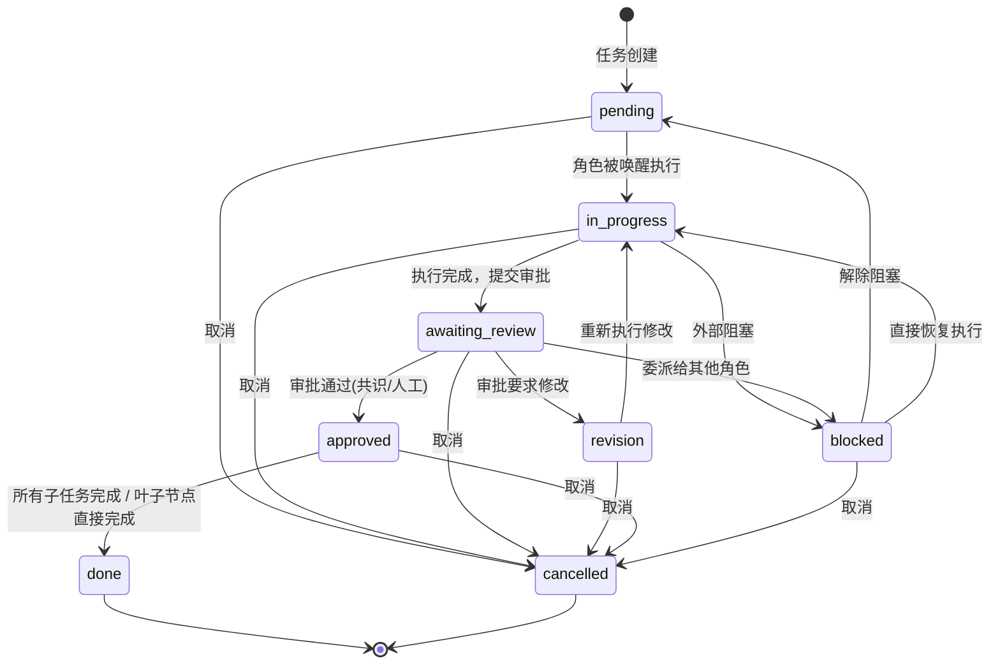
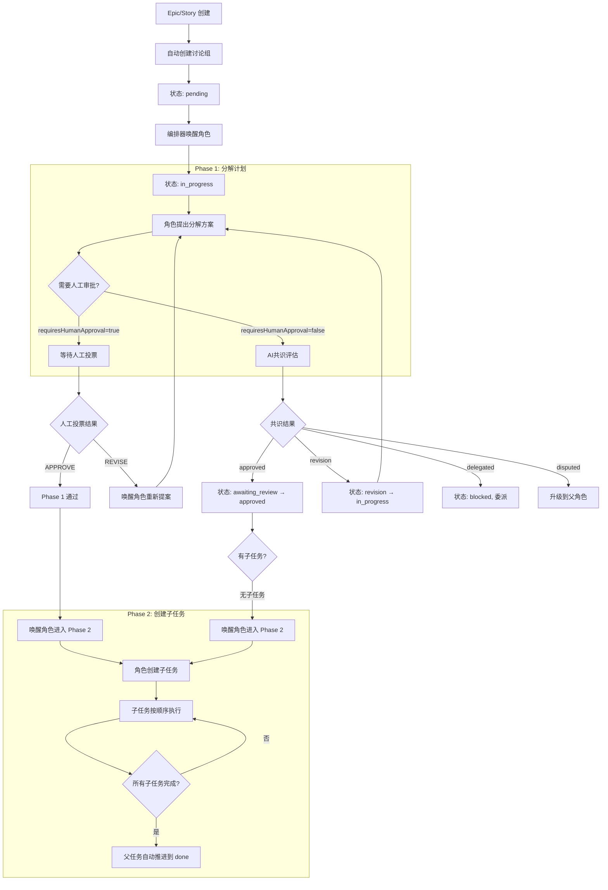
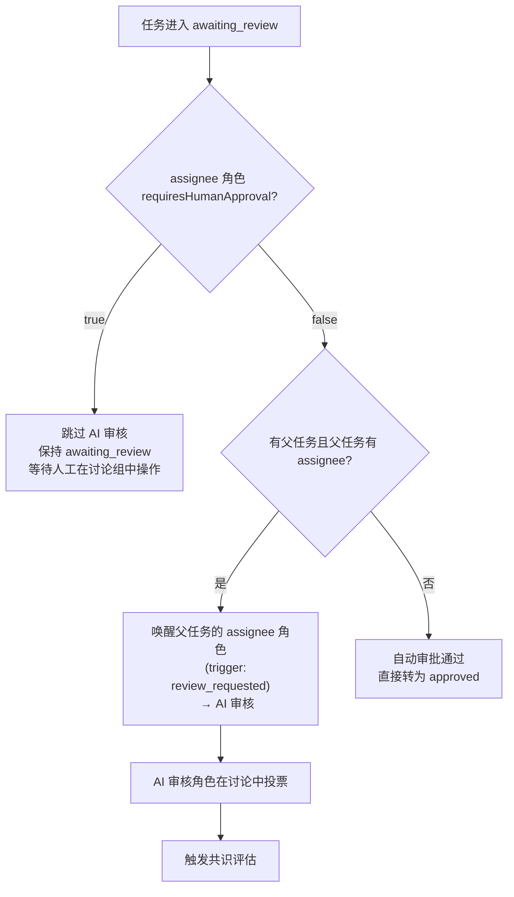
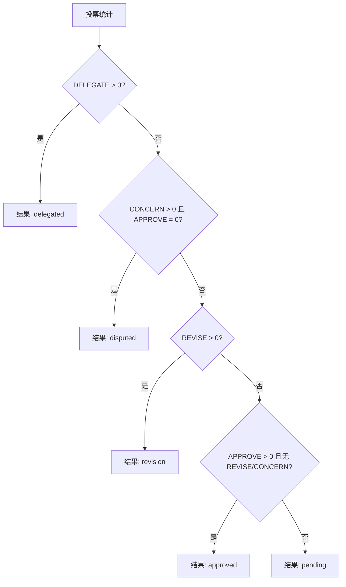
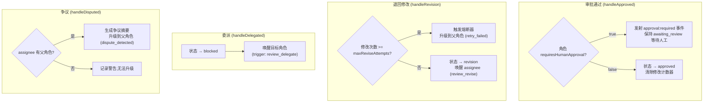
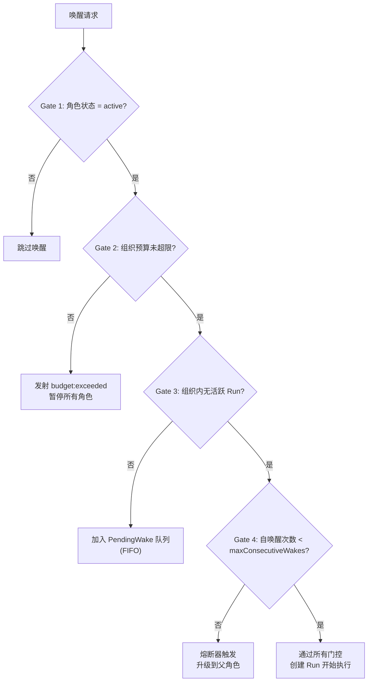
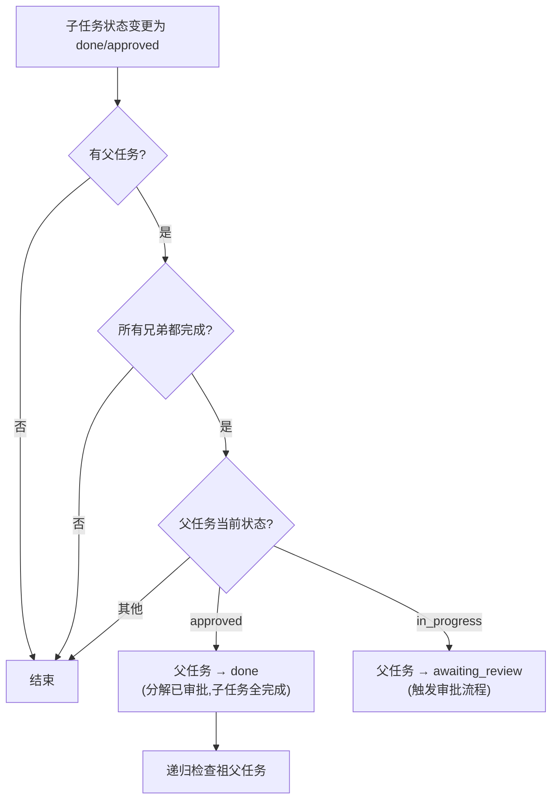
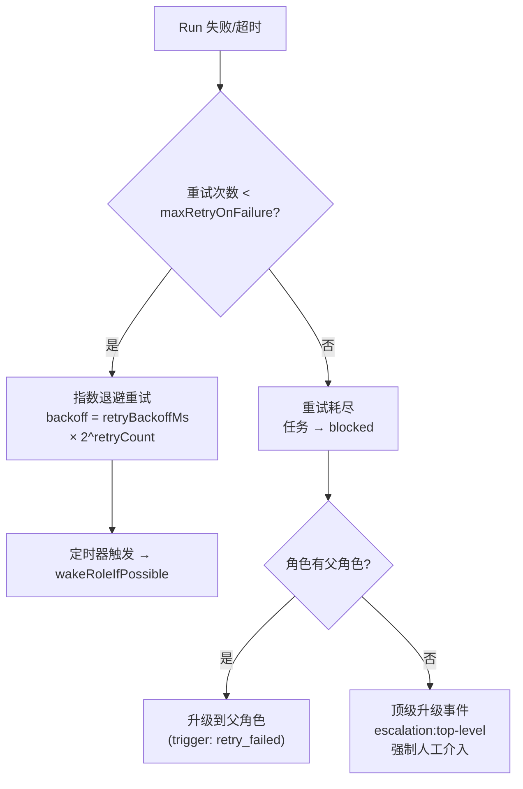
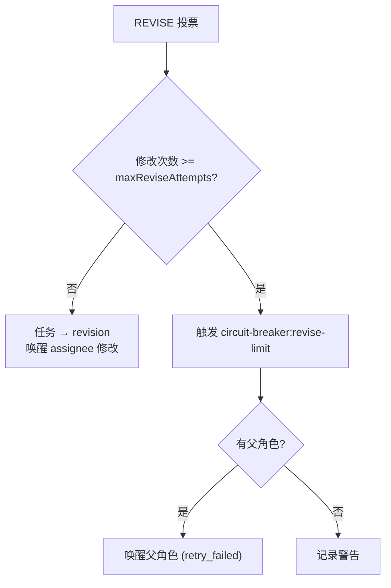
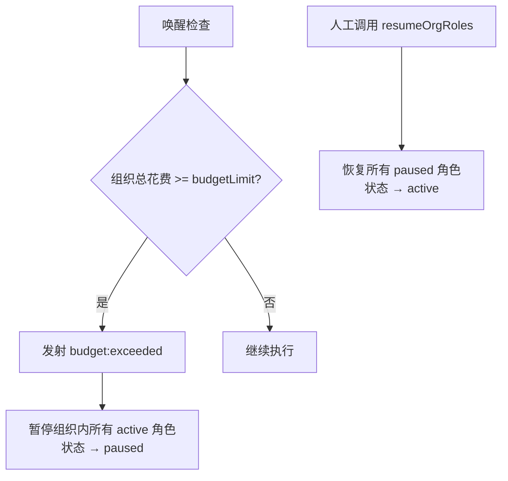

# Capibara 任务工作流程与审批流程深度分析

> 生成日期: 2026-04-03
> 基于源码分析: `task.service.ts`, `discussion.service.ts`, `consensus.detector.ts`, `org.orchestrator.ts`, `task.state-machine.ts`

---

## 1. 任务状态机 (Task State Machine)

### 1.1 状态定义

| 状态 | 含义 |
|------|------|
| `pending` | 任务已创建，等待被执行 |
| `in_progress` | 角色正在执行任务 |
| `awaiting_review` | 任务执行完毕，等待审批 |
| `revision` | 审批未通过，需要修改 |
| `approved` | 审批通过 |
| `done` | 任务完全结束（含所有子任务） |
| `blocked` | 任务被阻塞（委派或升级中） |
| `cancelled` | 任务已取消 |

### 1.2 合法状态转换

```
pending ──────→ in_progress
pending ──────→ cancelled

in_progress ──→ awaiting_review
in_progress ──→ blocked
in_progress ──→ cancelled

awaiting_review → approved
awaiting_review → revision
awaiting_review → blocked
awaiting_review → cancelled

revision ─────→ in_progress
revision ─────→ cancelled

approved ─────→ done
approved ─────→ cancelled

blocked ──────→ pending
blocked ──────→ in_progress
blocked ──────→ cancelled

done ──────────→ (终态，无后续转换)
cancelled ─────→ (终态，无后续转换)
```

### 1.3 状态转换图 (Mermaid)



---

## 2. 任务层级结构 (Task Hierarchy)

### 2.1 类型层级规则

```
root (无父级)
  └── epic                    ← 根级只允许 epic
        ├── story             ← epic 下允许 story, spike
        │     ├── task        ← story 下允许 task, bug, chore, spike
        │     │     └── subtask  ← task 下只允许 subtask
        │     ├── bug         ← 叶子节点
        │     ├── chore       ← 叶子节点
        │     └── spike       ← 叶子节点
        └── spike             ← 叶子节点
```

### 2.2 分解型任务 vs 叶子任务

| 分类 | 类型 | 特征 |
|------|------|------|
| **分解型 (Decomposition)** | `epic`, `story` | 自动创建讨论组，有 Phase 1/Phase 2 流程 |
| **可分解型** | `task` | 可以包含 `subtask`，但不自动创建讨论组 |
| **叶子型 (Leaf)** | `subtask`, `spike`, `bug`, `chore` | 不能有子任务，approved 后自动推进到 done |

> **讨论组创建范围**: 除了分解型任务自动创建讨论组外，当任务的 assignee 角色设置了 `requiresHumanApproval=true` 时，也会自动创建讨论组以支持人工审批投票。

---

## 3. 核心工作流程：两阶段分解 (Phase 1 & Phase 2)

分解型任务 (`epic`/`story`) 采用两阶段流程：



### 3.1 Phase 1 详细流程

1. **任务创建** → `task:created` 事件
2. **讨论组自动创建** → 仅 `epic`/`story` 类型
3. **编排器唤醒角色** → 角色进入 Phase 1 执行
4. **角色提交分解方案**:
   - 对于 `requiresHumanApproval=true` 的角色：
     - 任务保持 `in_progress`，等待人工在讨论中投票
     - 人工 APPROVE → 发射 `wake:triggered (review_approve)` → 角色进入 Phase 2
     - 人工 REVISE → 发射 `wake:triggered (review_revise)` → 角色重新提案
   - 对于 `requiresHumanApproval=false` 的角色：
     - 任务转为 `awaiting_review`
     - 触发审批评估（见第4节）

### 3.2 Phase 2 详细流程

1. **角色被唤醒** (trigger: `review_approve`)
2. **角色创建子任务** → 每个子任务发射 `task:created`
3. **子任务按顺序执行** (Sequential Sibling Gate)
4. **所有子任务完成** → `checkAutoPropagate()` 自动推进父任务

---

## 4. 审批流程 (Approval Flow)

### 4.1 审批决策树

当任务进入 `awaiting_review` 状态时，`TaskService.updateStatus()` 执行以下逻辑：



**关键逻辑（来自 `task.service.ts`）:**

1. **优先级 1 - requiresHumanApproval 优先**: 如果 assignee 角色设置了 `requiresHumanApproval=true`，**跳过 AI 审核**，直接等待人工在讨论组中操作。这确保人工审批的绝对控制权。
2. **优先级 2 - 父角色AI审核**: 如果不需要人工审批，且任务有父任务、父任务有 assignee，则唤醒父角色进行 AI 审核
3. **优先级 3 - 自动审批**: 如果没有父角色审核者，且角色 `requiresHumanApproval=false`，直接自动通过

### 4.2 投票与共识机制

#### 投票类型

| 投票标签 | 含义 | 效果 |
|---------|------|------|
| `APPROVE` | 同意 | 推进审批通过 |
| `REVISE` | 要求修改 | 退回修改 |
| `CONCERN` | 提出顾虑 | 可能触发争议升级 |
| `DELEGATE` | 委派 | 将任务委派给其他角色 |

#### 共识判定优先级（`ConsensusDetector.evaluate()`）



**判定优先级顺序:**
1. **DELEGATE 最优先** — 任何委派投票都立即触发委派
2. **争议次之** — 有 CONCERN 且无 APPROVE → 争议
3. **修改再次** — 有 REVISE 投票 → 退回修改
4. **通过** — 有 APPROVE 且无 REVISE/CONCERN → 通过
5. **等待** — 其他情况继续等待

### 4.3 人工投票 vs AI 投票的处理差异

`DiscussionService.onVoteAdded()` 对两者处理逻辑不同：

| 场景 | 人工投票 (authorRoleId=null) | AI 投票 |
|------|---------------------------|---------|
| **APPROVE** | 直接触发效果（绕过共识检测器） | 通过共识检测器评估 |
| **REVISE** | 直接触发修改流程 | 通过共识检测器评估 |
| **DELEGATE** | 直接触发委派 | 通过共识检测器评估 |

**人工 APPROVE 的两种场景:**

| 任务当前状态 | 效果 |
|------------|------|
| `in_progress` | Phase 1 审批通过 → 唤醒角色进入 Phase 2 (trigger: `review_approve`) |
| `awaiting_review` | 最终审批通过 → 任务转为 `approved` |

### 4.4 审批结果处理



### 4.5 Review Round 机制

讨论组维护 `currentRound` 计数器，用于隔离不同轮次的投票，防止历史投票污染当前轮次的共识判定。

**轮次流转:**
1. 讨论组创建时 `currentRound = 1`
2. 每次 REVISE 退回时：
   - `reviseCount` +1（用于熔断判定）
   - `currentRound` +1（开启新投票轮次）
3. 共识检测器使用 `getVoteStatsForRound(groupId, currentRound)` 获取当前轮次的投票统计
4. APPROVE 通过后 `reviseCount` 重置为 0

**作用:** 确保在多次 REVISE 循环中，每轮投票独立统计，避免前轮的 APPROVE 投票影响当前轮次的共识结果。

---

## 5. 编排器唤醒逻辑 (Orchestrator Wake Logic)

### 5.1 唤醒触发器 (WakeTrigger)

| 触发器 | 含义 | 来源 |
|--------|------|------|
| `task_assigned` | 任务分配给角色 | 任务创建/兄弟完成/父任务通过 |
| `task_completed` | 子任务完成 | (当前未使用) |
| `review_requested` | 请求审核 | 子任务进入 awaiting_review |
| `review_approve` | 审核通过 | 共识/人工批准 |
| `review_revise` | 要求修改 | 共识/人工退回 |
| `review_delegate` | 委派 | 共识/人工委派 |
| `delegation_completed` | 委派完成 | (预留) |
| `retry_failed` | 重试失败 | 重试耗尽/熔断器触发 |
| `dispute_detected` | 争议检测 | 共识检测到争议 |

### 5.2 唤醒前置门控 (Wake Gates)



**关键约束:**
- **每组织串行执行**: 同一组织同一时间只能有一个活跃 Run
- **每组织事件串行化**: 编排器使用 `orgQueues` (Promise chain) 保证同一组织的事件按序处理，空闲时自动清理队列引用
- **顺序兄弟门控**: 同级子任务按顺序执行（第一个 pending 的才会被唤醒）
- **父任务审批门控**: 子任务只有在父任务 `approved`/`done` 后才被唤醒

### 5.3 事件 → 唤醒目标映射

| 事件 | 唤醒谁 | 条件 |
|------|--------|------|
| `task:created` | 任务的 assignee | 父任务已 approved + 是第一个 pending 兄弟 |
| `task:status-changed (→approved)` | 第一个 pending 子任务的 assignee | 分解门控：子任务等父批准 |
| `task:status-changed (→done/cancelled)` | 下一个 pending 兄弟的 assignee | 顺序执行门控 |
| `wake:triggered` | 指定的 roleId | 来自讨论/共识/升级 |
| `run:succeeded` | PendingWake 队列中最早的 | 释放组织执行槽 |
| `run:failed/timed-out` | 相同角色（重试）或父角色（升级） | 重试耗尽则升级 |
| `dispute:detected` | 父角色 | 争议升级 |

---

## 6. 父任务自动推进 (Auto-Propagation)

`TaskService.checkAutoPropagate()` 处理子任务完成后的父任务状态推进：



**"所有兄弟完成"的判定逻辑:**
- `done` / `cancelled` → 视为完成
- 其他状态（包括 `approved`） → **不视为完成**

> **注**: 叶子任务（subtask/spike/bug/chore）在 approved 后自动推进到 done，因此兄弟完成判定只需检查 `done`/`cancelled` 即可覆盖所有场景。`task` 类型无子任务时也会自动推进到 done。

---

## 7. 失败处理与升级链 (Error Handling & Escalation)

### 7.1 Run 失败重试



### 7.2 修改循环保护



### 7.3 自唤醒熔断

- 每个角色在数据库中维护 `consecutiveWakeCount` 字段（持久化，重启不丢失）
- 超过 `maxConsecutiveWakes` → 触发 `circuit-breaker:self-wake` 事件
- 升级到父角色，若无父角色则发射 `escalation:top-level`
- Run 成功完成后自动重置计数

---

## 8. 预算控制 (Budget Control)



---

## 9. 审批预设 (Approval Presets)

系统提供三种预设配置（`approval.handlers.ts`）：

| 预设 | 效果 |
|------|------|
| `all_auto` | 所有角色 `requiresHumanApproval=false` — 全自动 |
| `top_level_human` | 顶级角色（无父角色）需人工审批，其余自动 |
| `custom` | 用户自定义每个角色的审批配置 |

---

## 10. 完整流程示例：从 Epic 到 Done

```
1.  用户创建 Epic (type=epic, assignee=RoleA)
    → task:created 事件
    → 讨论组自动创建
    → 编排器唤醒 RoleA (trigger: task_assigned)
    → Epic 状态: pending → in_progress

2.  RoleA 执行 Phase 1: 提出分解方案 (创建 Stories 计划)
    → 如果 RoleA.requiresHumanApproval=true:
        等待人工在讨论中投票 APPROVE
    → 如果 RoleA.requiresHumanApproval=false:
        Epic 状态: in_progress → awaiting_review
        无父角色 → 自动审批 → Epic 状态: approved

3.  审批通过后 (Phase 1 → Phase 2)
    → 编排器检测到 approved 且无子任务
    → 唤醒 RoleA (trigger: review_approve)

4.  RoleA 执行 Phase 2: 创建子 Stories
    → Story1 (assignee=RoleB), Story2 (assignee=RoleC)
    → 每个 Story 发射 task:created
    → 各 Story 的讨论组自动创建

5.  父审批门控: Epic 已 approved → Story1 可以被唤醒
    → 顺序执行: 先唤醒 Story1 (第一个 pending 兄弟)

6.  Story1 走完 Phase1 → Phase2 → 创建 Tasks
    → Task1, Task2 按顺序执行
    → 每个 Task 完成后唤醒下一个
    → 所有 Tasks 完成 → Story1 auto-propagate → done

7.  Story1 done → 唤醒 Story2 (下一个 pending 兄弟)
    → Story2 走相同流程

8.  所有 Stories done → Epic auto-propagate → done
```

---

## 11. 关键配置项

| 配置项 | 位置 | 作用 |
|--------|------|------|
| `execution.maxReviseAttempts` | config | 最大修改循环次数 |
| `execution.maxRetryOnFailure` | config | Run 失败最大重试次数 |
| `execution.retryBackoffMs` | config | 重试基础退避时间(ms) |
| `execution.maxConsecutiveWakes` | config | 自唤醒熔断阈值 |
| `execution.budgetLimit` | config | 组织预算上限 |
| `role.requiresHumanApproval` | role配置 | 是否需要人工审批 |
| `role.canApprove` | role配置 | 是否可以参与投票 |
| `role.canDelegate` | role配置 | 是否可以委派 |

---

## 12. 已确认的设计决策

1. **Phase 1 人工审批路径**: 当 `requiresHumanApproval=true` 时，Phase 1 分解方案的人工审批发生在任务仍为 `in_progress` 状态——人工 APPROVE 不改变任务状态，而是直接唤醒角色进入 Phase 2。这与 `awaiting_review` 路径的逻辑不同，属于有意设计。

2. **共识检测器的 DELEGATE 优先级**: DELEGATE 投票的优先级最高，即使有 APPROVE 投票存在，只要有一个 DELEGATE 就会触发委派。

3. **requiresHumanApproval 绝对优先**: 当角色设置了 `requiresHumanApproval=true` 时，任务进入 `awaiting_review` 后**不会唤醒上级 AI 审核**，直接等待人工在讨论组中操作。AI 审批和人工审批互斥，不存在双重检查。

4. **兄弟完成判定仅信任终态**: `checkAutoPropagate()` 中只有 `done`/`cancelled` 视为完成。叶子任务 approved 后自动推进到 done，消除了多层判定的复杂性。

5. **顺序执行约束**: 同级子任务严格按顺序执行（第一个 pending 才唤醒）。并行执行为 V2 特性。

6. **组织串行约束**: 每个组织同一时间只有一个活跃 Run。所有其他唤醒进入 PendingWake 队列。事件处理通过 `orgQueues` Promise 链保证串行。
