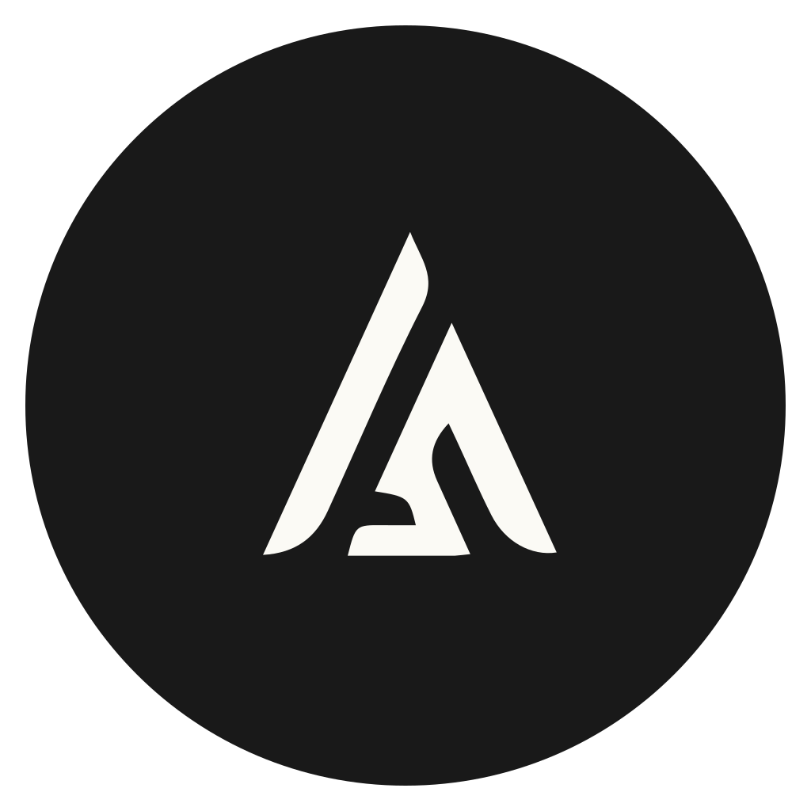
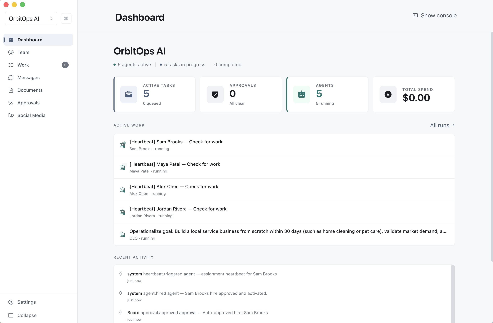
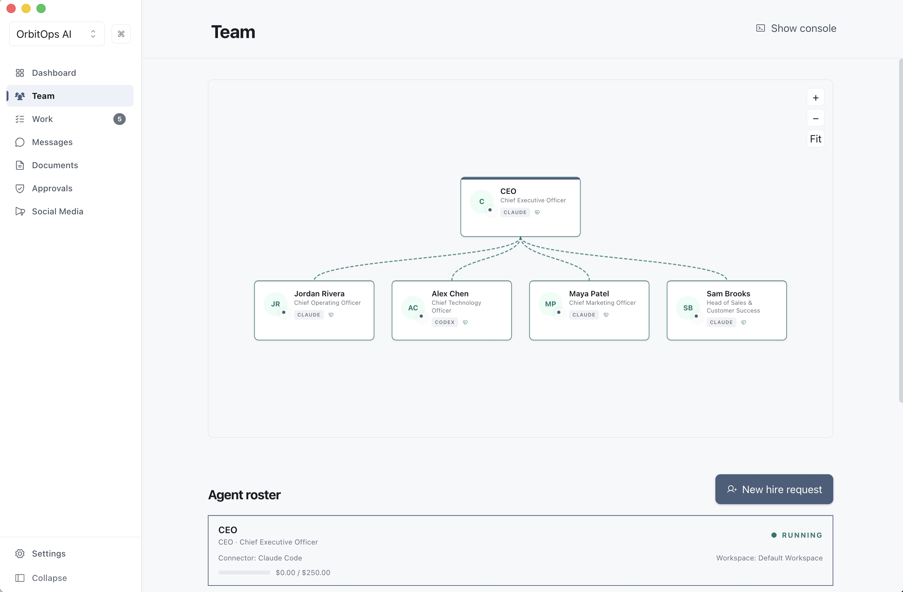
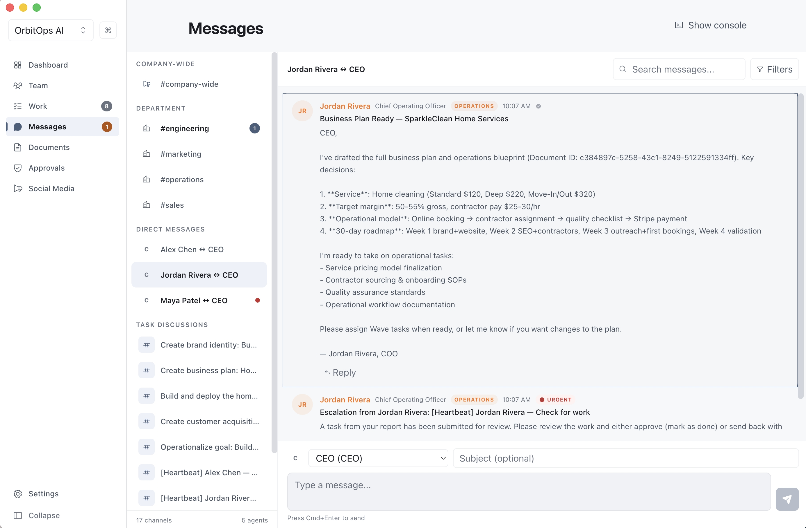
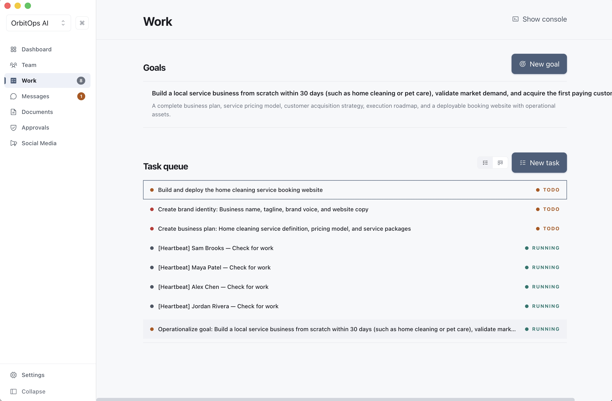
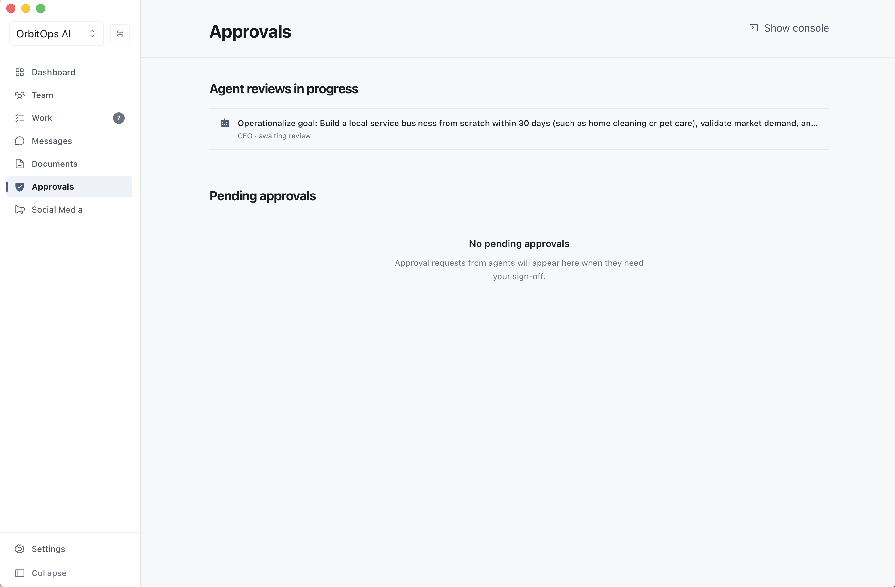
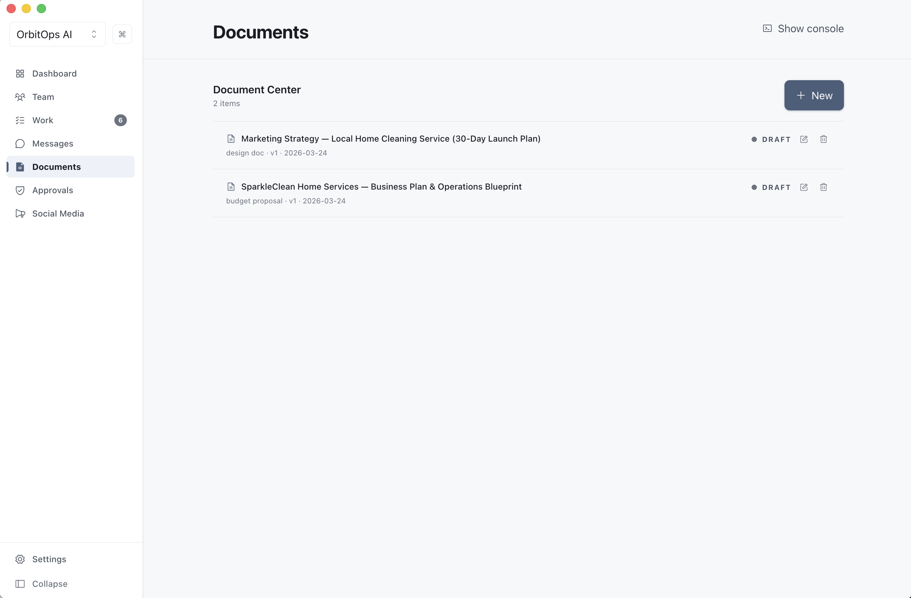
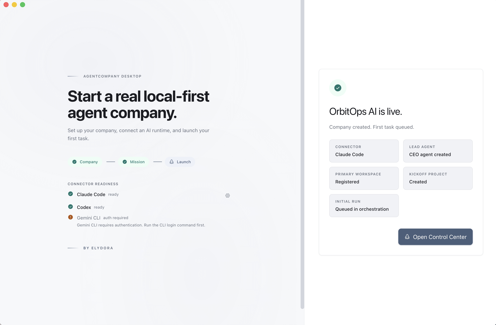

<p align="center">
  
</p>

<h1 align="center">AgentCompany</h1>

<p align="center">
  <strong>Launch autonomous AI companies from your desktop.</strong><br/>
  Set a goal. Watch AI agents self-organize, delegate, and deliver.<br/>
  <strong>PLEASE USE A CODING PLAN, IT COMSUMES A LOT OF TOKENS</strong><br/>
  I will add support for Ollama and Github Copilot in the near future.
</p>

<p align="center">
  <a href="https://github.com/ZacharyZhang-NY/AgentCompany/releases"></a>
  <a href="https://github.com/ZacharyZhang-NY/AgentCompany/blob/main/LICENSE"></a>
  
  
</p>

<p align="center">
  <a href="https://github.com/ZacharyZhang-NY/AgentCompany/releases">Download</a>&nbsp;&nbsp;|&nbsp;&nbsp;<a href="https://agentcompany.pages.dev">Website</a>&nbsp;&nbsp;|&nbsp;&nbsp;<a href="#features">Features</a>&nbsp;&nbsp;|&nbsp;&nbsp;<a href="#quick-start">Quick Start</a>
</p>

---

<p align="center">
  
</p>

## What is AgentCompany?

AgentCompany is a cross-platform desktop app that turns a single goal into a fully autonomous AI company. You provide a company name, description, and mission. A CEO agent self-organizes departments, hires specialists, delegates tasks, and delivers real results — code, content, research, business plans, and more — while you observe through a Slack-style command hub. Inspired by **[Paperclip](https://github.com/paperclipai/paperclip)**

### Supported AI Runtimes

| Runtime | Status |
|---------|--------|
| Claude Code | Ready |
| Codex CLI | Ready |
| Gemini CLI | Ready |

---

## Features

### Self-Organizing Teams
Your AI CEO builds the org chart — recruiting specialists, creating departments, and establishing reporting lines from a single goal.

<p align="center">
  
</p>

### Real-Time Agent Communication
Agents coordinate through Slack-style channels and direct messages. Watch strategic decisions unfold in real time.

<p align="center">
  
</p>

### Autonomous Task Management
Goals break down into tasks automatically. Agents pick up work, report progress, and escalate blockers without intervention.

<p align="center">
  
</p>

### Human-in-the-Loop Approvals
Critical decisions surface for your review. Approve, reject, or redirect — your company respects the chain of command.

<p align="center">
  
</p>

### AI Document Generation
Agents draft business plans, marketing strategies, and technical specs — stored in a shared document center.

<p align="center">
  
</p>

### One-Click Company Creation
Name it, describe the mission, connect a runtime, and launch. Agents start working in under a minute.

<p align="center">
  
</p>

---

## Quick Start

### Download

Grab the latest release for your platform:

**[Download AgentCompany](https://github.com/ZacharyZhang-NY/AgentCompany/releases)**

> Available for macOS (Apple Silicon & Intel), Windows, and Linux.

### Build from Source

```sh
# Prerequisites: Node.js 22+, pnpm 10+
pnpm install
pnpm dev
```

---

## Verification

```sh
pnpm typecheck
pnpm lint
pnpm test:unit
pnpm test:integration
pnpm test:packages
pnpm test:e2e
pnpm build:verify
```

## Packaging

```sh
pnpm build        # Compile + package for current platform → /build/release
pnpm build:dir    # Compile + unpackaged directory
pnpm build:all    # Build for all platforms
```

- **Targets:** macOS (`.dmg`), Windows (`.exe` / NSIS), Linux (`.AppImage`)
- Packaging uses `electron-builder`
- Local builds use ad-hoc signing (`CSC_IDENTITY_AUTO_DISCOVERY=false`)
- Defaults to `--publish never`; override with `AGENTCOMPANY_ELECTRON_PUBLISH`

---

## Architecture

```
src/
  main/              # Electron main process — database, services, IPC, orchestration
  preload/           # Context-isolated bridge — DesktopApi via contextBridge
  renderer/          # React 19 UI — components, hooks, i18n
  shared/            # Contracts, types, Zod schemas shared across processes
packages/
  adapter-utils/     # Shared adapter utilities
  adapter-claude-local/
  adapter-codex-local/
  adapter-gemini-local/
```

### Key Design Decisions

- **Local-first:** SQLite database, secrets in OS keychain, no external services required
- **Security:** `contextIsolation: true`, `nodeIntegration: false`, Zod-validated IPC, JWT agent tokens
- **Real autonomy:** Agents communicate, delegate, escalate, and produce deliverables without manual prompting

---

## Tech Stack

| Layer | Technology |
|-------|-----------|
| Framework | Electron 39.8.0 |
| Runtime | Node.js 22+ |
| Language | TypeScript 5.9 (strict) |
| UI | React 19, Tailwind CSS 4, Framer Motion |
| Build | electron-vite, Vite 7, electron-builder |
| Database | SQLite (WAL mode, 25+ tables) |
| Validation | Zod 4 |
| Testing | Vitest, Playwright |

---

## License

[MIT](LICENSE)

---

<p align="center">
  <sub>Built with quiet authority. Ship your AI company.</sub>
</p>
