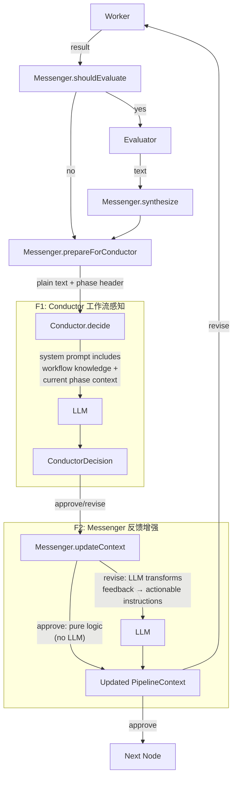

# Architecture Design: Conductor 工作流感知 + Messenger 反馈处理增强

> Change ID: `20260320-conductor-messenger-enhance`
> Date: 2026-03-20

---

## Architecture Overview

Two targeted enhancements to existing MVTT implementations, no new abstractions:

1. **MvttConductor** gains internal MVTT workflow knowledge — its system prompt becomes phase-aware, so decisions account for where the current phase sits in the `analyze→design→implement→review→test` pipeline and what downstream phases need.

2. **MvttMessenger.updateContext()** becomes async with LLM processing — when the Conductor issues a `revise` decision, the raw feedback is transformed into structured, context-enriched, actionable revision instructions before being injected into `PipelineContext`.

Both changes are **internal to the MVTT implementation layer**. The `IConductor` interface is unchanged. The `IMessenger` interface has one signature change (`updateContext` returns `Promise<PipelineContext>`).

---

## Architecture Diagram



---

## Key Components

| Component | Change | Layer | File |
|-----------|--------|-------|------|
| `IMessenger` | `updateContext` signature → async | Core Interface | `src/core/interfaces/messenger.interface.ts` |
| `MvttConductor` | System prompt + input enrichment | Implementation | `src/implementations/mvtt/mvtt-conductor.ts` |
| `MvttMessenger` | `updateContext` async + LLM for revise | Implementation | `src/implementations/mvtt/mvtt-messenger.ts` |
| `WorkerNodeHandler` | `await` on `updateContext` calls | Application | `src/application/pipeline/worker-node-handler.ts` |

---

## Interface Definitions

### IMessenger (updated)

```typescript
export interface IMessenger {
  formatForWorker(phase: Phase, context: PipelineContext): Promise<WorkerCommand>;
  shouldEvaluate(workerResult: WorkerResult, context: PipelineContext): Promise<boolean>;
  synthesize(evaluatorResults: string[], context: PipelineContext): Promise<string>;
  prepareForConductor(content: string, context: PipelineContext): Promise<string>;
  // CHANGED: sync → async
  updateContext(decision: ConductorDecision, context: PipelineContext): Promise<PipelineContext>;
}
```

### IConductor (unchanged)

```typescript
export interface IConductor {
  decide(input: string): Promise<ConductorDecision>;
}
```

---

## F1 Detail: MvttConductor 工作流感知

### Design

MvttConductor maintains MVTT workflow knowledge **entirely within its own system prompt**. No new dependencies, no new constructor parameters.

#### 1. Workflow Knowledge Constant

A new constant `MVTT_WORKFLOW_KNOWLEDGE` defines the complete workflow:

```typescript
const MVTT_WORKFLOW_KNOWLEDGE = `
## MVTT Workflow

The software development pipeline follows this workflow:
  analyze → design → implement → review → test

Phase descriptions:
- analyze: Requirements analysis — produces structured requirement breakdown
- design: Architecture design — produces technical blueprint based on analysis
- implement: Code implementation — produces working code based on design
- review: Code review — produces review feedback on implementation quality
- test: Testing — produces test results validating implementation

Key principles:
- Each phase's output must be sufficient to support the next phase
- Earlier phases (analyze, design) should prioritize completeness and clarity
- Later phases (review, test) should validate against earlier phase outputs
- "approve" means the output is ready for the downstream consumer
`;
```

#### 2. Phase Context Injection in `decide()`

The `decide()` method builds a phase context block from the `input` string (which already contains `Phase: xxx` from `prepareForConductor`). This is appended to the user prompt:

```
Current Phase Context:
- Phase: {phase}
- Position: {n} of 5 in workflow
- Upstream: {previous phases}
- Downstream: {next phases}
- Downstream needs: {what the next phase expects from this output}
```

The phase is extracted from the `input` header that Messenger already provides (`Phase: xxx | Attempt: n | Pipeline: id`).

#### 3. System Prompt Composition

The final system prompt = `CONDUCTOR_SYSTEM_PROMPT` + `MVTT_WORKFLOW_KNOWLEDGE`.

The workflow knowledge is static and hardcoded. The phase context is dynamic per `decide()` call.

### Design Rationale

- **Hardcoded in MvttConductor** (not from MvttPromptFramework): The workflow is MVTT-specific domain knowledge. MvttPromptFramework serves prompt file I/O, not business knowledge. Keeping it in MvttConductor is cleaner.
- **Phase extracted from input header**: Avoids adding `phase` parameter to `IConductor.decide()`, keeping the interface unchanged.
- **No constructor changes**: All knowledge is static constants within the file.

---

## F2 Detail: MvttMessenger.updateContext 反馈增强

### Design

`updateContext()` becomes async. For `approve` decisions, behavior is unchanged (pure logic). For `revise` decisions, an LLM call transforms the raw feedback.

#### 1. Approve Path (unchanged logic)

```typescript
if (decision.action === 'approve') {
  // Same pure logic as before, just wrapped in Promise
  return { ...context, completedPhases: [...], currentPhase: nextPhase, revisionFeedback: undefined };
}
```

#### 2. Revise Path (new LLM processing)

```typescript
// decision.action === 'revise'
const enhancedFeedback = await this.enhanceFeedback(decision.feedback, context);
return {
  ...context,
  revisionFeedback: enhancedFeedback,
};
```

#### 3. New Private Method: `enhanceFeedback()`

```typescript
private async enhanceFeedback(
  rawFeedback: string[] | undefined,
  context: PipelineContext,
): Promise<string[]>
```

LLM prompt structure:

```
You are processing revision feedback for the "{phase}" phase of a software development pipeline.

Original feedback from the Conductor:
{rawFeedback joined}

Context:
- Phase: {context.currentPhase}
- Attempt: {context.phaseAttempts[phase]}
- Previous revision feedback (if any): {context.revisionFeedback}
- Requirement: {context.requirement.description}

Transform this feedback into clear, actionable revision instructions:
1. Make each instruction specific and executable
2. Add relevant context from the requirement and phase
3. Remove vague or redundant items
4. If previous revision feedback exists, reconcile with new feedback (avoid contradictions)
5. Order by priority (most critical first)

Output JSON: {"instructions": ["instruction 1", "instruction 2", ...]}
```

**Fallback**: If the LLM call fails, the raw `decision.feedback` is used as-is (same as current behavior).

#### 4. phaseAttempts Increment Removed

Currently `updateContext()` increments `phaseAttempts` for the revise path. This is **redundant** — `WorkerNodeHandler.handleRevision()` already increments it at line 177. The increment in `updateContext()` will be removed to avoid double-counting.

Wait — let me verify. Looking at `worker-node-handler.ts`:
- Line 115 (approve): calls `updateContext` — current `updateContext` does NOT increment for approve. OK.
- Line 185 (revise in `handleRevision`): `handleRevision` increments at line 177, then calls `updateContext` at line 185. Current `updateContext` for revise ALSO increments. This is **double-counting**.

This is a pre-existing bug. The fix: `updateContext()` for the revise path should NOT increment `phaseAttempts` — it should only set `revisionFeedback`. The increment is `handleRevision`'s responsibility.

---

## Technical Decisions (ADR)

| # | Decision | Choice | Rationale |
|---|----------|--------|-----------|
| 1 | Where to store workflow knowledge | Hardcoded constants in `MvttConductor` | MVTT-specific knowledge, not generic framework concern; simple and explicit |
| 2 | How to get current phase in `decide()` | Parse from input header string | Avoids changing `IConductor` interface; Messenger already provides phase in header |
| 3 | `updateContext` approve path | Keep as pure logic (no LLM) | Approve has no feedback to process; unnecessary cost |
| 4 | `updateContext` revise LLM failure | Fallback to raw feedback | Graceful degradation; pipeline shouldn't break due to feedback formatting |
| 5 | Remove `phaseAttempts` increment from `updateContext` | Remove | Fix pre-existing double-counting bug; `handleRevision` already increments |

---

## Affected Files Summary

| File | Change Type | Description |
|------|------------|-------------|
| `src/core/interfaces/messenger.interface.ts` | **Modify** | `updateContext` return type: `PipelineContext` → `Promise<PipelineContext>` |
| `src/implementations/mvtt/mvtt-conductor.ts` | **Modify** | Add workflow knowledge constant; enrich system prompt; inject phase context in `decide()` |
| `src/implementations/mvtt/mvtt-messenger.ts` | **Modify** | `updateContext` → async; add `enhanceFeedback()` private method for revise path; remove phaseAttempts increment |
| `src/application/pipeline/worker-node-handler.ts` | **Modify** | Add `await` to `updateContext()` calls (lines 115, 185) |

---

## Implementation Guidelines

- `MVTT_WORKFLOW_KNOWLEDGE` and `PHASE_DOWNSTREAM_NEEDS` are const strings/objects at module scope in `mvtt-conductor.ts` — no external config needed
- Phase extraction from input uses simple string parsing (split first line by `|`, extract `Phase: xxx`)
- `enhanceFeedback()` uses the existing `this.executor` and `this.outputParser.extractJson<>()` pattern already established in `shouldEvaluate()`
- The `updateContext` signature change in `IMessenger` propagates to `WorkerNodeHandler` only — no other callers exist
- Empty or undefined `decision.feedback` in revise path: skip LLM, return `[]`

---

**Suggested Next Steps**:
- Review and confirm design decisions (especially ADR #5 bug fix)
- `#implement` to start implementation
