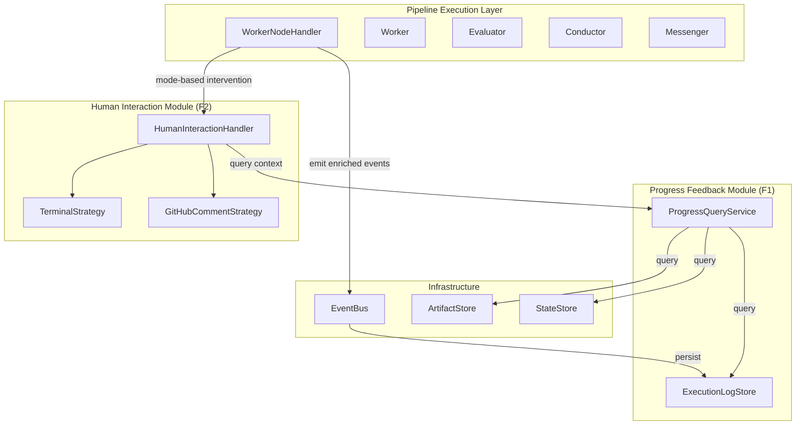

# Architecture Design: 任务进度反馈 + 人工介入功能

> Change ID: `20260320-progress-feedback-human-intervention`
> Date: 2026-03-21
> Based on: `workspace/artifacts/20260320-progress-feedback-human-intervention/analysis.md`

---

## Architecture Overview

本设计为 F1（任务进度反馈）和 F2（人工介入）两个功能提供统一的架构方案，核心设计原则：

1. **最小侵入性** - 复用现有基础设施（IEventBus、IArtifactStore、IStateStore）
2. **关注点分离** - 进度反馈与人工介入作为独立模块，通过事件解耦
3. **可扩展性** - 为未来 Electron UI 和 HTTP API 预留扩展点

---

## Architecture Diagram



---

## Module Structure

| Module | Purpose | Dependencies |
|--------|---------|--------------|
| `core/types/pipeline.types.ts` | 扩展 PipelineContext，增加交互记录 | - |
| `core/types/execution-log.types.ts` | 执行日志类型定义 | - |
| `core/interfaces/execution-log-store.interface.ts` | 执行日志存储接口 | core/types |
| `infrastructure/persistence/json-execution-log-store.ts` | 执行日志存储实现 | core/interfaces |
| `application/progress/progress-query.service.ts` | 进度查询服务 | execution-log-store, artifact-store, state-store |
| `application/pipeline/worker-node-handler.ts` | 集成人工介入逻辑 | human-interaction-handler, progress-query-service |
| `application/human-interaction/human-interaction.handler.ts` | 增强上下文展示 | progress-query-service |
| `application/human-interaction/strategies/*.ts` | 策略实现更新 | - |

---

## Key Components

### F1: 任务进度反馈

| Component | Responsibility | Layer | File |
|-----------|---------------|-------|------|
| `ExecutionLogEntry` | 执行日志条目类型 | Core Types | `core/types/execution-log.types.ts` |
| `IExecutionLogStore` | 执行日志存储接口 | Core Interface | `core/interfaces/execution-log-store.interface.ts` |
| `JsonExecutionLogStore` | JSON 文件存储实现 | Infrastructure | `infrastructure/persistence/json-execution-log-store.ts` |
| `ProgressQueryService` | 进度查询服务 | Application | `application/progress/progress-query.service.ts` |

### F2: 人工介入

| Component | Responsibility | Layer | File |
|-----------|---------------|-------|------|
| `InteractionRecord` | 交互记录类型 | Core Types | `core/types/pipeline.types.ts` |
| `HumanInteractionHandler` | 人工介入处理（增强） | Application | `application/human-interaction/human-interaction.handler.ts` |
| `IHumanInteractionStrategy` | 策略接口（增强） | Application | `application/human-interaction/strategies/human-interaction.strategy.ts` |
| `TerminalStrategy` | Terminal 策略（增强） | Application | `application/human-interaction/strategies/terminal.strategy.ts` |

---

## Interface Definitions

### 1. Execution Log Types

```typescript
// core/types/execution-log.types.ts

export type ExecutionLogLevel = 'info' | 'warn' | 'error';

export interface ExecutionLogEntry {
  id: string;
  timestamp: string;
  pipelineId: string;
  changeId: string;
  phase: Phase;
  eventType: PipelineEventType;
  level: ExecutionLogLevel;
  /** Event-specific payload */
  payload: Record<string, unknown>;
  /** LLM output (for worker:completed events), truncated if too long */
  output?: string;
  /** Output truncation flag */
  outputTruncated?: boolean;
}

export interface ExecutionLogQuery {
  pipelineId?: string;
  changeId?: string;
  phase?: Phase;
  eventTypes?: PipelineEventType[];
  since?: string;
  until?: string;
  limit?: number;
  offset?: number;
}
```

### 2. Execution Log Store Interface

```typescript
// core/interfaces/execution-log-store.interface.ts

export interface IExecutionLogStore {
  /** Append log entry */
  append(entry: ExecutionLogEntry): Promise<void>;

  /** Query logs with filters */
  query(query: ExecutionLogQuery): Promise<ExecutionLogEntry[]>;

  /** Get logs for specific pipeline */
  getLogsByPipeline(pipelineId: string, limit?: number): Promise<ExecutionLogEntry[]>;

  /** Delete logs older than specified days */
  purge(olderThanDays: number): Promise<number>;

  /** Get log count for pipeline */
  count(pipelineId: string): Promise<number>;
}
```

### 3. Progress Query Service Interface

```typescript
// application/progress/progress-query.service.ts

export interface PipelineProgress {
  pipelineId: string;
  changeId: string;
  status: PipelineStatus;
  currentPhase: Phase;
  completedPhases: Phase[];
  /** Total rounds across all phases */
  totalRounds: number;
  /** Current round in current phase */
  currentRound: number;
  /** Execution logs (recent, limited) */
  recentLogs: ExecutionLogEntry[];
  /** Phase artifacts (truncated preview) */
  artifacts: Array<{ phase: Phase; preview: string }>;
  /** Cost summary */
  costSummary: { total: number; byPhase: Record<Phase, number> };
  /** Timestamps */
  startedAt: string;
  updatedAt: string;
}

export interface IProgressQueryService {
  /** Get current progress for pipeline */
  getProgress(pipelineId: string): Promise<PipelineProgress | null>;

  /** Get interaction history for human intervention context */
  getInteractionHistory(
    pipelineId: string,
    phase: Phase,
    count: number,
  ): Promise<InteractionRecord[]>;

  /** Get latest worker output for a phase */
  getLatestOutput(pipelineId: string, phase: Phase): Promise<string | null>;
}
```

### 4. Interaction Record Type (extends PipelineContext)

```typescript
// core/types/pipeline.types.ts (additions)

export interface InteractionRecord {
  round: number;
  phase: Phase;
  timestamp: string;
  /** Worker output (truncated) */
  workerOutput: string;
  workerOutputTruncated: boolean;
  /** Evaluator results summary (if evaluated) */
  evaluatorSummary?: string;
  /** Conductor decision */
  conductorDecision: ConductorAction;
  conductorReason: string;
  /** Feedback given (if revised) */
  feedback?: string;
}

/** Add to PipelineContext */
export interface PipelineContext {
  // ... existing fields ...

  /** Current round number (increments per worker execution in a phase) */
  currentRound: number;

  /** Last N interaction records (max 3), stored in reverse chronological order */
  interactionHistory: InteractionRecord[];
}
```

### 5. Enhanced Human Interaction Strategy Interface

```typescript
// application/human-interaction/strategies/human-interaction.strategy.ts

export interface InterventionContext {
  pipelineId: string;
  changeId: string;
  phase: Phase;
  round: number;
  mode: InteractionMode;
  /** Last 3 interaction records */
  recentInteractions: InteractionRecord[];
  /** Current worker output (full) */
  currentOutput: string;
  /** Evaluator results (if evaluated) */
  evaluatorResults?: string[];
  /** Conductor escalate reason (for semi-auto mode) */
  escalateReason?: string;
}

export interface IHumanInteractionStrategy {
  /** Request human approval with full context */
  requestApproval(context: InterventionContext): Promise<HumanResponse>;
}
```

---

## Technical Decisions (ADR)

### ADR-001: 执行日志存储方案

| # | Decision | Choice | Rationale |
|---|----------|--------|-----------|
| 1 | 存储格式 | **JSON Lines (`.jsonl`)** | 追加友好，查询高效，与现有 JSON 存储模式一致 |
| 2 | 文件组织 | **按 pipelineId 分文件** | 避免单文件过大，便于清理 |
| 3 | 输出截断策略 | **最大 10KB，超出截断** | LLM 输出可能很大，需要限制单条日志大小 |

**文件结构**:
```
{stateDir}/logs/
├── {pipelineId-1}.jsonl
├── {pipelineId-2}.jsonl
└── ...
```

### ADR-002: 交互记录存储位置

| # | Decision | Choice | Rationale |
|---|----------|--------|-----------|
| 1 | 存储位置 | **PipelineContext.interactionHistory** | 随 Pipeline 状态持久化，无需额外存储 |
| 2 | 记录数量 | **最近 3 轮** | 满足人工介入展示需求，避免无限增长 |
| 3 | 输出存储 | **截断存储 + 引用 Artifact** | 显示截断版本，完整版本可从 ArtifactStore 查询 |

### ADR-003: WorkerNodeHandler 集成方式

| # | Decision | Choice | Rationale |
|---|----------|--------|-----------|
| 1 | 注入方式 | **构造函数注入 HumanInteractionHandler** | 符合现有 DI 模式 |
| 2 | mode 判定时机 | **Worker 完成后、Conductor 决策后** | `manual`: Worker 完成后；`semi-auto`: Conductor escalate 后 |
| 3 | 流程控制 | **await requestApproval()，阻塞直到响应** | 保持同步语义，简化错误处理 |

### ADR-004: 事件 Payload 增强

| # | Decision | Choice | Rationale |
|---|----------|--------|-----------|
| 1 | 增强方式 | **扩展 PipelineEvent.data 字段** | 无需修改 PipelineEvent 结构，向后兼容 |
| 2 | 输出字段 | **`output` + `outputTruncated`** | 明确标识是否截断 |
| 3 | 评估详情 | **`evaluatorResults: string[]`** | 存储评估结果摘要数组 |

---

## Implementation Guidelines

### 1. WorkerNodeHandler 改造流程

```
Worker 执行完成
    │
    ├── 记录 InteractionRecord
    │
    ├── [mode === 'manual']
    │       │
    │       └── 调用 HumanInteractionHandler.requestApproval()
    │               │
    │               ├── approved → 继续 Conductor 决策
    │               └── rejected → 记录 feedback → 继续 revise
    │
    ├── Conductor 决策
    │       │
    │       ├── approve → 继续
    │       ├── revise → 继续
    │       └── escalate
    │               │
    │               └── [mode === 'semi-auto']
    │                       │
    │                       └── 调用 HumanInteractionHandler.requestApproval()
    │                               │
    │                               ├── approved → 设置 approved=true
    │                               └── rejected → 记录 feedback → 继续 revise
    │
    └── 继续/退出循环
```

### 2. 交互记录更新时机

```typescript
// 在 WorkerNodeHandler.handle() 中
const record: InteractionRecord = {
  round: context.currentRound,
  phase,
  timestamp: new Date().toISOString(),
  workerOutput: truncate(workerResult.output, 10240), // 10KB
  workerOutputTruncated: workerResult.output.length > 10240,
  conductorDecision: decision.action,
  conductorReason: decision.reason,
  feedback: decision.feedback?.join('\n'),
};

// 保持最近 3 条
context.interactionHistory.unshift(record);
if (context.interactionHistory.length > 3) {
  context.interactionHistory.pop();
}
```

### 3. 进度查询服务使用

```typescript
// 在 HumanInteractionHandler 中
const context: InterventionContext = {
  pipelineId: context.pipelineId,
  // ...
  recentInteractions: await this.progressQuery.getInteractionHistory(
    pipelineId, phase, 3
  ),
  currentOutput: await this.progressQuery.getLatestOutput(pipelineId, phase),
};
```

---

## File Changes Summary

| 文件 | 变更类型 | 主要变更 |
|------|----------|----------|
| `src/core/types/execution-log.types.ts` | **新增** | ExecutionLogEntry, ExecutionLogQuery |
| `src/core/types/pipeline.types.ts` | **修改** | 增加 InteractionRecord, PipelineContext 字段 |
| `src/core/types/events.types.ts` | **修改** | 扩展事件 data 字段类型（JSDoc 注释） |
| `src/core/interfaces/execution-log-store.interface.ts` | **新增** | IExecutionLogStore |
| `src/core/interfaces/index.ts` | **修改** | 导出新接口 |
| `src/tokens.ts` | **修改** | 增加 EXECUTION_LOG_STORE_TOKEN |
| `src/infrastructure/persistence/json-execution-log-store.ts` | **新增** | JsonExecutionLogStore 实现 |
| `src/application/progress/progress-query.service.ts` | **新增** | ProgressQueryService |
| `src/application/pipeline/worker-node-handler.ts` | **修改** | 集成 HumanInteractionHandler, 模式判定, 交互记录 |
| `src/application/human-interaction/human-interaction.handler.ts` | **修改** | 增强 requestApproval 接口 |
| `src/application/human-interaction/strategies/human-interaction.strategy.ts` | **修改** | 接口改为 InterventionContext |
| `src/application/human-interaction/strategies/terminal.strategy.ts` | **修改** | 实现上下文展示 |
| `src/composition-root.ts` | **修改** | 注册新依赖 |

---

## Implementation Plan

| Phase | Task | Dependencies | Complexity |
|-------|------|--------------|------------|
| 1 | 创建 execution-log.types.ts | - | Low |
| 2 | 创建 IExecutionLogStore 接口 | Phase 1 | Low |
| 3 | 实现 JsonExecutionLogStore | Phase 2 | Medium |
| 4 | 扩展 PipelineContext (InteractionRecord) | - | Low |
| 5 | 修改事件 payload 发送点 | - | Low |
| 6 | 创建 ProgressQueryService | Phase 2, 3, 4 | Medium |
| 7 | 增强 IHumanInteractionStrategy 接口 | - | Low |
| 8 | 修改 HumanInteractionHandler | Phase 6, 7 | Medium |
| 9 | 修改 TerminalStrategy | Phase 7, 8 | Medium |
| 10 | 修改 WorkerNodeHandler 集成 | Phase 4, 8 | High |
| 11 | 更新 composition-root | Phase 3, 6 | Low |
| 12 | 单元测试 | All | Medium |

---

**Suggested Next Steps**:
- 确认设计方案
- `#implement` 开始实现
